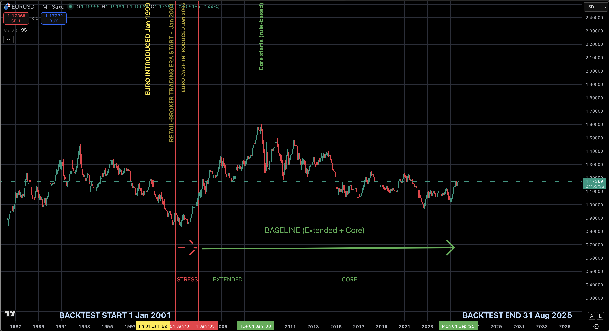
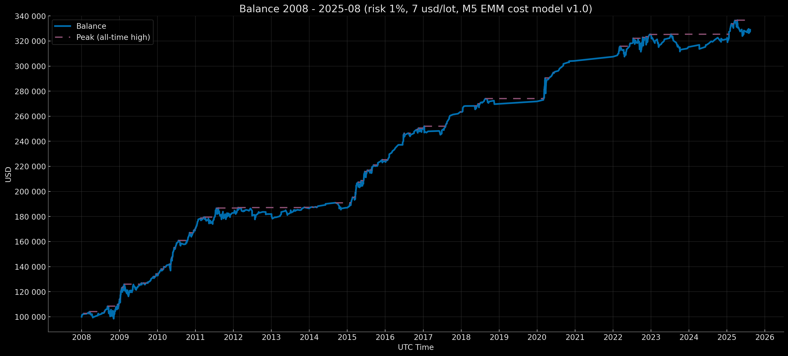
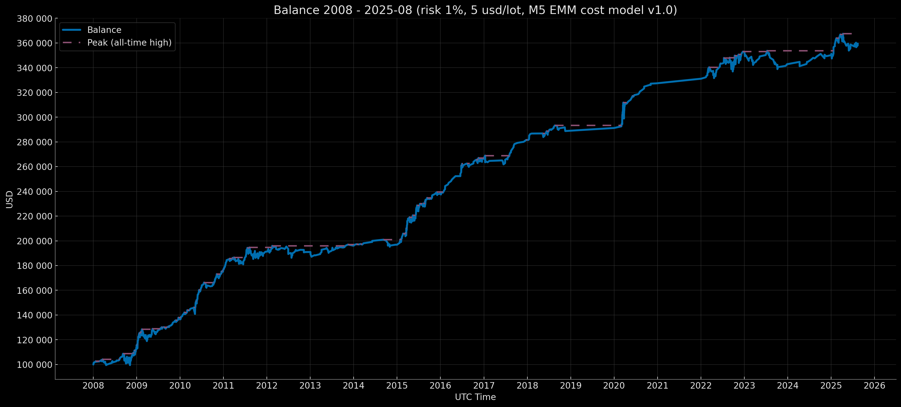
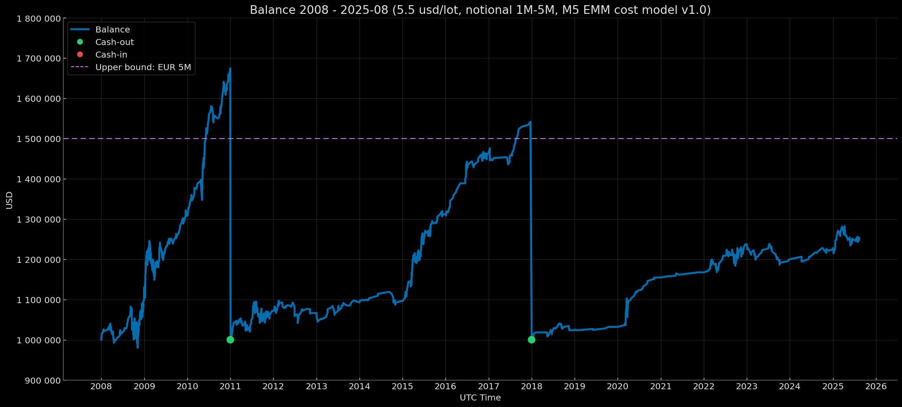
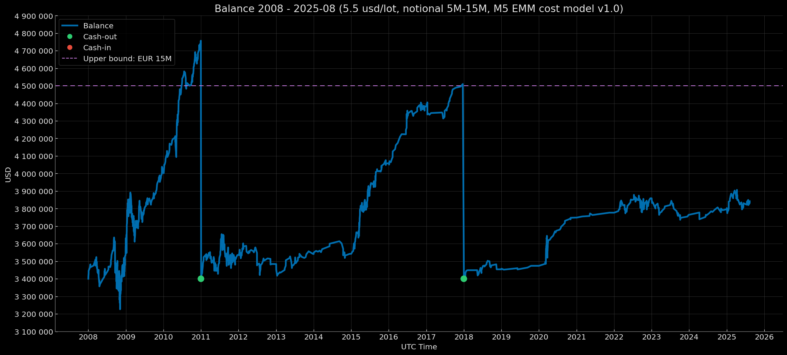
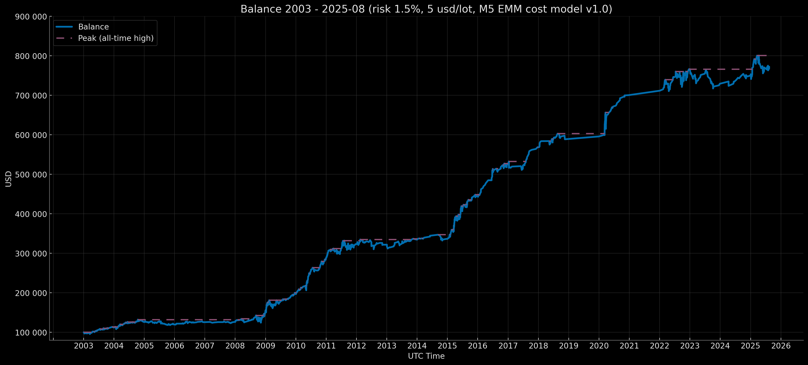

<div align="center">

# 🇪🇺 🇺🇸 Euro Macromechanica (EMM) Backtest — Overview & Methodology
# EMM Quinta Medulla Invariance Model

> Euro Macromechanica — Macro-structural Mechanics of EUR/USD

</div>

<p align="center">Backtest Period Map (EUR/USD, 2001–2025-08)</p>
<p align="center"></p>

> Note: “quant” is short for *quantitative*.

> A full guide for verifying the transparency of the processes and the input/output files used in the backtest is provided in [AUDIT.md](https://github.com/euro-macromechanica-backtest/results/tree/main/docs/AUDIT.md); the link is also repeated at the end of this document.

The project results provide **robust empirical evidence** of **invariant quantitative factors (signals of market inefficiency)** in **EUR/USD** price dynamics over the entire historical backtest period. **Consistent outcomes over nearly the entire history of the euro as the EU’s single currency** (since the introduction of cash in January 2002), including the major systemic crises of the past two decades, corroborate this.

This project should not be regarded as a **“full-fledged institutional-level micro-backtest”**. Rather, it serves as an **indirect demonstration** of the sustainable effectiveness of a single research model, based on the results of the **base core** on **M5** under a **conservative execution framework**. The **base core** represents the **minimal necessary sample of trades** for the EMM research, derived from a limited set of quantitative factors. Its purpose is to illustrate **performance potential**, rather than to provide high-precision metrics, which is inherently unattainable at a **non-institutional level**, particularly given the OTC-specific context.

The backtest project includes, in particular:
- coverage of nearly **the entire history of the euro as the EU’s single currency**, including **all major systemic crises of the past two decades**;
- only **one intraday signal logic** on the **M5** timeframe;
- a fully **unchanged** logic (no retraining) across the entire backtest horizon;
- a **transparently verifiable pipeline** of input and output data (deterministic execution, a cryptographic hash chain, and **unedited, single-take live backtest recordings**) without disclosing the model logic;
- a **technically thorough engine implementation**, with emphasis on **objective treatment of all relevant factors** and maximal accounting of all plausible trading costs under **non-institutional infrastructure and constrained resources**;
- **transparent metric computation** based on non-public trade files and equity series (**cryptographically anchored** in the consolidated result manifests generated by the backtest engine), **including an open calculator script and the calculation methodology**;
- **consistent** results over the entire backtest horizon on a single asset — EUR/USD.
- **GBPUSD cross-asset test** over the main data-quality period 2008–2025-08, including both pre-Brexit and post-Brexit (2016) periods.

**The backtest was conducted in UTC (UTC+0).**

---

---

## Table of Contents

- [Input Data for the M5 EMM Backtest](#input-data)
  - [Source Minute Data, Data Quality Policy, and the Decision to Split Backtest Periods](#source-minute-data)
  - [Economic Calendars](#source-calendars)
- [Public Logic of the M5 EMM Engine](#m5-emm-engine-logic) 
  - [Input Normalization and Determinism](#input-normalization)
  - [Aggregating Minutes into M5 Bars](#m5-resample)
  - [Order Execution Logic](#order-execution)
  - [Order Execution Logic in the Presence of Gaps](#order-gap)
  - [Gap-Detection Logic](#gap-detection)
  - [Cost Accounting, Trade Size Calculation, and Rounding](#cost-accounting)
  - [Epsilon (ε)](#epsilon)
- [Implemented M5 EMM Model Logic](#m5-emm-engine-logic) 
  - [Time Filters of the Implemented M5 EMM Logic](#time-filters)
  - [Calendar Filters of the Implemented M5 EMM Logic](#calendar-filters)
- [M5 EMM Cost Model (EUR/USD) Methodology](#cost-model)
  - [Commission Profiles](#commission)
  - [Dynamic Cost Model (Spread/Slippage) Based on Average Notional Trade Volumes (EUR) of the M5 EMM Strategy](#spread-slippage)
- [Rationale for a Look-Ahead-Free Implementation of the Mathematical Computation of Objective (TP) and Guard (SL) Levels on Fully Formed 5-Minute Bars in the M5 EMM Engine](#look-ahead)
- [Rationale for Choosing HistData Minute Data for the M5 EMM Backtest](#histdata)
  - [Transparency and Reproducibility](#histdata-reprod) 
  - [Publicly Available Tick Data](#tick-data) 
  - [OTC Specifics and M1 Data Discrepancies](#otc) 
  - [Rationale for the Operational Immateriality of M1 Data-Source Differences for M5 EMM](#m1-decision) 
  - [Conclusion on Data Choice](#m1-conclusion) 
- [Results: Data Quality Policy v1.0 Periods, Profiles, Risk Modes, Capitalization Modes, and Determinism](#results-method)
  - [Data Quality Policy v1.0 Periods](#data-policy)
  - [Profiles](#profiles)
  - [Risk and Capitalization Modes](#modes)
  - [Determinism of Results](#results-determ)
- [Evidence of Strategy Existence and Invariance](#strategy-proof) 
  - [Cryptographic Bundle — Proof of Existence and Integrity of the Sealed Strategy Archive](#crypto-bound)
  - [Live-Run Videos](#live-run)  
- [Metrics](#metrics)
  - [Metric-Calculation Methodology (essentials)](#metrics-method)
  - [Conditional Sortino Method (strict, loss-only)](#sortino)
  - [OOS / Walk-Forward / Multiple Testing & Selection Bias](#oos)
  - [Monte Carlo](#monte-carlo)
  - [Confidence Intervals (BCa)](#confidence-intervals)
  - [Trade Bootstrap (EDR & Losing Streaks)](#trades-bootstrap)
  - [Benchmark](#benchmark)
  - [Full Methodology and Metric Definitions](#metrics-full)
  - [Metric Files](#metric-files)
- [Brief Results Overview](#review)
  - [Extended Baseline](#ext)
  - [Core Baseline](#core)
  - [Composite Baseline](#comp)
  - [Robustness of Results](#results-robust)
- [Conclusions](#summary) 
- [Limitations and scope of applicability](#limitations)
- [Links](#links)
- [Contact](#contact)
- [Licenses and Attributions](#license)
- [Disclaimer — Not Investment Advice](#disclaimer)

---

---

<a id="input-data"></a>
## Input Data for the M5 EMM Backtest

<a id="source-minute-data"></a>
### Source Minute Data, Data Quality Policy, and the Decision to Split Backtest Periods

> The euro was introduced as the EU’s single currency in non-cash form in January 1999; retail access to EUR/USD trading emerged around 2001. Cash euros were introduced in January 2002.

The primary objective is to run the backtest over the longest feasible horizon, ideally starting from the point when retail access via FX brokers became available.

> *Special thanks to HistData for free access to minute data (and tick samples) for currency pairs with broad historical coverage—one of the few free sources comparable in scope.*

A decision was made to conduct the backtest on **minute data** from HistData rather than on ticks. The rationale for choosing minute data and the HistData source (versus alternatives such as Dukascopy) is described in the section “Rationale for choosing HistData minute data for the M5 EMM backtest.”

Unfortunately, the quality of the minute data did not allow for a robust test of **2001–2002**: the number of **5–15 minute** gaps was **exceptionally** high, which is critical for M5 logic (all quant factors are implemented on the **M5** timeframe, and a large number of gaps in that range **materially distorts** the computation of the required levels). Therefore, **2001–2002** are used as a *stress period* to illustrate **strategy** behavior under degraded data quality. Accordingly, metrics are computed only for the *baseline* periods.

Data quality for **2003–2007** is also **below the core period**, so this span is labeled **Extended Baseline** to keep it separate from the higher-quality core period — **Core Baseline** (**2008–2025-08**). To illustrate results over the longest horizon, a composite track is **also provided** in a compounding mode (balance carries forward year to year: Ending Balance → next year’s Initial Balance) on mixed-quality data — **Composite Baseline** (**2003–2025-08 = extended + core**).

Gaps **exceeding 15 minutes** are also material, but their impact is lower relative to **5–15 minute** intervals. Consequently, the **5–15 minute** range is adopted as the key band for classification. In an ideal setting there would be no gaps at all; the work proceeds with the data that were available at the time.

**Backtest periods:**  
- **Stress period:** 2001–2002 (illustrative runs on degraded data quality).  
- **Extended Baseline:** 2003–2007 (5 years).  
- **Core Baseline:** 2008–2025-08 (17 years 8 months).  
- **Composite Baseline:** 2003–2025-08 (22 years 8 months).

> Metrics are published only for the baseline periods. (Extended metrics are provided only for the Core Baseline.)

According to HistData, the raw minute data are timestamped in fixed **EST (UTC−5)** (see the F.A.Q.: http://www.histdata.com/f-a-q/). For the backtest, they are normalized to **UTC (UTC+0)**.

Minute-data normalization includes only:
- assigning column names: `datetime`, `open`, `high`, `low`, `close`, `volume`;
- converting timestamps to UTC (UTC+0) and sorting.

The minute data values were neither modified nor removed.

- Normalized minute data — [data-hub/source_data/prepared](https://github.com/euro-macromechanica-backtest/data-hub/tree/main/source_data/prepared)  
- Minute-data normalization script — [data-preparation-toolkit/minute_data_normalizer](https://github.com/euro-macromechanica-backtest/data-preparation-toolkit/tree/main/minute_data_normalizer)  
- Gap-report analysis script for minute data — [data-preparation-toolkit/minute_data_analyzer](https://github.com/euro-macromechanica-backtest/data-preparation-toolkit/tree/main/minute_data_analyzer)

*All original minute-data files and text reports on minute-data quality were obtained from HistData. The gap analysis is fully reproducible with any tools. A simple visual inspection of the frequency of 5–15-minute gaps confirms the appropriateness of the chosen Data Quality Policy and addresses skeptical concerns (including assertions about possible OTS “timeline anchoring,” etc.). The raw minute data sourced from HistData are likewise fully reproducible. If HistData requests data removal, the raw minute files used in the backtest will be made available for verification upon request.*

---

<a id="source-calendars"></a>
### Economic Calendars

The calendars were compiled manually (in parts) with the assistance of ChatGPT’s advanced modes: official sources throttle bulk HTTP requests, and there are no free consolidated calendars covering such a long period. The engine required a narrow set of countries and only key macro releases, specifically filtered by the author, which are typically published within fixed time windows. Accordingly, the risk of potential **timing inaccuracies** in the collected releases is low.

> All events are sourced from official websites: national central banks, national statistical agencies, etc.

In the implemented logic, the calendar serves as an **entry filter**, not a signal source: the strategy avoids opening positions during release windows. If a release time is incorrect, a trade will typically be **closed via stop-loss** rather than generate “false” profit. Consequently, even in the unlikely presence of timing errors, the results are generally **more likely to be understated than overstated**.

**List of high-importance events and countries specifically filtered and compiled for the M5 EMM engine.**

**United States:**
- Scheduled FOMC events: press conferences, statements, and rate decisions
- Fed Chair speeches at the Jackson Hole Economic Symposium
- Semiannual testimony by the Federal Reserve Chair before the U.S. Congress on the Monetary Policy Report (Humphrey–Hawkins)
- Employment Situation (Nonfarm Payrolls, NFP)
- GDP (BEA: advance/second/third)
- Retail Sales (Advance, Census)
- ISM Manufacturing PMI
- ISM Services PMI (officially “ISM Services PMI”; formerly Non-Manufacturing)
- PCE Price Index
- CPI
- PPI

**Euro Area:**
- Scheduled ECB press conferences and rate decisions

**Reasons for excluding flash HICP, Unemployment Rate, etc. for the Euro Area**
- First, these releases generally do not drive ≥60-pip **EUR/USD** moves within the 10–15-minute window after publication. They are therefore immaterial to the implemented logic; rare, episodic spikes on flash HICP do not change the overall picture.
- Second, the engine logic is designed to capture impulses on the order of ~40 pips and larger over 5–10 minutes.

**Details of the implemented logic in the M5 EMM backtest are provided in the section `Implemented M5 EMM Strategy Logic`.**

> Unscheduled high-importance events (e.g., ad-hoc FOMC decisions/statements, inter-meeting actions) were recorded separately as a precaution, but they were not included in the scheduled calendars and were not used in the backtest, as they are not scheduled publications.

Economic calendars are available at [data-hub/economic_calendars/](https://github.com/euro-macromechanica-backtest/data-hub/tree/main/economic_calendars).

The directory [`data-hub/economic_calendars/raw/`](https://github.com/euro-macromechanica-backtest/data-hub/tree/main/economic_calendars/raw) contains the collected calendars with events in each source’s local release time, split into parts for greater transparency. The directory [`data-hub/economic_calendars/prepared/`](https://github.com/euro-macromechanica-backtest/data-hub/tree/main/economic_calendars/prepared) contains the normalized calendars — converted to UTC+0 — that were used as input files in the backtest.

> The calendars do not include actual release values—only metadata such as time, title, importance, country/region, etc.

Calendar normalization consists only of converting publication times to UTC+0 and sorting the records. The UTC+0 conversion uses the IANA time-zone database, ensuring correct handling of local rules and **Daylight Saving Time (DST)** transitions. There are no DST-related inconsistencies: the key macro releases listed above are not published during clock-change hours.

Calendar normalization script — [`data-preparation-toolkit/economic_calendar_normalizer`](https://github.com/euro-macromechanica-backtest/data-preparation-toolkit/tree/main/economic_calendar_normalizer)

*All calendar data used in the backtest are fully transparent and reproducible.*

---

---

<a id="m5-emm-engine-logic"></a>
## Public M5 EMM Engine Logic

<a id="input-normalization"></a>
### Input Normalization and Determinism

The engine ingests one-minute market data and calendar events timestamped in UTC (ISO-8601).
Before simulation, all input series are brought to a **single, reproducible form** so that the outcome depends **only on the data themselves**, not on row order, duplicates, or source artifacts. One-minute records are ordered by time; if multiple rows share the same timestamp, the **last** one is retained and the preceding ones are treated as superseded; malformed or incomplete price values are discarded. **No synthetic fills or interpolations are applied**—only the actual content of the data is used in calculations.

Minutes are then mapped unambiguously to five-minute windows by interval membership: empty windows are dropped; partially filled windows are preserved **without fills/interpolations**. Normalization **does not create missing minutes**, so real gaps are preserved and handled by the gap logic.

Calendar data (hourly events and trading schedules) are normalized to a common format and de-duplicated; their application is described in the section `Implemented M5 EMM Strategy Logic`.

**Normalization and aggregation procedures are deterministic**: given identical inputs, repeated runs yield identical results regardless of the original row order, the presence of duplicates, or heterogeneity of the export. At the end of the period, any remaining positions are closed **at the last available one-minute price**, which fixes the terminal state unambiguously.

**Determinism of results.**  

Simulation outcomes are deterministic: with identical inputs, repeated runs reproduce the same set of trades, timestamps, and prices. This is achieved through stable sorting and de-duplication, a fixed grid and rules for mapping minutes to windows, an unambiguous choice of the “earliest” minute where applicable, a single global epsilon, a fixed SL-over-TP priority in conflict cases, **strict quant-logic rules**, and the absence of randomness. Partially filled bars are preserved without interpolation; real gaps are not filled and are handled by the gap logic. For exact reproducibility, the M5 EMM engine’s dependency versions are pinned.

**Determinism of output files.**

Simulation artifacts are produced **deterministically**: with unchanged inputs, parameters, and dependency versions, each rerun produces the same set of files with identical content. This is ensured by a uniform time base and fixed M5 grid, prior normalization of one-minute records (stable sorting, de-duplication without interpolation), a predictable, staged simulation pipeline (a two-pass scheme that forms trades and equity snapshots, aligns equity to entry times, and a final pass without random components), and stable serialization rules (constant delimiter, fixed numeric precision, a single timestamp format, and time-ordered rows). The composition and naming of outputs remain constant via templates with deterministic year resolution; the SVG visualization is generated from the already-deterministic equity series and is therefore reproducible as well. For external verification of immutability, an `artifacts_YYYY.sha256` file is produced listing the SHA-256 checksums of all input and output artifacts; its lines are sorted so the checksum file itself is byte-stable. With identical inputs/parameters and pinned library versions, the contents of `trades_YYYY.csv*`, `balance_YYYY.csv*` (equity series), `summary_YYYY.csv*`, `balance_YYYY.svg`, and `artifacts_YYYY.sha256` are **byte-for-byte identical** across runs.

---

<a id="m5-resample"></a>
### Aggregating Minutes into M5 Bars

Minute quotes are mapped onto a fixed five-minute grid: a window starts at time `t` and covers the half-open interval `[t, t + 5 minutes)`, with each minute belonging to exactly one window. One M5 bar is produced per window: **Open** comes from the earliest valid minute in the window, **High/Low** are the maximum/minimum across the minutes in the window, and **Close** comes from the latest valid minute in the window. If a window contains no valid minutes, no bar is created; if it contains fewer than five minutes, the bar is treated as **partially filled** and is preserved **without padding or interpolation**. **The bar’s timestamp is the window start time (`t`).**

> Aggregation is performed after minute-level normalization and deduplication.

**The procedure is deterministic:** the order of input rows and duplicate occurrences of the same minute timestamp do not affect the result (when timestamps collide, the **last** record is used). Partially filled bars are retained; their eligibility for entry searches is governed by data-quality rules and the trading schedule. When a gap is detected, only **new entries** are temporarily blocked, while management of already open positions continues.

---

<a id="order-execution"></a>
### Order Execution Logic

- On each M5 bar, a deterministic set of auxiliary levels in the trade direction is computed from the current M5 bar and the history of prior M5 bars: **Trigger** (entry), **Guard (SL)** (stop), and **Objective (TP)** (profit-taking target).
- Levels are **not recomputed within** the 5-minute window; a new set appears only when the window rolls to the next M5 bar.
- At most **one trade per computed Trigger** level.
- Monitoring operates on the M5 grid; the actual fill is searched on **M1** within the current M5 bar.
- If multiple M1 candles touch the **Trigger** within an M5 bar, the **earliest touching minute** executes. **Guard (SL)** and **Objective (TP)** follow the same earliest-touch rule.
- **Guard (SL)** is fixed at entry (the minute the **Trigger** executes) and is calculated relative to the **current** M5 bar. **Objective (TP)** is **dynamic** and is recomputed on **each subsequent** M5 bar after entry.
- If the **Objective (TP)** is reached within the **current** M5 bar, the trade closes at the level computed for the current bar; if the **first minute of the next** M5 bar has begun and the Objective is then reached, the close occurs at the **next bar’s** level.
- A computed **Guard (SL)** is **required** to open a trade. Requiring a pre-computed **Objective (TP)** at entry is deliberately **omitted** for conservatism: if it is missing at entry, the Objective is computed on the **next** M5 bar and thereafter, until a stop occurs.
- If **two Trigger levels are reached in the same minute** within an M5 bar, trades are opened from **both** levels; risk is taken as the configured **per-trade** risk from the balance at entry (e.g., with a $100,000 balance and 1% risk per trade, **each** trade risks 1%—the risk is **not split**).
- When **TP and SL are both touched** on M1, **Guard (SL)** always has priority.
- If **two Trigger levels are reached in different minutes** within the same M5 bar, trades are opened from **each** Trigger accordingly.

> The implemented logic uses **market orders**. For details of the market-order cost model, see `M5 EMM Cost Model (EUR/USD) Methodology`.

> For the rationale behind computing **Objective (TP)** and **Guard (SL)** from **fully formed M5 bars** (rather than incrementally within the current bar; i.e., look-ahead considerations), see `Rationale for a Look-Ahead-Free Implementation of the Mathematical Computation of Objective (TP) and Guard (SL) Levels on Fully Formed 5-Minute Bars in the M5 EMM Engine`

---

<a id="order-gap"></a>
### Order Execution Logic in the Presence of Gaps

After entry, the position is tracked on **M1** within the current **M5** bar. If a gap occurs (no minutes inside one or more M5 bars), the close check resumes on the **first available minute after the gap**. The close is executed at the **computed level**, not at the opening price of the first minute after the gap.

- **Guard (SL)** is fixed at entry (from the M5 bar where the **Trigger** fired) and does not change. After a gap, as soon as the first available M1 minute reaches **Guard (SL)**, the trade closes at the **Guard (SL)** level (the level is constant). Thus, the stop does not gain from the gap and is not “improved.”
- **Objective (TP)** is dynamic:  
  - if the **Objective (TP)** is reached within the **same** M5 bar, closing occurs at that bar’s **Objective (TP)**;  
  - if the first available minute is already in the **next** M5 bar and the target *would have been reached during the gap*, the close occurs at the **next bar’s Objective (TP)** (i.e., the freshly recomputed level on the new bar), not at the post-gap opening price.
- There is **no windfall** from gaps. Even if the market “jumps” far beyond the target, the close is executed at the computed **Objective (TP)** of the relevant M5 bar (current/next), not at a potentially better post-gap opening price. Likewise, loss is fixed at the predetermined **Guard (SL)**.
- **Potential deviation due to a 5-minute gap:** because **Objective (TP)** is recomputed on each new M5 bar, its value after a gap may differ slightly from the hypothetical level without a gap—either upward or downward. Accordingly, this does **not** confer an unintended advantage to the strategy.
- **Conflict on the first minute after a gap** (if both **Guard (SL)** and **Objective (TP)** would be touched): **Guard (SL)** always has priority.

---

<a id="gap-detection"></a>
### Gap-Detection Logic

The detector evaluates each **M5** bar by comparing:

1. **Time gap** between  
   • the **last minute before** the start of the current timeframe (TF) window, and  
   • the **first minute inside** the current TF window.  
   If this pause is **strictly greater than** the configured threshold (in minutes), a gap is recorded.

2. **Price gap** between  
   • the **close** of the last minute of the previous window, and  
   • the **open** of the first minute of the current window.  
   If the absolute difference is **≥ the configured threshold** (in pips), a gap is recorded. *(Threshold set to **25 pips**.)*

The checks apply only if **both** the “previous minute” and the “first minute of the current window” are available. If either is missing, no gap is detected on that bar.

If the pause before the start of the current window exceeds a separate **“long” reopen** threshold of **1440 minutes**, then—even if the above conditions are met—the gap **does not trigger a lockout** (it is treated as a normal reopen after a long break such as weekends/holidays). If at least one type of gap (time or price) is detected and this is **not** a reopen, the **lockout window** starts at the **first minute of the current TF window** where the gap was detected. **The lockout duration is configured in minutes.** *(Set to **30 minutes**.)*

While the current M5 bar falls within the **lockout window**, **only new entries are disallowed**. Management and exits of already open positions proceed as usual. If an M5 bar has **no minutes at all**, the bar is skipped entirely, and management/exits are not evaluated on it. When the current TF time reaches (or is past) the end of the lockout, the lock is removed and normal processing resumes.

Gap checking is performed **inside** the entry-eligibility branch (after external quant factors) and **before** testing **Trigger** touches. A lockout window is set if the bar is **eligible** for entries and a gap is detected, **regardless** of whether any **Trigger** touch occurs. If the bar is **not eligible** or this is a **reopen**, **no lockout window** is set—by design, for conservatism, to avoid additional filtering where entries are not possible anyway.

**Implementation Notes**

- **Empty M5 bars.** If the current M5 bar contains **no M1 minutes**, the bar is skipped entirely: no gap detection, no new-entry checks, and no position management/exits are performed (there is nothing to evaluate). Management resumes at the **first available minute of the next bar**.
- The **time** threshold is compared as **`>`** (strictly greater), the **price** threshold as **`≥`**.
- The lockout always **starts at the first minute of the current window**; if both checks (time and price) trigger simultaneously, the result is the same.
- The lockout **does not accumulate** and is **not auto-extended**; a new lockout may start on the **next** bar if another gap is detected.
- **“Extension” of the lockout.**  
  - If the **next eligible bar** also contains a gap, the engine starts a **new lockout window** from that bar’s start—effectively resetting the timer. This may look like an extension, but it is not a sum of intervals; it is a **new window** that overwrites the previous start/end by time.  
  - If a bar is **empty** (no M1 minutes), it is skipped entirely: no entry checks, no gap detection, and **no extension/restart** of the lockout window occur on it.
- If the **reopen** threshold is hit, the lockout **is not enabled**, even if regular gap thresholds are exceeded.

**The gap detector evaluates only the M5 window boundary**—the interval between the **last M1 before** the window and the **first M1 inside** the window. Missing minutes **inside** the window are **not** treated as a gap, and **no lockout window** is started because of them.

Two data-quality rules apply:
- **Thin bar.** If a window contains too few minutes, the bar may be **ineligible** for entry searches by a **minimum coverage** threshold *(set to **3 minutes**)*. This is **not** a gap and does **not** start a lockout.  
- **Empty bar.** If an M5 bar has **no minutes at all**, the bar is skipped in full; management/exits are not evaluated (there are no minutes to check).

**Result:** a lockout is triggered **only** by a boundary gap (time or price). Gaps **inside** an M5 window are **neither detected nor penalized**.

> Due to the gap-protection logic, some potential trades may be skipped; however, given the 2008–2025-08 data quality, such cases are rare. Detecting gaps specifically **at M5 window boundaries** further filters discontinuities to increase result objectivity. The rationale for boundary-based lockouts is that **Trigger / Guard / Objective** levels are fixed at the **close of each M5 bar** (from bar data) and are **not recalculated inside** the bar. A new level set appears only at a **window change**, hence the natural place to check for gaps is the **boundary** (last M1 before the window vs. first M1 inside). Gaps inside an M5 bar do **not** start a lockout: levels are static within the bar, so the **bar-eligibility filter** suffices without extra blocking. Introducing lockouts for intra-bar gaps would be overly strict; for such gaps, the bar’s entry-eligibility filter is applied **without** starting a lockout.

Gap detection is applied **exclusively** within the **entry-eligibility** branch (and **before** testing Trigger touches); outside this context it is **not activated**. This design avoids over-filtering rare minute-data artifacts and prevents unnecessary noise in the backtest. Empirically, the approach is supported by the stability of long-horizon backtest results under the data-quality period classification.

---

<a id="cost-accounting"></a>
### Cost Accounting, Trade Size Calculation, and Rounding

The engine is configured with **fixed cost parameters for a single annual run** (within the selected profile/mode and calendar year). Costs comprise **commission**, **spread**, and **slippage**. All three components are applied to **every** trade; the published results already include their impact on PnL.

**Point vs pip.** For five-decimal quotes, 1 pip = 10 points. All thresholds/costs are specified in pips and converted to price.

- **Commission.** Specified as a **round-turn** rate per 1 standard lot (100,000 EUR) and applied **proportionally to the actual position size**. It **is not included** in per-trade risk sizing (size/lot sizing) — it is treated as a **separate trading cost** booked on top of the trade result.
- **Spread and slippage.** Specified as **round-turn** amounts (in pips) for the chosen profile/year and **split evenly (50/50)** between the two sides of the trade: half at entry, half at exit (e.g., spread RT = 0.8 pips ⇒ 0.4 / 0.4 pips). **Spread and slippage are modeled via effective execution prices**: entry/exit levels (**Trigger/Objective/Guard**) are shifted adversely. These costs are also **included in position-size calculation at the target risk** (lot sizing and expected stop loss are computed using the already adjusted prices), hence they directly affect final PnL.
- **Fixed for the period.** Cost parameters are set at launch and **do not change within an annual run**. Each profile/mode and calendar year uses its own values from the cost-model table aligned with the implemented M5 EMM cost-model logic — [`docs/cost_model/m5_emm_cost_model_v1.0.csv`](https://github.com/euro-macromechanica-backtest/results/blob/main/docs/cost_model/m5_emm_cost_model_v1.0.csv).

> **For methodology details, see the section `M5 EMM Cost Model (EUR/USD) Methodology`.**

**Bottom line:** commission is accounted for separately from risk, while spread/slippage are included in risk and position-size calculations; all costs are applied to every trade, so run results and summary metrics already reflect their impact.

**Per-trade position sizing.** The position size for each trade is a fixed fraction of the current balance at entry (the risk fraction is set for the entire annual run). Risk is taken from the **actual balance** right before opening the trade, not from a pre-fixed notional.  
> If two **Trigger** levels are hit within the same minute of an M5 bar, trades are opened from both levels; the default per-trade risk is taken **for each** trade from the balance at entry (e.g., with a $100,000 balance and 1% risk per trade, both trades open at 1% risk each — the risk is **not split** between them).

**Risk-based lot rounding.** First, a “raw” position size is computed so that the potential loss at the stop equals the target risk; the stop distance is taken **including** spread/slippage. The size is then **always** rounded **down** to the nearest permissible increment, so the realized stop-risk does not exceed the target. Exceedance is only possible in edge cases:
- the computed lot is below the technical minimum and the minimum tradable size is used;
- multiple trades are opened in the same minute without splitting the overall per-minute risk cap between them;
- commission is charged on top of the trade result and increases the realized loss, since it is not included in the risk base.

> **Spread and slippage** are explicit inputs and are included at the lot-sizing stage: the entry-to-SL distance is measured **with** these costs already applied.

---

<a id="epsilon"></a>
### Epsilon (ε)

The model uses a single comparison tolerance ε equal to **one minimum tick increment** of the instrument. For **EURUSD (5-digit quotes)**: **ε = 0.00001** (*1 point = 0.1 pip*).

**Scope.**  
ε is used **only** for the binary check of whether a computed level is “touched” by the minute bar’s extremum (High/Low) within an M5 window. ε **does not affect** the computation of the levels themselves.

**Order relative to costs.**  
First, the “touch / no-touch” event is determined with ε; then the execution price is formed with the configured costs (spread / slippage / commission). ε **does not change** the magnitude of the costs.

**Exceptions (where ε is not applied).**  
Gap detection and bar-eligibility checks are evaluated strictly by the specified inequalities (`>` / `≥`) **without ε**.

**Rationale.**  
A value of **0.1 pip** is **minimally sufficient** to offset boundary discretization and rounding effects on M1. It does not “widen” levels into zones and does not create a methodological advantage; any shifts are smaller than the tick size and far below transactional noise (spread / slippage / commission).

**Determinism.**  
A fixed ε ensures reproducible results given identical inputs.

**Related execution rules.**  
In intra-minute conflicts, **Guard (SL) has priority** over **Objective (TP)** when both are reached simultaneously.

**Note (OTC specifics).**  
Minute OHLC series from different providers (e.g., HistData vs. Dukascopy) can differ slightly due to time zone, price type, and aggregation. Formalizing ε standardizes the “touch” criterion and reduces the impact of such differences.

---

---

<a id="m5-emm-logic"></a>
## Implemented M5 EMM Model Logic

### This M5 EMM implementation represents a minimally sufficient set of trades to demonstrate effectiveness. In this design, all operations—trading decisions, computations, and feature handling — are performed exclusively on the 5-minute timeframe. The M5 module is not complete: owing to the approach’s complexity and resource constraints, the full suite of factors has not been implemented even within a single M5 model. Moreover, the current version does not include the principal framework for trading in post-release windows for major macroeconomic data, which is one of the key drivers of performance. The EMM Research is a composition of signals across several timeframes, incorporating macro-structural dynamics; nonetheless, this M5 core is sufficient to demonstrate effectiveness.

---

<a id="time-filters"></a>
### Time Filters of the Implemented M5 EMM Logic

The strategy trades macro-structural patterns on M5 bars and opens positions only during **calm intervals** of the trading day. **This is not “Asia-only”**: “calm” refers to windows **outside** the volatile **top-of-hour** intervals in the **London–NY** sessions, the **rollover period**, and **scheduled data-release** windows; filters are also applied within active **London–NY** segments. All prohibitions are specified as **fixed UTC windows** and **do not depend on DST** (the HistData source’s fixed EST baseline is accounted for; see the FAQ: `http://www.histdata.com/f-a-q/`).

Within the EMM logic, **10-minute blocks** are implemented as a filter for **top-of-hour volatility** in the active **London–NY** segments, where spreads/slippage statistically increase. Additional fixed filters **prohibit or tighten** entries at specific times based on EMM logic. The **rollover** and the **CME Globex** maintenance window are covered by a **fixed block** that spans both summer and winter.

**FX rollovers (UTC):**
- Summer (EDT, UTC−4): 21:00 UTC  
- Winter (EST, UTC−5): 22:00 UTC

**CME Globex daily maintenance break (UTC):**
- Summer (CDT, UTC−5): 21:00–22:00 UTC  
- Winter (CST, UTC−6): 22:00–23:00 UTC

A full **no-trade window is enforced from 19:00 to 00:10 UTC**, which covers the FX rollovers and the CME Globex break **regardless of DST**. Accordingly, by the time these windows begin there are **no open positions**, and **no exits** are executed during them. This is corroborated by trade metrics on **average trade duration**.

---

<a id="calendar-filters"></a>
### Calendar Filters of the Implemented M5 EMM Logic

Economic calendars are compiled **only** for pre-defined **Euro Area and U.S.** scheduled releases classified as high-importance. All timestamps are provided **in UTC** and are **DST-agnostic**.

- **Event hour (technical).** Any calendar timestamp is mapped to its *technical event hour*, defined as the full hour **starting at the beginning of that hour**.  
  Example: a release at **15:30** is treated as the event hour **15:00–15:59**. Tightening applies **to the entire hour**, not just from the release minute.

- **Pre-window — full prohibition.** The pre-window is **60 minutes before the release time**. However, any portion that **overlaps the event hour** is governed by the event-hour rules (tightening rather than a full ban).  
  **Effective pre-window:** from *(release time − 60 minutes)* **to the start of the technical event hour**.  
  Example: for a **15:30** release, the raw window is 14:30–15:29:59, but **15:00–15:29:59** belongs to the event hour; therefore, the **full prohibition** effectively applies **14:30–14:59:59**.

- **Event hour — tightening (not a full ban).** Throughout the technical event hour, **trade entries** are allowed **only** if a strict condition is met; in simplified form: **price impulse ≥ 300 pips** over **5–15 minutes**. This threshold is a **conservative upper bound**; for EUR/USD such moves are **rare**. In such episodes, entries are **more likely** to occur **15–30 minutes or more** after the release, when transaction costs (spread/slippage) typically normalize. Accordingly, even if such rare trades do occur, the specified cost model remains objective and does **not** bias results across the entire backtest horizon.

- **After the event hour.** Beginning **with the next hour mark** (in the example, **from 16:00**), calendar constraints are lifted.

**All filters, their values, and all quant logic are strictly fixed and uniform (**no changes and no re-optimization**) across the entire backtest horizon (profiles, risk modes, capitalization modes, etc.).**

---

---

<a id="cost-model"></a>
## M5 EMM Cost Model (EUR/USD) Methodology

### All components of the cost model—commission, spread, and slippage—are applied to every trade. Spread and slippage are incorporated into the orders’ effective execution price.  
See `Cost Accounting, Trade Size Calculation, and Rounding`.

<a id="commission"></a>
### Commission Profiles

- **Institutional** — *primary track*: average institutional commission **$5.5 per round-turn per 1 standard lot (100,000 EUR)**; equivalent **≈ 0.55 pips RT on EURUSD** *(≈ $2.75 per side)* — benchmark for institutional conditions.
- **Retail Rebate** — average retail commission after cashback **$5 per round-turn per 1 standard lot (100,000 EUR)**; equivalent **≈ 0.5 pips RT on EURUSD** *(≈ $2.5 per side)* — rebate-account conditions.
- **Retail Standard** — *illustrative retail commission*: **$7 per round-turn per 1 standard lot (100,000 EUR)**; equivalent **≈ 0.7 pips RT on EURUSD** *(≈ $3.5 per side)*.

---

**Institutional**

All institutional modes apply a **fixed commission of $5.5 per round-turn per 1 standard lot (100,000 EUR)** as a separate expense line, regardless of flow type (ECN/PoP raw-spread, single-dealer, “zero-commission,” etc.).  
Equivalents: **≈ 0.55 pips RT** *(≈ $2.75 per side; **$55 per $1M RT**)*.

**Spread** and **slippage** are handled separately per the EUR/USD execution model from [`m5_emm_cost_model_v1.0.csv`](https://github.com/euro-macromechanica-backtest/results/blob/main/docs/cost_model/m5_emm_cost_model_v1.0.csv) and **do not include the commission**. The total transactional cost equals *(spread + slippage)* plus the **$5.5 RT/lot** commission.

**Rationale**

- Normalizes metrics across liquidity providers and pricing models (line-item commission vs all-in spread).
- Improves auditability: the commission is an explicit parameter and can be varied in sensitivity checks without changing spread/slippage.

**Market levels (reference)**

*A fixed value of **$5.5 RT/lot** is used in calculations; the table below is for comparison with market practice.*

| Flow / Venue                      | Charging method           | Typical level (RT/lot) | Pips RT (equiv.) | $ per $1M RT | Notes                                                     |
|----------------------------------|---------------------------|------------------------:|-----------------:|-------------:|-----------------------------------------------------------|
| Top-tier ECN / PoP (raw-spread)  | Line-item commission      | **$4–6**               | **0.40–0.60**    | **$40–60**   | Benchmark for mid/large participants; $5.5 sits near mid. |
| Prime-broker direct, high volume | Line-item commission      | **$2–4**               | **0.20–0.40**    | **$20–40**   | Requires high volumes and tighter tiers.                  |
| Smaller PoP / low frequency      | Line-item commission      | **$6–7**               | **0.60–0.70**    | **$60–70**   | Lower volume discounts; less regular trading.             |
| Single-dealer (all-in)           | Cost embedded in spread   | —                      | +**~0.3–0.7 pips** | —           | In the model, commission is separate (fixed $5.5).        |
| “Zero-commission” ECN            | $0/lot, wider spread      | —                      | ~**0.5–0.8 pips** | —           | All-in equivalent; commission entered separately.         |

**Conversions**
- **1 lot = $10 per 1 pip** ⇒ **$X RT/lot = X/10 pips RT**.
- **$ per $1M RT = 10 × ($ per lot RT) = 100 × (pips RT)**.

**Sensitivity (indicative)**

- **Notional Volume (EUR): 5M**  (50 lots; $/pip = $500)  
  → Base: **$275 RT/trade** (= 0.55 pips × $500)  
  → Δ**±$1 RT/lot** ⇒ **±$50/trade** (≈ ±0.10 pips RT)

- **Notional Volume (EUR): 10M** (100 lots; $/pip = $1,000)  
  → Base: **$550 RT/trade** (= 0.55 pips × $1,000)  
  → Δ**±$1 RT/lot** ⇒ **±$100/trade** (≈ ±0.10 pips RT)

- **Notional Volume (EUR): 15M** (150 lots; $/pip = $1,500)  
  → Base: **$825 RT/trade** (= 0.55 pips × $1,500)  
  → Δ**±$1 RT/lot** ⇒ **±$150/trade** (≈ ±0.10 pips RT)

- **Notional Volume (EUR): 30M** (300 lots; $/pip = $3,000)  
  → Base: **$1,650 RT/trade** (= 0.55 pips × $3,000)  
  → Δ**±$1 RT/lot** ⇒ **±$300/trade** (≈ ±0.10 pips RT)

**Formulas**
- **Commission per trade (RT, $):**  
  `Cost_RT_$ = Commission_RT_per_lot_$ × (Notional_USD / 100,000)`
- **Commission in pips RT:**  
  `Pips_RT = Commission_RT_per_lot_$ / 10`
- **Annual effect (indicative):**  
  `ΔAnnualCost_$ = (Δ$ RT/lot) × (Notional_USD / 100,000) × Trades_per_year`

> **Commission (institutional conditions, EUR/USD).** By default, **$5.5 per round-turn per 1 standard lot (100,000 EUR)** is applied as a separate expense line, equivalent to **≈ 0.55 pips RT** (≈ $2.75 per side; **$55 per $1M RT**). Spread and **slippage** are accounted for separately per the execution model. The market range for ECN/PoP is **$4–6 RT/lot**; for all-in flows, the cost is embedded in the spread, yet a single explicit commission is used here for comparability.

---

**Retail Rebate**

In the Retail Rebate profile, an average commission of **$5.00 per round-turn per standard lot (100,000 EUR)** is used on **raw ECN/PoP** accounts, **after cashback**. Equivalents: **≈ 0.50 pips RT**, **≈ $2.50 per side**, **$50 per $1M RT**. The commission is booked **as a separate line item** and **is not included** in spread/slippage.

This profile assumes **retail ECN/PoP (raw-spread)** with **IB/cashback on the commission**. The commission is charged and shown **as a separate line item**; standard **all-in** accounts are **not used**. In calculations, the commission is **not included** in spread/slippage. Instrument: EUR/USD; this value applies to all trades under the retail profile (subject to operational volume limits up to 50 lots).

**Interpretation in the model.**

The commission is expressed in $ and pips using standard EUR/USD conversions (1 lot = $10 per pip):
- $5.00 RT/lot ⇒ **0.50 pips RT**.  
- For $1M notional (≈ 10 lots): **$50 RT**.

**Market context (reference).**

Without cashback, retail-ECN typical levels are **$6.5–7.0 RT/lot** (≈ 0.65–0.70 pips). With cashback, the range is often **$4.5–5.5 RT/lot**; the chosen **$5.0 RT/lot** aligns with the central tendency and serves as a neutral average.

**Indicative sensitivity.**
- **Notional (EUR) 1M** — 10 lots, $/pip = $100 → **$50 RT per trade** (= 0.50 pips × $100).
- **Notional (EUR) 5M** — 50 lots, $/pip = $500 → **$250 RT per trade** (= 0.50 pips × $500).

> The Retail Rebate profile targets retail brokers on **raw-spread** pricing. For all-in tariffs the commission is nominally absent (cost embedded in the spread); within this profile, an explicit **$5.00 RT/lot** commission is used, while spread/slippage are modeled separately.

---

**Retail Standard**

In the Retail Standard profile, an average commission of **$7.00 per round-turn per standard lot (100,000 EUR)** is used on **raw ECN/PoP** accounts, **without cashback/rebates**. Equivalents: **≈ 0.70 pips RT**, **≈ $3.50 per side**, **$70 per $1M RT**. The commission is booked **as a separate line item** and **is not included** in spread/slippage.

This profile assumes **retail ECN/PoP (raw-spread)** **without IB/cashback**. The commission is charged and shown **as a separate line item**; standard **all-in** accounts are **not used**. In calculations, the commission is **not included** in spread/slippage. Instrument: EUR/USD; this value applies to all trades under the retail profile (subject to operational volume limits up to 50 lots).

**Interpretation in the model.**  
The commission is expressed in $ and pips using standard EUR/USD conversions (1 lot = $10 per pip):
- $7.00 RT/lot ⇒ **0.70 pips RT**.  
- For $1M notional (≈ 10 lots): **$70 RT**.

**Market context (reference).**  
For retail raw-ECN without cashback, a typical corridor is **$6.5–7.0 RT/lot** (≈ 0.65–0.70 pips). The chosen **$7.0 RT/lot** reflects the upper bound and serves as a **conservative base**.

**Indicative sensitivity.**
- **Notional (EUR) 1M** — 10 lots, $/pip = $100 → **$70 RT per trade** (= 0.70 pips × $100).
- **Notional (EUR) 5M** — 50 lots, $/pip = $500 → **$350 RT per trade** (= 0.70 pips × $500).

> The Retail Standard profile targets retail brokers on **raw-spread** pricing without cashback; **spread/slippage** are modeled separately and do not include the commission.

---

<a id="spread-slippage"></a>
### Dynamic Cost Model (Spread/Slippage) Based on Average Notional Trade Volumes (EUR) of the M5 EMM Strategy

**Cost table of average values by Notional Volume (EUR/USD, top-tier ECN/PoP): [`eurusd_market_order_costs_ecn_round-turn_pips_v1.0.csv`](https://github.com/euro-macromechanica-backtest/results/blob/main/docs/cost_model/eurusd_market_order_costs_ecn_round-turn_pips_v1.0.csv)**

The principles for constructing and using the table
[`eurusd_market_order_costs_ecn_round-turn_pips_v1.0.csv`](https://github.com/euro-macromechanica-backtest/results/blob/main/docs/cost_model/eurusd_market_order_costs_ecn_round-turn_pips_v1.0.csv)
— which reflects **market-order** execution costs for EUR/USD — are outlined below. Parameters are calibrated for **top-tier ECN / Prime-of-Prime (raw-spread)** with multi-LP aggregation. All figures are expressed in **pips per round-turn (RT)**, i.e., entry + exit combined.

**Temporal assumptions (aligned with the M5 EMM strategy logic).**  
Calculations are made for “quiet intervals”:
- windows of major macro releases and events are excluded;
- opening volatility segments of the **London** and **New York** sessions are excluded;
- **rollovers** and adjacent low-liquidity periods (the CME Globex technical break) are excluded.

**Realism and limitations.**
- Spread levels (e.g., ~0.2–0.5 pips RT at **1–5M EUR notional**) and the profile of rising slippage with larger notional volumes are consistent with practical **top-tier ECN/PoP** conditions in quiet hours and are **not** “marketing minima.”
- The table applies to **market orders**; alternative execution mechanics (TWAP/VWAP/child orders) are not modeled and may have different cost structures.
- For **all-in** pricing, commission is embedded in the spread; this table covers **raw streams**, so commission is always added **separately** and not mixed with spread/slippage.

**Transparency and reproducibility.**  
The table reflects **industry-calibrated averages** for EUR/USD execution costs on **top-tier ECN/PoP (raw-spread)** in quiet hours; **commission ($/lot)** is accounted for **separately**. Any third party can **independently benchmark** these levels by executing market orders in quiet intervals and measuring **RT cost = spread (RT) + slippage (RT)**. For **smaller sizes**, deviations are typically minimal; a tolerance of **±0.10 pips RT** is operationally acceptable. For **larger sizes**, variability is higher but should remain within the indicated ranges. The table is a **transparent reference point** and does not constitute a promise of specific terms with any particular counterparty.

---

**Table of cost values used in the M5 EMM backtest [`m5_emm_cost_model_v1.0.csv`](https://github.com/euro-macromechanica-backtest/results/blob/main/docs/cost_model/m5_emm_cost_model_v1.0.csv).**

The **spread/slippage** costs are **fixed for each annual run** based on the strategy’s average trade sizes, which are derived from average stop distances, the fixed risk setting, and the balance path under the implemented **M5 EMM** engine logic. As the balance changes year to year, the cost model is **adjusted** according to the table of average values — [`m5_emm_cost_model_v1.0.csv`](https://github.com/euro-macromechanica-backtest/results/blob/main/docs/cost_model/m5_emm_cost_model_v1.0.csv).

The file [`m5_emm_cost_model_v1.0.csv`](https://github.com/euro-macromechanica-backtest/results/blob/main/docs/cost_model/m5_emm_cost_model_v1.0.csv) lists the values used in backtesting for every **profile / risk mode / capitalization mode** and **calendar year**. The **spread/slippage** values are treated as **averages** across **notional-volume (EUR)** ranges, calibrated from [`eurusd_market_order_costs_ecn_round-turn_pips_v1.0.csv`](https://github.com/euro-macromechanica-backtest/results/blob/main/docs/cost_model/eurusd_market_order_costs_ecn_round-turn_pips_v1.0.csv). *(For the Institutional profile, the **Notional 15M–30M** band uses deliberately conservative—elevated—values as a stress yardstick.)*

**Example profile (Institutional)**

*Notional 1M–5M; initial balance — $1,000,000; reset to $1,000,000 when the year-end balance ≥ $1,500,000.*  
Range of **spread + slippage (round-turn)**: **0.4–0.75 pips** (source: [`eurusd_market_order_costs_ecn_round-turn_pips_v1.0.csv`](https://github.com/euro-macromechanica-backtest/results/blob/main/docs/cost_model/eurusd_market_order_costs_ecn_round-turn_pips_v1.0.csv)).  
The backtest uses a conservative **0.65 pips** from [`m5_emm_cost_model_v1.0.csv`](https://github.com/euro-macromechanica-backtest/results/blob/main/docs/cost_model/m5_emm_cost_model_v1.0.csv) as the **fixed** average for the **Notional 1M–5M** band.

A rough threshold: at the shortest stop distance and fixed risk, **notional 5M** corresponds to a balance of about **$1,500,000**. Therefore, when that indicative threshold is reached at year-end, the **balance is reset** to the approximate median so that average trade sizes remain within the **1M–5M** band.

Other capitalization modes follow the same logic:
- **Notional 5M–15M** — **spread + slippage (round-turn)**: **0.75–1.6 pips**; the backtest uses a conservative fixed average of **1.35 pips**.  
- **Notional 15M–30M** — **spread + slippage (round-turn)**: **1.6–2.25 pips**; the backtest uses a conservative fixed **2.2 pips** *(stress-oriented)*.

The **Retail** profiles use identical accounting. Per-year cost levels are set from the **initial balance**. This applies both to **annual resets** and to **compounding** over the full period — the logic does not change. Under **compounding**, if the year-end balance approaches the point where, with the shortest stop distance, the trade notional is right at (or presses against) the band boundary where costs should be **adjusted upward**, the next year’s costs are set accordingly. The same applies when a subsequent year clearly **crosses** that boundary.

> Both tables carry **SHA-256 hashes**, **GPG signatures**, and **OTS anchors** for verification and reproducibility. All cost parameters (commission, spread, slippage) used in backtesting are fixed in the **SHA-256 manifest** of the CSV table [`m5_emm_cost_model_v1.0.csv`](https://github.com/euro-macromechanica-backtest/results/blob/main/docs/cost_model/m5_emm_cost_model_v1.0.csv); the manifest is **GPG-signed** and **time-anchored** via **OpenTimestamps**. This guarantees that parameters correspond to the specific profiles/modes and calendar years of the backtest and confirms that published annual run results and metrics were computed under exactly those values.

---

---

<a id="look-ahead"></a>
## Rationale for a Look-Ahead-Free Implementation of the Mathematical Computation of Objective (TP) and Guard (SL) Levels on Fully Formed 5-Minute Bars in the M5 EMM Engine

From the `Order Execution Logic` it follows that **Objective (TP) and Guard (SL) levels** are computed with respect to the current M5 bar in the simulation using **look-ahead**: the levels are derived from a **fully formed** M5 bar, rather than incrementally (as minutes accumulate). This design was implemented **deliberately** to produce the most objective results feasible. The logical justification is set out below.

### Justification of minute-based backtest accuracy and tick-level approximation

Given minute data, the most objective approximation to tick-level reality is the current approach: levels are computed **on an already formed M5 bar** (look-ahead), while execution is checked on **M1 without interpolation and without any “peek ahead.”** The reason is straightforward: in live trading, auxiliary levels are re-evaluated **on every tick** in real time.

**Indicative tick-rate ranges (top-tier retail ECN FX):**
- London–New York overlap: ~300–1,200 ticks/min (≈ 5–20 ticks/s); brief spikes during news can be higher.
- European morning outside the overlap: ~150–800 ticks/min (≈ 2.5–13 ticks/s).
- Asian session: ~30–200 ticks/min (≈ 0.5–3.3 ticks/s).

Allowing for variability, a conservative baseline is **≈ 5 ticks/s** (≈ **300 ticks/min**), i.e., roughly **~300 level re-evaluations per minute** in real time—bearing in mind the strategy’s session filters (London–New York) and the exclusion of major macro releases.

Attempting to backtest on minutes while re-computing levels **within** a 5-minute window yields at most **5** re-computations per bar (one per minute), versus **~1,500** steps at tick granularity (e.g., 5 min × ~300 ticks/min). Such a sparse update cadence can introduce material error **unless** a **look-ahead** policy is used. On a 4-hour timeframe with minute data, there are ~240 minutes inside the bar—~240 steps—which is closer to acceptable, yet still below the requirements of the M5 EMM logic (given here as intuitive contrast). For **M5**, reducing the update frequency to 5 steps makes level estimation on a “not-yet-completed” bar methodologically vulnerable to distortions, especially for intraday approaches with modest targets.

**Conclusion.** Computing levels from **fully formed M5 bars** while checking execution on **M1** provides a tick-proximate approximation when using minute data and **does not** produce any artificial improvement in execution quality.

**Rationale for minimal expected divergence:**
- Any differences in the price path arise mainly **within a single minute** (intra-M1 tick ordering versus the M1 aggregate); at the M5 scale this is smoothed out.
- Level handling is **symmetric**: the dynamic **Objective (TP)** and the entry-fixed **Guard (SL)** can deviate both upward and downward; no persistent model bias arises.
- The gap policy and closing **at calculated levels**, rather than at the “best” post-gap price, limit the impact of extreme execution scenarios.
- In practice, the contribution of such microscopic differences is typically **well below the contribution of transaction costs** (spread, slippage, commission).

**Practical accuracy.** In the strategy’s typical regimes **(outside news windows and within permitted session intervals)**, differences between M5 look-ahead and a tick-level reconstruction within the bar are usually small and **do not create a persistent bias** in results.

Accordingly, applying **look-ahead only at the level-calculation stage on a fully formed M5 bar** does not create a modeling advantage.

**Scope of look-ahead.**  
Look-ahead is applied **only** when computing **Objective (TP)** and **Guard (SL)** from a fully formed M5 bar.  
The signal **Trigger** and all execution (TP/SL touches) are handled **without look-ahead** on **M1**; all other quant logic in the **M5 EMM** engine also operates **without look-ahead**.

> **Summary: chronology and boundaries of look-ahead**
>
> - **Definition.** **Objective (TP)** and **Guard (SL)** levels are computed from the **fully formed M5 bar *t*** (intentional *look-ahead*).
> - **Order of application.** Levels computed on *t* are **immediately checked** within the **same M5 window *t*** on minute data (**M1**) using the extremum of each minute (retrospective check within window *t*).
> - **Look-ahead scope.** *Look-ahead* is used **exclusively** at the level-computation stage. All touch checks and execution on **M1** are performed **without look-ahead**: fixed comparison rules (**≤ / ≥**) with **ε = 1 tick**, **SL** priority on conflict with **TP**, and no interpolation; all other quant logic in the **M5 EMM** engine likewise runs **without look-ahead**.
> - **Justification.** This procedure approximates tick-by-tick re-evaluation of levels on minute series **without** synthetic interpolation and **without** peeking ahead at the M1 level.
> - **No unwarranted advantage.** Symmetric rules for long/short, a strict cost model (spread/slippage/commission), plus session/calendar constraints preclude systematic bias; any residual effect is materially **smaller** than transaction costs.

---

---

<a id="histdata"></a>
## Rationale for Choosing HistData Minute Data for the M5 EMM Backtest

The backtest was initially planned to use **Dukascopy tick data** to maximize accuracy and avoid relying on look-ahead logic for computing **Objective (TP)** and **Guard (SL)** levels from fully formed 5-minute bars. However, the decision was made to use **HistData minute data** for several reasons.

**Backtest objectives:**
- Full transparency and reproducibility of input and output data **without disclosing the strategy logic**.
- To demonstrate that consistently **positive results** over **most of the euro’s history** provide empirical evidence of **stable quant factors** in EUR/USD mechanics. This is an **indirect** demonstration of the profitability of the **full EMM logic** (via the core subset and a conservative execution model), **not** a **full** institutional-grade micro-backtest for **pinpoint metric estimation**.

---

<a id="histdata-reprod"></a>
### Transparency and Reproducibility

HistData can be downloaded directly from the official website, and its minute and tick series are accompanied by gap reports, which ensures **verifiability and repeatability** of the inputs for anyone auditing the pipeline.

Using **Dukascopy** to cover the full backtest horizon (decades) requires third-party scripts and libraries to fetch the data, because the source interface does not support bulk downloads over long periods; all data analysis must then be performed independently. This **degrades the clarity of procedures and the replicability of the input data** for the **backtest**.

For tick data from any source, full normalization, deduplication, etc. are also required — which **minimizes transparency and reproducibility** while **substantially complicating the pipeline** without providing additional practical benefit for the aims of this backtest. The quality of **Dukascopy** ticks is objectively unknown without a complete audit over the entire study period. A fair assessment requires exporting **all ticks** over the entire backtest horizon — **tens of gigabytes compressed** and up to **hundreds of gigabytes** in CSV/Parquet — and an independent party is unlikely to verify normalization at that scale.

---

<a id="tick-data"></a>
### Publicly Available Tick Data

**Rationale for using minute data rather than tick data**

Under the implemented **M5 EMM** logic, using public-access tick data is very unlikely to produce a **statistically significant** change in backtest results versus **minute data**, while it would complicate the pipeline and reduce reproducibility.
- **OTC specifics.** In OTC FX, **ticks from different providers inevitably differ** (different LP baskets, routing, last-look/firmness, publication frequency, filters). That is normal for an over-the-counter market; any public tick stream is only **one possible representation** of the market, not a “single canonical record.”
- **Limited microstructure.** Public ticks are typically **BBO without depth (no L2/L3)** and without matching-engine-level markers; queue reconstruction and the ordering of micro-events cannot be recovered.
- **M5 execution methodology.** Deterministic intrabar rules (look-ahead and a **fixed intrabar High/Low conflict-resolution rule**) predefine the order of execution within a bar. Ticks can only change outcomes for a small fraction of “conflict” bars and do not affect the overall picture.
- **Scale of target levels.** **Objective (TP)**/**Guard (SL)** levels are set well above typical intraminute volatility (trade statistics confirm average holding times). Reaching those levels is governed by minute dynamics; the contribution of tick-level “micro-noise” to such events is minimal.
- **Long-horizon result drivers.** Multi-year P&L is driven far more by the cost profile and uniform accounting rules.
- **Gaps in L1 feeds.** **Public L1 (top-of-book) tick datasets** (HistData, Dukascopy, etc.) often contain extended inter-tick gaps—frequently one minute or more; such feeds are **not lossless** and, without strict normalization and audit (UTC alignment, deduplication, **gap reports**), are **unsuitable** for objective event ordering inside bars (see tick reports from HistData: [`data-hub/source_data/tick_data_reference/`](https://github.com/euro-macromechanica-backtest/data-hub/tree/main/source_data/tick_data_reference)).
- **Engineering load and verifiability risk.** Tick data require normalization and cleaning (duplicates, “heartbeat” artifacts, gaps). This increases noise and introduces risk of non-reproducible handling, hindering independent verification.

**Bottom line:** for this backtest, it is more rational to rely on **minute data + deterministic execution rules** rather than public tick data.

---

<a id="otc"></a>
### OTC Specifics and M1 Data Discrepancies

The spot-FX market has **OTC characteristics** (there is no single consolidated quote feed). Consequently, one-minute bars (M1) from different providers **are not required to match** frame-by-frame. Sources of divergence include: LP-basket composition and routing, price type (Bid/Ask/Mid/Last), minute stamping (start vs end-of-minute), day boundaries and DST handling, tick-aggregation/clean-up rules, and treatment of shortened sessions.

**Implication.** For any providers (including HistData and Dukascopy), differences in OHLC for individual minutes will be observed. Once brought to a single specification, these differences are **operationally immaterial** for the implemented strategy.

**Applicability boundary.** Material sensitivity arises for configurations with **very tight stops of 2–5 pips**, triggers at minute extremes, and tick-accurate fill emulation without normalization.

---

<a id="m1-decision"></a>
### Rationale for the Operational Immateriality of M1 Data-Source Differences for M5 EMM

**Canonical source.** The backtest uses **HistData M1**; the provider’s minute-bar specification is accepted *as is* and defines the working standard.

**Normalization.** The only operation is converting fixed **EST** to **UTC** (timestamp conversion).  
**Not done:** shifting minute labels, rebuilding OHLC, interpolating gaps, adjusting prices/volumes, etc.  
**Methodologically:** the **M1→M5** step is **aggregation for calculation**, not normalization of the source series.

**Consequence.** All computations rely on **raw HistData M1 in UTC**; this series serves as the **canonical minute specification** within the backtest. Alternative sources are considered comparable **when aligned to the same aggregation rules as the HistData source**.

**Factors that reduce the impact of inter-provider deltas (assuming the canonical minute spec is followed):**
- **Level parameters.** The widths of **Guard (SL)**/**Objective (TP)** are **tens of pips** (not less than typical intraminute volatility); micro-shifts of **High/Low** on the order of **0.1–0.2 pip (1–2 points)** seldom change whether a level is hit.
- **Liquidity filters.** Windows of heightened microstructural instability are excluded (news, rollovers, volatile top-of-hour intervals in **London/NY**).
- **Execution rules.** A fixed intraminute conflict priority (**Guard → Objective**) and an **ε-tolerance** on boundary bars.
- **Exogenous cost model.** **Spread + slippage (round-turn)** and **commission** are modeled separately and dominate micro-divergences in M1 bars.
- **Horizon/frequency.** A long history and modest trade frequency average out local discrepancies.

**Bottom line.** Small **M1** differences across providers are a normal feature of **OTC FX** and, once sources are harmonized to the canonical minute specification, do **not** affect the **overall** effectiveness picture of **M5 EMM**. Maintaining a “parallel track” on another provider is optional and would reduce transparency due to the heavy normalization required; a truly detailed **micro-backtest** is feasible only under institutional conditions.

> **Caveat.** The conclusion on operational equivalence applies to this methodology and horizon and is **not universal** for all strategies and timeframes.

---

<a id="m1-conclusion"></a>
### Conclusion on Data Choice

Complicating the pipeline with scripts and libraries for bulk downloading minute/tick series from **Dukascopy**, followed by detailed normalization and suitability checks, is **not warranted** for the stated objectives: it reduces the **auditability** and **reproducibility** of results. The rational choice is **HistData** minute data combined with **deterministic intrabar execution rules** and an **explicitly specified cost model**.

Replicating the backtest on an alternative minute-data source is, with high probability, **unlikely to provide practical added value**, while it would reduce transparency due to the need to analyze and conform the series to the **HistData canonical specification** (normalization, minute-mark alignment, gap control).

The aim of this backtest is **not** extreme precision of individual metrics, but a **clear demonstration of overall dynamics and properties** of the strategy over a long historical horizon under a **conservative execution model**.

**Note.** A truly detailed micro-backtest — with true queueing, partial fills, realistic liquidity and spread micro-dynamics, and exact event ordering — is feasible **only** on institutional-grade data and infrastructure (EBS / Cboe FX / Refinitiv, etc.), where **L2/L3** data, order-book events (**add/modify/cancel/trade**), **microsecond/millisecond** timestamps, and **lossless** capture are available.

---

---

<a id="results-method"></a>
## Results: Data Quality Policy v1.0 Periods, Profiles, Risk Modes, Capitalization Modes, and Determinism

<a id="data-policy"></a>
### Periods per Data Quality Policy v1.0

Based on the Data Quality Policy v1.0 (see `Input Data for the M5 EMM Backtest`), the backtest periods are classified as follows:
- **Core Baseline (2008–2025-08; 17 years 8 months)** — the primary, quality-homogeneous period **after a structural shift** in the data (sharp reduction in 5–15-minute gaps).
- **Extended Baseline (2003–2007; 5 years)** — an extension toward the early history; **data quality differs from Core** (higher frequency of 5–15-minute gaps). Metrics are published **separately**.
- **Stress (2001–2002; 2 years)** — years with a systematically high level of gaps; used **only** for stress checks.
- **Composite (2003–2025-08; Extended + Core)** — a reference *pooled view* over the long horizon (mixed quality); published as a **reference figure**.

---

<a id="profiles"></a>
### Profiles

Profiles are classified by commission level and structure:
- **Institutional** — *primary track*: average institutional commission **$5.5 per round-turn per 1 standard lot (100,000 EUR)**; equivalent **≈0.55 pips on EURUSD** *(≈**$2.75** per side)* — a benchmark for institutional conditions.
- **Retail Rebate** — average retail commission **after cashback**, **$5 per round-turn per 1 standard lot (100,000 EUR)**; equivalent **≈0.5 pips on EURUSD** *(≈**$2.5** per side)* (mode with commission cashback).
- **Retail Standard** — *typical retail commission*: **$7 per round-turn per 1 standard lot (100,000 EUR)**; equivalent **≈0.7 pips on EURUSD** *(≈**$3.5** per side)*.

---

<a id="modes"></a>
### Risk and Capitalization Modes

- **Core Baseline:**
  - *Institutional* — risk **1.0%** (capitalization modes: Notional 1M–5M, Notional 5M–15M, Notional 15M–30M).
  - *Retail Rebate* — risk **1.0%** (initial balance **$100,000 each year** and a **full-period compounding** mode starting from **$100,000**).
  - *Retail Standard* — risk **1.0%** (initial balance **$100,000 each year** and a **full-period compounding** mode starting from **$100,000**).

- **Extended Baseline:**
  - *Retail Rebate* — risk **1.0%** (initial balance **$100,000 each year** and **full-period compounding** from **$100,000**).
  - *Retail Standard* — risk **1.0%** (initial balance **$100,000 each year** and **full-period compounding** from **$100,000**).

- **Stress:**
  - *Retail Standard* — risk **1.0%** (initial balance **$100,000 each year**).

- **Composite Baseline (Core + Extended):**
  - *Retail Rebate* — risk **1.5%** (**full-period compounding** starting from **$100,000**).

**The Institutional profile uses capitalization modes aligned to notional-volume ranges at 1.0% risk:**
- **Notional 1M–5M** (initial balance **$1,000,000**; rebase to **$1,000,000** if the year-end balance **≥ $1,500,000**).
- **Notional 5M–15M** (initial balance **$3,400,000**; rebase to **$3,400,000** if the year-end balance **≥ $4,500,000**).
- **Notional 15M–30M** (initial balance **$7,900,000**; rebase to **$7,900,000** if the year-end balance **≥ $9,000,000**).

---

<a id="results-determ"></a>
### Determinism of Results

The M5 EMM engine is configured **deterministically** (see `Public Logic of the M5 EMM Engine`).  
Accordingly, results reproduce **bit-for-bit** given identical input data and fixed versions of Python, libraries, and dependencies used by the backtest engine.

Metrics are computed from **non-public result files** — detailed trade reports (with timestamps and prices) and **time-aligned** equity/drawdown series. Separate SHA/GPG/OTS artifacts are **not** provided for the metrics, because the metrics are **reproducible from these underlying files**; for verification, it is sufficient to validate the integrity of the result files themselves (via the **yearly manifests generated** by the M5 EMM engine) and recompute the metrics with the open script.

---

---


<a id="strategy-proof"></a>
## Evidence of Strategy Existence and Invariance

<a id="crypto-bound"></a>
### Cryptographic Bundle — Proof of Existence and Integrity of the Sealed Strategy Archive

The deterministic archive of the backtest strategy engine is protected with a combination of [**SHA-256, GPG signature, and OpenTimestamps (OTS) anchor**](https://github.com/euro-macromechanica-backtest/results/tree/main/strategy_existence_evidence) to **verify** the existence of the underlying logic implemented in code. Whenever authenticity needs to be demonstrated, the original M5 EMM strategy engine used for the entire backtest can be **easily verified** through this **cryptographic combination**.

**Environment snapshot**

Runtime
- OS: macOS Sonoma 14.1.1
- Python: 3.13
- Timezone: UTC (all timestamps in UTC)

Python packages (locked)
- numpy==2.3.3
- packaging==25.0
- pandas==2.3.2
- python-dateutil==2.9.0.post0
- pytz==2025.2
- pyyaml==6.0.2
- six==1.17.0
- tzdata==2025.2

> Note: packages are version-locked, which ensures reproducibility.

---

<a id="live-run"></a>
### Live-Run Videos

Live runs were executed on randomly selected years across different tracks to confirm the **invariance of the strategy logic** and the **reproducibility** of results over the full backtest horizon when using the cost values from [`m5_emm_cost_model_v1.0.csv`](https://github.com/euro-macromechanica-backtest/results/blob/main/docs/cost_model/m5_emm_cost_model_v1.0.csv). The same sealed build of the strategy archive is used for all periods; only the cost parameters, initial balance, and per-trade risk vary per yearly run.

Each video shows that:
- before launch, the **SHA-256** of the deterministic strategy archive is checked against the pre-published value;
- the **SHA-256** of all input files is verified;
- a **GPG-signed commit marked as Verified** for  
  [`docs/cost_model/m5_emm_cost_model_v1.0.csv`] is shown, and the run’s parameters are cross-checked: **initial balance**, **risk**, **costs** — for the relevant **track** and **calendar year**;
- the run is executed on a fixed code build and configuration, with no manual intervention;
- upon completion, the **SHA-256** of all output files is verified.

Live runs are recorded as **continuous, unedited screen captures** (*single-take; no splices, cropping, speed-ups, or other post-processing*). The original artifacts are published together with **SHA-256**, **GPG signatures**, and **OpenTimestamps (OTS) anchors** for independent integrity checks.

**Watch links:**
- Core Baseline · Institutional · Notional 1M–5M · 2015: https://archive.org/details/emm-core-inst-1m-5m-2015-live-run
- Core Baseline · Retail Rebate · Risk 1% · Compounding EoY–SoY Base 100k · 2010: https://archive.org/details/emm-core-rebate-comp-2010-live-run
- Core Baseline · Retail Standard · Risk 1% · Compounding EoY–SoY Base 100k · 2023: https://archive.org/details/emm-core-standard-comp-2023-live-run

**Download links (video + integrity files):**
- Core Baseline · Institutional · Notional 1M–5M · 2015: https://archive.org/download/emm-core-inst-1m-5m-2015-live-run
- Core Baseline · Retail Rebate · Risk 1% · Compounding EoY–SoY Base 100k · 2010: https://archive.org/download/emm-core-rebate-comp-2010-live-run
- Core Baseline · Retail Standard · Risk 1% · Compounding EoY–SoY Base 100k · 2023: https://archive.org/download/emm-core-standard-comp-2023-live-run

---

---

<a id="metrics"></a>
## Metrics

<a id="metrics-method"></a>
### Metric-Calculation Methodology (essentials)

- **Time zone:** all timestamps and anchors are **UTC+0**.  
- **Results are based on realized P&L (closed equity).**
- **Monthly grid (EoM):** balance at **month-end close**; if a month has no trades, then `monthly_return = 0` (the balance is carried forward, i.e., a 0% month).  
- **Variances/σ:** sample (`ddof = 1`).  
- **Drawdowns:** `dd_t = eq_t / cummax(eq_t) - 1`; computed **separately** on the EoM grid and along the continuous **intramonth** path (raw balance — closed-equity, realized-only).  
- **Longest underwater (EoM):** the longest run of `dd < 0` from peak to recovery (see **TTR** below); reported in **months**.  
- **TTR / Months since MaxDD trough:**  
  — **TTR (time-to-recover):** number of months to fully recover the prior peak, **including** the recovery month; if no recovery — `NaN`.  
  — **Months since MaxDD trough:** months from the MaxDD trough to the current period end, **excluding** the trough month.  
- **DD quantiles:** computed on the **signed** drawdown depth (negative values). Therefore, as the percentile increases, values become **less negative** (closer to 0).  
- **Yearly metrics:** computed strictly **within the calendar year**; the peak for DD **resets at 1 January 00:00 UTC+0**.  
- **Active months — share:**  
  — in `yearly_summary.csv`: `active_months_share = active_months_count / 12`.  
     *Note:* the divisor is **fixed (= 12) even for an incomplete current year**. Actual coverage is reported separately in `months_in_year_available`. This preserves cross-year comparability; in a partial year the share may look lower — this is not an error.  
  — for the **full period**: `active_months_share = active_months_count / months`.  
- **R-metrics (normalized by the actual per-trade risk):** `R = pnl_pct / risk_per_trade`.  
  Classification: `win: R > +ε`, `loss: R < −ε`, `zero: |R| ≤ ε`. **PF is by sums**; zeros are excluded from the PF denominator and from the win rate.  
  *Examples:* with `risk = 1%` → `R = pnl_pct / 0.01`; with `risk = 1.5%` → `R = pnl_pct / 0.015`.  
- **Sharpe/Sortino (monthly base → annualized):** computed from **monthly returns**, `rf = 0`. Annualization:  
  `Sharpe_ann = Sharpe_monthly × √12`; **Conditional Sortino** uses a **loss-only sample LPSD** (`ddof = 1; target = 0% monthly; annualized × √12`).  
- **Calmar (EoM only):** `Calmar = CAGR / |MaxDD (EoM)|`.  
- **MAR = Calmar (full period):** in the report, “MAR” denotes **Calmar over the full period** —  
  `Calmar (EoM; full period) = CAGR_full_period / |MaxDD_EoM_full_period|`.  
  For yearly rows (if shown) we use **Calmar (EoM; Year)**, computed from `CAGR_year` and `MaxDD_EoM_intra_year`. Calmar is not computed for “Active Months (Supp.)”.  
- **Signs:** **MaxDD** (EoM/intramonth) and **DD quantiles** are **negative**; these represent “depth”.  
- **Rolling-window completeness:** rolling metrics are computed only on **complete windows**; incomplete windows are marked `NaN` and flagged with `insufficient_months=true`.

> **Calmar — denominator guard.** An **ε-guard** is applied to `|MaxDD|` to prevent division by a near-zero denominator.

**Intramonth vs EoM (brief):**  
- **EoM (end-of-month):** metrics are computed on a **monthly grid** from the balance **at month-end close (UTC+0)**; risk and drawdown assessments are typically less aggressive.  
- **Intramonth (path-level):** metrics are computed along the **continuous path** of the balance (UTC+0); **MaxDD** values are usually deeper than on EoM.

---

<a id="sortino"></a>
### Conditional Sortino Method (strict, loss-only)

**Definition.** The reports use a **strict (conservative)** Sortino variant tailored for precise risk assessment of trading strategies. The downside deviation is computed **only over losing months** (loss-only) relative to the target \(T = 0\%\) per month, with the **statistical** standard deviation \(\mathrm{ddof}=1\). Annualization multiplies by \(\sqrt{12}\).

$$
\mathrm{Sortino}
= \frac{\bar r - T}{\sigma_{\text{down, loss-only}}}\cdot\thinspace\sqrt{12}
$$

$$
\sigma_{\text{down, loss-only}}
= \sqrt{\frac{\sum\limits_{i\thinspace\colon\thinspace r_i < T} (r_i - T)^2}{M - 1}}
$$

where \(M\) is the number of losing months in the window. If \(M<2\), the metric is not reported (*insufficient negatives*).

**Differences from the “standard” Sortino.** Industry practice often uses an LPM(2)-based variant with **all observations** \(N\) in the denominator (positive and zero months contribute zero), and commonly \(\mathrm{ddof}=0\):

$$
\sigma_{\text{down, std}}
= \sqrt{\frac{1}{N}\sum_{i=1}^{N}\big(\min(r_i - T, 0)\big)^2}
$$

That approach “dilutes” risk with non‑negative months and typically yields **higher** Sortino values versus the strict loss‑only variant.

**Rationale.** Loss‑only with \(\mathrm{ddof}=1\) avoids diluting risk with flat/positive months and provides a **more conservative and precise** sensitivity to losing episodes — which is critical for intramonth/intraday profiles and risk management.

**Comparability with industry.** For a rough conversion to the “standard” LPM variant, the following approximation can be used:

$$
\mathrm{Sortino}_{\text{std}}
\approx
\mathrm{Sortino}_{\text{loss-only}}\cdot\thinspace\sqrt{\frac{N}{M-1}}
$$

where \(N\) is the window size (e.g., 12 or 36 months) and \(M\) the number of losing months. With small \(M\), the standard Sortino will be substantially higher.

**Note on rolling windows.** On short windows (12m), when the number of losing months \((M)\) is small, the strict method can yield **Sortino < Sharpe** — an expected property of the formula, not a calculation error. On longer horizons the effect remains but is weaker.

**Computation parameters.**
- Target: \(T = 0\%\) per month.
- Downside deviation: losing months only; \(\mathrm{ddof}=1\).
- Annualization: multiplier \(\sqrt{12}\).
- Publication policy: if \(M<2\), the metric is marked as unavailable.

---

<a id="oos"></a>
### OOS / Walk‑Forward / Multiple Testing & Selection Bias

**Time-based OOS / Walk-Forward are not applied**, as a **single fixed M5 EMM logic** is used **without re-optimization or parameter tuning**. The purpose of time-based OOS is to detect overfitting after parameter adjustments, **which is not relevant here**.

**Multiple testing / selection bias are absent**, since **only one hypothesis / one parameter set** was tested, with no configuration sweeps and no cherry-picking.

**Cross-asset test on GBPUSD** serves as an independent **out-of-sample (OOS) by asset**: parameters optimized on EURUSD were applied **without any changes** to GBPUSD. Post-Brexit, the EURUSD–GBPUSD correlation decreased significantly, so successful application of the model on GBPUSD confirms:
- absence of overfitting,  
- the model’s ability to **generalize**,  
- stability and robustness of the performance profile on an independent asset.

**Strategy robustness is further supported by**:
- long historical data,  
- equity curve dynamics (files `balance_YYYY.csv`),  
- 12/36-month rolling periods,  
- drawdown quantiles,  
- BCa confidence intervals,  
- Monte Carlo (stationary bootstrap across all configurations).

**Audit.** Upon request, a **holdout period** can be prepared **without any retraining or parameter changes** for independent verification.

---

<a id="monte-carlo"></a>
### Monte Carlo
- **Method:** `stationary_bootstrap` (monthly blocks).
- **Horizons:** `12`, `36`, `full_period` (each computed separately).
- **Number of paths:** **10,000**.
- **RNG seed:** **42**.
- **Average block lengths:** **3–12 months** (grid over L; aggregate statistics by the median across configurations).

> Note: final Monte Carlo figures are aggregated **by medians** across block configurations.

<a id="confidence-intervals"></a>
### Confidence Intervals (BCa)
- **Method:** `bootstrap_bca` (BCa — bias‑corrected & accelerated).
- **Resamples:** **5,000**.
- **RNG seed:** **43**.
- **Time correlation:** `stationary_bootstrap`  
  — for **EoM metrics:** average block length **6 months**;  
  — for **intramonth metrics:** average block length **5 days**.
- **Confidence level:** **90%**.

<a id="trades-bootstrap"></a>
### Trade Bootstrap (EDR & Losing Streaks)
- **Input:** series of trade‑level `R` values (normalized by per‑trade risk).  
- **Method:** `stationary_bootstrap` over trades (preserves temporal dependence via block resampling).
- **Number of paths:** **5,000**.
- **Path horizon:** **100** trades.
- **RNG seed:** **44**.  
- **Average block length:** determined by the block‑break probability **p = 0.2**, hence `E[L] = 1/p = 5` trades.  
  Implementation: at each step, with probability `p` start a **new block** (jump to a random index of the original series); otherwise continue the **current block** (cyclic index advance).

--- 

<a id="benchmark"></a>
### Benchmark

In the **EUR/USD** pair, there is no stable long-run directional premium; therefore comparisons with external benchmarks (equity indices) or directional strategies (**buy-and-hold**, **long-only**/**short-only** in EUR/USD) are methodologically inappropriate. This is evident from the behavior of the long-horizon price series over the entire backtest window. The project deliberately uses no external benchmark: quality is assessed via internal risk metrics (**Sharpe**, strict **Sortino** (loss-only), **Calmar**), the stability of **12/36-month** rolling windows, **BCa bootstrapped** confidence intervals, and a stress cost model. For risk-metric calculations, the assumption `R_f = 0` is used (USD-denominated, intraday M5). This approach ensures comparability of results within the stated risk profile.

---

<a id="metrics-full"></a>
### Full Methodology and Metric Definitions

See [`docs/metrics_methodology/metrics_schema.json`](https://github.com/euro-macromechanica-backtest/results/tree/main/docs/metrics_methodology/metrics_schema.json) and [`docs/metrics_methodology/metrics_schema.md`](https://github.com/euro-macromechanica-backtest/results/tree/main/docs/metrics_methodology/metrics_schema.md).  

For transparency, the methodology files and the calculator script are also published in [`metrics-toolkit`](https://github.com/euro-macromechanica-backtest/metrics-toolkit).

---

<a id="metric-files"></a>
### Metric Files

**Metric CSVs** are located under each capitalization‑mode track in the `metrics` folder.

**Base metric set:**
```
metrics/
  monthly_returns.csv
  full_period_summary.csv
  rebasing_applied.csv
  yearly_summary.csv
  trades_full_period_summary.csv
```

**Extended metric set:**
```
metrics/
  confidence_intervals.csv
  dd_quantiles_full_period.csv
  monthly_returns.csv
  monte_carlo_summary.csv
  full_period_summary.csv
  rebasing_applied.csv
  rolling_12m.csv
  rolling_36m.csv
  trades_full_period_summary.csv
  yearly_summary.csv
```

> `rebasing_applied.csv` — present for modes with balance rebasing.

- The full **extended** metric set is published only for **Core Baseline** results.
- **Extended Baseline** and **Composite Baseline (Extended + Core)** are intentionally published **without extended metrics** — base set only.

---

---

<a id="review"></a>
## Brief Results Overview

<div align="center">

<a id="ext"></a>
### Extended Baseline

</div>


<div align="center">

**Retail Standard**
</div>

<p align="center">Balance Curve — Fixed Start 100k & Compounding EoY-SoY Base 100k Modes (Risk 1%, $7 round-turn per standard lot, M5 EMM cost model v1.0) 2003–2007</p>
<table>
  <tr>
    <td align="left" width="50%">
      
    </td>
    <td align="right" width="50%">
      
    </td>
  </tr>
</table>

---

<div align="center">

**Retail Rebate**
</div>

<p align="center">Balance Curve — Fixed Start 100k & Compounding EoY-SoY Base 100k Modes (Risk 1%, $5 round-turn per standard lot, M5 EMM cost model v1.0) 2003–2007</p>
<table>
  <tr>
    <td align="left" width="50%">
      
    </td>
    <td align="right" width="50%">
      
    </td>
  </tr>
</table>

---

<div align="center">

<a id="core"></a>
### Core Baseline

**Retail Standard**

</div>

<p align="center">Balance Curve — Fixed Start 100k Mode (Risk 1%, $7 round-turn per standard lot, M5 EMM cost model v1.0) 2008–2025-08</p>
<p align="center">
  
</p>

---

<p align="center">Balance Curve — Compounding EoY-SoY Base 100k Mode (Risk 1%, $7 round-turn per standard lot, M5 EMM cost model v1.0) 2008–2025-08</p>
<p align="center">
  
</p>

---

<div align="center">

**Retail Rebate**

</div>

<p align="center">Balance Curve — Fixed Start 100k Mode (Risk 1%, $5 round-turn per standard lot, M5 EMM cost model v1.0) 2008–2025-08</p>
<p align="center"></p>

---

<p align="center">Balance Curve — Compounding EoY-SoY Base 100k Mode (Risk 1%, $5 round-turn per standard lot, M5 EMM cost model v1.0) 2008–2025-08</p>
<p align="center"></p>

---

<div align="center">

**Institutional**

</div>

<p align="center">Balance Curve — Notional 1M-5M Mode (Risk 1%, $5.5 round-turn per standard lot, M5 EMM cost model v1.0) 2008–2025-08</p>
<p align="center"></p>

---

<p align="center">Balance Curve — Notional 5M-15M Mode (Risk 1%, $5.5 round-turn per standard lot, M5 EMM cost model v1.0) 2008–2025-08</p>
<p align="center"></p>

---

<p align="center">Balance Curve — Notional 15M-30M Mode (Risk 1%, $5.5 round-turn per standard lot, M5 EMM cost model v1.0) 2008–2025-08</p>
<p align="center"></p>

---

<div align="center">

<a id="comp"></a>
### Composite Baseline

**Retail Rebate**

</div>

<p align="center">Balance Curve — Compounding EoY-SoY Base 100k Mode (Risk 1.5%, $5 round-turn per standard lot, M5 EMM cost model v1.0) 2003–2025-08</p>
<p align="center"></p>

---

<a id="results-robust"></a>
### Robustness of Results

Robustness is demonstrated through performance profiles and capitalization regimes based on a dynamic cost model over a long historical horizon, as well as through a GBPUSD cross-asset test conducted before and after Brexit (2016).

**Extended Baseline & Core Baseline**

**Retail Standard:**
  - Fixed Start 100k: `0.70 (commission) + 0.30 (spread) + 0.10 (slippage) = 1.10 pips` per trade  
  - Compounding EoY–SoY Base 100k: `0.70 (commission) + dynamic (spread + slippage) as balance changes = 1.10–1.25 pips` per trade

**Retail Rebate:**
  - Fixed Start 100k: `0.50 (commission) + 0.30 (spread) + 0.10 (slippage) = 0.90 pips` per trade  
  - Compounding EoY–SoY Base 100k: `0.50 (commission) + dynamic (spread + slippage) as balance changes = 0.90–1.05 pips` per trade

**Composite Baseline**

**Retail Rebate:**  
  - Compounding EoY–SoY Base 100k: `0.50 (commission) + dynamic (spread + slippage) as balance changes = 0.90–1.40 pips` per trade

As a detailed robustness example, **Institutional** profiles fix costs by **notional volume** bands; when the end-of-year threshold is reached, the base balance is *reset*:

- **Notional 1M–5M:** `0.55 (commission) + 0.30 (spread) + 0.35 (slippage) = 1.20 pips` per trade  
- **Notional 5M–15M:** `0.55 (commission) + 0.50 (spread) + 0.85 (slippage) = 1.90 pips` per trade  
- **Notional 15M–30M:** `0.55 (commission) + 0.55 (spread) + 1.65 (slippage) = 2.75 pips` per trade

**Summary:** Across all profiles, modes, and Baseline tracks, the equity path remains sustainably positive with no catastrophic drawdowns; the effect persists under all modeled cost levels, as confirmed by the closed-equity curves.

**GBPUSD Cross Asset Test**

<p align="center">GBPUSD Cross Asset Test – Balance Curve — Compounding EoY-SoY Base 100k Mode (Risk 1%, no cost model) 2008–2025-08</p>
<p align="center"></p>

To demonstrate model robustness and the absence of overfitting, a cross-asset test was performed: parameters optimized on EURUSD were applied to GBPUSD *without any adjustments for UK-specific economic data or volatility patterns*.

Historically, EURUSD and GBPUSD were highly correlated, but after **Brexit (2016)** this correlation dropped significantly. This makes GBPUSD an **independent out-of-sample** test: the asset was not involved in optimization and has a materially different post-Brexit market structure.

Stable performance on GBPUSD confirms:
- absence of overfitting,
- no multiple testing or selection bias,
- the model’s ability to generalize without cherry-picking.

> Even on degraded data (Stress period), the strategy **did not exhibit catastrophic capital loss**: the maximum balance decline in **2001** was **≈15%**.

Full per-track reviews and source CSVs are available in the corresponding tracks.

- Overview: [results/README.md](https://github.com/euro-macromechanica-backtest/results/blob/main/results/README.md)  
- Results: [results/](https://github.com/euro-macromechanica-backtest/results/tree/main/results)

---

---

<a id="summary"></a>
## Conclusions

Summarizing the material across all sections, the backtest results provide robust empirical evidence of invariant **quantitative factors** (signs of market inefficiency) in EUR/USD price dynamics, and they validate the correctness of the approach taken (transparency, reproducibility, absence of artificial “execution enhancements”) under the stated assumptions and a conservative execution model.

Additionally, the body of evidence presented in the methodology objectively supports a **detailed and conservative** approach to backtesting the **core subset** of the author’s model **without attempts to overstate results**:
- a thoroughly engineered engine with an emphasis on **objective treatment of all relevant factors** while operating **under non-institutional infrastructure and resource constraints**;
- **granular cost modeling** based on average trade sizes, risk parameters, and stop distances, **aligned with the strategy’s trading windows**;
- **high transparency** of inputs and **reproducibility** of the entire pipeline;
- a **formalized Conditional Sortino (strict, loss-only)** methodology: the metric is deliberately **conservative** (typically lower than standard Sortino) yet **more relevant and objective**, as it is oriented toward precise assessment of trading-strategy risk.

The invariance of the logic, the absence of re-training/“cherry-picking”/multiple testing and selection bias, and the objectivity of the results are further supported by:
- a **cryptographically fixed version of the backtest engine** and **single-take live backtest videos** with full verification of the engine version, input files, cost-model values, and obtained results;
- **transparent metric computation** based on non-public trade files and balance series (**cryptographically fixed** in the consolidated manifests generated by the backtest engine), **including an open calculator script and a formalized methodology**;
- a backtest over **virtually the entire available historical horizon of the euro** (since the introduction of cash in **January 2002**), which—together with a fixed engine version, live-run recordings, and **illustrating dynamics via balance curves** (built from `balance_YYYY.csv`)—**effectively rules out** the influence of *multiple testing* and *selection bias*, as well as the risk of segment-specific “fit”; this is additionally corroborated by **12/36-month rolling evaluations**, **drawdown quantiles**, **Trade bootstrap (EDR and sequences of losing trades)**, **detailed Monte Carlo (stationary bootstrap)**, and **BCa confidence intervals** at a **90%** confidence level.
- **GBPUSD cross-asset test results** for the period 2008–2025-08 using **unchanged parameters**.

---

---

<a id="limitations"></a>
### Limitations and scope of applicability

- The results pertain to currency pairs (**EUR/USD** & **GBP/USD**) and a single signal timeframe (**M5**).
- Execution is modeled on **M1** with a conservative cost model; **tick-level execution is not modeled**.
- The canonical specification for M1 data is the raw **HistData** series. For the backtest, only the timestamp conversion from fixed **EST** to **UTC** was performed.
- Historical data quality is **non-uniform** (see *Data Quality Policy v1.0*).
- Stress periods (2001–2002) are **excluded from the aggregate metrics**; for them, **only yearly backtest tallies** are published.
- This backtest is a deterministic demonstration using M1 data, a conservative cost model, and strict liquidity/news/gap filters. It does not purport to resolve microstructure questions (tick sequencing/queueing, limit order book, latency, market impact); such issues are addressed exclusively in institutional settings. The conservative assumptions are intentional: the objective is to understate, not embellish, the results.


---

---

<a id="links"></a>
## Links

- [Euro Macromechanica (EMM) Research](https://emmresearch.github.io)
- [Euro Macromechanica (EMM) Backtesting Ecosystem](https://github.com/euro-macromechanica-backtest)
- [Full verification guide to process transparency and the input/output files used in the backtest](https://github.com/euro-macromechanica-backtest/results/tree/main/docs/AUDIT.md)
- [Guide to verifying SHA-256, GPG signatures, and OTS](https://github.com/euro-macromechanica-backtest/results/blob/main/docs/INTEGRITY.md)
- [Backtest results](https://github.com/euro-macromechanica-backtest/results/tree/main/results)
- [metrics-toolkit](https://github.com/euro-macromechanica-backtest/metrics-toolkit)
- [data-hub](https://github.com/euro-macromechanica-backtest/data-hub/)
- [data-preparation-toolkit](https://github.com/euro-macromechanica-backtest/data-preparation-toolkit)

---

<a id="contact"></a>
## Contact

GitHub: **rleydev** (thelaziestcat) · Email: **thelazyazzcat@gmail.com**, **thelaziestcat@proton.me**

---

<a id="license"></a>
### Licenses & Attributions

- Repository license map (results) – [LICENSES.md](https://github.com/euro-macromechanica-backtest/results/blob/main/LICENSES.md)
- Code and utilities in related repositories are governed by their respective licenses; see each repository’s `LICENSE`.
- The strategy source code, detailed trade reports, and balance series (with timestamps and prices) are non-public.

---

<a id="disclaimer"></a>
## Disclaimer — Not Investment Advice

This material is provided for informational and research purposes only and does not constitute investment advice, an offer, or a solicitation. Backtested results are hypothetical and subject to limitations; past performance is not indicative of future results. Assumptions (cost models, risk, etc.) are illustrative and may not align with the reader’s objectives or constraints.