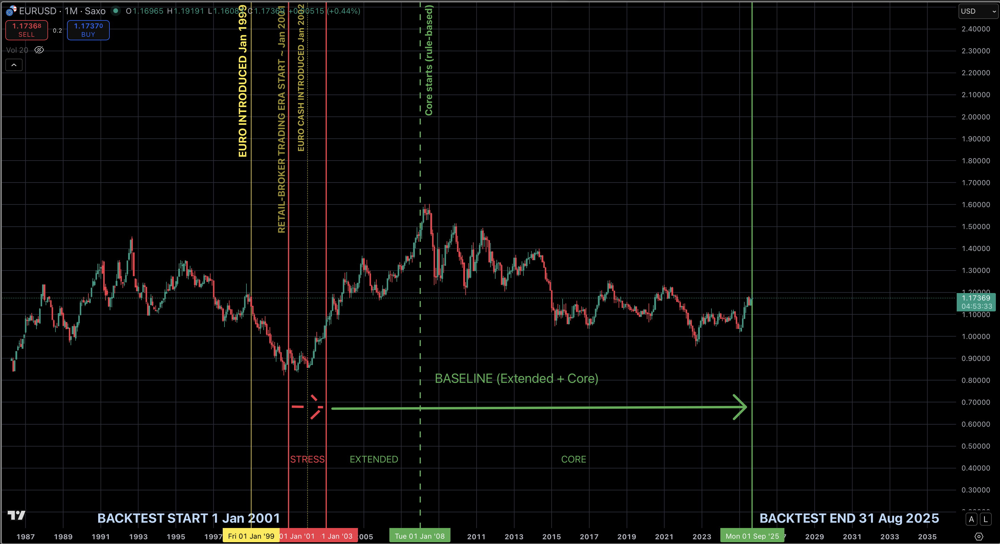
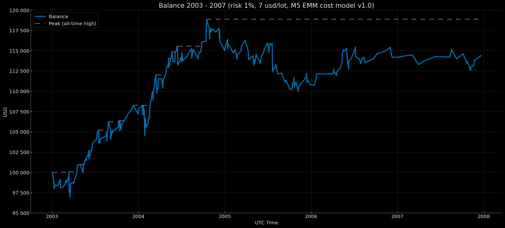
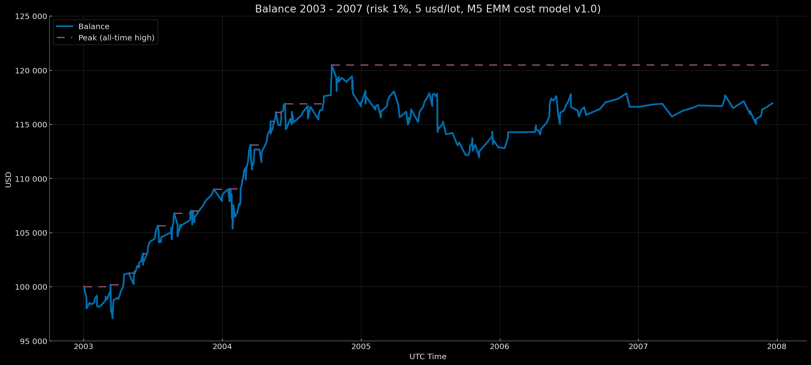
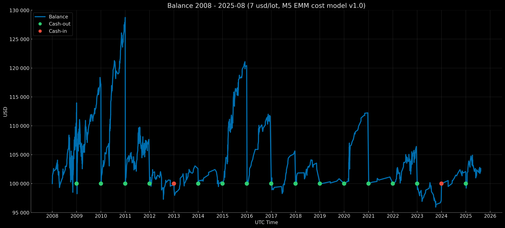
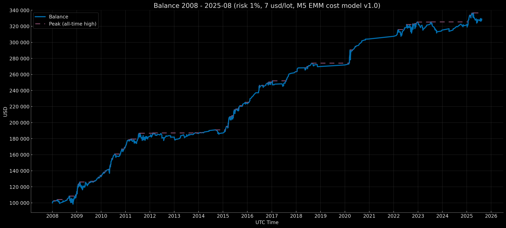
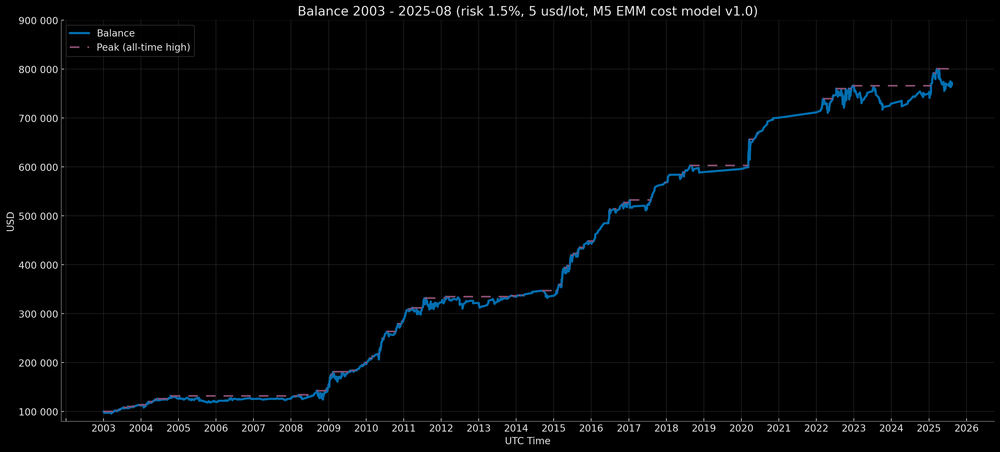
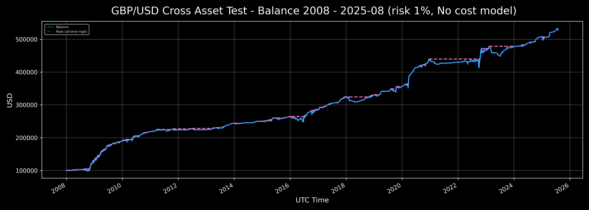

<div align="center">

# 🇪🇺 🇺🇸 Обзор и Методология Euro Macromechanica (EMM) Backtest 
# EMM Quinta Medulla Invariance Model

 > Euro Macromechanica — Macro-structural Mechanics of EUR/USD

 </div>


<p align="center">Backtest Period Map (EUR/USD, 2001–2025-08)</p>
<p align="center"></p>

> Заметка: «квант» — от англ. *quantitative* — «количественно измеряемый».

> Полная инструкция по верификации прозрачности процессов, а также входных и выходных файлов, использовавшихся в бэктесте содержится в [AUDIT.ru.md](https://github.com/euro-macromechanica-backtest/results/tree/main/docs/AUDIT.ru.md); ссылка продублирована в конце документа.

Результаты проекта демонстрируют **устойчивые эмпирические свидетельства** существования **неизменных квант-факторов (признаков рыночной неэффективности)** в механике движения **EUR/USD** на всём историческом интервале бэктеста. **Стабильные итоги за почти всю историю евро как единой валюты ЕС** (с момента введения наличных в январе 2002 года), включая ключевые системные кризисы последних двух десятилетий, служат этому подтверждением.

Данный проект не является «полноценным микро-бэктестом» институционального уровня, а представляет собой **косвенную демонстрацию** устойчивой эффективности одной отдельной модели исследования **EMM** через результаты базового ядра на **M5** при **консервативной модели исполнения**. **Базовое ядро** — это **минимально необходимая выборка сделок** исследования EMM, полученная из реализации ограниченного набора количественных факторов; оно предназначено для демонстрации **результативности**, а не высокой точности метрик, что объективно недостижимо на **неинституциональном** уровне и при OTC специфике.

Проект бэктеста включает, в частности:
- охват почти **всей истории евро как единой валюты ЕС**, включая **все ключевые системные кризисы последних двух десятилетий**;
- только **одну сигнальную внутридневную логику** на таймфрейме **M5**;
- полностью **неизменную** логику (без переобучения) на всём горизонте бэктеста;
- **прозрачно верифицируемый пайплайн** входных и выходных данных (детерминированное исполнение, криптографическая цепочка хэшей и видеозаписи лайв-прогонов) без раскрытия логики модели;
- детально реализованную техническую часть движка с акцентом на **объективный учёт всех релевантных факторов** и максимальный учёт всех возможных торговых издержек при работе **в условиях неинституциональной инфраструктуры и ограниченных ресурсов**;
- **прозрачность расчёта метрик** на основе непубличных файлов сделок и рядов баланса (**криптографически зафиксированных** в сводных манифестах результатов, генерируемых движком бэктеста), **включая открытый скрипт-калькулятор и методологию расчёта**.
- **стабильные** результаты на всём горизонте бэктеста на одном активе — EUR/USD.
- **GBPUSD cross asset test** за основной период по качеству данных 2008-2025-08 включая пре-Brexit и пост-Brexit периоды (2016).

**Бэктест проводился в UTC (UTC+0).**

---

---

## Содержание

- [Входные данные для бэктеста М5 ЕММ](#input-data)
  - [Исходные минутные данные, политика качества данных и решение о разделении на периоды бэктеста](#source-minute-data)
  - [Экономические календари](#source-calendars)
- [Публичная логика движка M5 EMM](#m5-emm-engine-logic) 
  - [Нормализация входных данных и детерминизм](#input-normalization)
  - [Процесс агрегирования минут в M5 бары](#m5-resample)
  - [Логика исполнения ордеров](#order-execution)
  - [Логика исполнения ордеров при появлении разрывов](#order-gap)
  - [Логика детектов разрывов](#gap-detection)
  - [Логика учета издержек, расчета и округления объема сделки](#cost-accounting)
  - [Epsilon (ε)](#epsilon)
- [Реализованная логика модели M5 EMM](#m5-emm-logic) 
  - [Временные фильтры реализованной логики M5 EMM](#time-filters)
  - [Календарные фильтры реализованной логики M5 EMM](#calendar-filters)
- [Методология модели издержек (EUR/USD) M5 EMM](#cost-model)
  - [Режимы комиссий](#commission)
  - [Динамическая модель издержек (spread/slippage) на основе средних Notional Volume (EUR) сделок стратегии M5 EMM](#spread-slippage)
- [Аргументация объективности реализации look-ahead логики математических расчётов уровней Objective (TP) и Guard (SL) по полностью сформированным 5-минутным барам в движке M5 EMM](#look-ahead)
- [Аргументация выбора минутных данных HistData для бэктеста M5 EMM](#histdata)
  - [Прозрачность и воспроизводимость](#histdata-reprod) 
  - [Тик-данные публичного доступа](#tick-data) 
  - [OTC-специфика и расхождения M1-данных](#otc) 
  - [Причины операционной незначимости различий источника M1 данных для M5 EMM](#m1-decision) 
  - [Вывод по выбору данных](#m1-conclusion) 
- [Результаты: периоды по Data Quality Policy v1.0, профили, режимы риска, режимы капитализации и детерминизм](#results-method)
  - [Периоды по Data Quality Policy v1.0](#data-policy)
  - [Профили](#profiles)
  - [Режимы риска и капитализации](#modes)
  - [Детерминизм результатов](#results-determ)
- [Доказательства существования логики стратегии и ее неизменности](#strategy-proof) 
  - [Криптографическая связка - доказательство существования и целостности закрытого архива стратегии](#crypto-bound)
  - [Видео лайв-прогоны ](#live-run)  
- [Метрики](#metrics)
  - [Методология расчёта метрик (основное)](#metrics-method)
  - [Методика расчёта Conditional Sortino (strict, loss-only)](#sortino)
  - [OOS / Walk-Forward / Multiple Testing & Selection Bias](#oos)
  - [Monte Carlo](#monte-carlo)
  - [Доверительные интервалы (BCa)](#confidence-intervals)
  - [Trade bootstrap (EDR & серии убыточных сделок)](#trades-bootstrap)
  - [Benchmark](#benchmark)
  - [Полная методология и определения метрик](#metrics-full)
  - [Файлы метрик](#metric-files)
- [Краткий обзор результатов](#review)
  - [Extended Baseline](#ext)
  - [Core Baseline](#core)
  - [Composite Baseline](#comp)
  - [Робастность результатов](#results-robust)
- [Выводы](#summary)
- [Ограничения и границы применимости](#limitations)
- [Ссылки](#links)
- [Контакты](#contact)
- [Лицензии и атрибуции](#license)
- [Disclaimer — не является инвестиционной рекомендацией](#disclaimer)

---

---

<a id="input-data"></a>
## Входные данные для бэктеста М5 ЕММ

<a id="source-minute-data"></a>
### Исходные минутные данные, политика качества данных и решение о разделении на периоды бэктеста

> Евро введён как единая валюта ЕС в безналичной форме в январе 1999 года; розничный доступ к торговле EUR/USD появился примерно в 2001 году. Наличные евро введены в январе 2002 года.

Главная цель — провести бэктест за максимально возможный период, желательно начиная с момента появления розничного доступа к торговле у FX-брокеров.

> *Отдельная благодарность HistData за бесплатный доступ к минутным данным (и тиковым выборкам) по валютным парам с большим историческим охватом — один из немногих сопоставимых по покрытию бесплатных источников.*

Решение было принято проводить бэктест на **минутных данных** HistData, а не на тиках. Подробности о причинах выбора минутных данных и источника HistData (в сравнении с альтернативами, например, Dukascopy) описаны в разделе `Аргументация выбора минутных данных HistData для бэктеста M5 EMM`.

К сожалению, качество минутных данных не позволило объективно протестировать **2001–2002 годы**: количество разрывов длительностью **5–15 минут** оказалось колоссальным, что критично для логики M5 (поскольку все квант-факторы реализованы на таймфрейме **M5**, а большое количество разрывов такого диапазона существенно искажает математические расчёты необходимых уровней). Поэтому **2001–2002 годы** используются как *stress-период* для иллюстрации поведения стратегии на деградированном качестве данных. Соответственно, метрики рассчитываются только для baseline-периодов.

Качество данных за **2003–2007 годы** также нельзя назвать идеальным, поэтому этот участок отмечен как **extended baseline**, чтобы не смешивать его с основным периодом по качеству данных — **core baseline** (**2008–2025-08**). Для иллюстрации на максимально длинном горизонте дополнительно сформирован композитный трек в режиме компаундинга (баланс переходит из года в год: Ending Balance → Initial Balance следующего года) на смешанном качестве данных — **composite baseline** (**2003–2025-08 = extended + core**).

Разрывы длительностью **более 15 минут** тоже значимы, однако их влияние ниже по сравнению с интервалами **5–15 минут**. Поэтому в качестве ключевого порога для классификации принят диапазон **5–15 минут**. В идеале разрывов не должно быть вовсе; работа выполнена с теми данными, которые были доступны на тот момент.

Коротко: в целом, качество данных позволяет получить объективные результаты бэктеста на минутной логике исполнения. 
Подробные результаты анализа разрывов, кратных 5 минутам, находятся в [data-hub/data_quality_analysis/](https://github.com/euro-macromechanica-backtest/data-hub/tree/main/data_quality_analysis).
Исходные минутные данные (raw) — [data-hub/source_data/raw](https://github.com/euro-macromechanica-backtest/data-hub/tree/main/source_data/raw).
Политика качества данных — [results/data_quality_policy/policy_v1.0.ru.md](https://github.com/euro-macromechanica-backtest/results/blob/main/data_quality_policy/policy_v1.0.ru.md)

**Периоды бэктеста:**  
- **Stress-период:** 2001–2002 (иллюстрация на деградированном качестве).  
- **Extended baseline:** 2003–2007 (5 лет).  
- **Core baseline:** 2008–2025-08 (17 лет 8 месяцев).  
- **Composite baseline:** 2003–2025-08 (22 года 8 месяцев).

> Метрики публикуются только для Baseline периодов. (Расширенные метрики только для Core Baseline)

По сведениям HistData исходные минутные данные указаны в фиксированном **EST (UTC−5)** (см. раздел F.A.Q. на сайте http://www.histdata.com/f-a-q/), поэтому для бэктеста они нормализованы к **UTC (UTC+0)**.

Нормализация минутных данных включает только:
- присвоение имён колонкам: `datetime`, `open`, `high`, `low`, `close`, `volume`;
- приведение временных меток к UTC (UTC+0) и сортировку.

Значения минутных данных не изменялись и не удалялись.

- Нормализованные минутные данные — [data-hub/source_data/prepared](https://github.com/euro-macromechanica-backtest/data-hub/tree/main/source_data/prepared)
- Скрипт нормализации минутных данных — [data-preparation-toolkit/minute_data_normalizer](https://github.com/euro-macromechanica-backtest/data-preparation-toolkit/tree/main/minute_data_normalizer)  
- Скрипт анализа отчётов о разрывах в минутных данных — [data-preparation-toolkit/minute_data_analyzer](https://github.com/euro-macromechanica-backtest/data-preparation-toolkit/tree/main/minute_data_analyzer)

*Все исходные файлы минутных данных и текстовые отчёты по качеству минуток получены с HistData. Анализ разрывов полностью воспроизводим любыми инструментами. Простой визуальный просмотр частоты разрывов 5–15 минут подтверждает корректность выбранной политики качества данных и снимает скептические вопросы (включая претензии о возможном OTS-якорении таймлайна и т. п.). Исходные минутные данные, взятые с HistData, также полностью воспроизводимы. При запросе об удалении данных со стороны HistData минутные исходники, на которых проводился бэктест, будут предоставляться для верификации по запросу.*

---

<a id="source-calendars"></a>
### Экономические календари

Календари собирались вручную (по частям) с помощью расширенных режимов ChatGPT: официальные источники ограничивают массовые HTTP-запросы, а бесплатных сводных календарей за столь длинный период нет. Для логики движка требовался узкий набор стран, а также только ключевые макрорелизы, специально отфильтрованные автором, которые, как правило, публикуются в фиксированные временные окна. Поэтому риск возможных **временных неточностей** в собранных релизах невелик.

> Все события собраны из официальных источников: национальные банки, национальные статистические службы и т. д.

Роль календаря в реализованной логике — **фильтр входов**, а не источник сигналов: стратегия избегает открытий позиций в окнах релизов. При ошибке во времени релиза сделка, как правило, закрывается по стопу, а не создаёт «ложную» прибыль. Следовательно, даже при маловероятных ошибках во времени публикаций результаты, как правило, **занижены**, а не завышены.

**Список событий высокой важности и стран, специально отфильтрованных и собранных для движка M5 EMM**.

**США:**
- Плановые события FOMC:  пресс-конференции, заявления и решения по процентной ставке
- Речи председателя ФРС на Jackson Hole Economic Symposium
- Полугодичные выступления председателя ФРС в Конгрессе по Отчёту о денежно-кредитной политике (Humphrey–Hawkins)
- Employment Situation (Nonfarm Payrolls, NFP)
- GDP (BEA: advance/second/third)
- Retail Sales (Advance, Census)
- ISM Manufacturing PMI
- ISM Services PMI (официально “ISM Services PMI”, раньше Non-Manufacturing)
- PCE Price Index
- CPI
- PPI

**Еврозона:**
- Плановые пресс-конференции ЕЦБ и решения по процентной ставке

**Причины исключения flash HICP, Unemployment Rate и т.д. по ЕС.**
- Во-первых, эти релизы, как правило, не являются драйверами движения EUR/USD на ≥60 пипсов в 10–15-минутном окне после публикации. Поэтому они незначимы для реализованной логики; редкие эпизодические всплески по flash HICP не меняют общей картины.
- Во-вторых, логика движка учитывет импульсы порядка ~40 пипсов и больше за 5–10 минут.

**Подробности о реализованной логике в бэктесте M5 EMM описаны — в разделе `Реализованная логика стратегии M5 EMM`.**

> Внеплановые события высокой важности (например, внеочередные решения/заявления FOMC, intermeeting actions) фиксировались отдельно на всякий случай, но в плановые календари не включались и не использовались в бэктесте, поскольку не являются запланированными публикациями.

Экономические календари находятся в [data-hub/economic_calendars/](https://github.com/euro-macromechanica-backtest/data-hub/tree/main/economic_calendars).

В пути [`data-hub/economic_calendars/raw/`](https://github.com/euro-macromechanica-backtest/data-hub/tree/main/economic_calendars/raw) выложены собранные календари с событиями в локальном времени релиза источника, по частям — для повышения прозрачности. В пути [`data-hub/economic_calendars/prepared/`](https://github.com/euro-macromechanica-backtest/data-hub/tree/main/economic_calendars/prepared) находятся нормализованные календари — приведённые к UTC+0, которые использовались как входные файлы в бэктесте.

> Календари не содержат фактических значений релизов — только метаданные: время, название, степень важности, страна/регион и т. д.

Нормализация календарей включает только приведение времени публикаций к UTC+0 и сортировку записей. Преобразование в UTC+0 выполнено с использованием базы часовых поясов IANA, что обеспечивает корректный учёт локальных правил времени и переходов на/с летнего времени (DST). Несоответствий из-за переходов DST нет: ключевые вышеперечисленные макрорелизы не публикуются в часы перевода времени.

Скрипт нормализации экономических календарей — [`data-preparation-toolkit/economic_calendar_normalizer`](https://github.com/euro-macromechanica-backtest/data-preparation-toolkit/tree/main/economic_calendar_normalizer)

*Все данные календарей, использовавшихся в бэктесте, полностью прозрачны и воспроизводимы.*

---

---

<a id="m5-emm-engine-logic"></a>
## Публичная логика движка M5 EMM

<a id="input-normalization"></a>
### Нормализация входных данных и детерминизм

Движок принимает входные минутные данные и календарные события с временными метками в формате UTC (ISO-8601).
Перед запуском моделирования все исходные ряды приводятся к **единому и воспроизводимому виду**, чтобы результат зависел **только от самих данных**, а не от порядка строк, дубликатов или артефактов источника. Минутные записи упорядочиваются по времени; если для одной и той же метки встречается несколько строк, учитывается **последняя**, а предыдущие считаются устаревшими; некорректные или неполные ценовые значения исключаются. **Искусственные заполнения и интерполяции не применяются** — в расчёт попадает только фактическое содержимое данных.

Далее минуты однозначно сопоставляются пятиминутным окнам по правилу принадлежности интервалу: пустые окна отбрасываются, частично заполненные сохраняются **без заполнений/интерполяций**. Нормализация **не создаёт отсутствующих минут**, поэтому реальные паузы (разрывы) сохраняются и учитываются логикой разрывов.

Календарные данные (часовые события и торговые расписания) приводятся к единому виду и дедуплицируются; их применение описано в разделе `Реализованная логика стратегии M5 EMM`.

**Процедуры нормализации и агрегирования детерминированы**: при одинаковом входе повторные прогоны дают одинаковый результат, независимо от исходного порядка строк, наличия дубликатов или неоднородностей выгрузки. В конце периода все оставшиеся позиции закрываются **по последней доступной минутной цене**, что фиксирует итоговое состояние однозначно.

**Детерминизм результатов.** 

Результаты симуляции детерминированы: при идентичном входе повторные запуски воспроизводят один и тот же набор сделок, времён и цен. Это достигается за счёт стабильной сортировки и снятия дублей, фиксированной сетки и правил сопоставления минут окнам, однозначного выбора «самой ранней» минуты, единого установленного epsilon, фиксированного приоритета SL при конфликте с TP, **строгих правил квант-логики** и отсутствия случайности. Частично заполненные бары сохраняются без интерполяций; реальные паузы в данных не заполняются и учитываются логикой разрывов. Для точной воспроизводимости фиксируются версии зависимостей движка M5 EMM.

**Детерминизм файлов на выходе.**

Файловые артефакты симуляции формируются **детерминированно**: при неизменных входных данных, параметрах и версиях зависимостей каждое повторное выполнение производит идентичный набор файлов с совпадающим содержимым. Это обеспечивается единообразной временной базой и фиксированной M5-сеткой, предварительной нормализацией минутных записей (стабильная сортировка, снятие дублей без интерполяций), предсказуемой последовательностью этапов симуляции (двухпроходная схема с формированием сделок и снимков баланса, сопоставлением баланса моментам входа и финальным прогоном без случайных компонентов), а также стабильными правилами сериализации (постоянный разделитель, фиксированная числовая точность, единый формат меток времени и упорядочение строк по времени). Состав и наименования выходов остаются постоянными за счёт шаблонов с детерминированным определением года; визуализация SVG строится из уже детерминированного ряда баланса и потому также воспроизводима. Для внешней верификации неизменности формируется файл `artifacts_YYYY.sha256` со списком SHA-256 всех входных и выходных артефактов; строки в нём упорядочиваются, что делает сам файл контрольных сумм побитово стабильным. При одинаковых входах/параметрах и фиксированных версиях библиотек содержимое `trades_YYYY.csv*`, `balance_YYYY.csv*` (ряд баланса), `summary_YYYY.csv*`, `balance_YYYY.svg` и `artifacts_YYYY.sha256` повторяется строго.

---

<a id="m5-resample"></a>
### Процесс агрегирования минут в M5 бары 

Минутные котировки укладываются на фиксированную пятиминутную сетку: окно начинается в момент `t` и охватывает промежуток `[t, t+5 минут)`, каждая минута попадает ровно в одно окно. Для каждого окна формируется один M5-бар: **Open** — из самой ранней доступной минуты окна, **High/Low** — максимум/минимум среди минут окна, **Close** — из самой поздней доступной минуты окна. Если в окне нет ни одной валидной минуты, бар не создаётся; если минут меньше пяти, бар считается частично заполненным и сохраняется без заполнений/интерполяций. **Метка бара — время начала окна.**

> Агрегация выполняется после нормализации/дедупликации минутных данных.

**Процедура детерминирована:** порядок исходных строк и дубли одной и той же минутной метки не влияют на результат (при совпадении меток учитывается последняя запись). Частично заполненные бары сохраняются; их пригодность для поиска входов определяется правилами качества данных и расписанием. При обнаружении разрыва вводится временный запрет только на новые входы, тогда как сопровождение уже открытых позиций продолжается.

---

<a id="order-execution"></a>
### Логика исполнения ордеров 

- На каждом M5-баре детерминированно рассчитывается набор служебных уровней по направлению сделки на основе текущего M5-бара и истории прошлых M5-баров: **Trigger** — вход; **Guard (SL)** — стоп; **Objective (TP)** — целевая фиксация прибыли.
- Внутри 5-минутного окна уровни **не пересчитываются**; новый набор уровней появляется только при смене окна.
- Совершается только **1 сделка на 1 рассчитанный уровень Trigger**.
- Наблюдение ведётся только относительно M5-баров; сам вход ищется на M1 внутри текущего M5-бара.
- Если внутри M5-бара несколько M1-свечей касаются уровня **Trigger**, исполняется самая ранняя минута, коснувшаяся рассчитанного уровня. По той же логике срабатывают **Guard (SL)** и **Objective (TP)**.
- **Guard (SL)** фиксируется в момент входа (в минуте исполнения **Trigger**) и рассчитывается относительно текущего M5-бара. **Objective (TP)** — динамический, пересчитывается на каждом следующем M5-баре после входа.
- Если **Objective (TP)** достигается в текущем M5-бара, сделка закрывается по уровню, рассчитанному для текущего M5-бара; если началась первая минута следующего M5-бара и **Objective** достигнут внутри следующего M5-бара, закрытие происходит по уровню следующего M5-бара.
- Для открытия сделки обязателен рассчитанный **Guard (SL)**. Обязательное наличие рассчитанного **Objective (TP)** при входе опущено для консервативности: при его отсутствии уровень рассчитывается на следующем M5-баре и далее — до закрытия по стопу.
- При достижении в одной минуте сразу двух уровней **Trigger** внутри M5-бара сделки открываются от обоих уровней; риск берётся установленный по умолчанию **на каждую** сделку от баланса на момент входа (например, при балансе $100 000 и риске 1% на сделку обе сделки откроются с риском по 1% каждая — риск **не делится** на два).
- При конфликте на M1 целевой прибыли (TP) и стоп-лосса (SL) приоритет всегда у **Guard (SL)**.
- При достижении двух уровней **Trigger** внутри одного M5-бара в разные минуты сделки открываются от каждого достигнутого **Trigger** соответственно.

> Реализованная логика предполагает работу с маркет-ордерами. Подробное описание модели издержек по маркет-ордерам см. в разделе `Методология модели издержек (EUR/USD) M5 EMM`.

> Подробное объяснение по причинам реализации логики расчета уровней **Objective (TP)** и **Guard (SL)** относительно полностью сформированных М5 баров а не по мере накопления минут в текущем М5 (look-ahead) смотреть в разделе`Аргументация объективности реализации look-ahead логики математических расчётов уровней Objective (TP) и Guard (SL) по полностью сформированным 5-минутным барам в движке M5 EMM`

---

<a id="order-gap"></a>
### Логика исполнения ордеров при появлении разрывов 

После входа позиция сопровождается на M1 внутри текущего M5-бара. Если возникает разрыв (нет минут внутри одного или нескольких M5-баров), проверка закрытия возобновляется на первой доступной минуте после разрыва. Закрытие при этом считается по расчётному уровню, а не по цене открытия минуты после разрыва.

- **Guard (SL)** фиксирован на момент входа (по уровням того M5, где был **Trigger**) и не меняется. После разрыва, как только первая доступная M1 достигает **Guard (SL)**, сделка закрывается по уровню **Guard (SL)** (уровень постоянный). Таким образом, стоп не получает преимущества от разрыва и не «улучшается».
- **Objective (TP)** динамический:  
  - если факт достижения **Objective (TP)** фиксируется внутри того же M5, закрытие идёт по **Objective (TP)** этого M5;  
  - если первая доступная минута уже в следующем M5 и цель «была бы достигнута в разрыве», закрытие происходит по **Objective (TP)** следующего M5 (то есть по свежепересчитанному уровню на новом баре), а не по цене открытия после разрыва.
- Никакого «сверхплюса» от разрывов нет. Даже если рынок «перескочил» далеко за цель, закрытие идёт по расчётному уровню **Objective (TP)** соответствующего M5 (текущего/следующего), а не по потенциально лучшей цене открытия после разрыва. Точно так же убыток фиксируется по зафиксированному **Guard (SL)**.
- **Погрешность из-за 5-минутного разрыва**: поскольку **Objective (TP)** пересчитывается на каждом новом M5, его значение после разрыва может немного отличаться от гипотетического уровня без разрыва — как в «плюс», так и в «минус». Соответственно, это не даёт несанкционированного преимущества стратегии.
- Конфликт на первой минуте после разрыва (если одновременно достигнуты **Guard (SL)** и **Objective (TP)**): приоритет всегда у **Guard (SL)**.

---

<a id="gap-detection"></a>
### Логика детектов разрывов 

Детектор проверяет каждый M5-бар, сравнивая:

1. **Временной разрыв** между  
   • последней минутой до открытия текущего TF-окна и  
   • первой минутой внутри текущего TF-окна.  
   Если пауза **строго больше** заданного порога (в минутах) — фиксируется разрыв.

2. **Ценовой разрыв** между  
   • закрытием последней минуты прошлого окна и  
   • открытием первой минуты текущего окна.  
   Если модуль разницы **≥ заданного порога** (в пипсах) — фиксируется разрыв. *(Порог установлен в 25 пипсов.)*

Условия применяются только если доступны и «предыдущая минута», и «первая минута текущего окна». Если одна из них отсутствует — разрыв на этом баре не детектируется.

Если перерыв до начала текущего окна превышает отдельный «длинный» порог (*reopen*) в **1440 минут**, то даже при срабатывании условий выше разрыв **не активирует блокировку** (считается нормальным перезапуском после долгого простоя — выходных/праздников). Если обнаружен хотя бы один тип разрыва (время или цена) и это не реопен, то старт «штрафного» окна — **первая минута текущего TF-окна**, в котором был обнаружен разрыв. **Длительность «штрафного» окна задана в минутах.** *(Установлено значение 30 минут.)*

Пока текущий M5-бар попадает в «штрафное окно», действует запрет **только на новые входы**. Сопровождение и выход уже открытых позиций выполняются в обычном порядке. Если у M5-бара вообще нет ни одной минуты, бар пропускается целиком, и сопровождение/выходы на нём не проверяются. Когда текущее время TF-бара достигает конца блокировки (или позже), блок снимается, работа продолжается в штатном режиме.

Проверка на разрыв выполняется **внутри** ветки допуска к поиску входов (после сторонних квант-факторов), **до** проверки касаний **Trigger**. Штрафное окно ставится, если бар **допущен** к поиску входов и на нём детектирован разрыв, **независимо** от наличия касаний **Trigger**. Если бар **не допущен** или это *reopen*, «штрафное окно» **не ставится** — это сделано для консерватизма, чтобы не вводить лишнюю фильтрацию там, где входы всё равно невозможны.

**Замечания по реализации:**

- **Пустые M5-бары.** Если у текущего M5-бара нет ни одной M1-минуты, бар пропускается целиком: детект разрыва, поиск новых входов и сопровождение/выходы на таком баре не выполняются, потому что нечего проверять. Сопровождение возобновляется на первой доступной минуте следующего бара.
- Временной порог сравнивается как `>` (строго больше), ценовой — как `≥`.
- Начало блокировки всегда ставится на **первую минуту текущего окна**; если одновременно сработали обе проверки, результат тот же.
- Блокировка не «накапливается» и не продлевается автоматически; на следующем баре может начаться новая, если снова обнаружится разрыв. 
- «Продление» блокировки.
	- Если следующий допущенный бар тоже содержит разрыв, движок ставит новое окно с его начала — фактически перезапускает таймер. Это выглядит как продление, но это не суммирование интервалов, а новое окно, перезаписывающее предыдущее по времени старта/окончания.
	- Если бар пустой (нет ни одной M1) — он пропускается целиком: ни проверка входов, ни детект разрывов, ни продление/перезапуск «штрафного окна» на нём не выполняются.
- Если сработал порог **reopen**, блокировка **не включается**, даже если обычные пороги разрыва превышены.

**Детектор разрывов анализирует только границу M5-окна** — интервал между последней M1 до начала окна и первой M1 внутри этого окна. Пропуски минут внутри самого окна гэпом не считаются и «штрафное окно» из-за них не ставится.
При этом действуют два правила качества данных:
- Тонкий бар: если внутри окна слишком мало минут, бар может быть не допущен к поиску входов по порогу минимального покрытия *(значение установлено в 3 минуты)*. Это не является разрывом и не запускает штраф.
- Пустой бар: если у M5-бара вообще нет ни одной минуты, такой бар пропускается целиком; сопровождение/выходы на нём не проверяются (минут нет для проверки).

**Итог**: штраф за гэп возникает только при разрыве на границе окон (по времени или по цене). Внутри M5-окна разрывы не детектируются и не штрафуются.

> Из-за логики защиты от разрывов также могут быть пропущены потенциальные сделки, но по качеству данных за период с 2008-2025-08 вероятность таких случаев мала. Таким образом, реализованная логика детектов разрывов на границах окна M5 баров дополнительно фильтрует разрывы для повышения объективности результатов. Причина, по которой «штрафное окно» ставится именно при разрывах на границах окон M5-баров, в том, что уровни Trigger / Guard / Objective фиксируются на закрытии каждого M5-бара (по данным бара), и затем не пересчитываются внутри бара. Новый набор уровней появляется именно на смене окна M5, поэтому и контроль разрывов делается на границе: сравнивается последняя M1 до окна и первая M1 внутри окна — естественная точка для детекта. Разрывы внутри M5 «штрафное окно» не запускают: внутри бара уровни неизменны, поэтому достаточно фильтра пригодности бара к входам без дополнительной блокировки. Вводить «штрафное окно» на разрывы внутри M5-бара — излишне жёсткий фильтр, поэтому при разрывах внутри M5-баров применяется фильтр пригодности бара для поиска входов (без постановки «штрафного окна»).

Детект разрывов применяется **исключительно** в ветке допуска к поиску входов (и до проверки касаний уровней), а вне этого контекста — **не активируется**; такой метод выбран, чтобы не усиливать фильтрацию редких артефактов минутных данных и не вносить лишний шум в бэктест. Эмпирически подход подтверждён стабильностью результатов бэктеста на длинном горизонте с учетом классификации периодов по качеству данных.

---

<a id="cost-accounting"></a>
### Логика учета издержек, расчета и округления объема сделки 

Движок настроен на **фиксированные параметры издержек для одного годового прогона** (в рамках выбранного профиля/режима и календарного года). В состав издержек входят: **комиссия**, **spread** и **slippage**. Все три компонента применяются к **каждой** сделке; опубликованные результаты уже включают их влияние на PnL.

**Point и pip.** Для пятизнака 1 pip = 10 points. Все пороги/издержки задаются в пипсах и переводятся в цену.

- **Комиссия (commission).** Задаётся как ставка за **round-turn** на 1 стандартный лот (100 000 EUR) и применяется **пропорционально фактическому объёму** позиции. **Не входит** в расчёт риска на сделку (size/lot sizing) — классифицируется как **отдельная торговая издержка**, учитываемая поверх результата сделки.
- **Spread и slippage.** Задаются как **round-turn** величины (в пипсах) для выбранного режима/года и **распределяются поровну (50/50)** между сторонами сделки: половина применяется при входе, половина — при выходе (напр.: spread RT = 0.8 pips ⇒ 0.4 / 0.4 pips). **Spread и slippage моделируются через эффективные цены исполнения**: цены входа/выхода (**Trigger/Objective/Guard**) сдвигаются в неблагоприятную сторону. Эти издержки также **учитываются при расчёте размера позиции под заданный риск** (лот-сайзинг и ожидаемая потеря на стопе считаются по уже скорректированным ценам), поэтому они напрямую влияют на итоговый P&L.
- **Фиксация на период.** Параметры издержек задаются при запуске и **не меняются в пределах годового прогона**. Для каждого профиля/режима и календарного года применяются собственные значения из таблицы модели издержек, согласованной с реализованной логикой модели издержек M5 EMM — [`docs/cost_model/m5_emm_cost_model_v1.0.csv`](https://github.com/euro-macromechanica-backtest/results/blob/main/docs/cost_model/m5_emm_cost_model_v1.0.csv). 

> **Подробности о методологии модели издержек см. в разделе `Методология модели издержек (EUR/USD) M5 EMM`.**

**Итог:** комиссия учитывается отдельно от риска, а spread/slippage включаются в расчёт риска и размера позиции; все издержки применяются к каждой сделке, поэтому результаты прогонов и сводные метрики уже отражают их влияние. 

**Расчёт размера позиции на сделку.** Объём позиции для каждой сделки определяется как фиксированная доля от текущего баланса на момент входа (доля риска задаётся на весь годовой прогон). Риск берётся не от заранее фиксированного, а от **фактического баланса** перед открытием сделки.  
> При достижении в одной минуте сразу двух уровней **Trigger** внутри M5-бара сделки открываются от обоих уровней; риск берётся установленный по умолчанию **на каждую** сделку от баланса на момент входа (например, при балансе $100 000 и риске 1% на сделку обе сделки откроются с риском по 1% каждая — риск **не делится** на два).

**Округление лота по риску.** Сначала вычисляется «сырой» объём позиции так, чтобы потенциальный убыток при срабатывании стоп-лосса соответствовал целевому риску; при этом дистанция до SL берётся уже с учётом spread/slippage. Затем объём **всегда** округляется вниз до ближайшего допустимого шага, поэтому фактический риск по стопу не превышает целевой. Превышение возможно лишь в частных случаях: 
- расчётный лот меньше технического минимума и берётся минимально допустимый объём; 
- в ту же минуту открывается несколько сделок без разделения между ними лимита риска; 
- комиссия списывается поверх результата сделки и увеличивает фактический убыток, поскольку не входит в базу расчёта риска.

> **Spread и slippage** заданы явно и учитываются на этапе лот-сайзинга: дистанция от входа до SL берётся уже с учётом этих издержек. 

---

<a id="epsilon"></a>
### Epsilon (ε)

В модели используется единый допуск сравнения ε, равный **одному минимальному шагу котирования** инструмента. Для **EURUSD (5-знак)**: **ε = 0.00001** (*1 point = 0.1 pip*).

**Область применения.**  
ε используется **только** при бинарной проверке факта «касания» расчётного уровня экстремумом минутного бара (High/Low) внутри M5-окна. На вычисление самих уровней ε **не влияет**.

**Порядок относительно издержек.**  
Сначала фиксируется событие «касание/не касание» с учётом ε; затем формируется цена исполнения с применением заданных издержек (spread/slippage/commission). ε **не изменяет** величины издержек.

**Исключения (где ε не применяется).**  
Детекция разрывов и проверки пригодности бара для входов трактуются строго по заданным неравенствам (`>` / `≥`) **без ε**.

**Обоснование выбора.**  
Значение **0.1 пипса** является **минимально достаточным** для нивелирования пограничных ошибок дискретизации и округления на M1, не «расширяет» уровни до зон и не создаёт методологического преимущества; возможные сдвиги меньше шага котирования и существенно ниже транзакционного шума (spread/slippage/commission).

**Детерминизм.**  
Фиксированное ε обеспечивает воспроизводимость результатов при одинаковых входных данных.

**Смежные правила исполнения.**  
Внутриминутные конфликты порядка событий разрешаются фиксированным приоритетом: **Guard (SL) имеет приоритет** над **Objective (TP)** при одновременном достижении.

**Примечание (OTC-специфика).**  
Минутные ряды разных провайдеров (например, HistData и Dukascopy) могут микроскопически расходиться по OHLC из-за тайм-зоны, типа цены и агрегации. Формализация ε нормирует критерий «касания» и снижает влияние таких расхождений.

---

---

<a id="m5-emm-logic"></a>
## Реализованная логика модели M5 EMM

### Реализованная версия M5 EMM покрывает базовое ядро модели, представляя минимально-достаточный набор сделок для демонстрации эффективности. В этой реализации все операции — торговые решения, вычисления и учёт признаков — выполняются исключительно на 5-минутном таймфрейме. Модуль M5 неполный: из-за сложности подхода и ограничений по ресурсам внедрение всего комплекса квант-факторов даже в рамках одной модели M5 не завершено. Кроме того, текущая версия не включает основную логику работы в пострелизных окнах важных макроданных, которая является одним из ключевых источников результативности. EMM Research — это композиция сигналов на нескольких таймфреймах с учётом макроструктурных закономерностей; тем не менее представленного M5-ядра достаточно, чтобы продемонстрировать его продуктивность.

---

<a id="time-filters"></a>
### Временные фильтры реализованной логики M5 EMM

Реализованная стратегия опирается на торговлю макроструктурой на M5-барах и торгует только **в спокойные интервалы** торговых окон. **Это не «только Азия»**: под «спокойными» понимаются окна вне волатильных интервалах в начале каждого часа сессий **London–NY**, ролловера и релизов; фильтры применяются и в активных отрезках **London–NY**. Все запреты заданы **фиксированными окнами в UTC** и **не зависят от DST** (источник данных HistData с фиксированной EST-привязкой учтён; ссылка на F.A.Q. с форматом времени — `http://www.histdata.com/f-a-q/`).

В рамках логики EMM реализованы **10-минутные блоки — фильтр волатильных окон начала часа** в активных отрезках сессий **London–NY**, где обычно происходит статистическое увеличение издержек (spread/slippage). Также реализованы специальные фиксированные фильтры **на запрет и ужесточение** открытия позиций на определённые фиксированные окна времени на основе логики EMM. **Ролловер и окно CME Globex** закрыты постоянным окном, покрывающим и лето, и зиму.

FX-ролловеры по UTC:
- Лето (EDT, UTC−4): 21:00 UTC
- Зима (EST, UTC−5): 22:00 UTC

CME Globex ежедневный технический перерыв по UTC:
- Лето (CDT, UTC−5) 21:00–22:00 UTC
- Зима (CST, UTC−6) 22:00–23:00 UTC

Фильтр реализован как полный запрет торговли **с 19:00 до 00:10 UTC** (включает FX-ролловеры и окно **CME Globex**, независимо от DST). Соответственно, к моменту ролловера и перерыва **CME Globex** открытых сделок нет, и закрытия сделок в эти периоды не выполняются. Это также подтверждают трейд-метрики средней продолжительности сделок.

---

<a id="calendar-filters"></a>
### Календарные фильтры реализованной логики M5 EMM

Экономические календари собраны **только** по заранее определённым плановым релизам **Еврозоны и США**, которые отнесены к событиям высокой важности. Все события приведены **в UTC** и **не зависят от DST**.

- **Час события (технический).** Любая календарная метка попадает в «технический час», определяемый как полный час, начинающийся с начала часа метки. Пример: релиз в **15:30** трактуется как «час события» **15:00–15:59**. Ужесточение действует **на весь час**, а не только с момента релиза.
- **Пре-окно — полный запрет.** Длительность пре-окна установлена **в 60 минут до времени релиза**. Однако часть, которая **пересекается с «техническим часом»**, уже относится к правилам «часа события» (там действует не полный запрет, а ужесточение).
  **Эффективное пре-окно**: от *(время релиза − 60 минут)* до **начала технического часа**.  
  Пример: при релизе **15:30** сырое окно 14:30–15:29:59, но **15:00–15:29:59** — это уже «час события»; значит, **полный запрет** фактически действует **14:30–14:59:59**.
- **Час события — ужесточение (не полный запрет).** В течение всего «технического часа» входы **допускаются только при выполнении жёсткого условия**; в упрощённой формулировке — **импульс ≥ 300 пипсов за 5–15 минут**. Порог задан как **консервативная верхняя граница**; для EUR/USD такие движения — объективно **единичные эпизоды**. В подобных эпизодах вход с большей **долей вероятности** смещается на **15–30+ минут** после релиза, когда издержки (spread/slippage) обычно нормализуются. Соответственно, даже при наличии таких единичных сделок заданная модель издержек остаётся объективной и не искажает результаты на всём горизонте бэктеста (если такие случаи вообще встречаются).
- **После часа события.** Начиная с **следующей часовой метки** (в примере — **с 16:00**) календарные ограничения снимаются.

**Все фильтры, их значения и вся квант-логика жёстко фиксированы и едины *(без изменения и переобучения)* на всём горизонте бэктеста (профилей/режимов риска/капитализации и т. д.).**

---

---

<a id="cost-model"></a>
## Методология модели издержек (EUR/USD) M5 EMM

### Все компоненты модели издержек — комиссия, spread и slippage — учтены в каждой сделке. Spread и slippage отражены в эффективной цене исполнения ордеров.  
См. раздел `Логика учёта издержек, расчёта и округления объёма сделки`.

---

<a id="commission"></a>
### Режимы комиссий

- **Institutional** — *главный трек*: средняя институциональная комиссия **$5.5 за round-turn на 1 стандартный лот (100 000 EUR)**; эквивалент **≈0.55 pips на EURUSD** *(≈**$2.75** за сторону)* — ориентир для институциональных условий.
- **Retail Rebate** — усреднённая комиссия ритейл-счёта после кэшбэка **$5 за round-turn на 1 стандартный лот (100 000 EUR)**; эквивалент **≈0.5 pips на EURUSD** *(≈**$2.5** за сторону)* (режим с использованием сервиса кэшбэка на комиссии).
- **Retail Standard** — *иллюстрация обычной ритейл-комиссии*: **$7 за round-turn на 1 стандартный лот (100 000 EUR)**; эквивалент **≈0.7 pips на EURUSD** *(≈**$3.5** за сторону)*.

---

**Institutional**

Во всех институциональных режимах применяется **фиксированная комиссия $5.5 за round-turn на 1 стандартный лот (100 000 EUR)** как отдельная строка расходов, независимо от типа потока (ECN/PoP raw-spread, single-dealer, «zero-commission» и т. п.).  
Эквиваленты: **≈ 0.55 pips RT** (≈ **$2.75** per side; **$55 за $1 млн RT**).

**Spread** и **slippage** учитываются отдельно согласно модели исполнения по EUR/USD из таблицы [`m5_emm_cost_model_v1.0.csv`](https://github.com/euro-macromechanica-backtest/results/blob/main/docs/cost_model/m5_emm_cost_model_v1.0.csv) и **не включают комиссию**. Итоговая транзакционная стоимость рассчитывается как сумма *(spread + slippage)* и *комиссии $5.5 RT/лот*.

**Обоснование выбора**

- Унификация метрик между различными провайдерами ликвидности и моделями ценообразования (комиссия строкой vs all-in в спреде).
- Повышение проверяемости: комиссия задаётся явным параметром и, при необходимости, можно варьировать в блоке чувствительности без изменения параметров spread/slippage.

**Рыночные уровни (справочно)**

*В расчётах используется фиксированное значение $5.5 RT/лот; таблица ниже предназначена для сопоставления с рыночной практикой.*

| Поток / venue                         | Способ взимания          | Типичный уровень (RT/лот) | Эквивалент, пипсы RT | $ за $1M RT | Комментарий                                           |
|--------------------------------------|---------------------------|---------------------------:|---------------------:|------------:|-------------------------------------------------------|
| Top-tier ECN / PoP (raw-spread)      | Комиссия отдельной строкой| **$4–6**                   | **0.40–0.60**        | **$40–60**  | Бенчмарк для средних/крупных участников; $5.5 — центр.|
| Prime-broker direct, high volume      | Комиссия отдельной строкой| **$2–4**                   | **0.20–0.40**        | **$20–40**  | Требуются высокие обороты и строгие ценовые тиры.     |
| Smaller PoP / низкая частота          | Комиссия отдельной строкой| **$6–7**                   | **0.60–0.70**        | **$60–70**  | Меньшие скидки за объём; нерегулярная торговля.       |
| Single-dealer (all-in)                | Стоимость в спреде        | —                          | +**~0.3–0.7 п**      | —           | В модели комиссия учитывается отдельно (фикс. $5.5).  |
| «Zero-commission» ECN                 | 0 $/лот, шире спред       | —                          | ~**0.5–0.8 п**       | —           | Эквивалент all-in; в модели комиссия задаётся отдельно.|

**Конверсии**
- **1 лот = $10 за 1 pip** ⇒ **$X RT/лот = X/10 пипса RT**.
- **$Y за $1 млн RT = $Y/10 за лот RT = $100 × (пипсы RT)**.

**Чувствительность (индикативно)**

- **Notional Volume (EUR): 5M**  (50 lots; $/pip = $500)
  → Base: **$275 RT/trade** (= 0.55 pips × $500)
  → Δ**±$1 RT/lot** ⇒ **±$50/trade** (≈ ±0.10 pips RT)

- **Notional Volume (EUR): 10M** (100 lots; $/pip = $1,000)
  → Base: **$550 RT/trade** (= 0.55 pips × $1,000)
  → Δ**±$1 RT/lot** ⇒ **±$100/trade** (≈ ±0.10 pips RT)

- **Notional Volume (EUR): 15M** (150 lots; $/pip = $1,500)
  → Base: **$825 RT/trade** (= 0.55 pips × $1,500)
  → Δ**±$1 RT/lot** ⇒ **±$150/trade** (≈ ±0.10 pips RT)

- **Notional Volume (EUR): 30M** (300 lots; $/pip = $3,000)
  → Base: **$1,650 RT/trade** (= 0.55 pips × $3,000)
  → Δ**±$1 RT/lot** ⇒ **±$300/trade** (≈ ±0.10 pips RT)

**Формулы расчёта**
- **Комиссия за сделку (RT, $):**  
  `Cost_RT_$ = Commission_RT_per_lot_$ × (Notional_USD / 100,000)`
- **Комиссия в пипсах RT:**  
  `Pips_RT = Commission_RT_per_lot_$ / 10`
- **Годовой эффект (индикативно):**  
  `ΔAnnualCost_$ = (Δ$RT/lot) × (Notional_USD / 100,000) × Trades_per_year`

> **Комиссия (институциональные условия, EUR/USD).** По умолчанию применяется **$5.5 за round-turn на 1 стандартный лот (100 000 EUR)** как отдельная строка расходов, эквивалентная **≈ 0.55 пипса RT** (≈ $2.75 per side; **$55/$1M RT**). Spread и slippage учитываются раздельно в соответствии с моделью исполнения. Диапазон рыночных условий для ECN/PoP составляет **$4–6 RT/лот**; для all-in-потоков стоимость содержится в спреде, однако в целях сопоставимости применяется единая явная комиссия.

---

**Retail Rebate**
 
В розничном профиле Retail Rebate используется усреднённая комиссия **$5.00 за round-turn на 1 стандартный лот (100 000 EUR)** на счетах **raw ECN/PoP**, **после кэшбэка**. Эквиваленты: **≈0.50 pips RT**, **≈$2.50 per side**, **$50 за $1 млн RT**. Комиссия учитывается **отдельной строкой** и **не включается** в spread/slippage.

Используется режим **retail ECN/PoP (raw-spread)** с **IB/кэшбэком на комиссию**. Комиссия взимается и отражается **отдельной строкой**; стандартные **all-in** счета **не применяются**. При расчётах комиссия **не включается** в (spread/slippage). Пара EUR/USD; значение применяется ко всем сделкам розничного профиля (при действующих операционных лимитах объёма до 50 лотов).

**Интерпретация в модели.**  

Комиссия выражается в $ и пипсах согласно стандартным конверсиям для EUR/USD (1 лот = $10/пип):
- $5.00 RT/лот ⇒ **0.50 pips RT**.  
- На $1 млн notional (≈ 10 лотов): **$50 RT**.

**Рыночный контекст (справочно).**  

Без кэшбэка у retail-ECN типичный уровень **$6.5–7.0 RT/лот** (≈ 0.65–0.70 п). С кэшбэком диапазон часто **$4.5–5.5 RT/лот**; выбранное значение **$5.0 RT/лот** соответствует центральной тенденции и подходит как нейтральная средняя.
**Индикативная чувствительность.**
- **Notional (EUR) 1M** — 10 лотов, $/pip = $100 → **$50 RT/сделку** (= 0.50 п × $100).
- **Notional (EUR) 5M** — 50 лотов, $/pip = $500 → **$250 RT/сделку** (= 0.50 п × $500).  

> Профиль Retail Rebate применим к условиям розничных брокеров на **raw-spread**. Для all-in тарифов комиссия формально отсутствует (стоимость заложена в spread); в рамках данного профиля используется явная комиссия $5.00 RT/лот, а spread/slippage моделируются отдельно.

---

**Retail Standard**
 
В розничном профиле Retail Standard используется усреднённая комиссия **$7.00 за round-turn на 1 стандартный лот (100 000 EUR)** на счетах **raw ECN/PoP**, **без кэшбэка/ребейта**. Эквиваленты: **≈0.70 pips RT**, **≈$3.50 per side**, **$70 за $1 млн RT**. Комиссия учитывается **отдельной строкой** и **не включается** в spread/slippage.

Используется режим **retail ECN/PoP (raw-spread)** **без IB/кэшбэка**. Комиссия взимается и отражается **отдельной строкой**; стандартные **all-in** счета **не применяются**. При расчётах комиссия **не включается** в (spread/slippage). Пара EUR/USD; значение применяется ко всем сделкам розничного профиля (при действующих операционных лимитах объёма до 50 лотов).
**Интерпретация в модели.**  
Комиссия выражается в $ и пипсах согласно стандартным конверсиям для EUR/USD (1 лот = $10/пип):
- $7.00 RT/лот ⇒ **0.70 pips RT**.  
- На $1 млн notional (≈ 10 лотов): **$70 RT**.
**Рыночный контекст (справочно).**  
Для retail raw-ECN без кэшбэка типичен коридор **$6.5–7.0 RT/лот** (≈ 0.65–0.70 п). Выбранное значение **$7.0 RT/лот** соответствует верхней границе и служит **консервативной базой**.
**Индикативная чувствительность.**
- **Notional (EUR) 1M** — 10 лотов, $/pip = $100 → **$70 RT/сделку** (= 0.70 п × $100).
- **Notional (EUR) 5M** — 50 лотов, $/pip = $500 → **$350 RT/сделку** (= 0.70 п × $500).  

> Профиль Retail Standard применим к условиям розничных брокеров на **raw-spread** без кэшбэка; **spread/slippage** моделируются отдельно и не содержат комиссии.

---

<a id="spread-slippage"></a>
### Динамическая модель издержек (spread/slippage) на основе средних Notional Volume (EUR) сделок стратегии M5 EMM

**Таблица издержек средних значений по Notional Volume (EUR/USD, top-tier ECN/PoP) [`eurusd_market_order_costs_ecn_round-turn_pips_v1.0.csv`](https://github.com/euro-macromechanica-backtest/results/blob/main/docs/cost_model/eurusd_market_order_costs_ecn_round-turn_pips_v1.0.csv)**

Ниже описаны принципы формирования и использования таблицы [`eurusd_market_order_costs_ecn_round-turn_pips_v1.0.csv`](https://github.com/euro-macromechanica-backtest/results/blob/main/docs/cost_model/eurusd_market_order_costs_ecn_round-turn_pips_v1.0.csv), отражающей издержки исполнения **рыночных ордеров** по EUR/USD. Параметры рассчитаны для потоков **top-tier ECN / Prime-of-Prime (raw-spread)** с мульти-LP агрегированием. Все величины выражены в **пунктах (pips) за round-turn (RT)**, то есть суммарно по входу и выходу.

**Временные допущения (соответствуют логике стратегии M5 EMM).** 

Расчёты выполняются для «спокойных интервалов»:
- исключены окна публикации значимых макро-новостей и событий;
- исключены начальные волатильные отрезки сессий **Лондона** и **Нью-Йорка**;
- исключены **ролловеры** и примыкающие периоды пониженной ликвидности (тех. перерыв CME Globex).

**Реалистичность и ограничения.**
- Значения спреда (например, ~0.2–0.5 пипса RT при **1–5 млн Notional Volume EUR**) и профиль роста проскальзывания по мере увеличения notional volume соответствуют практическим условиям **top-tier ECN/PoP** в спокойные интервалы и не являются «минимально возможными» маркетинговыми величинами.
- Таблица применима к **market-orders**; альтернативные механики (TWAP/VWAP/child-ордера) отдельно не моделируются и могут иметь иную структуру издержек.
- Для моделей **all-in** комиссия вшита в spread; в текущей таблице рассматриваются **raw-потоки**, поэтому комиссия всегда добавляется **отдельно** и не смешивается со spread/slippage.

**Прозрачность и воспроизводимость.**  

Таблица отражает **индустриально-калиброванные средние** издержки исполнения по EUR/USD на **top-tier ECN/PoP (raw-spread)** в спокойные часы; **комиссия ($/лот)** учитывается **отдельно**. Любая третья сторона может **независимо сопоставить** уровни, применяя рыночные сделки в спокойные интервалы и измеряя **RT-стоимость = spread (RT) + slippage (RT)**. Для **небольших объёмов** расхождения обычно минимальны; допуск порядка **±0.10 пипса RT** считается операционно приемлемым. Для **крупных объёмов** вариативность выше, но должна укладываться в указанные диапазоны. Таблица служит **прозрачным ориентиром** и не является обещанием конкретных условий у определённого контрагента.

---

**Таблица значений издержек использовавшихся в бэктесте M5 EMM [`m5_emm_cost_model_v1.0.csv`](https://github.com/euro-macromechanica-backtest/results/blob/main/docs/cost_model/m5_emm_cost_model_v1.0.csv).**

Издержки **spread/slippage** задаются **фиксированно для каждого годового прогона** на основе средних объёмов сделок, рассчитанных из средних расстояний стопов, фиксированного риска и баланса в рамках реализованной логики движка **M5 EMM**. По мере изменения баланса от года к году модель издержек **корректируется** в соответствии с таблицей средних значений — [`m5_emm_cost_model_v1.0.csv`](https://github.com/euro-macromechanica-backtest/results/blob/main/docs/cost_model/m5_emm_cost_model_v1.0.csv).

В таблице [`m5_emm_cost_model_v1.0.csv`](https://github.com/euro-macromechanica-backtest/results/blob/main/docs/cost_model/m5_emm_cost_model_v1.0.csv) указаны значения для каждого профиля/режима риска/капитализации и **года**, использовавшиеся в бэктесте. Значения **spread/slippage** учитываются как **усредненные** по диапазонам **notional volume (EUR)** на основе таблицы [`eurusd_market_order_costs_ecn_round-turn_pips_v1.0.csv`](https://github.com/euro-macromechanica-backtest/results/blob/main/docs/cost_model/eurusd_market_order_costs_ecn_round-turn_pips_v1.0.csv). (Для institutional профиля *Notional 15M–30M* используются завышенные значения как стресс-ориентир.)


**Пример профиля (Institutional)**  

*Notional 1M–5M; initial balance — $1 000 000; ресет к $1 000 000 при достижении баланса по закрытию года ≥ $1 500 000.*  
Диапазон средних значений **spread + slippage (round-turn)**: **0.4–0.75 pips** (источник: [`eurusd_market_order_costs_ecn_round-turn_pips_v1.0.csv`](https://github.com/euro-macromechanica-backtest/results/blob/main/docs/cost_model/eurusd_market_order_costs_ecn_round-turn_pips_v1.0.csv)).  
В бэктесте использовано консервативное значение **0.65 pips** из таблицы [`m5_emm_cost_model_v1.0.csv`](https://github.com/euro-macromechanica-backtest/results/blob/main/docs/cost_model/m5_emm_cost_model_v1.0.csv) — как среднее и фиксированное для диапазона **Notional 1M–5M**.

Примерная граница: при самом коротком расстоянии до стопа и фиксированном риске для **notional 5M** баланс будет приблизительно **$1 500 000**. Соответственно, по закрытию года при достижении примерного рассчитанного порога срабатывает **ресет баланса** к приближенному медианному значению, чтобы удерживать объёмы сделок в среднем в пределах диапазона **1M–5M**.

По такой же логике реализованы и другие режимы капитализации:
- **Notional 5M–15M** — **spread + slippage (round-turn)**: **0.75–1.6 pips**; в бэктесте использовано консервативное фиксированное среднее **1.35 pips**.  
- **Notional 15M–30M** — **spread + slippage (round-turn)**: **1.6–2.25 pips**; в бэктесте использовано консервативное фиксированное **2.2 pips** (стресс-ориентир).

В **Retail**-профилях логика учёта издержек идентична. Размеры издержек для каждого годового прогона задаются на основе **initial balance**. Это одинаково работает и при **ежегодном ресете**, и при **compounding** на весь период — логика не меняется. В режиме **compounding**, если по закрытию годового прогона баланс подбирается к приближённому значению, при котором объём сделки с минимальным расстоянием до стопа вплотную подходит к границе диапазона **notional** либо совпадает с ней (где издержки должны увеличиваться), издержки корректируются справедливо для следующего года. Аналогично реализовано для случаев если следующий годовой результат пересекает значительно эту границу. 

> Обе таблицы имеют **SHA-256-хэши**, **GPG-подписи** и **OTS-якоря** для верификации и воспроизводимости результатов бэктеста. Все значения издержек (commission, spread, slippage), используемые в бэктесте, закреплены в **SHA-256-манифесте** CSV-таблицы [`m5_emm_cost_model_v1.0.csv`](https://github.com/euro-macromechanica-backtest/results/blob/main/docs/cost_model/m5_emm_cost_model_v1.0.csv); манифест **подписан GPG** и **привязан ко времени** через **OpenTimestamps**. Это гарантирует соответствие параметров конкретным профилям/режимам и календарным годам бэктеста и подтверждает, что публикуемые результаты годовых прогонов и метрики рассчитаны именно при этих значениях.

---

---

<a id="look-ahead"></a>
## Аргументация объективности реализации look-ahead логики математических расчётов уровней Objective (TP) и Guard (SL) по полностью сформированным 5-минутным барам в движке M5 EMM

Исходя из раздела **логики исполнения ордеров**, следует, что **расчёт уровней Objective (TP) и Guard (SL)** выполняется относительно текущего M5-бара в симуляции, с применением **look-ahead**: уровни строятся на основе **полностью сформированного** M5-бара, а не частично (не по мере накопления минут). Данная модель была реализована **намеренно**, для моделирования максимально объективных результатов. Ниже приводится чёткое логическое объяснение.

### Обоснование точности минутного бэктеста и тиковая аппроксимация

При наличии минутных данных наиболее объективной аппроксимацией тиковой реальности является текущая логика: уровни рассчитываются **на уже сформированном M5-баре** (look-ahead), а исполнение проверяется на **M1 без интерполяций и без «заглядывания вперёд»**. Причина проста: в реальной торговле служебные уровни переоцениваются **на каждом тике** в режиме реального времени.

**Оценочные ориентиры по плотности тиков (лучшие розничные ECN FX):**
- Лондон–Нью-Йорк (overlap): ~300–1 200 тиков/мин (≈5–20 тиков/с); кратковременные всплески на новостях возможны выше.
- Европейское утро вне overlap: ~150–800 тиков/мин (≈2.5–13 тиков/с).
- Азиатская сессия: ~30–200 тиков/мин (≈0.5–3.3 тика/с).

С учётом вариативности консервативную оценку можно принять как **≈5 тиков/с** (≈**300 тиков/мин**), то есть **~300 переоценок уровней** в минуту в реальном времени — при том, что стратегия ограничена специальными фильтрами в торговых сессиях (Лондон–Нью-Йорк) и исключает торговлю на релизах ключевых макроданных.

Попытка строить бэктест на одних минутках с пересчётом уровней **внутри** 5-минутного окна даёт максимум **5** пересчётов на бар (по одному на каждую минуту) вместо **1500** шагов при тиковом потоке (например, 5 мин × ~300 тиков/мин). Такая редкая переоценка уровней способна вносить заметную погрешность, если **не** применять политику **look-ahead**. Для 4-часового таймфрейма на минутных данных внутри бара будет ~240 минут, то есть ~240 шагов — это уже ближе к приемлемой аппроксимации хотя всё же не дотягивает по требованиям логики M5 EMM (приведено для интуитивного контраста). Для **M5** же падение частоты пересчёта до 5 шагов делает оценку уровней по «недостроенному» бару методологически уязвимой для искажений, особенно для интрадей-подходов с небольшими целями.

**Вывод.** Расчёт уровней по **полностью сформированным M5-барам** при проверке исполнения на **M1** обеспечивает аппроксимацию, близкую к тиковому моделированию на базе минутных данных и при этом не приводит к искусственному «улучшению» исполнения.

**Обоснование незначительности ожидаемого расхождения:**
- Возможные расхождения траектории цены возникают главным образом **внутри одной минуты** (порядок тиков внутри M1 против её агрегата); на масштабе M5 это сглаживается.
- Обработка уровней **симметрична**: динамический **Objective (TP)** и фиксируемый при входе **Guard (SL)** могут отклоняться как вверх, так и вниз; устойчивого смещения в пользу модели не возникает.
- Политика разрывов и закрытие **по расчётным уровням**, а не по «лучшей» цене после разрыва, ограничивают влияние экстремальных сценариев исполнения.
- На практике вклад таких микроскопических расхождений, как правило, **существенно ниже вклада транзакционных издержек** (spread, slippage, комиссия).

**Практическая точность.** В типичных для стратегии режимах **(вне окон новостей и в допустимых сессионных интервалах)** различия между M5-look-ahead и тиковой реконструкцией внутри бара, как правило, малы и **не формируют устойчивого смещения** результатов.

Следовательно, применение **look-ahead только на этапе расчёта уровней по полностью сформированному M5-бару** не создаёт модельного преимущества.

**Ограничение look-ahead.**
Look-ahead применяется **только** на этапе расчёта уровней **Objective (TP)** и **Guard (SL)** из полностью сформированного M5-бара.
Сигнальный **Trigger** и всё исполнение (касания **TP/SL**) обрабатываются **без look-ahead** на **M1**; вся прочая квант-логика движка **M5 EMM** также работает **без look-ahead**.

> **Коротко: хронология и границы look-ahead**
>
> - **Определение.** Уровни **Objective (TP)** и **Guard (SL)** рассчитываются из **полностью сформированного M5-бара *t*** (осознанный *look-ahead*).
> - **Порядок применения.** Рассчитанные на *t* уровни **немедленно проверяются** внутри **того же M5-окна *t*** на минутных данных (**M1**) по экстремумам соответствующих минут (ретроспективная проверка внутри окна *t*).
> - **Зона действия look-ahead.** *Look-ahead* используется **исключительно** на этапе вычисления уровней. Все проверки касаний и исполнение на **M1** выполняются **без look-ahead**: фиксированные правила сравнения (**≤ / ≥**) с **ε = 1 тик**, приоритет **SL** при конфликте с **TP**, отсутствие интерполяций; вся прочая квант-логика движка **M5 EMM** также работает **без look-ahead**.
> - **Обоснование подхода.** Данный порядок аппроксимирует тиковую переоценку уровней на минутных рядах **без** синтетических интерполяций и «заглядывания вперёд» на уровне M1.
> - **Отсутствие необоснованного преимущества.** Симметрия правил для long/short, жёсткая модель издержек (spread/slippage/commission), а также сессионные/календарные ограничения исключают системное смещение результатов; возможный эффект существенно **меньше** вклада транзакционных издержек.

---

---

<a id="histdata"></a>
## Аргументация выбора минутных данных HistData для бэктеста M5 EMM 

Изначально, бэктест планировался на тик-данных Ducascopy для максимальной точности результатов чтобы обойтись без look-ahead логики математических расчётов уровней Objective (TP) и Guard (SL) по полностью сформированным 5-минутным барам, однако решение было принято использовать минутные данные HistData по ряду причин.

**Цели бэктеста:**
- Полная прозрачность и воспроизводимость входных и выходных данных **без раскрытия логики стратегии**.
- Показать, что стабильно **положительные результаты** бэктеста почти **на всей истории евро эмпирически указывают на наличие неизменных квант-факторов** в механике EUR/USD. Это **косвенная** демонстрация прибыльности **полной логики EMM** (через базовое ядро и консервативную модель исполнения), а не **полноценный** микро-бэктест институционального уровня для выявления точных значений метрик.

---

<a id="histdata-reprod"></a>
### Прозрачность и воспроизводимость

Данные HistData может скачать любой напрямую с официального сайта и сверить их целостность с данными, использованными в бэктесте. Минутные и тик-ряды HistData сопровождаются отчётами по разрывам, что обеспечивает **верифицируемость и повторяемость** входных данных для любого, кто верифицирует пайплайн.

При использовании данных **Dukascopy** для охвата полного горизонта бэктеста (десятилетия) требуются сторонние скрипты и библиотеки для скачивания данных, так как интерфейс источника не позволяет скачивать данные с охватом больших периодов и к тому же, весь анализ данных необходимо производить самостоятельно, что, в свою очередь, ухудшает **ясность процедур и реплицируемость результатов** исходных данных для **бэктеста**.

Для тик-данных любого источника требуется ещё и полная нормализация, удаление дублей и т. д. — что **сводит прозрачность и воспроизводимость к минимуму**; при этом существенное усложнение пайплайна **не даёт дополнительной практической пользы** для целей этого бэктеста. **Качество тиков Dukascopy** объективно неизвестно без полного аудита по всему исследуемому периоду. Для честной оценки необходимо выгрузить **все тики за весь горизонт бэктеста** — это десятки гигабайт в сжатом виде и до сотен гигабайт в CSV/Parquet, а нормализацию такого объёма независимая сторона, как правило, верифицировать не будет.

---

<a id="tick-data"></a>
### Тик-данные публичного доступа

**Обоснование выбора минутных данных, а не тик-данных**

При реализованной логике **M5 EMM** применение тик-данных публичного доступа с высокой вероятностью **не приведёт к статистически значимому** изменению результатов бэктеста по сравнению с минутными рядами, при том что усложнит пайплайн и снизит воспроизводимость. 
- **OTC-специфика.** В OTC-FX **тики разных провайдеров неизбежно различаются** (разные наборы LP, роутинг, last-look/firmness, частота публикации, фильтры). Это норма для внебиржевого рынка; любой публичный тик-ряд — лишь **одно из возможных представлений** рынка, а не «единый эталон».
- **Ограниченная микроструктура.** Публичные тики — это, как правило, **BBO без глубины (нет L2/L3)** и без меток уровня **matching engine**; восстановление очереди и порядка микрособытий невозможно.
- **Методология исполнения на M5.** Детерминированные интрабар-правила (look-ahead и фиксированное разрешение конфликтов High/Low) заранее задают порядок исполнения внутри бара. Тики могут изменить результат лишь для небольшой доли «конфликтных» баров и не влияют на общую картину.
- **Масштаб целевых уровней.** Используются **Objective (TP)**/**Guard (SL)**, значительно больше типичной внутриминутной волатильности (это подтверждают трейд-метрики средней продолжительности сделок). Достижение этих уровней определяется минутной динамикой; вклад тикового «микрошума» в такие события минимален. 
- **Доминанты результата на длинном горизонте.** Итоговый P&L за годы/десятилетия в большей степени определяется профилем издержек и единообразием учётных правил.
- **Пропуски в L1-потоках.** В публичных **L1** тик-данных (HistData, Dukascopy и др.) систематически встречаются длительные межтиковые пропуски — нередко минутного масштаба; такой поток **не lossless** и без строгой нормализации и аудита (приведение к **UTC**, дедупликация, **gap-report**) **непригоден** для объективного восстановления порядка событий внутри баров (см. референсы тиковых отчётов HistData [`data-hub/source_data/tick_data_reference/`](https://github.com/euro-macromechanica-backtest/data-hub/tree/main/source_data/tick_data_reference)).
- **Технологическая нагрузка и риски верифицируемости.** Тики требуют нормализации и очистки (дубликаты, «сердцебиения», пропуски). Это повышает шум и создаёт риск невоспроизводимой обработки, что затрудняет независимую проверку.

**Итог:** для целей данного бэктеста рациональнее опираться на **минутные ряды + детерминированные правила исполнения**, а не на публичные тики.

---

<a id="otc"></a>
### OTC-специфика и расхождения M1-данных

Рынок spot-FX имеет **OTC-специфику** (отсутствует единый консолидированный поток котировок). Следовательно, минутные бары (M1) разных поставщиков **не обязаны совпадать** покадрово. Источники расхождений: состав и маршрутизация LP-потока, тип цены (Bid/Ask/Mid/Last), разметка минуты (start/end-of-minute), граница суток и DST, правила агрегации и очистки тиков, обращение с укороченными сессиями.

**Следствие.** Для любых провайдеров (в т.ч. HistData, Dukascopy) наблюдаются различия в OHLC отдельных минут. После приведения к единой спецификации эти различия носят **операционно несущественный** характер для реализованной стратегии.

**Граница применимости.** Материальная чувствительность возникает для конфигураций с **очень короткими стопами 2–5 пипсов**, триггерами на экстремумах минуты и тик-точной имитацией исполнения без нормализации.

---

<a id="m1-decision"></a>
### Причины операционной незначимости различий источника M1-данных для M5 EMM

**Канонический источник.** В бэктесте используется **HistData M1**; спецификация минутных баров провайдера принимается «как есть» и задаёт рабочий стандарт.

**Нормализация.** Единственная операция — перевод фиксированного **EST** в **UTC** (пересчёт таймстемпов).  
**Не выполнялись:** сдвиг минутных меток, пересборка OHLC, интерполяция пропусков, корректировки цен/объёмов и т.д.  
**Методологически:** преобразование **M1→M5** — это **агрегация для расчёта**, а не нормализация исходного ряда.

**Следствие.** Все расчёты основаны на **сыром HistData M1 в UTC**; этот ряд выступает **каноничной спецификацией минут** в рамках бэктеста. Альтернативные источники считаются сопоставимыми **при приведении к тем же правилам агрегации источника HistData**.

**Факторы, снижающие влияние межпровайдерных дельт (при соблюдении указанной каноничной спецификации):**
- **Параметры уровней.** Ширина **Guard (SL)**/**Objective (TP)** — **десятки пипсов** (не меньше типичной внутриминутной волатильности); микросдвиги **High/Low** порядка **0.1–0.2 pip (1–2 points)** редко меняют факт срабатывания.
- **Фильтры ликвидности.** Исключаются окна повышенной микроструктурной нестабильности (новости, ролловеры, волатильные начала часов в окнах **London/NY**).
- **Правила исполнения.** Единый приоритет конфликтов в минуте (**Guard → Objective**) и **ε-допуск** на граничных барах.
- **Экзогенная модель издержек.** **Spread + slippage (round-turn)** и **комиссия** задаются отдельно и доминируют над микродивергенциями M1-баров.
- **Горизонт/частота.** Длинная история и невысокая частота сделок усредняют локальные расхождения.

**Итог.** Небольшие различия **M1** между провайдерами — нормальная особенность **OTC-FX** и, при приведении источников к каноничной спецификации минут, не влияют **на общую картину** эффективности **M5 EMM**. Поддержка «параллельного трека» на другом провайдере не обязательна и снижает прозрачность из-за трудоёмкой нормализации к общему стандарту; по-настоящему детальный **микро-бэктест** возможен лишь в институциональных условиях.

> **Оговорка.** Вывод об операционной эквивалентности источников относится к данной методике и горизонту и **не является универсальным** для любых стратегий и таймфреймов.

---

<a id="m1-conclusion"></a>
### Вывод по выбору данных

Усложнять пайплайн за счёт скриптов и библиотек для массовой выгрузки минутных/тиковых рядов из **Dukascopy**, их детальной нормализации и оценки пригодности **нецелесообразно** для поставленных задач: это снижает проверяемость и воспроизводимость результатов. Рациональный выбор — минутные данные **HistData** в сочетании с **детерминированными правилами интрабарного исполнения** и **явно заданной моделью издержек**.

Репликация бэктеста на альтернативном источнике минутных данных, с высокой вероятностью, **не даст практической добавленной ценности**, но ухудшит прозрачность из-за необходимости анализа и приведения рядов к канонической спецификации **HistData** (нормализация, сверка разметки минут, контроль разрывов).

Цель данного бэктеста — не предельная точность отдельных метрик, а **наглядная демонстрация общей динамики и свойств** стратегии на длинном историческом горизонте при консервативной модели исполнения.

**Примечание.** «По-настоящему подробный» микробэктест — с честной очередностью, частичными исполнениями, реалистичной ликвидностью и спред-микродинамикой, точным порядком событий — **возможен только на институциональных данных и уровне разработки** (EBS / Cboe FX / Refinitiv и др.), где доступны **L2/L3**, события книги заявок (**add/modify/cancel/trade**), **микросекундные/миллисекундные** метки и **lossless**-съём.

---

---

<a id="results-method"></a>
## Результаты: периоды по Data Quality Policy v1.0, профили, режимы риска, режимы капитализации и детерминизм

<a id="data-policy"></a>
### Периоды по Data Quality Policy v1.0

На основе Data Quality Policy v1.0 из раздела `Входные данные для бэктеста M5 EMM` классификация периодов бэктеста следующая:
- **Core Baseline (2008–2025-08; 17 лет 8 месяцев)** — основной, однородный по качеству период **после структурного сдвига** в данных (резкое снижение 5–15-минутных разрывов).
- **Extended Baseline (2003–2007; 5 лет)** — расширение окна к началу истории; **качество данных отличается от Core** (выше частота 5–15-минутных разрывов). Метрики публикуются **отдельно**.
- **Stress (2001–2002; 2 года)** — годы с системно высоким уровнем разрывов; используются **только** для стресс-проверок.
- **Composite (2003–2025-08; Extended + Core)** — справочный *pooled view* на длинном горизонте (смешанное качество); публикуется как **reference-показатель**.

---

<a id="profiles"></a>
### Профили

Профили классифицированы по размеру и структуре комиссий:
- **Institutional** — *главный трек*: средняя институциональная комиссия **$5.5 за round-turn на 1 стандартный лот (100 000 EUR)**; эквивалент **≈0.55 pips на EURUSD** *(≈**$2.75** за сторону)* — ориентир для институциональных условий.
- **Retail Rebate** — усреднённая комиссия ритейл-счёта после кэшбэка **$5 за round-turn на 1 стандартный лот (100 000 EUR)**; эквивалент **≈0.5 pips на EURUSD** *(≈**$2.5** за сторону)* (режим с использованием сервиса кэшбэка на комиссии).
- **Retail Standard** — *иллюстрация обычной ритейл-комиссии*: **$7 за round-turn на 1 стандартный лот (100 000 EUR)**; эквивалент **≈0.7 pips на EURUSD** *(≈**$3.5** за сторону)*.

---

<a id="modes"></a>
### Режимы риска и капитализации

- **Core Baseline:**
   - *Institutional* - риск **1.0%** (режимы капитала: Notional 1M-5M, Notional 5M-15M, Notional 15M-30M).
   - *Retail Rebate* — риск **1.0%** (старт капитала $100 000 каждый год и режим компаундинга на весь период со старта $100 000).
   - *Retail Standard* — риск **1.0%** (старт капитала $100 000 каждый год и режим компаундинга на весь период со старта $100 000).

- **Extended Baseline:**
  - *Retail Rebate* — риск **1.0%** (старт капитала $100 000 каждый год и режим компаундинга на весь период со старта $100 000).
  - *Retail Standard* — риск **1.0%** (старт капитала $100 000 каждый год и режим компаундинга на весь период со старта $100 000).

- **Stress:**
  - *Retail Standard* — риск **1.0%** (старт капитала $100 000 каждый год).

- **Composite Baseline (Core + Extended):**
  - *Retail Rebate* — риск **1.5%** (режим компаундинга на весь период со старта $100 000).

**Institutional профиль имеет режимы капитализации относительно диапазонов notional volume с риском 1.0%**
  - Notional 1M-5M (старт баланса $1 000 000, ребейз к $1 000 000 при достижении порога >= $1 500 000 по закрытию года).
  - Notional 5M-15M (старт баланса $3 400 000, ребейз к $3 400 000 при достижении порога >= $4 500 000 по закрытию года).
  - Notional 15M-30M (старт баланса $7 900 000, ребейз к $7 900 000 при достижении порога >= $9 000 000 по закрытию года).

---

<a id="results-determ"></a>
### Детерминизм результатов

Движок М5 ЕММ настроен детерминированно. Описание в разделе `Публичная логика движка M5 EMM`.
Соответственно, результаты воспроизводятся бит-в-бит при одинаковых входных данных с соблюдением версий Python, библиотек и зависимостей которые использует движок бэктеста.

Метрики посчитаны на основе **непубличных файлов результатов** — детальных отчётов по сделкам (с метками времени и ценами), а также временных рядов баланса/просадки **с привязкой ко времени**. Отдельных SHA/GPG/OTS для метрик **нет**, поскольку метрики воспроизводимы из этих исходных файлов; для проверки достаточно верифицировать целостность самих файлов результатов (по **годовым манифестам, генерируемым** движком M5 EMM) и пересчитать метрики открытым скриптом.

---

---

<a id="strategy-proof"></a>
## Доказательства существования логики стратегии и ее неизменности 

<a id="crypto-bound"></a>
### Криптографическая связка - доказательство существования и целостности закрытого архива стратегии 

[**SHA-256, GPG-подпись и OTS-якорь**](https://github.com/euro-macromechanica-backtest/results/tree/main/strategy_existence_evidence) детерминированного архива кода движка стратегии бэктеста сделаны для **верификации** существования самой логики, реализованной в коде. В случаях, когда требуется подтверждение достоверности, оригинальный движок стратегии, на котором производился весь проект M5 EMM бэктеста, **легко верифицируется** через эту **криптографическую комбинацию**.

**Environment snapshot**

Runtime
- OS: macOS Sonoma 14.1.1
- Python: 3.13
- Timezone: UTC (все временные метки в UTC)

Python packages (locked)
- numpy==2.3.3
- packaging==25.0
- pandas==2.3.2
- python-dateutil==2.9.0.post0
- pytz==2025.2
- pyyaml==6.0.2
- six==1.17.0
- tzdata==2025.2

> Примечание: пакеты зафиксированы по версиям (lock), что обеспечивает воспроизводимость.

---

<a id="live-run"></a>
### Видео лайв-прогоны 

Лайв-прогоны выполнены на случайно отобранных годах в разных треках для подтверждения **неизменности логики стратегии** и **воспроизводимости** результатов на всём горизонте бэктеста при использовании значений издержек из таблицы [`m5_emm_cost_model_v1.0.csv`](https://github.com/euro-macromechanica-backtest/results/blob/main/docs/cost_model/m5_emm_cost_model_v1.0.csv). Для всех периодов применяется одна и та же зафиксированная версия архива стратегии; на годовых прогонах варьируются только параметры издержек, начальный баланс и риск на сделку.

На каждом видео показано, что:
- перед запуском сверяется **SHA-256** детерминированного архива стратегии с заранее опубликованным значением;
- верифицируются **SHA-256** всех входных файлов;
- демонстрируется **подписанный (GPG) и помеченный как Verified коммит** файла
  [`docs/cost_model/m5_emm_cost_model_v1.0.csv`] и сверяются параметры, применённые в прогоне: **начальный баланс**, **риск**, **издержки** — для соответствующего **трека** и **календарного года**;
- прогон выполняется на фиксированной версии кода и конфигурации, без ручного вмешательства;
- по завершении верифицируются **SHA-256** всех выходных файлов.

Live-прогоны зафиксированы как **непрерывные, несмонтированные записи экрана** (one-take; без склеек, кадрирования, ускорений и иной пост-обработки) публикуются исходные файлы с **SHA-256**, **GPG-подисями** и **OTS-якоря** для независимой проверки целостности.

**Ссылки на просмотр видео:**
- Core Baseline · Institutional · Notional 1M–5M · 2015: https://archive.org/details/emm-core-inst-1m-5m-2015-live-run
- Core Baseline · Retail Rebate · Risk 1% · Compounding EoY–SoY Base 100k · 2010: https://archive.org/details/emm-core-rebate-comp-2010-live-run
- Core Baseline · Retail Standard · Risk 1% · Compounding EoY–SoY Base 100k · 2023: https://archive.org/details/emm-core-standard-comp-2023-live-run

**Ссылки для скачивания (видео и файлы целостности):**
- Core Baseline · Institutional · Notional 1M–5M · 2015: https://archive.org/download/emm-core-inst-1m-5m-2015-live-run
- Core Baseline · Retail Rebate · Risk 1% · Compounding EoY–SoY Base 100k · 2010: https://archive.org/download/emm-core-rebate-comp-2010-live-run
- Core Baseline · Retail Standard · Risk 1% · Compounding EoY–SoY Base 100k · 2023: https://archive.org/download/emm-core-standard-comp-2023-live-run

---

---

<a id="metrics"></a>
## Mетрики

<a id="metrics-method"></a>
### Методология расчёта метрик (основное)

- **Часовой пояс:** все временные метки и якоря — **UTC+0**.  
- **Результаты на основе реализованного P&L (закрытого баланса).**
- **Месячная шкала (EoM):** balance по **закрытию месяца**; если месяц без сделок — `monthly_return = 0` (balance тянется вперёд, что эквивалентно 0%).  
- **Дисперсии/σ:** выборочные (`ddof = 1`).  
- **Просадки:** `dd_t = eq_t / cummax(eq_t) - 1`; считаются **раздельно** на EoM-сетке и по непрерывному **intramonth** пути (raw balance - closed-equity, realized-only).  
- **Longest underwater (EoM):** самая длинная последовательность `dd < 0` от пика до восстановления (см. TTR ниже); результат в **месяцах**.  
- **TTR / Months since MaxDD trough:**  
  — **TTR (time-to-recover):** число месяцев до полного восстановления пика, **включая** месяц восстановления; если не восстановилось — `NaN`.  
  — **Months since MaxDD trough:** месяцы с момента MaxDD-дна до текущего конца периода, **исключая** месяц дна.  
- **DD-квантили:** считаются по **подписанной** глубине просадки (отрицательные значения). Поэтому при росте перцентиля значения становятся **менее отрицательными** (ближе к 0).  
- **Yearly-метрики:** считаются строго **внутри календарного года**; пик для DD **сбрасывается 1 января 00:00 UTC+0**.  
- **Active months — доля:**  
  — в `yearly_summary.csv`: `active_months_share = active_months_count / 12`.  
     *Примечание:* делитель **фиксирован (=12) даже для неполного текущего года**. Фактическое покрытие выводится отдельно в `months_in_year_available`. Это сделано для сопоставимости между годами; в неполном году доля может казаться ниже — это не ошибка.  
  — в **full-period**: `active_months_share = active_months_count / months`.  
- **R-метрики (нормировка на фактический риск per trade):** `R = pnl_pct / risk_per_trade`.  
  Классификация: `win: R > +eps`, `loss: R < −eps`, `zero: |R| ≤ eps`. **PF по суммам**; нули исключаются из знаменателя PF и из win-rate.  
  *Примеры:* при `risk=1%` → `R = pnl_pct / 0.01`; при `risk=1.5%` → `R = pnl_pct / 0.015`.  
- **Sharpe/Sortino (месячная база → годовая нормировка):** расчёт по **месячным доходностям**, `rf = 0`. Годовая нормировка:  
  `Sharpe_ann = Sharpe_monthly × √12`, **Conditional Sortino** `(loss-only sample LPSD; ddof=1; target=0% monthly; annualized ×√12)`.  
- **Calmar (только EoM):** `Calmar = CAGR / |MaxDD (EoM)|`.  
- **MAR = Calmar (Full period):** в отчёте под «MAR» понимается **Calmar за весь период** —  
  `Calmar (EoM; full period) = CAGR_full_period / |MaxDD_EoM_full_period|`.  
  Для годовых строк (если выводятся) используется обозначение **Calmar (EoM; Year)**, который считается от `CAGR_year` и `MaxDD_EoM_intra_year`. Calmar не считается для «Active Months (Supp.)».  
- **Знаки:** **MaxDD** (EoM/intramonth) и **DD-квантили** — **отрицательные**; это величины «глубины».
- **Полнота окон в роллингах.** Роллинговые метрики вычисляются только по **полным окнам**; неполные окна маркируются как `NaN` с флагом `insufficient_months=true`.

> - **Calmar — защита знаменателя.** При расчёте показателя Calmar применяется **ε-guard** к `|MaxDD|`, исключающий деление на величину, близкую к нулю.  

**Intramonth vs EoM (кратко).** 
- **EoM (end-of-month).** Метрики формируются на **месячном гриде** по балансу **на закрытии месяца (UTC+0)**; оценка риска и просадок, как правило, менее агрессивна.  
- **Intramonth (path-level).** Метрики формируются по **непрерывной траектории** баланса (UTC+0); значения **MaxDD** обычно глубже, чем в EoM.

---

<a id="sortino"></a>
### Методика расчёта Conditional Sortino (strict, loss-only)

**Определение.** В отчётах используется **strict (консервативная)** версия Sortino, ориентированная на точную оценку риска торговых стратегий. Downside-отклонение рассчитывается **только по убыточным месяцам** (loss-only) относительно целевого уровня \(T=0\%\) в месяц, со **статистическим** стандартным отклонением \(\mathrm{ddof}=1\). Годовая нормализация — умножение на \(\sqrt{12}\).

$$
\mathrm{Sortino}
= \frac{\bar r - T}{\sigma_{\text{down, loss-only}}}\cdot\thinspace\sqrt{12}
$$

$$
\sigma_{\text{down, loss-only}}
= \sqrt{\frac{\sum\limits_{i\thinspace\colon\thinspace r_i < T} (r_i - T)^2}{M - 1}}
$$

где \(M\) — число убыточных месяцев в окне. Если \(M<2\), показатель не публикуется (*insufficient negatives*).

**Отличия от «стандартного» Sortino.** В отраслевой практике распространён вариант на основе LPM(2), где в знаменателе используются **все наблюдения** \(N\) (положительные и нулевые месяцы дают нулевой вклад), а также чаще применяется \(\mathrm{ddof}=0\):

$$
\sigma_{\text{down, std}}
= \sqrt{\frac{1}{N}\sum_{i=1}^{N}\big(\min(r_i - T, 0)\big)^2}
$$

Такой подход «разбавляет» риск неотрицательными месяцами и обычно даёт **более высокие** значения Sortino по сравнению со строгим loss-only.

**Мотивация выбора.** Loss-only с \(\mathrm{ddof}=1\) исключает размывание риска «плоскими» и положительными месяцами и даёт **более консервативную и точную** оценку чувствительности к убыточным эпизодам — что критично для внутримесячных/интрадей-профилей и риск-менеджмента.

**Сопоставимость с отраслью.** Для грубой конвертации к «стандартному» LPM-варианту можно использовать оценочное соотношение

$$
\mathrm{Sortino}_{\text{std}}
\approx
\mathrm{Sortino}_{\text{loss-only}}\cdot\thinspace\sqrt{\frac{N}{M-1}}
$$

где \(N\) — размер окна (например, 12 или 36 мес.), \(M\) — число убыточных месяцев. При малом \(M\) стандартный Sortino будет существенно выше.

**Замечание по скользящим окнам.** На коротких окнах (12м) при малом числе убыточных месяцев \((M)\) строгая методика даёт **Sortino < Sharpe** — ожидаемое свойство формулы, а не ошибка расчёта. На длинных горизонтах эффект сохраняется, но выражен слабее.

**Параметры расчёта.**
- Целевой уровень: \(T = 0\%\) в месяц.
- Downside-отклонение: только по убыточным месяцам; \(\mathrm{ddof}=1\).
- Годовая нормализация: множитель \(\sqrt{12}\).
- Политика публикации: при \(M<2\) метрика помечается как отсутствующая.

---

<a id="oos"></a>
### OOS / Walk-Forward / Multiple Testing & Selection Bias

**OOS/Walk-Forward по времени не применяются**, так как используется **одна фиксированная логика M5 EMM без переоптимизации/подгонки параметров**. Назначение временного OOS — выявлять переобучение после подбора параметров, **чего здесь нет**.

**Multiple testing / selection bias отсутствуют**, так как тестировалась **одна гипотеза/один набор параметров**, без перебора конфигураций и без cherry-picking.

**Cross-asset test на GBPUSD** выступает как независимый **out-of-sample (OOS) по активу**: параметры стратегии, оптимизированные на EURUSD, применены **без изменений** к GBPUSD. После Brexit корреляция EURUSD–GBPUSD снизилась, поэтому успешное применение модели на GBPUSD подтверждает:
- отсутствие overfitting,
- способность модели к **generalization**,
- стабильность и робастность профиля на независимом активе.

**Робастность стратегии дополнительно подтверждается**:
- длинной историей,  
- динамикой по кривым баланса (файлы `balance_YYYY.csv`),  
- 12/36-месячными роллингами,  
- квантилями просадок,  
- BCa-интервалами,  
- Monte Carlo (stationary bootstrap по всем конфигурациям).

**Аудит.** По запросу может быть подготовлен **holdout-период** **без какого-либо переобучения и изменения параметров** для независимой проверки.

---

<a id="monte-carlo"></a>
### Monte Carlo
- **Метод:** `stationary_bootstrap` (месячные блоки).
- **Горизонты:** `12`, `36`, `full_period` (каждый считается отдельно).
- **Число путей:** **10 000**.
- **RNG seed:** **42**.
- **Средние длины блоков:** **3–12 месяцев** (перебор по набору L; агрегирование показателей — по медиане между конфигурациями).

> Примечание: итоговые цифры в Monte Carlo агрегируются **по медианам** между конфигурациями блоков.

<a id="confidence-intervals"></a>
### Доверительные интервалы (BCa)
- **Метод:** `bootstrap_bca` (BCa — bias‑corrected & accelerated).
- **Число ресэмплов:** **5 000**.
- **RNG seed:** **43**.
- **Корреляции во времени:** `stationary_bootstrap`  
  — для **EoM‑метрик**: средняя длина блока **6 месяцев**;  
  — для **intramonth‑метрик**: средняя длина блока **5 дней**.
- **Уровень доверия:** **90%**.

<a id="trades-bootstrap"></a>
### Trade bootstrap (EDR & серии убыточных сделок)
- **Вход:** ряд сделочных значений `R` (нормированных на риск per trade).  
- **Метод:** `stationary_bootstrap` по сделкам (сохранение временной зависимости посредством блочного ресэмплирования).
- **Число путей:** **5 000**.
- **Горизонт пути:** **100** сделок.
- **RNG seed:** **44**.  
- **Средняя длина блока:** определяется вероятностью разрыва блока **p = 0.2**, следовательно `E[L] = 1/p = 5` сделок.  
  Реализация: на каждом шаге с вероятностью `p` начинается **новый блок** (прыжок на случайный индекс исходного ряда), иначе продолжается **текущий блок** (циклическое смещение индекса).

--- 

<a id="benchmark"></a>
### Benchmark

В паре EUR/USD отсутствует естественная долгосрочная «лонг-премия», поэтому сравнение с внешними бенчмарками (фондовые индексы) и с направленными стратегиями **buy-and-hold** (как длинными, так и короткими позициями по EUR/USD) методологически некорректно; это видно из поведения долгосрочного ценового ряда на всём горизонте бэктеста. В проекте намеренно не используется внешний бенчмарк: качество оценивается внутренними риск-метриками (Sharpe, строгий Sortino, Calmar), стабильностью 12/36-месячных окон, бутстрэповыми доверительными интервалами и стресс-моделью издержек. Для расчётов риск-метрик принимается допущение о безрисковой ставке `R_f = 0` (деноминация в USD, внутридневной M5). Такой подход обеспечивает сопоставимость результатов в рамках заявленного профиля риска.

---

<a id="metrics-full"></a>
### Полная методология и определения метрик

См. [`docs/metrics_methodology/metrics_schema.json`](https://github.com/euro-macromechanica-backtest/results/tree/main/docs/metrics_methodology/metrics_schema.json) и [`docs/metrics_methodology/metrics_schema.md`](https://github.com/euro-macromechanica-backtest/results/tree/main/docs/metrics_methodology/metrics_schema.md).  

Продублированные файлы **методологии** и скрипт калькулятора для прозрачности опубликованы в [`metrics-toolkit`](https://github.com/euro-macromechanica-backtest/metrics-toolkit).

---

<a id="metric-files"></a>
### Файлы метрик

**Метрики CSV** расположены в каждом треке режима капитализации в папке `metrics`.

**Базовый набор метрик:**
```
metrics/
  monthly_returns.csv
  full_period_summary.csv
  rebasing_applied.csv
  yearly_summary.csv
  trades_full_period_summary.csv
```

**Расширенный набор метрик:**
```
metrics/
  confidence_intervals.csv
  dd_quantiles_full_period.csv
  monthly_returns.csv
  monte_carlo_summary.csv
  full_period_summary.csv
  rebasing_applied.csv
  rolling_12m.csv
  rolling_36m.csv
  trades_full_period_summary.csv
  yearly_summary.csv

```
> - `rebasing_applied.csv` - для режимов с ребейзом баланса.

- Полный расширенный набор метрик публикуется только для **Core Baseline** результатов.
- **Extended Baseline** и **Composite Baseline (Extended+Core)** намеренно публикуются **без расширенных метрик** — только базовый набор.

---

---

<a id="review"></a>
## Краткий обзор результатов 

<div align="center">

<a id="ext"></a>
### Extended Baseline

</div>


<div align="center">

**Retail Standard**
</div>

<p align="center">Balance Curve — Fixed Start 100k & Compounding EoY-SoY Base 100k Modes (Risk 1%, $7 round-turn per standard lot, M5 EMM cost model v1.0) 2003–2007</p>
<table>
  <tr>
    <td align="left" width="50%">
      
    </td>
    <td align="right" width="50%">
      
    </td>
  </tr>
</table>

---

<div align="center">

**Retail Rebate**
</div>

<p align="center">Balance Curve — Fixed Start 100k & Compounding EoY-SoY Base 100k Modes (Risk 1%, $5 round-turn per standard lot, M5 EMM cost model v1.0) 2003–2007</p>
<table>
  <tr>
    <td align="left" width="50%">
      
    </td>
    <td align="right" width="50%">
      
    </td>
  </tr>
</table>

---

<div align="center">

<a id="core"></a>
### Core Baseline

**Retail Standard**

</div>

<p align="center">Balance Curve — Fixed Start 100k Mode (Risk 1%, $7 round-turn per standard lot, M5 EMM cost model v1.0) 2008–2025-08</p>
<p align="center">
  
</p>

---

<p align="center">Balance Curve — Compounding EoY-SoY Base 100k Mode (Risk 1%, $7 round-turn per standard lot, M5 EMM cost model v1.0) 2008–2025-08</p>
<p align="center">
  
</p>

---

<div align="center">

**Retail Rebate**

</div>

<p align="center">Balance Curve — Fixed Start 100k Mode (Risk 1%, $5 round-turn per standard lot, M5 EMM cost model v1.0) 2008–2025-08</p>
<p align="center"></p>

---

<p align="center">Balance Curve — Compounding EoY-SoY Base 100k Mode (Risk 1%, $5 round-turn per standard lot, M5 EMM cost model v1.0) 2008–2025-08</p>
<p align="center"></p>

---

<div align="center">

**Institutional**

</div>

<p align="center">Balance Curve — Notional 1M-5M Mode (Risk 1%, $5.5 round-turn per standard lot, M5 EMM cost model v1.0) 2008–2025-08</p>
<p align="center"></p>

---

<p align="center">Balance Curve — Notional 5M-15M Mode (Risk 1%, $5.5 round-turn per standard lot, M5 EMM cost model v1.0) 2008–2025-08</p>
<p align="center"></p>

---

<p align="center">Balance Curve — Notional 15M-30M Mode (Risk 1%, $5.5 round-turn per standard lot, M5 EMM cost model v1.0) 2008–2025-08</p>
<p align="center"></p>

---

<div align="center">

<a id="comp"></a>
### Composite Baseline

**Retail Rebate**

</div>

<p align="center">Balance Curve — Compounding EoY-SoY Base 100k Mode (Risk 1.5%, $5 round-turn per standard lot, M5 EMM cost model v1.0) 2003–2025-08</p>
<p align="center"></p>

---

<a id="results-robust"></a>
### Робастность результатов

Робастность демонстрируется через профили результатов и режимы капитализации на основе динамической модели издержек за длительный исторический период, а также через кросс-ассет тест на GBPUSD до и после Brexit (2016).

**Extended Baseline & Core Baseline**

Retail Standard: 
  - Fixed Start 100k `0.7 (commission) + 0.3 (spread) + 0.1 (slippage) = 1.1 pips` на сделку
  - Compounding EoY–SoY Base 100k `0.7 (commission) + (динамическая модель spread + slippage по мере изменения баланса) = 1.1-1.25 pips` на сделку

Retail Rebate: 
  - Fixed Start 100k `0.5 (commission) + 0.3 (spread) + 0.1 (slippage) = 0.9 pips` на сделку
  - Compounding EoY–SoY Base 100k `0.5 (commission) + динамическая модель (spread + slippage) по мере изменения баланса = 0.9–1.05 pips` на сделку

**Composite Baseline**

Retail Rebate: 
  - Compounding EoY–SoY Base 100k `0.5 (commission) + динамическая модель (spread + slippage) по мере изменения баланса = 0.9–1.40 pips` на сделку

В качестве детального примера робастности представлены **Institutional-профили**, в которых издержки фиксируются по диапазонам **notional volume**; при достижении установленного порога по итогам года выполняется *reset* базового баланса:

- **Notional 1M–5M:** `0.55 (commission) + 0.30 (spread) + 0.35 (slippage) = 1.20 pips` на сделку  
- **Notional 5M–15M:** `0.55 (commission) + 0.50 (spread) + 0.85 (slippage) = 1.90 pips` на сделку  
- **Notional 15M–30M:** `0.55 (commission) + 0.55 (spread) + 1.65 (slippage) = 2.75 pips` на сделку

**Итог:** В целом, во всех профилях, режимах и треках Baseline наблюдается устойчиво положительная динамика без катастрофических просадок; эффект сохраняется при любых смоделированных уровнях издержек, что подтверждается кривыми закрытого баланса.

**GBPUSD Cross Asset Test**

<p align="center">GBPUSD Cross Asset Test – Balance Curve — Compounding EoY-SoY Base 100k Mode (Risk 1%, no cost model) 2008–2025-08</p>
<p align="center"></p>

Для демонстрации робастности модели и отсутствия overfitting был выполнен cross-asset тест: параметры, оптимизированные на EURUSD, применяются к GBPUSD *без какой-либо подгонки под UK-экономику или локальные особенности волатильности*.  

Исторически EURUSD и GBPUSD были высоко коррелированы, однако после **Brexit (2016)** корреляция значительно снизилась. Поэтому использование GBPUSD выступает как **независимый out-of-sample** тест: актив не участвовал в оптимизации и имеет отличную пост-Brexit структуру движения.  

Стабильность результатов на GBPUSD подтверждает:
- отсутствие overfitting,
- отсутствие multiple testing и selection bias,
- способность модели переноситься на другой актив без “cherry-picking”.

> Отдельно следует отметить, что даже на деградированном потоке данных (stress-период) стратегия **не продемонстрировала катастрофической потери капитала**: максимальное снижение баланса по итогам **2001 года** составило **≈15%**.

Полные обзоры по каждому треку и исходные CSV доступны в соответствующих треках.

- Общая информация: [results/README.ru.md](https://github.com/euro-macromechanica-backtest/results/blob/main/results/README.ru.md)
- Результаты: [results/](https://github.com/euro-macromechanica-backtest/results/tree/main/results)  

---

---

<a id="summary"></a>
## Выводы

Суммируя материал всех разделов, результаты бэктеста **дают устойчивые эмпирические свидетельства наличия неизменных квант-факторов (признаков рыночной неэффективности)** в механике цены **EUR/USD**, а также **подтверждают корректность применённого подхода** (прозрачность, воспроизводимость, отсутствие искусственного «улучшения» исполнения) при принятых допущениях и консервативной модели исполнения.

Дополнительно, совокупность сведений, изложенных в методологии, объективно подтверждает **детальный и консервативный** подход к бэктесту **базового ядра** авторской модели **без попыток завышения результатов**:
- детально реализованная техническая часть движка с акцентом на **объективный учёт всех релевантных факторов** при работе **в условиях неинституциональной инфраструктуры и ограниченных ресурсов**;
- **детализированное моделирование издержек** на основе средних объёмов сделок, параметров риска и расстояний до стопов, **с учётом торговых окон стратегии**.
- **высокая прозрачность** входных данных и **воспроизводимость** всего пайплайна;
- **формализованная методика расчёта Conditional Sortino (strict, loss-only)**: показатель намеренно **консервативен** (как правило, ниже стандартного Sortino), но при этом **более релевантен и объективен**, так как ориентирован на точную оценку риска торговых стратегий.

Неизменность логики, отсутствие переобучения/«cherry-picking»/*multiple testing* и *selection bias*, а также объективность результатов дополнительно подтверждаются:
- **криптографически зафиксированной версией движка** бэктеста и **видеозаписями лайв-прогонов** с полной верификацией: версии движка, входных данных, значений модели издержек и полученных результатов;
- **прозрачностью расчёта метрик** на основе непубличных файлов сделок и рядов баланса (**криптографически зафиксированных** в сводных манифестах результатов, генерируемых движком бэктеста), **включая открытый скрипт-калькулятор и формализованную методологию расчёта**.
- бэктестом на **всём практически доступном историческом горизонте евро** (с момента введения наличных в **январе 2002 года**), что в сочетании с фиксированной версией движка,  видеозаписями лайв-прогонов и **иллюстрацией динамики по кривым баланса** (построенным на основе файлов `balance_YYYY.csv`) **практически исключает** влияние *multiple testing* и *selection bias*, а также риск «подгонки» под отдельные отрезки истории; дополнительно это подтверждается метриками: **роллинг-оценками 12/36 месяцев**, оценками **квантилей просадок**, результатами **Trade bootstrap (EDR и серии убыточных сделок)**, **подробного Monte Carlo (stationary bootstrap)** и **доверительных интервалов BCa** с уровнем доверия **90%**.
= **Результатами GBPUSD cross asset теста** за период 2008-2025-08 без изменений параметров 

---

---

<a id="limitations"></a>
### Ограничения и границы применимости

- Результаты относятся к валютным парам (**EUR/USD** и **GBP/USD**) и одному таймфрейму сигнальной логики (**M5**).
- Исполнение моделируется на **M1** с консервативной моделью издержек; **тик-уровень исполнения не моделируется**.
- Каноническая спецификация минутных данных (M1) — исходные ряды **HistData**. Для бэктеста выполнен только перевод меток времени из фиксированного **EST** в **UTC**.
- Качество исторических данных **неоднородно** (см. *Data Quality Policy v1.0*); 
- Stress-периоды (2001–2002) **исключены из сводных метрик**; по ним публикуются **только годовые итоги бэктеста**.
- Настоящий бэктест является детерминированной демонстрацией на базе M1 данных с консервативной моделью издержек и строгими фильтрами ликвидности/новостей/гэпов. Он не претендует на ответ по микроструктурным вопросам (тик-очередь, LOB, latency, market impact); такие вопросы решаются исключительно в институциональном окружении. Консервативные допущения намерены: цель — недооценить, а не приукрасить результат.

---

---

<a id="links"></a>
## Ссылки

- [Euro Macromechanica (EMM) Research](https://emmresearch.github.io)
- [Euro Macromechanica (EMM) Backtesting Ecosystem](https://github.com/euro-macromechanica-backtest)
- [Полная инструкция по верификации прозрачности процессов, а также входных и выходных файлов, использовавшихся в бэктесте](https://github.com/euro-macromechanica-backtest/results/tree/main/docs/AUDIT.ru.md)
- [Инструкция по верификации SHA-256, GPG-подписей, OTS](https://github.com/euro-macromechanica-backtest/results/blob/main/docs/INTEGRITY.ru.md)
- [Результаты бэктеста](https://github.com/euro-macromechanica-backtest/results/tree/main/results)
- [metrics-toolkit](https://github.com/euro-macromechanica-backtest/metrics-toolkit)
- [data-hub](https://github.com/euro-macromechanica-backtest/data-hub/)  
- [data-preparation-toolkit](https://github.com/euro-macromechanica-backtest/data-preparation-toolkit) 

---

<a id="contact"></a>
## Контакты

GitHub: **rleydev** (thelaziestcat) · Email: **thelazyazzcat@gmail.com**, **thelaziestcat@proton.me**

---

<a id="license"></a>
### Лицензии и атрибуции

- Карта лицензий репозитория results – [LICENSES.md](https://github.com/euro-macromechanica-backtest/results/blob/main/LICENSES.md)
- Код и утилиты связанных репозиториев — по их лицензиям; см. `LICENSE` этих репозиториев.
- Исходный код стратегии, детальные отчёты по сделкам, а также ряды баланса (с метками времени и ценами) — непубличны.

---

<a id="disclaimer"></a>
## Disclaimer — не является инвестиционной рекомендацией

Материал предоставлен исключительно в информационных и исследовательских целях и не является инвестиционной рекомендацией, предложением или призывом к совершению сделок. Результаты бэктестов гипотетичны и имеют ограничения; прошлые результаты не гарантируют и не являются индикатором будущих результатов. Предпосылки (модели издержек, риск и т. п.) носят иллюстративный характер и могут не соответствовать целям или ограничениям читателя.