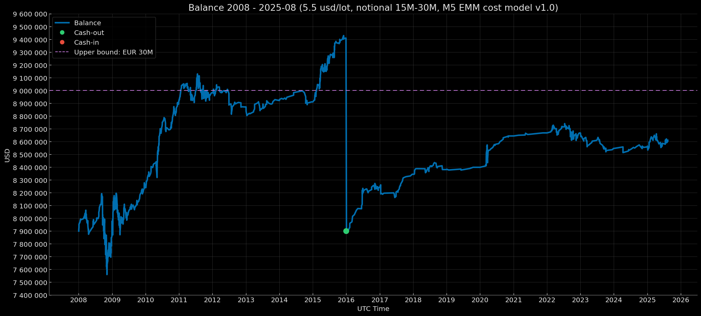

# Euro Macromechanica (EMM) M5 Engine — Core Baseline (2008–2025-08) — Institutional (5.5 USD/lot, risk 1%) – Notional 15M-30M

<p align="center">Balance Curve — Notional 15M-30M Mode (Risk 1%, $5.5 round-turn per standard lot, M5 EMM cost model v1.0) 2008–2025-08</p>

<p align="center"></p>

## 🧾 Track Description

This track reports the backtest results of the M5 EMM strategy under **Institutional** transaction costs: **5.5 USD per round-turn per 1 standard lot (100 000 EUR)**, equivalent to **≈0.55 pips** on EURUSD, with a **dynamic cost model (spread & slippage) M5 EMM cost model v1.0**. Capitalization mode — **reset to 7 900 000 USD when the threshold ≥ 9 000 000 USD is reached at year-end close**. Per-trade risk — **1% of balance at entry**.

- Data range: **Core Baseline 2008-01 – 2025-08** (coverage: **212 months without gaps = 17 years 8 months**)
- Instrument/TF: **EURUSD**, signal logic on **M5**
- **Backtest time zone:** **UTC+0** (all timestamps in UTC+0)
- Cost model: commission, spread, and slippage are **included** in PnL
- Base NAV for rebasing: **7 900 000 USD** 

> Details on institutional modes are provided in [`Euro Macromechanica (EMM) Backtest — Overview and Methodology`](https://github.com/euro-macromechanica-backtest/results/blob/main/README.md)

---

## 📈 Year-End Balance `notional_15M-30M_7m900k`

| Year | balance at year-end (UTC+0) | year-end percentage (rounded to 5 decimals) |
|---|---:|---:|
| 2008 | 7956843.71944 | +0.71954% |
| 2009 | 8240246.51059 | +3.56175% |
| 2010 | 8923467.55276 | +8.29127% |
| 2011 | 8982389.51840 | +0.66030% |
| 2012 | 8871558.04698 | −1.23388% |
| 2013 | 8922276.39165 | +0.57170% |
| 2014 | 8910993.71409 | −0.12646% |
| 2015 | 9410224.40526 | +5.60241% |
| 2016 | 8240248.85011 | +4.30695% |
| 2017 | 8344930.08770 | +1.27037% |
| 2018 | 8381558.97382 | +0.43894% |
| 2019 | 8399205.84238 | +0.21054% |
| 2020 | 8644588.28186 | +2.92150% |
| 2021 | 8668405.90131 | +0.27552% |
| 2022 | 8667565.35986 | −0.00970% |
| 2023 | 8546677.25745 | −1.39472% |
| 2024 | 8559238.26837 | +0.14697% |
| 2025-08 | 8611285.19030 | +0.60808% |

### Result over 17 years 8 months ~ +2 221 509.60 USD / +28.12%

---

## 🧾 Cost Model

- **Commission:** 5.5 USD per round-turn per 1 standard lot (100k EUR)  
- **Cost model (commission, spread, slippage) M5 EMM cost model v1.0** — [`docs/cost_model/m5_emm_cost_model_v1.0.csv`](https://github.com/euro-macromechanica-backtest/results/tree/main/docs/cost_model/m5_emm_cost_model_v1.0.csv).
- All costs are **included** in PnL.

> Details of the dynamic cost model are described in [`Euro Macromechanica (EMM) Backtest — Overview and Methodology`](https://github.com/euro-macromechanica-backtest/results/blob/main/README.md)

---

## 📊 Summary — Institutional 5.5 USD/lot, `notional_15M-30M_7m900k`, risk 1%

### Full period summary 
- **CAGR 1.49%** with annual volatility **2.20%**; risk/return — **Sharpe 0.68**, **Sortino 0.71**, **MAR (Full period Calmar) 0.26**.  
- Drawdowns (on the continuous curve): **EoM MaxDD −5.84%**, **TTR — 4 months**; intramonth deeper (**−7.72%**), **TTR — 4 months**. Time under water (max episode length): **EoM 49 months**, **Intramonth 45 months**; since the trough: **EoM 202 months**, **Intramonth 201 months**. 
- Monthly premium: average/median month **0.13% / 0.08%**.  
- Sample size: **17 years 8 months**, **212** months; number of “zero” months **41**.  
- Additional metrics: share of months “under water” **68.87%**; **VaR/ES (95%) −0.69% / −1.39%**, **VaR/ES (99%) −1.51% / −2.48%**; **Downside deviation (annual) 2.12%**; **Tail ratio (P95/P5) 1.63**; **Omega (0%/month) 1.99**; **Gain-to-Pain (monthly) 1.99**; **Skewness −0.26**; **Kurtosis excess: 8.71**; **Newey–West t/p: 2.94 / 0.003**.  
- Stress benchmarks: **EoM MaxDD ≈ −5.84%**, **Intramonth MaxDD ≈ −7.72%**; expectation anchor — **average month ≈ 0.13%**.
> **Summary:** an ultra‑conservative profile — returns are low at low volatility; drawdowns are usually shallow but can persist for months, and “flat” closes are frequent. Tail risks are restrained, with a slightly left‑skewed asymmetry (some losses sharper than typical gains). Even so, statistics indicate a significant positive drift, so the base expectation is slow, predictable capital accretion at moderate risk in exchange for tolerance of long but shallow drawdowns and frequent neutral months.

### Trades summary
- Sample size: **1443** trades; win rate **71.24%**.
- Profile quality: **PF 1.22**, **Payoff 0.49**, **Expectancy mean 0.02 R**, **median 0.10 R**.
- R‑distribution: **σ 0.233 R**, **min −1.00661 R**, **max 0.56210 R**.
- Average outcomes: **avg win 0.14 R**, **avg loss −0.29 R**.
- Worst streaks (sum of R): **5‑tr −2.07 R**, **10‑tr −2.60 R**, **20‑tr −3.17 R**.
- 100‑trade run (EDR): **P50 −1.95 R**, **P95 −0.98 R**.
- Probabilities (over **100 trades**): **≤5R 1.38%**, **≤7R 0.14%**, **≤10R 0.00%**.
- Max losing streak in 100 trades: **P50 3**, **P95 5**.
- Probability of a long losing streak: **≥7 0.74%**, **≥10 0.00%**.
- Duration: **mean 18.00m**, **median 13.00m**, **P95 54.00m**, **wins 12.00m**, **losses 32.00m**.
> **Summary:** the profile relies on a high win rate with modest trade quality: average gain is smaller than average loss, PF is low, and per‑trade expectancy is barely positive. A typical 100‑trade block shows moderate “drawdown‑ness” (EDR around −2 R) and is likely to breach moderate DD thresholds; nevertheless, long losing streaks are rare (usually 3–5 in a row) due to the high share of winners. Holding periods are short and even, which makes the equity path operationally predictable, but result robustness is sensitive to costs and loss‑limiting discipline.

### Yearly summary
- Calendar coverage: **2008–2025-08** (year **2025** is partial).
- Mean/median calendar year: **1.49% / 0.59%**.
- Best/worst year: **2010 (8.29%)**, **2023 (−1.39%)**.
- Drawdowns (within the year, from peak): **EoM −5.84% → 0.00%**, **Intramonth −7.72% → −0.09%**.
- Trading activity: total trades **1443**; yearly averages — win rate **69.42%**, PF **1.48**.
- “Active” yearly metrics (averages): share of active months **81.02%**, return of active months **1.49%**, active volatility (annual) **1.79%**.
- Tail risk by month (yearly average): **VaR95 −0.56% / ES95 −0.76%**.
> **Summary:** a moderately positive and even profile on the yearly cut: a small but steady plus on the mean/median. Within‑year drawdowns are compact (EoM shallower than intramonth), active months dominate, trade quality is “workmanlike,” and tail risks are contained.

### Monthly returns 
- Coverage: **212** months (2008-01—2025-08). Mean/median month: **0.13% / 0.08%** (P10/P90: **−0.38% / 0.74%**).
- Symmetry: positive months **116**, negative **55**, zero **41**.
- Extremes: best month **2010-05 (3.03%)**, worst month **2008-10 (−3.56%)**.
- Runs by month: maximum winning streak — **12** in a row, maximum losing streak — **3** in a row; zero months interrupt runs.
> **Summary**: a small but repeatable premium with moderate amplitude. Positive months outnumber negative ones; losing episodes are short and not deep; extremes stay within a “working” range. Zero months periodically break streaks and further smooth the trajectory.

### DD quantiles 
> Drawdown quantiles are shown signed (negative), while xRisk = |DD| is published as a positive magnitude. Therefore, as the percentile rises, DD values approach 0, and xRisk values decrease.
- Observations / episodes: **146** points; **16** drawdown episodes.  
- Depth quantiles (EoM, calendar): **P90 −0.16%**, **P95 −0.11%**, **P99 −0.01%**.  
- Time under water: **P90 14 months**, **P95 25 months**.  
- Depth in xRisk scale: **P90 0.16**, **P95 0.11**, **P99 0.01**.
> **Summary:** tail episodes are shallow by depth, and worst‑quantile time underwater is limited to roughly a couple of years. xRisk‑scale estimates align with calendar ones; destructive tails are not evident.

### Rolling 12m
- Windows: **201**; incomplete windows: **0**.
- Window return (12m): mean/median **1.57% / 0.82%** (P10/P90: **−1.00% / 5.22%**); best/worst window end: **2010-07 (8.78%) / 2013-02 (−2.31%)**.
- Share of windows by sign: positive **143**, negative **56**, zero **2**.
- Risk/quality (window medians): volatility (annual) **1.49%**, Sharpe **1.03**, Sortino **0.61**, Calmar **1.93**; window MaxDD **−0.70%**.
- Window composition (medians): active **91.67%** (~11 of 12), positive **50.0%**, negative **25.0%**.
- Tails and asymmetry (medians): **Tail 1.39**, **Omega 2.12**; **VaR95 −0.36% / ES95 −0.60%**.
> **Summary:** a predominance of positive outcomes with a low share of zeros and a moderate frequency of negatives. A typical window shows stable positive returns at lower volatility; Sharpe, Sortino, and Calmar indicate an acceptable risk–return mix; within‑window drawdowns are shallow. Composition shows a high share of active months with positives exceeding negatives; tail metrics reflect favorable asymmetry and moderate stress risks.

### Rolling 36m 
- Windows: **177**; **incomplete:** **0**.
- Annualized window return: mean/median **1.53% / 1.25%**; **P10/P90:** **−0.38% / 3.69%**; **best/worst window end:** **2011-10 (5.63%) / 2024-05 (−0.59%)**.
- Shares of windows by sign: positive **141**, negative **35**, zero **1**.
- Risk/quality (medians): volatility (annual) **1.42%**, **Sharpe 1.01**, **Sortino 1.7**, **Calmar 1.28**; **window MaxDD −1.16%**.
- Window composition (medians): active **86.11%** (~31 of 36), positive **50.0%**, negative **25.0%**.
- Tails and asymmetry (medians): **Tail 1.74**, **Omega 2.55**; **VaR95 −0.45% / ES95 −0.84%**.
> **Summary:** across 36‑month windows there is a persistent predominance of positive outcomes; a typical window delivers moderate annualized returns at low volatility. Risk‑adjusted metrics indicate a balanced risk–return; within‑window drawdowns remain moderate. Structurally, windows feature a high share of active months and a dominance of positives over negatives. Tail metrics indicate favorable asymmetry and controlled stress risks.

### Monte Carlo
- Method: **stationary_bootstrap**.
- Horizons: **12, 36, 212 months**.
- Average block lengths: **3, 4, 5, 6, 7, 8, 9, 10, 11, 12 months**.
- Risk per trade: **1%**.
> **Summary:** the endpoint distribution is tilted toward positive outcomes; on short and medium horizons, critical breaches of drawdown thresholds are mostly absent and typical drawdowns remain moderate. As the horizon extends, patience requirements increase: the probability of deep deviations and episodes with more pronounced drawdowns rises, though the risk of “hard” breaches remains limited and is largely tied to highly adverse paths. Overall, simulations show a right‑tailed, “healthy” distribution structure with dominant positive scenarios and controlled tail risks, with the strongest sensitivity observed on very long horizons.

### Confidence Intervals 
- Interval method: **bootstrap_bca** (BCa — bias‑corrected & accelerated).
- Bootstrap (EoM monthly): **stationary_bootstrap**, average block length **6 months**.
- Bootstrap (intramonth): **stationary_bootstrap**, average block length **5 days**.
- Confidence level: **90%**.
> **Summary:** for returns, intervals are generally above zero / partially straddle zero; for risk metrics (DD, VaR/ES) they lie in the negative zone, as expected since these are losses; only a small share cross zero and very few sit wholly above it. Interval widths are mostly moderate with no pronounced dependence on horizon in the provided set. Overall, the picture points to estimates being skewed downward with limited uncertainty, supporting a cautious, conservative conclusion.

### Cash flows
- **Rebasing events:** 1.
- **Cash flows:** **cash‑out** (payouts): **1 510 224.41** for **2015** (EoY **2015-12**) — **1** event; **cash‑in** (deposits) **0.00** — **0** events.
- **Extremes:** maximum **cash‑out** — **1 510 224.41** for **2015** (EoY **2015-12**).
- **Profit after the last rebasing** 711 285.19.
> **Summary:** net profit ~ **2 221 509.60**.

### Conclusion
Across the full horizon, the profile is conservative and operationally stable, with low volatility; drawdowns are shallow but sometimes prolonged, and “flat” months are frequent. Rolling windows most often show positive outcomes, confirming a stable positive drift. Monte Carlo indicates the dominance of favorable paths over short and medium horizons under moderate stress, and interval risk estimates confirm restrained tails. At the same time, the trading block relies on a high win rate with modest Payoff/PF, making results sensitive to aggregate costs.

### Full methodology and metric definitions in [`docs/metrics_methodology/metrics_schema.json`](https://github.com/euro-macromechanica-backtest/results/tree/main/docs/metrics_methodology/metrics_schema.json) / [`docs/metrics_methodology/metrics_schema.md`](https://github.com/euro-macromechanica-backtest/results/tree/main/docs/metrics_methodology/metrics_schema.md).

### Metrics files

```
metrics/
  confidence_intervals.csv
  dd_quantiles_full_period.csv
  monthly_returns.csv
  monte_carlo_summary.csv
  full_period_summary.csv
  rebasing_applied.csv
  rolling_12m.csv
  rolling_36m.csv
  trades_full_period_summary.csv
  yearly_summary.csv
```

### Metrics were computed based on non-public files `trades_YYYY.csv` and `balance_YYYY.csv`

---

## 📎 Links

- **Euro Macromechanica (EMM) Backtest — Overview and Methodology**: repository root **[README.md](https://github.com/euro-macromechanica-backtest/results/blob/main/README.md)**
- Cost model (commission, spread, slippage) M5 EMM cost model v1.0 — [`docs/cost_model/m5_emm_cost_model_v1.0.csv`](https://github.com/euro-macromechanica-backtest/results/tree/main/docs/cost_model/m5_emm_cost_model_v1.0.csv)
- General information about the contents of `results`: **[results/README.md](https://github.com/euro-macromechanica-backtest/results/blob/main/results/README.md)**
- Inputs and provenance: **[INPUTS-PIN.md](https://github.com/euro-macromechanica-backtest/results/blob/main/docs/INPUTS-PIN.md)** / **[INPUTS-PROVENANCE.md](https://github.com/euro-macromechanica-backtest/data-hub/blob/main/INPUTS-PROVENANCE.md)**
- Full audit guide: **[docs/AUDIT.md](https://github.com/euro-macromechanica-backtest/results/blob/main/docs/AUDIT.md)**
- Data quality policy: **[data_quality_policy/policy_v1.0.md](https://github.com/euro-macromechanica-backtest/results/blob/main/data_quality_policy/policy_v1.0.md)**
- Metric calculation methodology: **[docs/metrics_methodology/metrics_schema.md](https://github.com/euro-macromechanica-backtest/results/tree/main/docs/metrics_methodology/metrics_schema.md)** / **[docs/metrics_methodology/metrics_schema.json](https://github.com/euro-macromechanica-backtest/results/tree/main/docs/metrics_methodology/metrics_schema.json)**
