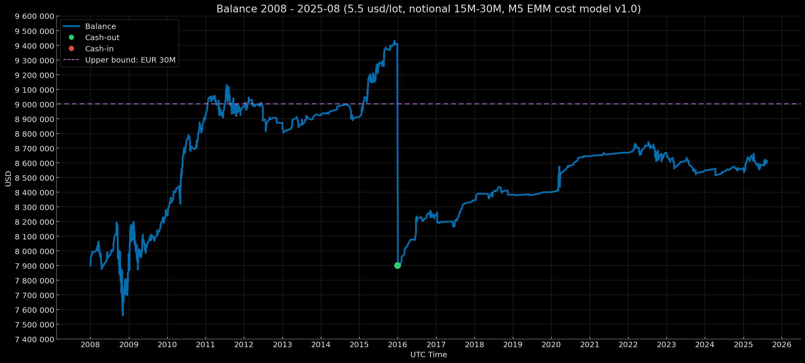

<p align="center">Balance Curve — Notional 15M-30M Mode (Risk 1%, $5.5 round-turn per standard lot, M5 EMM cost model v1.0) 2008–2025-08</p>

<p align="center"></p>


# Euro Macromechanica (EMM) M5 Engine — Core Baseline (2008–2025-08) — Institutional (5.5 USD/lot, risk 1%) – Notional 15M-30M

## 🧾 Описание трека

Этот трек фиксирует результаты бэктеста стратегии M5 EMM при **Institutional** комиссионных издержках: **5.5 USD за round-turn на 1 стандартный лот (100 000 EUR)**, эквивалент **≈0.55 pips** на EURUSD, **динамическая модель издержек (spread & slippage) M5 EMM cost model v1.0**. Режим капитализации — **ресет к 7 900 000 USD при достижении порога >= 9 000 000 USD по закрытию года**. Риск на сделку — **1% от баланса на момент входа**.

- Диапазон данных: **Core Baseline 2008-01 – 2025-08** (покрытие: **212 мес. без дыр = 17 лет 8 мес.**)
- Инструмент/TF: **EURUSD**, сигнальная логика на **M5**
- **Часовой пояс бэктеста:** **UTC+0** (все временные метки в UTC+0)
- Модель издержек: комиссия, spread и slippage **включены** в PnL
- Базовый NAV для ребейза: **7 900 000 USD** 

> Подробности об институциональных режимах описаны в [`Обзор и Методология Euro Macromechanica (EMM) Backtest`](https://github.com/euro-macromechanica-backtest/results/blob/main/README.ru.md)

---

## 📈 Баланс по закрытию года `notional_15M-30M_7m900k`

| Год | баланс на момент закрытия года (UTC+0) | процент на момент закрытия года (округление — 5 знаков после запятой) |
|---|---:|---:|
| 2008 | 7956843.71944 | +0.71954% |
| 2009 | 8240246.51059 | +3.56175% |
| 2010 | 8923467.55276 | +8.29127% |
| 2011 | 8982389.51840 | +0.66030% |
| 2012 | 8871558.04698 | −1.23388% |
| 2013 | 8922276.39165 | +0.57170% |
| 2014 | 8910993.71409 | −0.12646% |
| 2015 | 9410224.40526 | +5.60241% |
| 2016 | 8240248.85011 | +4.30695% |
| 2017 | 8344930.08770 | +1.27037% |
| 2018 | 8381558.97382 | +0.43894% |
| 2019 | 8399205.84238 | +0.21054% |
| 2020 | 8644588.28186 | +2.92150% |
| 2021 | 8668405.90131 | +0.27552% |
| 2022 | 8667565.35986 | −0.00970% |
| 2023 | 8546677.25745 | −1.39472% |
| 2024 | 8559238.26837 | +0.14697% |
| 2025-08 | 8611285.19030 | +0.60808% |

### Результат за 17 лет и 8 мес. ~ +2 221 509.60 USD / +28.12%

---

## 🧾 Модель издержек

- **Комиссия:** 5.5 USD за round-turn на 1 стандартный лот (100k EUR)  
- **Модель издержек (commission, spread, slippage) M5 EMM cost model v1.0** — [`docs/cost_model/m5_emm_cost_model_v1.0.csv`](https://github.com/euro-macromechanica-backtest/results/tree/main/docs/cost_model/m5_emm_cost_model_v1.0.csv).
- Все издержки **включены** в PnL.

> Подробности о динамической модели издержек описаны в [`Обзор и Методология Euro Macromechanica (EMM) Backtest`](https://github.com/euro-macromechanica-backtest/results/blob/main/README.ru.md)

---

## 📊 Краткий обзор — Institutional 5.5 USD/lot, `notional_15M-30M_7m900k`, risk 1%

### Full period summary 
- **CAGR 1.49%** при годовой волатильности **2.20%**; риск/доход — **Sharpe 0.68**, **Sortino 0.71**, **MAR (Full period Calmar) 0.26**.  
- Просадки (по непрерывной кривой): **EoM MaxDD −5.84%**, **TTR — 4 мес.**; внутримесячно глубже (**−7.72%**), **TTR — 4 мес.**. Длительность под водой (макс. длительность эпизода): **EoM 49 мес.**, **Intramonth 45 мес.**  
- Месячная премия: средний/медианный месяц **0.13% / 0.08%**.  
- Объём выборки: **17 лет 8 мес.**, **212** мес.; количество «нулевых» месяцев **41**.  
- Доп.показатели: доля месяцев «под водой» **68.87%**; **VaR/ES (95%) −0.69% / −1.39%**, **VaR/ES (99%) −1.51% / −2.48%**; **Downside deviation (год.) 2.12%**; **Tail ratio (P95/P5) 1.63**; **Omega(0%/мес) 1.99**; **Gain-to-Pain (мес.) 1.99**; **Skewness −0.26**; **Kurtosis excess: 8.71**; **Newey–West t/p: 2.94 / 0.003**.  
- Стресс-ориентиры: **EoM MaxDD ≈ −5.84%**, **Intramonth MaxDD ≈ −7.72%**; ориентир ожиданий — **средний месяц ≈ 0.13%**.
> **Итог:** профиль крайне консервативный — доходность невысокая при низкой волатильности; просадки, как правило, неглубокие, но могут затягиваться на месяцы, а «плоских» закрытий много. Хвостовые риски сдержанные, при этом асимметрия слегка «влево» (отдельные минусы резче типичных плюсов). При всём этом статистика указывает на значимый положительный дрейф, так что базовое ожидание — медленное, предсказуемое наращивание капитала при умеренном риске в обмен на терпимость к длительным, но неглубоким просадкам и частым нейтральным месяцам.

### Trades summary
- Объём выборки: **1443** сделок; win rate **71.24%**.
- Качество профиля: **PF 1.22**, **Payoff 0.49**, **Expectancy mean 0.02 R**, **median 0.10 R**.
- Распределение R: **σ 0.233 R**, **min −1.00661 R**, **max 0.56210 R**.
- Средние результаты: **avg win 0.14 R**, **avg loss −0.29 R**.
- Худшие серии (сумма R): **5‑тр −2.07 R**, **10‑тр −2.60 R**, **20‑тр −3.17 R**.
- Серия из 100 сделок (EDR): **P50 −1.95 R**, **P95 −0.98 R**.
- Вероятность (за **100 сделок**): **≤5R 1.38%**, **≤7R 0.14%**, **≤10R 0.00%**.
- Макс. убыточная серия в 100 сделках: **P50 3**, **P95 5**.
- Вероятность длинной убыточной серии: **≥7 0.74%**, **≥10 0.00%**.
- Длительность: **mean 18.00m**, **median 13.00m**, **P95 54.00m**, **wins 12.00m**, **losses 32.00m**.
> **Итог:** профиль держится на высоком вин-рейте при слабом качестве сделок: средняя прибыль меньше среднего убытка, PF низкий, ожидаемая доходность на сделку едва положительная. Типовой 100-сделочный блок даёт умеренную «просадочность» (EDR около −2 R) и с высокой вероятностью пробивает умеренные DD-пороги; при этом длинные серии лосей редки (обычно 3–5 подряд) благодаря высокой доле выигрышей. Удержание короткое и равномерное по времени, что делает траекторию предсказуемой операционно, но устойчивость результата чувствительна к издержкам и дисциплине ограничения убытков.

### Yearly summary
- Календарное покрытие: **2008–2025-08** (год **2025** неполный).
- Средний/медианный календарный год: **1.49% / 0.59%**.
- Лучший/худший год: **2010 (8.29%)**, **2023 (−1.39%)**.
- Просадки (внутри года, от пика): **EoM −5.84% → 0.00%**, **Intramonth −7.72% → −0.09%**.
- Торговая активность: всего сделок **1443**; средние по годам — win rate **69.42%**, PF **1.48**.
- «Активные» метрики по годам (средние): доля активных месяцев **81.02%**, доходность активных **1.49%**, волатильность активная (год.) **1.79%**.
- Риск хвостов по месяцам (среднее по годам): **VaR95 −0.56% / ES95 −0.76%**.
> **Итог:** на годовом срезе умеренно-положительный и ровный профиль: небольшой, но стабильный плюс по среднему/медиане; внутригодовые просадки компактны (EoM мельче «интры»), активных месяцев больше, качество сделок «рабочее», хвостовые риски сдержаны.

### Monthly returns 
- Покрытие: **212** месяцев (2008-01—2025-08). Средний/медианный месяц: **0.13% / 0.08%** (P10/P90: **−0.38% / 0.74%**).
- Симметрия: положительных месяцев **116**, отрицательных **55**, нулевых **41**.
- Экстремальные значения: лучший месяц **2010-05 (3.03%)**, худший месяц **2008-10 (−3.56%)**.
- Серии по месяцам: максимальная серия выигрышей — **12** подряд, максимальная серия убытков — **3** подряд; нулевые месяцы прерывают серии.
> **Итог**: небольшая, но повторяемая премия при умеренной амплитуде. Положительных месяцев больше, убыточные эпизоды короткие и без глубоких провалов, экстремумы остаются в «рабочем» диапазоне. Нулевые месяцы периодически прерывают серии и дополнительно сглаживают траекторию.

### DD quantiles 
> Квантили DD приведены в подписанном виде (отрицательные), а xRisk = |DD| публикуется как положительная величина. Поэтому при росте перцентиля значения DD становятся ближе к 0, а значения xRisk — уменьшаются.
- Наблюдения / эпизоды: **146** точек; **16** эпизодов просадок.  
- Квантили глубины (EoM, календарная): **P90 −0.16%**, **P95 −0.11%**, **P99 −0.01%**.  
- Длительность «под водой»: **P90 14 мес.**, **P95 25 мес.**  
- Глубина в xRisk-масштабе: **P90 0.16**, **P95 0.11**, **P99 0.01**.
> **Итог:**  хвостовые эпизоды по глубине неглубокие, а длительность под водой в худших квантилях ограничивается примерно парой лет. Оценки в xRisk-масштабе согласуются с календарными, признаков разрушительных хвостов не видно.

### Rolling 12m
- Окна: **201**; неполных окон: **0**.
- Возврат за окно (12м): средний/медианный **1.57% / 0.82%** (P10/P90: **−1.00% / 5.22%**); лучший/худший конец окна: **2010-07 (8.78%) / 2013-02 (−2.31%)**.
- Доля окон по знаку: положительных **143**, отрицательных **56**, нулевых **2**.
- Риск/качество (медианы по окнам): волатильность (год.) **1.49%**, Sharpe **1.03**, Sortino **0.61**, Calmar **1.93**; MaxDD за окно **−0.70%**.
- Состав месяцев в окне (медианы): активные **91.67%** (~11 из 12), положительных **50.0%**, отрицательных **25.0%**.
- Хвосты и асимметрия (медианы): **Tail 1.39**, **Omega 2.12**; **VaR95 −0.36% / ES95 −0.60%**.
> **Итог:** преобладание положительных исходов при низкой доле нулевых и умеренной частоте отрицательных. Типичное окно характеризуется стабильной положительной доходностью при пониженной волатильности; показатели Sharpe, Sortino и Calmar указывают на приемлемое соотношение риск–доходность, а внутриоконная просадка остаётся неглубокой. Структура окон демонстрирует высокую активность месяцев с преобладанием положительных периодов; хвостовые метрики отражают благоприятную асимметрию и умеренные стресс-риски.

### Rolling 36m 
- Окна: **177**; **неполных:** **0**.
- Годовая доходность окна (annualized): средняя/медианная **1.53% / 1.25%**; **P10/P90:** **−0.38% / 3.69%**; **лучший/худший конец окна:** **2011-10 (5.63%) / 2024-05 (−0.59%)**.
- Доли окон по знаку: положительных **141**, отрицательных **35**, нулевых **1**.
- Риск/качество (медианы): волатильность (год.) **1.42%**, **Sharpe 1.01**, **Sortino 1.7**, **Calmar 1.28**; **MaxDD за окно −1.16%**.
- Состав месяцев в окне (медианы): активные **86.11%** (~31 из 36), положительных **50.0%**, отрицательных **25.0%**.
- Хвосты и асимметрия (медианы): **Tail 1.74**, **Omega 2.55**; **VaR95 −0.45% / ES95 −0.84%**.
> **Итог:** по 36-месячным окнам наблюдается устойчивое преобладание положительных исходов; типичное окно даёт умеренную годовую доходность при невысокой волатильности. Риск-скорректированные показатели указывают на сбалансированное соотношение риск/доходность, а внутриоконные просадки остаются умеренными. Структурно окна характеризуются высокой долей активных месяцев и доминированием положительных над отрицательными. Хвостовые метрики указывают на благоприятную асимметрию и контролируемые стресс-риски.

### Monte Carlo
- Метод: **stationary_bootstrap**.
- Горизонты: **12, 36, 212 мес.**.
- Средние длины блоков: **3, 4, 5, 6, 7, 8, 9, 10, 11, 12 мес.**.
- Риск/сделку: **1%**.
> **Итог:** распределение итогов сдвинуто в сторону положительных исходов, а на коротких и среднесрочных интервалах преобладает отсутствие критичных нарушений порогов просадки; типичные просадки остаются умеренными. По мере удлинения горизонта возрастают требования к выдержке: вероятность глубоких отклонений и эпизодов с более заметными просадками становится выше, хотя риск «жёстких» нарушений остаётся ограниченным и чаще связан с крайне неблагоприятными траекториями. В сумме симуляции показывают правостороннюю, «здоровую» структуру распределения с доминированием положительных сценариев и контролируемыми хвостовыми рисками, при этом самая выраженная чувствительность наблюдается на очень длинных горизонтах.

### Confidence Intervals 
- Метод интервалов: **bootstrap_bca** (BCa — bias‑corrected & accelerated).
- Бутстрэп (EoM monthly): **stationary_bootstrap**, средняя длина блока **6 мес.**.
- Бутстрэп (intramonth): **stationary_bootstrap**, средняя длина блока **5 дней**.
- Уровень доверия: **90%**.
> **Итог:** по доходности интервалы в целом выше нуля/частично перекрывают ноль; по рисковым метрикам (DD, VaR/ES) — лежат в отрицательной зоне, что ожидаемо, т.к. это потери., лишь небольшая доля пересекает ноль, и совсем немногие — целиком выше него. Ширина интервалов в среднем умеренная, без выраженной зависимости от горизонта в предоставленном наборе. В целом картина указывает на устойчивое смещение оценок вниз при ограниченной неопределённости, что поддерживает осторожный, консервативный вывод.

### Cash flows
- **События ребейзинга:** 1.
- **Денежные потоки:** **cash‑out** (выплаты): **1 510 224.41** за **2015** (EoY **2015-12**) — **1** событие; **cash‑in** (внесения) **0.00** — **0** событий.
- **Экстремумы:** максимальный **cash‑out** — **1 510 224.41** за **2015** (EoY **2015-12**).
- **Прибыль после последнего ребейзинга** 711 285.19.
> **Итог:** чистая прибыль ~ **2 221 509.60**.

### Вывод
По всему горизонту видно консервативный и операционно устойчивый профиль, с низкой волатильностью, неглубокими, но порой затяжными просадками и частыми «плоскими» месяцами; на скользящих окнах чаще фиксируются положительные итоги, что подтверждает стабильный положительный дрейф. Монте-Карло указывает на доминирование благоприятных траекторий на кратко- и среднесрочных горизонтах при умеренных стрессах, а интервальные оценки рисков подтверждают сдержанные хвосты. При этом торговый блок опирается на высокий вин-рейт при скромном Payoff/PF, что делает результат чувствительным к совокупным издержкам.

### Полная методология и определения метрик в [`docs/metrics_methodology/metrics_schema.json`](https://github.com/euro-macromechanica-backtest/results/tree/main/docs/metrics_methodology/metrics_schema.json) / [`docs/metrics_methodology/metrics_schema.md`](https://github.com/euro-macromechanica-backtest/results/tree/main/docs/metrics_methodology/metrics_schema.md).

### Файлы метрик

```
metrics/
  confidence_intervals.csv
  dd_quantiles_full_period.csv
  monthly_returns.csv
  monte_carlo_summary.csv
  full_period_summary.csv
  rebasing_applied.csv
  rolling_12m.csv
  rolling_36m.csv
  trades_full_period_summary.csv
  yearly_summary.csv
```

### Метрики рассчитывались на основе непубличных файлов `trades_YYYY.csv` и `balance_YYYY.csv`

---

## 📎 Ссылки

- **Обзор и Методология Euro Macromechanica (EMM) Backtest**: корневой **[README.ru.md](https://github.com/euro-macromechanica-backtest/results/blob/main/README.ru.md)**
- Модель издержек (commission, spread, slippage) M5 EMM cost model v1.0 — [`docs/cost_model/m5_emm_cost_model_v1.0.csv`](https://github.com/euro-macromechanica-backtest/results/tree/main/docs/cost_model/m5_emm_cost_model_v1.0.csv)
- Общая информация о содержимом в `results`: **[results/README.ru.md](https://github.com/euro-macromechanica-backtest/results/blob/main/results/README.ru.md)**
- Входные данные и происхождение: **[INPUTS-PIN.ru.md](https://github.com/euro-macromechanica-backtest/results/blob/main/docs/INPUTS-PIN.ru.md)** / **[INPUTS-PROVENANCE.ru.md](https://github.com/euro-macromechanica-backtest/data-hub/blob/main/INPUTS-PROVENANCE.ru.md)**
- Полная инструкция по аудиту: **[docs/AUDIT.ru.md](https://github.com/euro-macromechanica-backtest/results/blob/main/docs/AUDIT.ru.md)**
- Политика качества данных: **[data_quality_policy/policy_v1.0.ru.md](https://github.com/euro-macromechanica-backtest/results/blob/main/data_quality_policy/policy_v1.0.ru.md)**
- Методология расчёта метрик: **[docs/metrics_methodology/metrics_schema.md](https://github.com/euro-macromechanica-backtest/results/tree/main/docs/metrics_methodology/metrics_schema.md)** / **[docs/metrics_methodology/metrics_schema.json](https://github.com/euro-macromechanica-backtest/results/tree/main/docs/metrics_methodology/metrics_schema.json)**