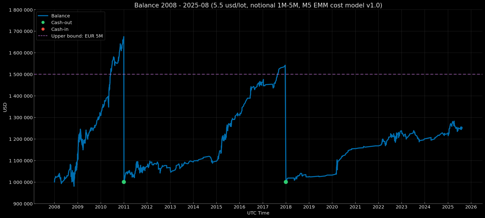

# Euro Macromechanica (EMM) M5 Engine — Core Baseline (2008–2025-08) — Institutional (5.5 USD/lot, risk 1%) – Notional 1M-5M

<p align="center">Balance Curve — Notional 1M-5M Mode (Risk 1%, $5.5 round-turn per standard lot, M5 EMM cost model v1.0) 2008–2025-08</p>

<p align="center"></p>

## 🧾 Track Description

This track reports the backtest results of the M5 EMM strategy under **Institutional** transaction costs: **5.5 USD per round-turn per 1 standard lot (100 000 EUR)**, equivalent to **≈0.55 pips** on EURUSD, with a **dynamic cost model (spread & slippage) M5 EMM cost model v1.0**. Capitalization mode — **reset to 1 000 000 USD when the threshold ≥ 1 500 000 USD is reached at year-end close**. Per-trade risk — **1% of balance at entry**.

- Data range: **Core Baseline 2008-01 – 2025-08** (coverage: **212 months without gaps = 17 years 8 months**)
- Instrument/TF: **EURUSD**, signal logic on **M5**
- **Backtest time zone:** **UTC+0** (all timestamps in UTC+0)
- Cost model: commission, spread, and slippage are **included** in PnL
- Base NAV for rebasing: **1 000 000 USD** 

> Details on institutional modes are provided in [`Euro Macromechanica (EMM) Backtest — Overview and Methodology`](https://github.com/euro-macromechanica-backtest/results/blob/main/README.ru.md)

---

## 📈 Year-End Balance `notional_1M-5M_1m`

| Year | balance at year-end (UTC+0) | year-end percentage (rounded to 5 decimals) |
|---|---:|---:|
| 2008 | 1124389.43274 | +12.43894% |
| 2009 | 1308566.12321 | +16.38015% |
| 2010 | 1674476.82590 | +27.96272% |
| 2011 | 1071546.56836 | +7.15466% |
| 2012 | 1066419.81593 | −0.47844% |
| 2013 | 1092907.38086 | +2.48378% |
| 2014 | 1095930.32240 | +0.27660% |
| 2015 | 1312286.72678 | +19.74180% |
| 2016 | 1461512.74835 | +11.37145% |
| 2017 | 1541729.95730 | +5.48864% |
| 2018 | 1023604.35193 | +2.36044% |
| 2019 | 1031914.07885 | +0.81181% |
| 2020 | 1154648.70742 | +11.89388% |
| 2021 | 1167565.54236 | +1.11868% |
| 2022 | 1237148.83921 | +5.95969% |
| 2023 | 1200026.24861 | −3.00066% |
| 2024 | 1224101.25245 | +2.00621% |
| 2025-08 | 1253448.68452 | +2.39747% |

### Result over 17 years 8 months ~ +1 469 655.47 USD / +146.97%

---

## 🧾 Cost Model

- **Commission:** 5.5 USD per round-turn per 1 standard lot (100k EUR)  
- **Cost model (commission, spread, slippage) M5 EMM cost model v1.0** — [`docs/cost_model/m5_emm_cost_model_v1.0.csv`](https://github.com/euro-macromechanica-backtest/results/tree/main/docs/cost_model/m5_emm_cost_model_v1.0.csv).
- All costs are **included** in PnL.

> Details of the dynamic cost model are described in [`Euro Macromechanica (EMM) Backtest — Overview and Methodology`](https://github.com/euro-macromechanica-backtest/results/blob/main/README.md)

---

## 📊 Summary — Institutional 5.5 USD/lot, `notional_1M-5M_1m`, risk 1%

### Full period summary 
- **CAGR 6.87%** with annual volatility **5.44%**; risk/return — **Sharpe 1.25**, **Sortino 2.38**, **MAR (Full period Calmar) 1.24**.
- Drawdowns (on the continuous curve): **EoM MaxDD −5.52%**, **TTR — 2 months**; intramonth deeper (**−9.42%**), **TTR — 2 months**. Time under water (max episode length): **EoM 26 months**, **Intramonth 22 months**.
- Monthly premium: average/median month **0.57% / 0.31%**.
- Calendar stability: best year **2010 (27.96%)**, worst **2023 (−3.00%)**; “zero” months **38**.
- Sample size: **17 years 8 months**, **212** months; number of trades: **1443**.
- Additional metrics: share of months “under water” **53.30%**; time since MaxDD trough: **EoM 202 months / Intramonth 201 months**; **VaR/ES (95%) −1.50% / −2.26%**, **VaR/ES (99%) −2.50% / −3.08%**; **Downside deviation (annual) 2.86%**; **Tail ratio (P95/P5) 1.99**; **Omega (0%/month) 3.40**; **Gain-to-Pain (monthly) 3.40**; **Skewness 1.58**; **Kurtosis excess: 5.65**; **Newey–West t/p for mean monthly: t=4.47 / p=0.00**.
- Stress benchmarks: **EoM MaxDD ≈ −5.52%**, **Intramonth MaxDD ≈ −9.42%**; expectation anchor — **average month ≈ 0.57%**.
> **Summary:** over the full period the profile is smooth and resilient: the premium is stable at moderate volatility; drawdowns are shallow and close quickly (intramonth deeper but controlled); monthly dynamics are repeatable with positive (“right‑tail”) asymmetry; the calendar view shows no prolonged slumps. Tail risks are contained and consistent with VaR/ES estimates, and the significant t‑statistic supports that the observed edge is unlikely to be random.

### Trades summary
- Sample size: **1443** trades; win rate **73.87%**.
- Profile quality: **PF 1.42**, **Payoff 0.50**, **Expectancy mean 0.08 R**, **median 0.33 R**.
- R‑distribution: **σ 0.55 R**, **min −1.02 R**, **max 0.59 R**.
- Averages: **avg win 0.38 R**, **avg loss −0.75 R**.
- Worst streaks (sum of R): **5‑tr −3.76 R**, **10‑tr −4.71 R**, **20‑tr −5.77 R**.
- 100‑trade run (EDR): **P50 −3.96 R**, **P95 −2.13 R**.
- Probabilities (over **100 trades**): Pr(MaxDD ≤ −5R) **26.82%**, ≤ −7R **7.26%**, ≤ −10R **0.82%**.
- Max losing streak in 100 trades: **P50 3**, **P95 5**.
- Probability of a long losing streak: **≥7 0.28%**, **≥10 0.00%**.
- Duration: **mean 18.00m**, **median 13.00m**, **P95 54.00m**, **wins 13.00m**, **losses 32.00m**.
> **Summary:** the strategy relies on frequent small gains versus rarer, larger losses, so stability rests on stop discipline and constant per‑trade risk. Streak metrics show manageable block drawdowns and indicate that slumps, when they occur, cluster over short stretches, while the typical block of trades on average pulls equity upward. The outcome distribution is right‑skewed and tail scenarios are contained, supporting predictability; the holding‑period profile matches careful execution without betting on rare spikes.

### Yearly summary 
- Calendar coverage: **2008–2025-08** (year **2025** is partial).
- Mean/median calendar year: **7.02% / 3.98%**.
- Best/worst year: **2010 (27.96%)**, **2023 (−3.00%)**.
- Drawdowns (within the year, from peak): **EoM −5.52% → 0.00%**, **Intramonth −9.42% → −0.23%**.
- Trading activity: total trades **1443**; yearly averages — win rate **71.90%**, PF **1.81**.
- “Active” yearly metrics (averages): share of active months **81.02%**, return of active months **7.02%**, active volatility (annual) **4.69%**.
- Tail risk by month (yearly average): **VaR95 −1.03% / ES95 −1.38%**.
> **Summary:** by yearly cut the profile is even and mostly positive: strong years handily offset the rare weak periods; within‑year drawdowns remain moderate (shallower by month‑end, deeper intramonth but controlled); “active” months dominate the year’s composition; risk‑adjusted quality holds at a solid level, and monthly tail risks by VaR/ES look restrained, confirming consistency year over year.

### Monthly returns 
- Coverage: **212** months (2008-01—2025-08). Mean/median month: **0.57% / 0.31%** (P10/P90: **−0.96% / 2.12%**).
- Symmetry: positive months **123**, negative **51**, zero **38**.
- Extremes: best month **2010-05 (8.32%)**, worst month **2008-09 (−4.01%)**.
- Runs by month: maximum winning streak — **12** in a row, maximum losing streak — **3** in a row; zero months interrupt runs.
> **Summary**: a small but repeatable premium; more positive months; zero months naturally break streaks; extreme swings are moderate; losing runs are short and are quickly offset by longer “green” stretches. A right‑skewed distribution and contained tails support a predictable trajectory without prolonged drawdowns.

### DD quantiles 
> Drawdown quantiles are shown signed (negative), while xRisk = |DD| is published as a positive magnitude. Therefore, as the percentile rises, DD values approach 0, and xRisk values decrease.
- Observations: **113**; drawdown episodes: **24**.
- Drawdown depth quantiles (EoM, calendar): **P90 −0.29%**, **P95 −0.20%**, **P99 −0.01%**.
- Time under water: **P90 14 months**, **P95 19 months**.
- Depth in xRisk scale: **P90 0.29**, **P95 0.20**, **P99 0.01**.
> **Summary:** the drawdown profile is compact and “shallow”: even tail episodes remain relatively mild, and time underwater is limited to moderate stretches; xRisk‑scale quantiles align with calendar ones, indicating appropriate risk load and the absence of long, destructive slumps — risk tolerance is high, stress benchmarks conservative.

### Rolling 12m
- Windows: **201**; incomplete windows: **0**.
- Window return (12m): mean/median **7.37% / 4.65%** (P10/P90: **−0.38% / 19.74%**); best/worst window end: **2011-01 (29.36%) / 2013-02 (−3.69%)**.
- Share of windows by sign: positive **177**, negative **24**, zero **0**.
- Risk/quality (window medians): volatility (annual) **4.15%**, Sharpe **1.54**, Sortino **1.96**, Calmar **4.70**; window MaxDD **−1.29%**.
- Window composition (medians): active **91.67%** (~11 of 12), positive **58.33%**, negative **25.00%**.
- Tails and asymmetry (medians): **Tail 2.37**, **Omega 3.45**; **VaR95 −0.77% / ES95 −1.07%**.
> **Summary:** on the 12‑month horizon the picture is smooth and predominantly “green”: the vast majority of windows are positive at moderate volatility; risk‑adjusted quality is solid; typical drawdowns are shallow; and window composition is consistently tilted toward active and positive months. Tails are restrained and right‑skewed, so weak stretches are rare and typically recover quickly — the profile looks predictable and comfortable from a risk standpoint.

### Rolling 36m 
- Windows: **177**; incomplete windows: **0**.
- Annualized window return: mean/median **6.74% / 5.35%** (P10/P90: **1.45% / 13.53%**); best/worst window end: **2011-10 (21.50%) / 2014-10 (0.51%)**.
- Shares of windows by sign: positive **177**, negative **0**, zero **0**.
- Risk/quality (window medians): volatility (annual) **3.91%**, Sharpe **1.32**, Sortino **3.05**, Calmar **2.86**; window MaxDD **−2.50%**.
- Window composition (medians): active **86.11%** (~31 of 36), positive **58.33%**, negative **19.44%**.
- Tails and asymmetry (medians): **Tail 2.64**, **Omega 4.78**; **VaR95 −1.02% / ES95 −1.74%**.
> **Summary:** all windows finish positive; dispersion is tight; volatility and drawdowns stay moderate; risk‑adjusted quality sits comfortably above neutral. Windows consistently include a larger share of “green” months; tails are contained — together this yields smooth capital accretion and high risk tolerance over the long interval.

### Monte Carlo
- Method: **stationary_bootstrap**.
- Horizons: **12, 36, 212 months**.
- Average block lengths: **3, 4, 5, 6, 7, 8, 9, 10, 11, 12 months**.
- Risk per trade: **1%**.
> **Summary:** on the 12‑month horizon the median outcome is positive and negative paths occur but remain a minority; calendar (EoM) drawdowns are shallow; breaches of strict xRisk thresholds are rare and require multiple months, with typical depth remaining moderate. Over 36 months the dispersion tightens markedly: the probability of a loss nearly vanishes, the median return is higher, risk‑adjusted quality stabilizes, and even when drawdowns emerge, reaching strict thresholds is difficult and takes considerably more time. On the full sample horizon, negative endpoints are virtually extinct; the median is higher, trajectories become highly predictable, double‑digit EoM drawdowns are extremely rare, and 7× and especially 10× xRisk are not violated on most paths, confirming a steady, calm profile as the horizon lengthens.

### Confidence Intervals 
- Interval method: **bootstrap_bca** (BCa — bias‑corrected & accelerated).
- Bootstrap (EoM monthly): **stationary_bootstrap**, average block length **6 months**.
- Bootstrap (intramonth): **stationary_bootstrap**, average block length **5 days**.
- Confidence level: **90%**.
> **Summary:** over the full period, return is statistically above zero with moderate uncertainty on volatility; month‑end drawdowns remain shallow; intramonth drawdowns are predictably deeper but without “destructive” tails. Threshold VaR/ES for monthly returns fit compact intervals and align with the overall risk profile, and the “smoothness” measure (Ulcer) is low, confirming the absence of long, deep slumps. By calendar year, median within‑year drawdowns are also modest: month‑end shallower and intramonth deeper, yet both bands remain narrow. In aggregate, the interval view confirms robustness and risk predictability: the positive signal is not tied to one‑off observations, and worst‑case allowances are restrained.

### Cash flows 
- Rebasing events: **2**.
- Cash flows: **cash‑out** (payouts) **674 476.83** for **2010** (EoY **2010-12**); **541 729.96** for **2017** (EoY **2017-12**) — **2** events; **cash‑in** (deposits) **0.00** — **0** events.
- Extremes: maximum cash‑out — **674 476.83** for **2010** (EoY **2010-12**); **cash‑in** are absent.
- **Profit after the last rebasing** 253 448.68.
> **Summary:** net profit ~ **1 469 655.47**.

### Conclusion
Across the entire period, a stable premium holds at moderate volatility; drawdowns are shallow and close quickly (intramonth deeper but controlled); monthly dynamics are smooth with right‑tail asymmetry; by year, rare weak stretches are offset by strong ones. Quantiles and VaR/ES indicate restrained tails; 1–3‑year rolling windows are predominantly positive; Monte Carlo across block lengths and horizons confirms risk compression and greater predictability at longer horizons; confidence intervals register statistical significance of the effect.

### Full methodology and metric definitions in [`docs/metrics_methodology/metrics_schema.json`](https://github.com/euro-macromechanica-backtest/results/tree/main/docs/metrics_methodology/metrics_schema.json) / [`docs/metrics_methodology/metrics_schema.md`](https://github.com/euro-macromechanica-backtest/results/tree/main/docs/metrics_methodology/metrics_schema.md).

### Metrics files

```
metrics/
  confidence_intervals.csv
  dd_quantiles_full_period.csv
  monthly_returns.csv
  monte_carlo_summary.csv
  full_period_summary.csv
  rebasing_applied.csv
  rolling_12m.csv
  rolling_36m.csv
  trades_full_period_summary.csv
  yearly_summary.csv
```

### Metrics were computed based on non‑public files `trades_YYYY.csv` and `balance_YYYY.csv`

---

## 📎 Links

- **Euro Macromechanica (EMM) Backtest — Overview and Methodology**: repository root **[README.md](https://github.com/euro-macromechanica-backtest/results/blob/main/README.md)**
- Cost model (commission, spread, slippage) M5 EMM cost model v1.0 — [`docs/cost_model/m5_emm_cost_model_v1.0.csv`](https://github.com/euro-macromechanica-backtest/results/tree/main/docs/cost_model/m5_emm_cost_model_v1.0.csv)
- General information about the contents of `results`: **[results/README.md](https://github.com/euro-macromechanica-backtest/results/blob/main/results/README.md)**
- Inputs and provenance: **[INPUTS-PIN.md](https://github.com/euro-macromechanica-backtest/results/blob/main/docs/INPUTS-PIN.md)** / **[INPUTS-PROVENANCE.md](https://github.com/euro-macromechanica-backtest/data-hub/blob/main/INPUTS-PROVENANCE.md)**
- Full audit guide: **[docs/AUDIT.md](https://github.com/euro-macromechanica-backtest/results/blob/main/docs/AUDIT.md)**
- Data quality policy: **[data_quality_policy/policy_v1.0.md](https://github.com/euro-macromechanica-backtest/results/blob/main/data_quality_policy/policy_v1.0.md)**
- Metric calculation methodology: **[docs/metrics_methodology/metrics_schema.md](https://github.com/euro-macromechanica-backtest/results/tree/main/docs/metrics_methodology/metrics_schema.md)** / **[docs/metrics_methodology/metrics_schema.json](https://github.com/euro-macromechanica-backtest/results/tree/main/docs/metrics_methodology/metrics_schema.json)**