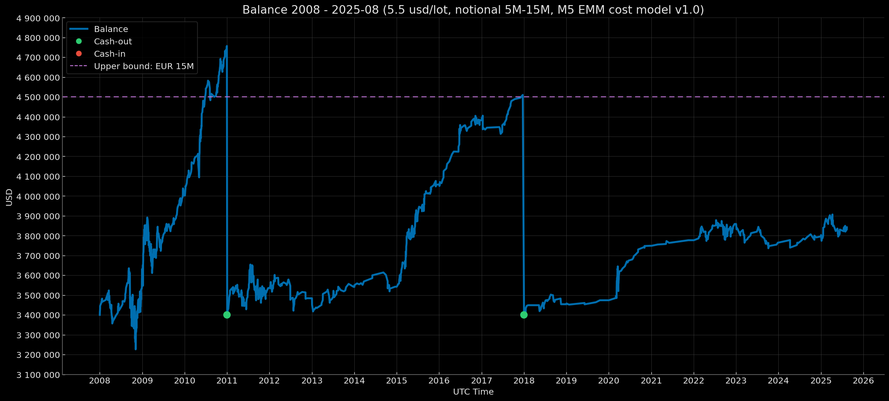

# Euro Macromechanica (EMM) M5 Engine — Core Baseline (2008–2025-08) — Institutional (5.5 USD/lot, risk 1%) – Notional 5M-15M

<p align="center">Balance Curve — Notional 5M-15M Mode (Risk 1%, $5.5 round-turn per standard lot, M5 EMM cost model v1.0) 2008–2025-08</p>

<p align="center"></p>

## 🧾 Track Description

This track reports the backtest results of the M5 EMM strategy under **Institutional** transaction costs: **5.5 USD per round-turn per 1 standard lot (100 000 EUR)**, equivalent to **≈0.55 pips** on EURUSD, with a **dynamic cost model (spread & slippage) M5 EMM cost model v1.0**. Capitalization mode — **reset to 3 400 000 USD when the threshold ≥ 4 500 000 USD is reached at year-end close**. Per-trade risk — **1% of balance at entry**.

- Data range: **Core Baseline 2008-01 – 2025-08** (coverage: **212 months without gaps = 17 years 8 months**)
- Instrument/TF: **EURUSD**, signal logic on **M5**
- **Backtest time zone:** **UTC+0** (all timestamps in UTC+0)
- Cost model: commission, spread, and slippage are **included** in PnL
- Base NAV for rebasing: **3 400 000 USD** 

> Details on institutional modes are provided in [`Euro Macromechanica (EMM) Backtest — Overview and Methodology`](https://github.com/euro-macromechanica-backtest/results/blob/main/README.md)

---

## 📈 Year-End Balance `notional_5M-15M_3m400k`

| Year | balance at year-end (UTC+0) | year-end percentage (rounded to 5 decimals) |
|---|---:|---:|
| 2008 | 3611162.26573 | +6.21065% |
| 2009 | 4002094.93277 | +10.82567% |
| 2010 | 4756808.33867 | +18.85796% |
| 2011 | 3535176.03286 | +3.97577% |
| 2012 | 3483737.35277 | −1.45505% |
| 2013 | 3541225.70340 | +1.65019% |
| 2014 | 3542053.46255 | +0.02337% |
| 2015 | 4058656.29513 | +14.58484% |
| 2016 | 4381908.39061 | +7.96451% |
| 2017 | 4509697.18218 | +2.91628% |
| 2018 | 3453737.23124 | +1.58051% |
| 2019 | 3473795.61457 | +0.58077% |
| 2020 | 3748617.43878 | +7.91128% |
| 2021 | 3776685.05823 | +0.74875% |
| 2022 | 3858614.74576 | +2.16935% |
| 2023 | 3764771.90447 | −2.43203% |
| 2024 | 3795868.13884 | +0.82598% |
| 2025-08 | 3841916.82474 | +1.21313% |

### Result over 17 years 8 months ~ +2 908 422.34 USD / +85.54%

---

## 🧾 Cost Model

- **Commission:** 5.5 USD per round-turn per 1 standard lot (100k EUR)  
- **Cost model (commission, spread, slippage) M5 EMM cost model v1.0** — [`docs/cost_model/m5_emm_cost_model_v1.0.csv`](https://github.com/euro-macromechanica-backtest/results/tree/main/docs/cost_model/m5_emm_cost_model_v1.0.csv).
- All costs are **included** in PnL.

> Details of the dynamic cost model are described in [`Euro Macromechanica (EMM) Backtest — Overview and Methodology`](https://github.com/euro-macromechanica-backtest/results/blob/main/README.ru.md)

---

## 📊 Summary — Institutional 5.5 USD/lot, `notional_5M-15M_3m400k`, risk 1%

### Full period summary
- **CAGR 4.28%** with annual volatility **4.44%**; risk/return — **Sharpe 0.97**, **Sortino 1.36**, **MAR (Full period Calmar) 0.57**.  
- Drawdowns (on the continuous curve): **EoM MaxDD −7.47%**, **TTR — 3 months**; intramonth deeper (**−11.26%**), **TTR — 3 months**. Time under water (max episode length): **EoM 31 months**, **Intramonth 44 months**; since the trough: **EoM 202 months**, **Intramonth 201 months**.  
- Monthly premium: average/median month **0.36% / 0.22%**.  
- Calendar stability: best year **2010 (18.86%)**, worst **2023 (−2.43%)**.  
- Sample size: **17 years 8 months**, **212** months; number of trades: **1443**.  
- Additional metrics: share of months “under water” **62.26%**; **VaR/ES (95%) −1.41% / −2.39%**, **VaR/ES (99%) −2.87% / −3.50%**; **Downside deviation (annual) 3.16%**; **Tail ratio (P95/P5) 1.68**; **Omega (0%/month) 2.52**; **Gain-to-Pain (monthly) 2.52**; **Skewness 0.86**; **Kurtosis excess: 4.73**; **Newey–West t/p: 3.85 / 0.00**.  
- Stress benchmarks: **EoM MaxDD ≈ −7.47%**, **Intramonth MaxDD ≈ −11.26%**; expectation anchor — **average month ≈ 0.36%**.  
- “Zero” months: **37**.
> **Summary:** the profile is conservative and even — returns are steadily positive at low volatility; calendar drawdowns are shallow and typically recover quickly, while intramonth drawdowns, though deeper, remain controlled. The monthly premium is small but repeatable with a notable share of “zero” closes; tail risks are moderate and consistent with VaR/ES, and the distribution is right-skewed. Statistical significance is confirmed (Newey–West), so the base expectation is careful capital growth with restrained risk and clear stress benchmarks.

### Trades summary
- Sample size: **1443** trades; win rate **72.35%**.
- Profile quality: **PF 1.30**, **Payoff 0.50** (avg win/|avg loss|). **Expectancy mean 0.05 R**, **median 0.25 R**.
- R-distribution: **σ 0.473 R**, **min −1.017 R**, **max 0.577 R**.
- Average outcomes: **avg win 0.31 R**, **avg loss −0.62 R**.
- Worst streaks (sum of R): **5-tr −3.71 R**, **10-tr −4.49 R**, **20-tr −5.49 R**.
- 100-trade run (EDR): **P50 −3.67 R**, **P95 −1.96 R**.
- Probabilities (over **100 trades**): Pr(MaxDD ≤ −5R) **≤5R 22.9%**, **≤7R 6.18%**, **≤10R 0.60%**.
- Max losing streak in 100 trades: **P50 3**, **P95 5**.
- Probability of a long losing streak: **≥7 0.38%**, **≥10 0.00%**.
- Duration: **mean 18.00m**, **median 13.00m**, **P95 54.00m**, **wins 13.00m**, **losses 32.00m**.
> **Summary:** many short winning trades and rarer but larger losses; the average trade remains positive, and stability rests on stop discipline. Typical drawdowns on a 100-trade sample are moderate; the probability of deep slumps is low; losing streaks are usually short. Average holding periods are brief, making the equity trajectory more predictable.

### Yearly summary
- Calendar coverage: **2008–2025-08** (year **2025** is partial).
- Mean/median calendar year: **4.34% / 1.91%**.
- Best/worst year: **2010 (18.86%)**, **2023 (−2.43%)**.
- Drawdowns (within the year, from peak): **EoM −7.47% → 0.00%**, **Intramonth −11.26% → −0.20%**.
- Trading activity: total trades **1443**; yearly averages — win rate **70.19%**, PF **1.64**.
- “Active” yearly metrics (averages): share of active months **81.02%**, return of active months **4.34%**, active volatility (annual) **3.80%**.
- Tail risk by month (yearly average): **VaR95 −0.99% / ES95 −1.35%**.
> **Summary:** on a yearly cut, dynamics are steadily positive: the mean and median year are in the black. Within-year drawdowns by month-end are shallow; intramonth drawdowns are deeper but controlled. Roughly 70% winning trades and PF ~1.6 at moderate volatility yield a predictable calendar profile with restrained tail risks.

### Monthly returns 
- Coverage: **212** months (2008-01—2025-08). Mean/median month: **0.36% / 0.22%** (P10/P90: **−0.79% / 1.69%**).
- Symmetry: positive months **121**, negative **54**, zero **37**.
- Extremes: best month **2010-05 (6.15%)**, worst month **2008-09 (−4.61%)**.
- Runs by month: maximum winning streak — **12** in a row, maximum losing streak — **3** in a row; zero months interrupt runs.
> **Summary**: monthly dynamics are even: a small but repeatable premium; a notably larger share of positive months; restrained tails without destructive outliers. Extremes stay within the “working corridor”; losing streaks are short and are quickly offset; zero months naturally interrupt trends — the overall profile is calm and predictable.

### DD quantiles 
> Drawdown quantiles are shown signed (negative), while xRisk = |DD| is published as a positive magnitude. Therefore, as the percentile rises, DD values approach 0, and xRisk values decrease.
- Observations / episodes: **132** points; **20** drawdown episodes.
- Depth quantiles (EoM, calendar): **P90 −0.35%**, **P95 −0.24%**, **P99 −0.02%**.
- Time under water: **P90 19** months, **P95 27** months.
- Depth in xRisk scale: **P90 0.35**, **P95 0.24**, **P99 0.02**.
> **Summary:** drawdowns are mostly shallow, tails are moderate; time underwater is typically from several quarters to a couple of years; calendar and xRisk quantiles are aligned — destructive tails are not observed.

### Rolling 12m
- Windows: **201**; incomplete windows: **0**.  
- Window return (12m): mean/median **4.59% / 2.70%** (P10/P90: **−0.84% / 12.57%**); best/worst window end: **2011-01 (20.24%) / 2013-02 (−4.20%)**.  
- Share of windows by sign: positive **162**, negative **39**, zero **0**.  
- Risk/quality (window medians): volatility (annual) **3.21%**, Sharpe **1.26**, Sortino **1.23**, Calmar **2.82**; window MaxDD **−1.29%**.  
- Window composition (medians): active **91.67%** (~11 of 12), positive **58.33%**, negative **25.00%**.  
- Tails and asymmetry (medians): **Tail 1.71**, **Omega 2.55**; **VaR95 −0.67% / ES95 −1.07%**.
> **Summary:** on the 12‑month horizon, the picture is smooth: most windows are positive; dispersion is moderate; within-window drawdowns are shallow and recover quickly; risk-adjusted quality sits comfortably above neutral; tails are restrained; and the share of “green” months consistently dominates losing months in the window.

### Rolling 36m 
- Windows: 177; incomplete windows: **0**.  
- Annualized window return: mean/median **4.26% / 3.39%**; **P10/P90:** **0.16% / 8.84%**; **best/worst window end:** **2011-10 (14.61%) / 2024-05 (−0.29%)**.  
- Shares of windows by sign: positive **168**, negative **8**, zero **1**.  
- Risk/quality (medians): volatility (annual) **3.07%**, **Sharpe 1.22**, **Sortino 2.34**, **Calmar 1.86**; **window MaxDD −2.30%**.  
- Window composition (medians): active **86.11%** (~31 of 36), positive **52.78%**, negative **22.22%**.  
- Tails and asymmetry (medians): **Tail 1.86**, **Omega 3.26**; **VaR95 −0.87% / ES95 −1.62%**.
> **Summary:** the vast majority of windows are positive; negative episodes are rare and shallow. Returns are moderate at low volatility; risk-adjusted metrics sit confidently above neutral; a typical within-window drawdown is compact; windows are dominated by active and “green” months; and tail risks by VaR/ES and tail metrics are restrained — together yielding a smooth capital path and predictable results over the three‑year interval.

### Monte Carlo
- Method: **stationary_bootstrap**.
- Horizons: **12, 36, 212 months**.
- Average block lengths: **3, 4, 5, 6, 7, 8, 9, 10, 11, 12 months**.
- Risk per trade: **1%**.
> **Summary:** the distributions show a persistent tilt toward favorable paths on short and medium horizons with a low probability of “hard” breaches of drawdown thresholds; typical drawdowns remain moderate. As the horizon lengthens, sensitivity to rare adverse scenarios rises, yet xRisk-oriented control remains in place, and median “time-to-threshold” often indicates the absence of critical breaches within the studied intervals. Overall, the simulated picture aligns with a conservative but positive profile: a smooth trajectory with manageable tail risks under disciplined risk management.

### Confidence Intervals 
- Interval method: **bootstrap_bca** (BCa — bias‑corrected & accelerated).
- Bootstrap (EoM monthly): **stationary_bootstrap**, average block length **6 months**.
- Bootstrap (intramonth): **stationary_bootstrap**, average block length **5 days**.
- Confidence level: **90%**.
> **Summary:** confidence intervals confirm a conservative profile: the return component shows a steady positive drift over the full horizon, while risk metrics are statistically stable on the downside, reflecting shallow but systematic drawdowns. By year, risk characteristics are homogeneous with no signs of “destructive” tails. In sum, this supports a cautious yet positive quality assessment: moderate risks, predictable variability, and a statistically confirmed upward tendency. 

### Cash flows 
- **Rebasing events:** 2.
- **Cash flows:** **cash‑out** (payouts): **1 356 808.34** for **2010** (EoY **2010‑12**); **1 109 697.18** (EoY **2017‑12**) — **2** events; **cash‑in** (deposits) **0.00** — **0** events.
- **Extremes:** maximum **cash‑out** — **1 356 808.34** for **2010** (EoY **2010‑12**).
- **Profit after the last rebasing** 441 916.82.
> **Summary:** net profit ~ **2 908 422.34**.

### Conclusion
Across the full horizon, the profile is consistently conservative: smooth growth at low volatility; calendar drawdowns are shallow and typically recover quickly; intramonth drawdowns are deeper but controlled. By month, the premium is small but repeatable; the share of positive months is noticeably larger; losing streaks are short. On yearly windows the outcome is predictable, and on multi‑year windows even and stable: risk‑adjusted metrics sit confidently above neutral, and typical drawdowns are compact. Resampling simulations confirm that as the horizon lengthens, outcome dispersion narrows and the probability of a negative endpoint drops sharply; confidence intervals align with this and do not indicate destructive tails. 

### Full methodology and metric definitions in [`docs/metrics_methodology/metrics_schema.json`](https://github.com/euro-macromechanica-backtest/results/tree/main/docs/metrics_methodology/metrics_schema.json) / [`docs/metrics_methodology/metrics_schema.md`](https://github.com/euro-macromechanica-backtest/results/tree/main/docs/metrics_methodology/metrics_schema.md).

### Metrics files

```
metrics/
  confidence_intervals.csv
  dd_quantiles_full_period.csv
  monthly_returns.csv
  monte_carlo_summary.csv
  full_period_summary.csv
  rebasing_applied.csv
  rolling_12m.csv
  rolling_36m.csv
  trades_full_period_summary.csv
  yearly_summary.csv
```

### Metrics were computed based on non-public files `trades_YYYY.csv` and `balance_YYYY.csv`

---

## 📎 Links

- **Euro Macromechanica (EMM) Backtest — Overview and Methodology**: repository root **[README.md](https://github.com/euro-macromechanica-backtest/results/blob/main/README.md)**
- Cost model (commission, spread, slippage) M5 EMM cost model v1.0 — [`docs/cost_model/m5_emm_cost_model_v1.0.csv`](https://github.com/euro-macromechanica-backtest/results/tree/main/docs/cost_model/m5_emm_cost_model_v1.0.csv)
- General information about the contents of `results`: **[results/README.md](https://github.com/euro-macromechanica-backtest/results/blob/main/results/README.md)**
- Inputs and provenance: **[INPUTS-PIN.md](https://github.com/euro-macromechanica-backtest/results/blob/main/docs/INPUTS-PIN.md)** / **[INPUTS-PROVENANCE.md](https://github.com/euro-macromechanica-backtest/data-hub/blob/main/INPUTS-PROVENANCE.md)**
- Full audit guide: **[docs/AUDIT.md](https://github.com/euro-macromechanica-backtest/results/blob/main/docs/AUDIT.md)**
- Data quality policy: **[data_quality_policy/policy_v1.0.md](https://github.com/euro-macromechanica-backtest/results/blob/main/data_quality_policy/policy_v1.0.md)**
- Metric calculation methodology: **[docs/metrics_methodology/metrics_schema.md](https://github.com/euro-macromechanica-backtest/results/tree/main/docs/metrics_methodology/metrics_schema.md)** / **[docs/metrics_methodology/metrics_schema.json](https://github.com/euro-macromechanica-backtest/results/tree/main/docs/metrics_methodology/metrics_schema.json)**
