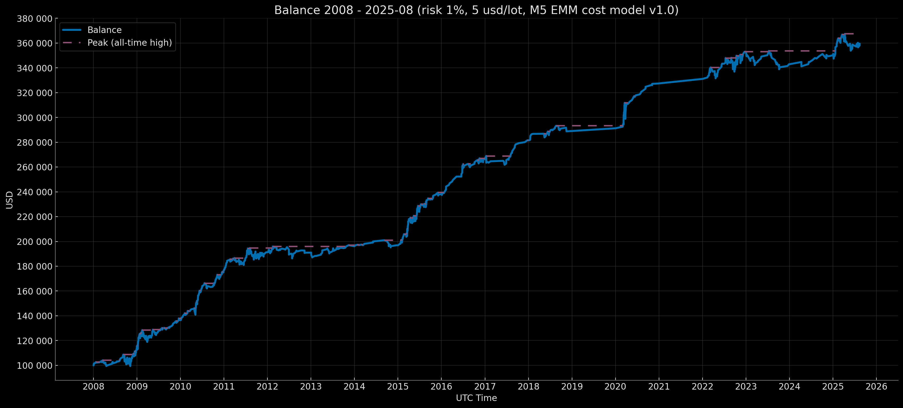

# Euro Macromechanica (EMM) M5 Engine — Core Baseline (2008–2025-08) — Retail Rebate (5 USD/lot, risk 1%) – Compounding EoY-SoY Base 100k

<p align="center">Balance Curve — Compounding EoY-SoY Base 100k Mode (Risk 1%, $5 round-turn per standard lot, M5 EMM cost model v1.0) 2008–2025-08</p>

<p align="center"></p>

## 🧾 Описание трека

Этот трек фиксирует результаты бэктеста стратегии M5 EMM при **Retail Rebate** комиссионных издержках: **5 USD за round-turn на 1 стандартный лот (100 000 EUR)**, эквивалент **≈0.5 pips** на EURUSD, **динамическая модель издержек (spread & slippage) M5 EMM cost model v1.0**. Режим капитализации — **компаундинг на всём периоде (EoY→SoY)**. Капитал переходит из года в год. **Ending balance → initial balance** следующего года. Старт initial balance в начале периода — 100k. Риск на сделку — **1% от баланса на момент входа**.

- Диапазон данных: **Core Baseline 2008-01 – 2025-08** (покрытие: **212 мес. без дыр = 17 лет 8 мес.**)
- Инструмент/TF: **EURUSD**, сигнальная логика на **M5**
- **Часовой пояс бэктеста:** **UTC+0** (все временные метки в UTC+0)
- Модель издержек: комиссия, spread и slippage **включены** в PnL

---

## 📈 Баланс по закрытию года `compounding_eoy_soy_base_100k`

| Год | баланс на момент закрытия года (UTC+0) | процент на момент закрытия года (округление — 5 знаков после запятой) |
|---|---:|---:|
| 2008 | 115063.86183 | +15.06386% |
| 2009 | 136533.57160 | +18.65895% |
| 2010 | 176953.26852 | +29.60422% |
| 2011 | 191244.62684 | +8.07635% |
| 2012 | 190956.19712 | −0.15082% |
| 2013 | 196116.38538 | +2.70229% |
| 2014 | 196863.80466 | +0.38111% |
| 2015 | 238102.08511 | +20.94762% |
| 2016 | 266287.11152 | +11.83737% |
| 2017 | 281540.69501 | +5.72825% |
| 2018 | 288773.39485 | +2.56897% |
| 2019 | 291249.23200 | +0.85736% |
| 2020 | 327337.35603 | +12.39080% |
| 2021 | 331097.63518 | +1.14875% |
| 2022 | 352963.22850 | +6.60397% |
| 2023 | 342917.96005 | −2.84598% |
| 2024 | 350124.05278 | +2.10140% |
| 2025-08 | 359544.45136 | +2.69059% |

### Результат за 17 лет и 8 мес. ~ +259 544.45 USD / 259.54%

---

## 🧾 Модель издержек

- **Комиссия:** 5 USD за round-turn на 1 стандартный лот (100k EUR)  
- **Модель издержек (commission, spread, slippage) M5 EMM cost model v1.0** — [`docs/cost_model/m5_emm_cost_model_v1.0.csv`](https://github.com/euro-macromechanica-backtest/results/tree/main/docs/cost_model/m5_emm_cost_model_v1.0.csv).
- Все издержки **включены** в PnL.

> Подробности о динамической модели издержек описаны в [`Обзор и Методология Euro Macromechanica (EMM) Backtest`](https://github.com/euro-macromechanica-backtest/results/blob/main/README.ru.md)

---

## 📊 Краткий обзор — Retail Rebate 5 USD/lot, `compounding_eoy_soy_base_100k`, risk 1%

### Full period summary 
- **CAGR 7.51%** при годовой волатильности **5.59%**; риск/доход — **Sharpe 1.33**, **Sortino 2.74**, **MAR (Full period Calmar) 1.66**.
- Просадки (по непрерывной кривой): **EoM MaxDD −4.52%**, **TTR — 2 мес.**; внутримесячно глубже (**−8.42%**), **TTR — 1 мес.**. Длительность под водой (макс. длительность эпизода): **EoM 26 мес.**, **Intramonth 22 мес.**
- Месячная премия: средний/медианный месяц **0.62% / 0.32%**.
- Календарная устойчивость: лучший год **2010 (29.60%)**, худший **2023 (−2.85%)**; «нулевых» месяцев **38**.
- Объём выборки: покрытие **2008‑01—2025‑08**, **17 лет 8 мес.**;  **212** мес.; количество сделок: **1443**.
- Доп. показатели: доля месяцев «под водой» **51.89%**; с момента дна MaxDD: **EoM 202 мес. / Intramonth 201 мес.**; **VaR/ES (95%) −1.28% / −2.14%**, **VaR/ES (99%) −2.45% / −2.94%**; **Downside deviation (год.) 2.70%**; **Tail ratio (P95/P5) 2.43**; **Omega(0%/мес) 3.80**; **Gain-to-Pain (мес.) 3.80**; **Skewness 1.81**; **Kurtosis excess: 6.44**; **Newey–West t/p по средней мес.: t=4.55 / p=0.00**.
- Стресс‑ориентиры: **EoM MaxDD ≈ −4.52%**, **Intramonth MaxDD ≈ −8.42%**; ориентир ожиданий — **средний месяц ≈ 0.62%**.
> **Итог:** стратегия по полному периоду показывает устойчивую премию при умеренной волатильности: просадки неглубокие и быстро отыгрываются, месячная доходность стабильна с «правой» асимметрией, а календарный профиль ровный — сильные годы перекрывают слабые без затяжных провалов; доля времени под водой невысока по качеству риска, хвосты сдержанные и согласуются с интервалами VaR/ES и значимой t-статистикой, так что базовое ожидание — небольшая, но предсказуемая месячная прибыль при комфортном уровне риска.

### Trades summary
- Объём выборки: **1443** сделок; win rate **74.01%**.
- Качество профиля: **Profit factor 1.46**, **Payoff 0.51** (avg win/|avg loss|).
- Ожидание на сделку: **mean 0.09 R**, **median 0.34 R**.
- Распределение R: **σ 0.55 R**, **min −1.02 R**, **max 0.59 R**.
- Средние результаты: **avg win 0.39 R**, **avg loss −0.75 R**.
- Худшие серии (сумма R): **5-тр −3.74 R**, **10-тр −4.67 R**, **20-тр −5.64 R**.
- Серия из 100 сделок (EDR): **P50 −3.87 R**, **P95 −2.10 R**.
- Вероятность (за **100 сделок**): Pr(MaxDD ≤ −5R) **24.62%**, ≤ −7R **6.18%**, ≤ −10R **0.68%**.
- Макс. убыточная серия в 100 сделках: **P50 3**, **P95 5**.
- Длительность: **mean 18.00m**, **median 13.00m**, **P95 54.00m**, **wins 13.00m**, **losses 32.00m**.
> **Итог:** стратегия опирается на частые небольшие выигрыши при более редких, но крупнее по размеру убытках, из-за чего стабильность держится на дисциплине стопов и постоянстве риска на сделку. Серийные метрики показывают управляемые просадки блоками и указывают, что провалы, когда случаются, концентрируются короткими «кластерными» отрезками, а типовой блок сделок в среднем тянет капитал вверх. Распределение результатов с «правым» уклоном и адекватные хвостовые сценарии поддерживают предсказуемость, а характер удержания позиций соответствует аккуратному исполнению без ставок на редкие всплески.

### Yearly summary
- Календарное покрытие: **2008–2025-08** (год **2025** неполный).
- Средний/медианный календарный год: **7.69% / 4.21%**.
- Лучший/худший год: **2010 (29.60%)**, **2023 (−2.85%)**.
- Просадки (внутри года, от пика): **EoM −4.52% → 0.00%**, **Intramonth −8.42% → −0.22%**.
- Торговая активность: всего сделок **1443**; средние по годам — win rate **72.30%**, PF **1.87**.
- «Активные» метрики по годам (средние): доля активных месяцев **81.02%**, доходность активных **7.69%**, волатильность активная (год.) **4.77%**.
- Риск хвостов по месяцам (среднее по годам): **VaR95 −0.98% / ES95 −1.32%**.
> **Итог:** на годовом горизонте профиль стабильно остаётся в плюсе, просадки по годам компактны, «активные» периоды тянут результат при умеренной волатильности; качество по Sharpe/Sortino/Calmar держится на уровне, а хвостовые месячные риски ограничены.

### Monthly returns 
- Покрытие: **212** месяцев. Средний/медианный месяц: **0.62% / 0.32%** (P10/P90: **−0.89% / 2.21%**).
- Симметрия: положительных месяцев **125**, отрицательных **49**, нулевых **38**.
- Экстремальные значения: лучший месяц **2010-05 (8.74%)**, худший месяц **2008-09 (−3.69%)**.
- Серии по месяцам: максимальная серия выигрышей — **12** подряд, максимальная серия убытков — **3** подряд; нулевые месяцы прерывают серии.
> **Итог:** месячная динамика компактная: премия небольшая, но повторяемая; положительных месяцев больше, затяжные убыточные серии редки, «худший» месяц укладывается в умеренные рамки.

### DD quantiles 
> Квантили DD приведены в подписанном виде (отрицательные), а xRisk = |DD| публикуется как положительная величина. Поэтому при росте перцентиля значения DD становятся ближе к 0, а значения xRisk — уменьшаются.
- Наблюдения: **110**; эпизоды просадок: **24**.
- Квантили глубины просадки (EoM, календарная): **P90 −0.28%**, **P95 −0.16%**, **P99 −0.07%**.
- Длительность «под водой»: **P90 14 мес.**, **P95 19 мес.**.
- Глубина в масштабе xRisk: **P90 0.28**, **P95 0.16**, **P99 0.07**.
> **Итог:** экстремальные просадки по квантили P90–P99 компактны, периоды под водой ограничены; в xRisk‑масштабе типичные «хвостовые» просадки остаются умеренными относительно принятого риска.

### Rolling 12m
- Окна: **201**; неполных окон: **0**.
- Возврат за окно (12м): средний/медианный **8.04% / 5.01%** (P10/P90: **−0.19% / 21.84%**); лучший/худший конец окна: **2009-10 (31.67%) / 2013-02 (−3.46%)**.
- Доля окон по знаку: положительных **178**, отрицательных **23**, нулевых **0**.
- Риск/качество (медианы по окнам): волатильность (год.) **4.21%**, Sharpe **1.61**, Sortino **2.22**, Calmar **5.54**; MaxDD за окно **−1.25%**.
- Состав месяцев в окне (медианы): активные **91.67%** (~11 из 12), положительных **58.33%**, отрицательных **16.67%**.
- Хвосты и асимметрия (медианы): **Tail 2.57**, **Omega 3.92**; **VaR95 −0.75% / ES95 −1.03%**.
> **Итог:** в 12-месячных окнах динамика стабильная: подавляющее большинство окон в плюсе, волатильность умеренная, просадки в каждом окне неглубокие и быстро отыгрываются. Риск-скорректированные метрики держатся на крепком уровне, хвосты сдержанные, а распределение «зелёных» месяцев внутри окна устойчиво доминирует над убыточными. В итоге профиль на годовом горизонте выглядит предсказуемым и комфортным к риску: сильные периоды регулярно перекрывают редкие слабые отрезки.

### Rolling 36m 
- Окна: **177**; неполных окон: **0**.
- Годовая доходность окна (annualized): средняя/медианная **7.28% / 5.71%** (P10/P90: **1.75% / 14.63%**); лучший/худший конец окна: **2011-10 (23.45%) / 2014-10 (0.76%)**.
- Доля окон по знаку: положительных **177**, отрицательных **0**, нулевых **0**.
- Риск/качество (медианы по окнам): волатильность (год.) **4.06%**, Sharpe **1.35**, Sortino **3.16**, Calmar **3.10**; MaxDD за окно **−2.48%**.
- Состав месяцев в окне (медианы): активные **86.11%** (~31 из 36), положительных **58.33%**, отрицательных **19.44%**.
- Хвосты и асимметрия (медианы): **Tail 2.98**, **Omega 5.71**; **VaR95 −1.00% / ES95 −1.68%**.
> **Итог:** на 36-месячном горизонте профиль устойчивый и предсказуемый: все окна положительные, доходность идёт плавно при умеренной волатильности; риск-скорректированные метрики на хорошем уровне, а просадки в каждом окне остаются неглубокими и контролируемыми. В составе окон доминируют активные и «зелёные» месяцы, хвостовые риски сдержанные — в сумме это даёт комфортный к риску, ровный ход результатов на длинном промежутке.

### Monte Carlo
- Метод: **stationary_bootstrap**.
- Горизонты: **12, 36, 212 мес.**.
- Средние длины блоков: **3, 4, 5, 6, 7, 8, 9, 10, 11, 12 мес.**.
- Риск/сделку: **1%**.
> **Итог:** На коротком горизонте медианный исход положительный при умеренных просадках и редких пробоях жёстких порогов; на среднем горизонте вероятность отрицательного результата становится минимальной, просадки остаются контролируемыми, а серьёзные пробои случаются редко и требуют длительного времени; на полном горизонте отрицательные исходы практически исключены, разброс сценариев сужается, хвостовые риски сдержаны, а «без пробоя» строгих порогов удерживается в большинстве путей. В целом симуляции подтверждают устойчивость стратегии: чем дольше горизонт, тем предсказуемее результат и спокойнее риск-профиль.

### Confidence Intervals 
- Метод интервалов: **bootstrap_bca** (BCa — bias‑corrected & accelerated).
- Бутстрэп (EoM monthly): **stationary_bootstrap**, средняя длина блока **6 мес.**.
- Бутстрэп (intramonth): **stationary_bootstrap**, средняя длина блока **5 дней**.
- Уровень доверия: **90%**.
> **Итог:** доверительные интервалы подтверждают статистически значимую положительную доходность на всём горизонте при умеренной неопределённости по волатильности. Календарные просадки по закрытиям остаются относительно неглубокими и узкими по диапазону, а внутримесячные ожидаемо глубже, но без признаков «разрушительных» хвостов; метрики VaR/ES согласованно указывают на сдержанные крайние сценарии. В годовом разрезе картина та же: внутригодовые просадки контролируемы, а распределение потерь остаётся стабильным. В сумме интервалы компактны, эффект стратегии устойчив и не зависит от одиночных выбросов, а риск-профиль выглядит ровным и управляемым.  

### Вывод
За весь горизонт в 17 лет и 8 месяцев трек даёт устойчивую положительную премию при умеренном риске: просадки неглубокие и быстро отыгрываются (по закрытиям и внутримесячно), месячная динамика ровная с доминированием «зелёных» периодов, а годовые и скользящие окна подтверждают плавный ход без затяжных провалов; Монте-Карло и доверительные интервалы согласованно показывают сдержанные хвосты и высокую предсказуемость результата, а профиль серий по сделкам указывает на управляемые локальные просадки и стабильный вклад типичных сделок; при фиксированной комиссии $5 за сделку совокупные издержки ниже базовой нагрузки, поэтому метрики риска-доходности и качество профиля закономерно улучшаются.

### Полная методология и определения метрик в [`docs/metrics_methodology/metrics_schema.json`](https://github.com/euro-macromechanica-backtest/results/tree/main/docs/metrics_methodology/metrics_schema.json) / [`docs/metrics_methodology/metrics_schema.md`](https://github.com/euro-macromechanica-backtest/results/tree/main/docs/metrics_methodology/metrics_schema.md).

### Файлы метрик

```
metrics/
  confidence_intervals.csv
  dd_quantiles_full_period.csv
  monthly_returns.csv
  monte_carlo_summary.csv
  full_period_summary.csv
  rolling_12m.csv
  rolling_36m.csv
  trades_full_period_summary.csv
  yearly_summary.csv
```

### Метрики рассчитывались на основе непубличных файлов `trades_YYYY.csv` и `balance_YYYY.csv`

---

## 📎 Ссылки

- **Обзор и Методология Euro Macromechanica (EMM) Backtest**: корневой **[README.ru.md](https://github.com/euro-macromechanica-backtest/results/blob/main/README.ru.md)**
- Модель издержек (commission, spread, slippage) M5 EMM cost model v1.0 — [`docs/cost_model/m5_emm_cost_model_v1.0.csv`](https://github.com/euro-macromechanica-backtest/results/tree/main/docs/cost_model/m5_emm_cost_model_v1.0.csv)
- Общая информация о содержимом в `results`: **[results/README.ru.md](https://github.com/euro-macromechanica-backtest/results/blob/main/results/README.ru.md)**
- Входные данные и происхождение: **[INPUTS-PIN.ru.md](https://github.com/euro-macromechanica-backtest/results/blob/main/docs/INPUTS-PIN.ru.md)** / **[INPUTS-PROVENANCE.ru.md](https://github.com/euro-macromechanica-backtest/data-hub/blob/main/INPUTS-PROVENANCE.ru.md)**
- Полная инструкция по аудиту: **[docs/AUDIT.ru.md](https://github.com/euro-macromechanica-backtest/results/blob/main/docs/AUDIT.ru.md)**
- Политика качества данных: **[data_quality_policy/policy_v1.0.ru.md](https://github.com/euro-macromechanica-backtest/results/blob/main/data_quality_policy/policy_v1.0.ru.md)**
- Методология расчёта метрик: **[docs/metrics_methodology/metrics_schema.md](https://github.com/euro-macromechanica-backtest/results/tree/main/docs/metrics_methodology/metrics_schema.md)** / **[docs/metrics_methodology/metrics_schema.json](https://github.com/euro-macromechanica-backtest/results/tree/main/docs/metrics_methodology/metrics_schema.json)**