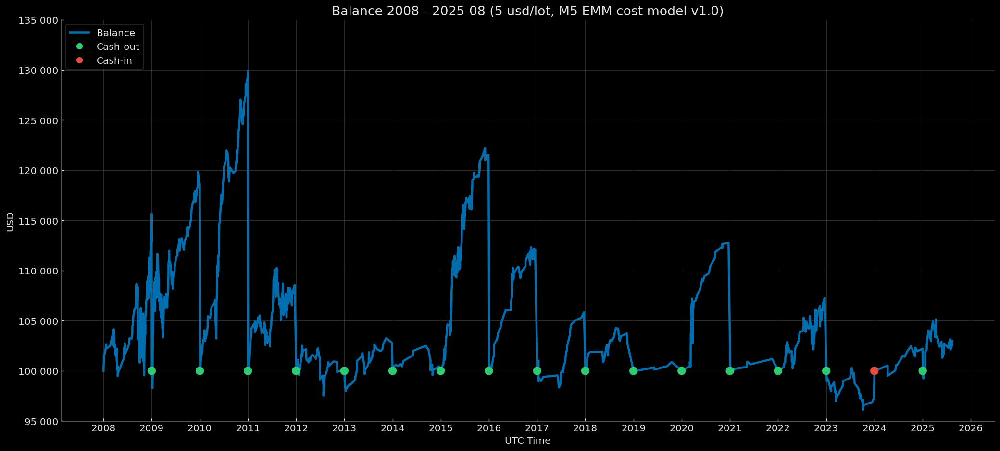

# Euro Macromechanica (EMM) M5 Engine — Core Baseline (2008–2025-08) — Retail Rebate (5 USD/lot, risk 1%) – Fixed Start 100k

<p align="center">Balance Curve — Fixed Start 100k Mode (Risk 1%, $5 round-turn per standard lot, M5 EMM cost model v1.0) 2008–2025-08</p>

<p align="center"></p>

## 🧾 Track Description

This track reports backtest results for the M5 EMM strategy under **Retail Rebate** transaction costs: **5 USD per round‑turn per 1 standard lot (100 000 EUR)**, equivalent to **≈0.5 pips** on EURUSD, with a **dynamic cost model (spread & slippage) M5 EMM cost model v1.0**. Capitalization mode — **annual reset to 100 000 USD**. Per‑trade risk — **1% of balance at entry**.

- Data range: **Core Baseline 2008-01 – 2025-08** (coverage: **212 months without gaps = 17 years 8 months**)
- Instrument/TF: **EURUSD**, signal logic on **M5**
- **Backtest time zone:** **UTC+0** (all timestamps in UTC+0)
- Cost model: commission, spread, and slippage **included** in PnL
- Base NAV for rebasing: **100 000 USD** (`fixed_start_100k` — annual reset to 100k)

---

## 📈 Year-End Balance `fixed_start_100k`

| Year | balance at year-end (UTC+0) | year-end percentage (rounded to 5 decimals) |
|---|---:|---:|
| 2008 | 115063.86183 | +15.06386% |
| 2009 | 118664.51354 | +18.66451% |
| 2010 | 129925.56060 | +29.92556% |
| 2011 | 108553.61072 | +8.55361% |
| 2012 | 100014.75271 | +0.01475% |
| 2013 | 102808.81689 | +2.80882% |
| 2014 | 100434.79457 | +0.43479% |
| 2015 | 121558.60205 | +21.55860% |
| 2016 | 112077.67541 | +12.07768% |
| 2017 | 105849.63712 | +5.84964% |
| 2018 | 102671.43861 | +2.67144% |
| 2019 | 100881.29009 | +0.88129% |
| 2020 | 112753.34318 | +12.75334% |
| 2021 | 101180.79393 | +1.18079% |
| 2022 | 107260.93175 | +7.26093% |
| 2023 | 97299.50895 | −2.70049% |
| 2024 | 102201.89077 | +2.20189% |
| 2025-08 | 102983.14404 | +2.98314% |

### Result over 17 years 8 months ~ +142184.17 USD / +142.18%

---

## 🧾 Cost Model

- **Commission:** 5 USD per round‑turn per 1 standard lot (100k EUR)  
- **Cost model (commission, spread, slippage) M5 EMM cost model v1.0** — [`docs/cost_model/m5_emm_cost_model_v1.0.csv`](https://github.com/euro-macromechanica-backtest/results/tree/main/docs/cost_model/m5_emm_cost_model_v1.0.csv).
- All costs are **included** in PnL.

> Details of the dynamic cost model are provided in [`Euro Macromechanica (EMM) Backtest — Overview and Methodology`](https://github.com/euro-macromechanica-backtest/results/blob/main/README.md)

---

## 📊 Summary — Retail Rebate 5 USD/lot, `fixed_start_100k`, risk 1%

### Full period summary 
- **CAGR 7.72%** with annual volatility **5.62%**; risk/return — **Sharpe 1.35**, **Sortino 2.84**, **MAR (Full period Calmar) 1.71**.
- Drawdowns (on the continuous curve): **EoM MaxDD −4.52%**, TTR — **2 months**; deeper intramonth (**−8.42%**), TTR — **1 month**. Time underwater (max episode length): **EoM 26 months**, **Intramonth 21 months**.
- Monthly premium: mean/median month **0.63% / 0.33%**.
- Calendar stability: best year **2010 (29.93%)**, worst **2023 (−2.70%)**; “zero” months **38**.
- Sample size: coverage **2008-01—2025-08** (**17 years 8 months, 212 months**); number of trades: **1443**.
- Additional metrics: share of months “underwater” **50.94%**; time since MaxDD trough (as of 2025-08): **EoM 202 months / Intramonth 201 months**; **VaR/ES (95%) −1.27% / −2.11%**, **VaR/ES (99%) −2.44% / −2.94%**; **Downside deviation (annual) 2.68%**; **Tail ratio (P95/P5) 2.48**; **Omega(0%/month) 3.93**; **Gain-to-Pain (monthly) 3.93**; **Skewness 1.83**; **Kurtosis excess: 6.45**; **Newey–West t/p for mean monthly return: t=4.65 / p=0.00**.
- Stress markers: **EoM MaxDD ≈ −4.52%**, **Intramonth MaxDD ≈ −8.42%**; expectation benchmark — **average month ≈ 0.63%**.
> **Summary:** the strategy delivers a stable small premium at moderate volatility; drawdowns are shallow and rebound quickly; risk profile is comfortable (positive asymmetry), and calendar behavior is even without prolonged slumps.

### Trades summary 
- Sample size: **1443** trades; win rate **74.08%**.
- Profile quality: **PF 1.47**, **Payoff 0.51**, **Expectancy mean 0.09 R**, **median 0.34 R**.
- R‑distribution: **σ 0.56 R**, **min −1.02 R**, **max 0.59 R**.
- Averages: **avg win 0.39 R**, **avg loss −0.76 R**.
- Worst streaks (sum of R): **5‑tr −3.74 R**, **10‑tr −4.65 R**, **20‑tr −5.64 R**.
- 100‑trade run (EDR): **P50 −3.84 R**, **P95 −2.09 R**.
- Probabilities (per **100 trades**): Pr(MaxDD ≤ −5R) **23.90%**, ≤ −7R **5.90%**, ≤ −10R **0.66%**.
- Max losing streak in 100 trades: **P50 3**, **P95 5**.
- Long losing streak probability: **≥7 0.28%**, **≥10 0.00%**.
- Duration: **mean 18.00m**, **median 13.00m**, **P95 54.00m**, **wins 13.00m**, **losses 32.00m**.
> **Summary:** the strategy relies on frequent small gains versus rarer, larger losses, so stability rests on stop discipline and constant per‑trade risk. Streak metrics show manageable block drawdowns and indicate that slumps, when they occur, cluster over short “blocky” segments, while a typical block of trades on average lifts equity. A right‑skewed outcome distribution and contained tail scenarios support predictability, and the holding‑period profile matches careful execution without reliance on rare spikes.

### Yearly summary
- Calendar coverage: **2008–2025-08** (year **2025** is partial).
- Mean/median calendar year: **7.90% / 4.42%**.
- Best/worst year: **2010 (29.93%)**, **2023 (-2.70%)**.
- Drawdowns (within the year, from peak): **EoM -4.52% → 0.00%**, **Intramonth -8.42% → -0.22%**.
- Trading activity: total trades **1443**; yearly averages — win rate **72.61%**, PF **1.90**.
- “Active” yearly metrics (averages): share of active months **81.02%**, return of actives **7.90%**, active volatility (annual) **4.79%**.
- Tail risk by month (yearly average): **VaR95 -0.96% / ES95 -1.30%**.
> **Summary:** on a yearly cut the strategy remains steadily positive up through the current partial year. Calendar returns are stable; within‑year drawdowns are moderate and controlled; negative periods are rare and offset by stronger years. Trading activity supports a high win rate and healthy quality profile; active months dominate, and risk‑adjusted metrics stay strong with contained tail risks.

### Monthly returns
- Coverage: **212** months (2008‑01—2025‑08). Mean/median month: **0.63% / 0.33%** (P10/P90: **−0.88% / 2.21%**).
- Symmetry: positive months **126**, negative **48**, zero **38**.
- Extremes: best month **2010-05 (8.83%)**, worst month **2008-09 (−3.69%)**.
- Runs by month: maximum winning streak — **12** in a row, maximum losing streak — **3** in a row; zero months interrupt streaks.
> **Summary**: month by month the strategy delivers a steady positive premium with an even distribution and pronounced right skew; positive months materially outnumber negatives, and losing streaks are short. Extreme spikes and slumps are rare; zero months appear and naturally break streaks — overall pointing to a steady cadence without prolonged underwater stretches.

### DD quantiles 
> Quantiles of DD are shown signed (negative), while xRisk = |DD| is published as a positive magnitude. Therefore, as the percentile rises, DD values approach 0, and xRisk values decrease.
- Observations: **108** points; drawdown episodes: **23**.
- Drawdown depth quantiles (calendar, EoM): **P90 −0.27%**, **P95 −0.21%**, **P99 −0.05%**.
- “Underwater” duration quantiles (months): **P90 16**, **P95 18**.
- Depth quantiles in xRisk scale: **P90 0.27**, **P95 0.21**, **P99 0.05**.
> **Summary:** the drawdown distribution looks “fine‑grained” and controlled — most episodes are shallow, while time underwater typically fits moderate spans; calendar and xRisk quantiles align, confirming a stable, calm risk profile without long or deep slumps.

### Rolling 12m 
- Windows: **201**; incomplete windows: **0**.
- Window return (12m): mean/median **8.26% / 5.19%** (P10/P90: **−0.15% / 22.13%**); best/worst: **2009-10 (31.68%) / 2013-02 (−3.34%)**.
- Sign shares: positive windows **179**, negative **22**, zero **0**.
- Risk/quality (window medians): volatility (annual) **4.24%**, Sharpe **1.66**, Sortino **2.66**, Calmar **5.59**; window MaxDD **−1.24%**.
- Window composition (medians): active **91.67%** (~11 of 12), positive **58.33%**, negative **16.67%**.
- Tails and asymmetry (medians): **Tail 2.59**, **Omega 3.96**; **VaR95 −0.74% / ES95 −1.01%**.
> **Summary:** on the 12‑month horizon the strategy prints positive windows most of the time at moderate annual volatility and strong risk‑adjusted metrics. Within‑window drawdowns are shallow; the shares of active and positive months are high; tail risks are restrained — a smooth and resilient profile even on stressed stretches.

### Rolling 36m 
- Windows: **177**; incomplete windows: **0**.
- Annualized window return: mean/median **7.51% / 5.88%** (P10/P90: **1.94% / 14.93%**); best/worst window end: **2011-10 (23.71%) / 2014-10 (0.88%)**.
- Shares by sign: positive **177**, negative **0**, zero **0**.
- Risk/quality (window medians): volatility (annual) **4.19%**, Sharpe **1.37**, Sortino **3.21**, Calmar **3.26**; window MaxDD **−2.47%**.
- Composition (medians): active **86.11%** (~31 of 36), positive **58.33%**, negative **19.44%**.
- Tails and asymmetry (medians): **Tail 3.05**, **Omega 5.80**; **VaR95 −0.97% / ES95 −1.62%**.
> **Summary:** on the three‑year horizon the strategy shows consistently positive results across all windows, with moderate volatility and strong risk‑adjusted metrics. Within‑window drawdowns are shallow; shares of active and “green” months are high; tail risks are restrained — a smooth profile without prolonged slumps and with good risk carry.

### Monte Carlo
- Method: **stationary_bootstrap**.
- Horizons: **12, 36, 212 months**.
- Average block lengths: **3, 4, 5, 6, 7, 8, 9, 10, 11, 12 months**.
- Risk per trade: **1%**.
> **Summary:** on a 12‑month horizon, median annual return sits in the mid single digits with a noticeable but moderate share of negative outcomes; median drawdowns are shallow, and breaches of double‑digit drawdowns are scarce. On 36 months, the median return is higher and the probability of finishing negative nearly disappears; the typical drawdown stays moderate and >10% scenarios are rare. On the full‑sample horizon, the median return is higher still with near‑zero probability of a negative outcome; median drawdowns rise but remain shallow, while the chance of a “double‑digit” drawdown remains very low. In xRisk terms, most paths do not hit hard thresholds (≥7× and especially ≥10×), and the median “time to breach” of softer thresholds (e.g., 5×) stretches to years — altogether confirming a resilient profile: the longer the horizon, the tighter the dispersion, the higher the predictability of positive outcomes, and the more restrained the tail risks.

### Confidence Intervals 
- Interval method: **bootstrap_bca** (BCa — bias‑corrected & accelerated).
- Bootstrap (EoM monthly): **stationary_bootstrap**, average block length **6 months**.
- Bootstrap (intramonth): **stationary_bootstrap**, average block length **5 days**.
- Confidence level: **90%**.
> **Summary:** confidence intervals confirm profile resilience — over the full period, returns are statistically above zero, and risk estimates (annual volatility and maximum drawdowns) stay within moderate, predictable bounds: calendar EoM drawdowns are narrow and shallow; intramonth ones are deeper (as expected) yet without “destructive” tails. By calendar year, median within‑year drawdowns remain small, and even the “worst” years by intervals sit in a controlled range (EoM notably shallower than intramonth). Overall, interval estimates indicate the strategy’s positive effect and risks are not driven by single observations and persist under resampling: the signal is durable and drawdowns are manageable. 

### Cash flows (USD)
- Rebasing events: **17**.
- Cash flows: **cash‑out** (payouts) **141 901.50** — **16** events; **cash‑in** (deposits) **2 700.49** — **1** event.
- Extremes: maximum cash‑out — **29 925.56** for **2010** (EoY **2010‑12**); maximum cash‑in — **2 700.49** for **2023** (EoY **2023‑12**).
- **Profit for the last year 2025-08** 2 983.14.
> **Summary:** net profit ~ **142 184.17**.

### Conclusion
Over the 17 years and 8 months horizon, the strategy delivers a stable premium at moderate volatility with quick, shallow drawdowns; the monthly profile — with a predominance of “green” months and right‑hand skew — confirms disciplined execution, while the trade slice with high win rate and PF shows equity is pulled upward by series of small gains under controlled losses. On rolling windows (12m and especially 36m) outcomes are predictably positive without extended slumps; Monte Carlo across all block lengths indicates that as the horizon grows, the probability of negative outcomes tends to zero and tail risks remain restrained. Confidence intervals (BCa) confirm statistical significance of the effect and risk manageability. A key detail: this track includes a fixed **$5** commission per trade; lower costs versus more expensive scenarios additionally improve headline and risk‑adjusted metrics (higher return/Sharpe, slightly shallower drawdowns).

### Full methodology and metric definitions in [`docs/metrics_methodology/metrics_schema.json`](https://github.com/euro-macromechanica-backtest/results/tree/main/docs/metrics_methodology/metrics_schema.json) / [`docs/metrics_methodology/metrics_schema.md`](https://github.com/euro-macromechanica-backtest/results/tree/main/docs/metrics_methodology/metrics_schema.md).

### Metrics files

```
metrics/
  confidence_intervals.csv
  dd_quantiles_full_period.csv
  monthly_returns.csv
  monte_carlo_summary.csv
  full_period_summary.csv
  rebasing_applied.csv
  rolling_12m.csv
  rolling_36m.csv
  trades_full_period_summary.csv
  yearly_summary.csv
```

### Metrics were computed based on non‑public files `trades_YYYY.csv` and `balance_YYYY.csv`

---

## 📎 Links

- **Euro Macromechanica (EMM) Backtest — Overview and Methodology**: repository root **[README.md](https://github.com/euro-macromechanica-backtest/results/blob/main/README.md)**
- Cost model (commission, spread, slippage) M5 EMM cost model v1.0 — [`docs/cost_model/m5_emm_cost_model_v1.0.csv`](https://github.com/euro-macromechanica-backtest/results/tree/main/docs/cost_model/m5_emm_cost_model_v1.0.csv)
- General information about the contents of `results`: **[results/README.md](https://github.com/euro-macromechanica-backtest/results/blob/main/results/README.md)**
- Inputs and provenance: **[INPUTS-PIN.md](https://github.com/euro-macromechanica-backtest/results/blob/main/docs/INPUTS-PIN.md)** / **[INPUTS-PROVENANCE.md](https://github.com/euro-macromechanica-backtest/data-hub/blob/main/INPUTS-PROVENANCE.md)**
- Full audit guide: **[docs/AUDIT.md](https://github.com/euro-macromechanica-backtest/results/blob/main/docs/AUDIT.md)**
- Data quality policy: **[data_quality_policy/policy_v1.0.md](https://github.com/euro-macromechanica-backtest/results/blob/main/data_quality_policy/policy_v1.0.md)**
- Metric calculation methodology: **[docs/metrics_methodology/metrics_schema.md](https://github.com/euro-macromechanica-backtest/results/tree/main/docs/metrics_methodology/metrics_schema.md)** / **[docs/metrics_methodology/metrics_schema.json](https://github.com/euro-macromechanica-backtest/results/tree/main/docs/metrics_methodology/metrics_schema.json)**
