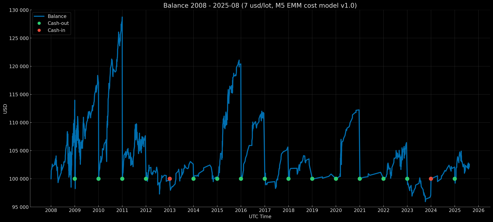

<p align="center">Balance Curve — Fixed Start 100k Mode (Risk 1%, $7 round-turn per standard lot, M5 EMM cost model v1.0) 2008–2025-08</p>

<p align="center"></p>

# Euro Macromechanica (EMM) M5 Engine — Core Baseline (2008–2025-08) — Retail Standard (7 USD/lot, risk 1%) – Fixed Start 100k

## 🧾 Track Description

This track reports backtest results for the M5 EMM strategy under **Retail Standard** transaction costs: **7 USD per round‑turn per 1 standard lot (100 000 EUR)**, equivalent to **≈0.7 pips** on EURUSD, with a **dynamic cost model (spread & slippage) M5 EMM cost model v1.0**. Capitalization mode — **annual reset to 100 000 USD**. Per‑trade risk — **1% of balance at entry**.

- Data range: **Core Baseline 2008-01 – 2025-08** (coverage: **212 months without gaps = 17 years 8 months**)
- Instrument/TF: **EURUSD**, signal logic on **M5**
- **Backtest time zone:** **UTC+0** (all timestamps in UTC+0)
- Cost model: commission, spread, and slippage **included** in PnL
- Base NAV for rebasing: **100 000 USD** (`fixed_start_100k` — annual reset to 100k)

---

## 📈 Year-End Balance `fixed_start_100k`

| Year | balance at year-end (UTC+0) | year-end percentage (rounded to 5 decimals) |
|---|---:|---:|
| 2008 | 113344.92927 | +13.34493% |
| 2009 | 117193.57340 | +17.19357% |
| 2010 | 128741.90561 | +28.74191% |
| 2011 | 107644.82001 | +7.64482% |
| 2012 | 99681.94648 | −0.31805% |
| 2013 | 102600.50940 | +2.60051% |
| 2014 | 100325.44006 | +0.32544% |
| 2015 | 120415.27860 | +20.41528% |
| 2016 | 111651.07150 | +11.65107% |
| 2017 | 105640.57446 | +5.64057% |
| 2018 | 102475.56063 | +2.47556% |
| 2019 | 100838.11156 | +0.83811% |
| 2020 | 112240.45496 | +12.24045% |
| 2021 | 101145.69393 | +1.14569% |
| 2022 | 106421.63098 | +6.42163% |
| 2023 | 97081.07467 | −2.91893% |
| 2024 | 102087.65096 | +2.08765% |
| 2025-08 | 102604.28525 | +2.60429% |

### Result over 17 years 8 months ~ +132134.51 USD / +132.5%

---

## 🧾 Cost Model

- **Commission:** 7 USD per round‑turn per 1 standard lot (100k EUR)  
- **Cost model (commission, spread, slippage) M5 EMM cost model v1.0** — [`docs/cost_model/m5_emm_cost_model_v1.0.csv`](https://github.com/euro-macromechanica-backtest/results/tree/main/docs/cost_model/m5_emm_cost_model_v1.0.csv).
- All costs are **included** in PnL.

> Details of the dynamic cost model are provided in [`Euro Macromechanica (EMM) Backtest — Overview and Methodology`](https://github.com/euro-macromechanica-backtest/results/blob/main/README.md)

---

## 📊 Summary — Retail Standard 7 USD/lot, `fixed_start_100k`, risk 1%

### Full period summary 
- **CAGR 7.18%** with annual volatility **5.52%**; risk/return — **Sharpe 1.29**, **Sortino 2.52**, **MAR (Full period Calmar) 1.38**.
- Drawdowns (on the continuous curve): **EoM MaxDD -5.20%**, TTR — **2 months**; intramonth deeper (**-9.12%**), TTR — **2 months**. Time under water (max episode length): **EoM 26 months**, **Intramonth 22 months**.
- Monthly premium: average/median month **0.59% / 0.32%**.
- Calendar stability: best year **2010 (28.74%)**, worst **2023 (-2.92%)**; “zero” months **37**.
- Sample size: coverage **2008-01—2025-08**, **17 years 8 months**; **212** months; number of trades: **1443**.
- Additional metrics: Share of months “under water”: **52.36%**; Time since MaxDD trough (as of 2025-08): **EoM 202 months / Intramonth 201 months**; VaR/ES (95%): **-1.35% / -2.20%**; VaR/ES (99%): **-2.49% / -3.05%**; Downside deviation (annual): **2.82%**; Tail ratio (P95/P5): **2.27**; Omega (0%/month): **3.57**; Gain-to-Pain (monthly): **3.57**; Skewness: **1.66**; Kurtosis excess: **5.9**; Newey–West t/p for mean monthly return: **t=4.54 / p=0.0000**.
- Stress benchmarks: **EoM MaxDD ≈ -5.20%**, **Intramonth MaxDD ≈ -9.12%**; expectation anchor — **average month ≈ 0.59%**.
> **Summary:** the profile delivers a stable monthly premium with moderate volatility; EoM drawdowns are shallow and recover quickly, intramonth fluctuations are deeper but controlled. Monthly tail risks are compact (VaR/ES), skew is positive (tail/omega), and risk discipline supports predictable growth over the long 2008-01—2025-08 horizon.

### Trades summary
- Sample size: **1443** trades; win rate **73.94%**.
- Profile quality: PF 1.44, Payoff (avg win/|avg loss|) 0.51, Expectancy mean (R) 0.09, Expectancy median (R) 0.34.
- R‑distribution: σ 0.56 R, min -1.03 R, max 0.59 R.
- Averages/medians: avg win 0.38 R, avg loss -0.76 R.
- Worst streaks (sum of R): 5‑tr -3.77 R, 10‑tr -4.71 R, 20‑tr -5.76 R.
- 100‑trade run (EDR): **P50 -3.94 R**, **P95 -2.13 R**.
- Probabilities: Pr(MaxDD ≤ −5R) = **26.06%**, ≤ −7R = **6.94%**, ≤ −10R = **0.80%**.
- Max losing streak in 100 trades: P50 3, P95 5.
- Trade duration: mean 18.00m, median 13.00m, P95 54.00m, wins 13.00m, losses 32.00m.
> **Summary:** the strategy relies on frequent small gains versus rarer, larger losses, hence stability rests on stop discipline and constant per‑trade risk. Streak metrics show manageable drawdowns in blocks and indicate that slumps, when they occur, cluster over short stretches, while the typical block of trades on average pulls equity upward. A right‑skewed outcome distribution and contained tail scenarios support predictability; the holding‑period profile matches careful execution without betting on rare spikes.

### Yearly summary 
- Calendar coverage: **2008–2025-08** (year **2025** is partial).
- Mean/median calendar year: **7.34% / 4.12%**.
- Best/worst year: **2010 (28.74%)**, **2023 (-2.92%)**.
- Drawdowns (within the year, from peak): **EoM -5.20% → 0.00%**, **Intramonth -9.12% → -0.22%**.
- Trading activity: total trades **1443**; yearly averages — win rate **72.10%**, PF **1.84**.
- “Active” yearly metrics (averages): share of active months **81.02%**, return of active months **7.34%**, active volatility (annual) **4.74%**.
- Tail risk by month (yearly average): **VaR95 -1.01% / ES95 -1.36%**.
> **Summary:** by yearly cut, the strategy remains steadily positive through the current partial year, with moderate, quickly repaired within‑year drawdowns. During active periods, risk–return is confident at restrained volatility, while trade quality and tail risks stay contained.

### Monthly returns 
- Coverage: **212** months (2008‑01—2025‑08). Mean/median month: **0.59% / 0.32%** (P10/P90: **-0.94% / 2.15%**).
- Symmetry: positive months **125**, negative **50**, zero **37**.
- Extremes: best month **2010-05 (8.52%)**, worst month **2008-09 (-3.92%)**.
- Runs by month: maximum winning streak — **12** in a row, maximum losing streak — **3** in a row; zero months interrupt runs.
> **Summary**: monthly dynamics are even: a small but repeatable premium, more positive months than negative, no extended losing streaks. Monthly drawdowns look manageable, tails are not protruding — the profile relies on frequent small positives rather than rare bursts.

### DD quantiles 
> Quantiles of DD are shown signed (negative), while xRisk = |DD| is published as a positive magnitude. Therefore, as the percentile rises, DD values approach 0, and xRisk values decrease.
- Observations: **110** points; drawdown episodes: **24**.
- Drawdown depth quantiles (calendar, EoM): **P90 -0.28%**, **P95 -0.25%**, **P99 -0.13%**.
- “Underwater” duration quantiles (months): **P90 14**, **P95 19**.
- Depth quantiles in xRisk scale: **P90 0.28**, **P95 0.25**, **P99 0.13**.
> **Summary:** quantiles indicate compact tails by depth and limited underwater periods by duration; the xRisk scale shows typical extreme drawdowns remain moderate relative to the accepted risk level.

### Rolling 12m
- Windows: **201**; incomplete windows: **0**.
- Window return (12m): mean/median **7.69% / 4.86%** (P10/P90: **-0.31% / 20.44%**); best/worst: **2011-01 (30.18%) / 2013-02 (-3.59%)**.
- Sign shares: positive windows **177**, negative **24**, zero **0**.
- Risk/quality (window medians): volatility (annual) **4.19%**, Sharpe **1.57**, Sortino **2.07**, Calmar **5.05**; window MaxDD **-1.27%**.
- Window composition (medians): active **91.67%** (~11 of 12), positive **58.33%**, negative **16.67%**.
- Tails and asymmetry (medians): **Tail 2.45**, **Omega 3.61**; **VaR95 -0.76% / ES95 -1.06%**.
> **Summary:** rolling 12‑month windows behave predictably: most are positive; risk over 12 months is low; within‑window drawdowns are shallow; tails are compact. Risk–return quality remains stable without reliance on rare spikes — dynamics are carried by the frequency of positive months and careful risk control, yielding a steady, resilient yearly window profile.

### Rolling 36m
- Windows: **177**; incomplete windows: **0**.
- Annualized window return: mean/median **7.02% / 5.55%** (P10/P90: **1.61% / 14.06%**); best/worst window end: **2011-10 (22.32%) / 2014-10 (0.63%)**.
- Shares of windows by sign: positive **177**, negative **0**, zero **0**.
- Risk/quality (window medians): volatility (annual) **4.01%**, Sharpe **1.33**, Sortino **3.09**, Calmar **2.97**; window MaxDD **-2.50%**.
- Window composition (medians): active **86.11%** (~31 of 36), positive **58.33%**, negative **19.44%**.
- Tails and asymmetry (medians): **Tail 2.88**, **Omega 5.07**; **VaR95 -1.01% / ES95 -1.71%**.
> **Summary:** on a three‑year horizon, rolling windows show steady positive returns, low typical volatility, and compact within‑window drawdowns; tail risks are small, and risk–return (Sharpe/Sortino/Calmar) holds firm in the median. The shares of active and positive months within 36‑month windows support a smooth, “pulling” trajectory without dependence on rare bursts.

### Monte Carlo
- Method: **stationary_bootstrap**.
- Horizons: **12, 36, 212 months**.
- Average block lengths: **3, 4, 5, 6, 7, 8, 9, 10, 11, 12 months**.
- Risk per trade: **1%**.
> **Summary:** across all simulated horizons, outcomes appear stable and resilient. On short windows, an endpoint loss is possible, but risk of large monthly drawdowns is low. On the medium horizon, the median outcome improves notably, the probability of finishing negative drops sharply, and drawdowns occur more often yet remain manageable; in xRisk scale, the typical maximum drawdown rises predictably, while severe thresholds are rarely reached and usually only after considerable time. On the longest window, almost all paths finish positive: the annual return distribution “compresses” (the lower tail lifts, the upper tail becomes more moderate), so the endpoint becomes more predictable; along the way, moderate EoM drawdowns are nearly inevitable, while extreme ones remain rare. Cash‑out policies trigger rarely on short horizons, more often on medium‑long ones, increasing the event count materially with horizon length. In sum, simulations confirm a resilient profile: longer horizons raise the probability of a positive outcome and reduce uncertainty, with drawdowns along the way fitting expected bounds.

### Confidence Intervals 
- Interval method: **bootstrap_bca** (BCa — bias‑corrected & accelerated).
- Bootstrap (EoM monthly): **stationary_bootstrap**, average block length **6 months**.
- Bootstrap (intramonth): **stationary_bootstrap**, average block length **5 days**.
- Confidence level: **90%**.
> **Summary:** confidence intervals indicate that key estimates (annual return, volatility, monthly tails) are sufficiently stable: dispersion around them is small, implying the observed “premium” and risk level are reproducible on the historical sample. Intervals for month‑end drawdowns remain moderate, while intramonth intervals are wider, underscoring that intramonth swings are deeper but risk compresses at month‑end. VaR/ES confirm compact tails — extreme monthly outcomes are rare and bounded. Overall, CIs point to a predictable profile with low estimate uncertainty; conclusions pertain to the historical distribution (regime shifts and out‑of‑sample risks are not covered by CIs).

### Cash flows (USD)
- Rebasing events: **17**.
- Cash flows: **cash‑out** (payouts) **132 767.19** — 15 events; **cash‑in** (deposits) **3 236.98** — 2 events.
- Extremes: maximum cash‑out — **28 741.91** for **2010** (EoY 2010-12); maximum cash‑in — **2 918.93** for **2023** (EoY 2023-12).
- **Profit for the last year 2025-08** 2604.29.
> **Summary:** net profit ~ **132 134.51**.

### Conclusion
Over the full horizon of 17 years 8 months, the profile behaves smoothly and predictably: the monthly “premium” is small but repeatable; drawdowns by month‑end are shallow and recover quickly, while intramonth swings are more pronounced yet remain controlled. Trade statistics pull performance via a high share of winning trades under disciplined loss control — the “frequent small positives vs. rarer, larger negatives” pattern works when per‑trade risk is stable. By year, the picture avoids extremes: positive periods dominate, no long losing streaks; rolling 12‑ and 36‑month windows confirm stable risk–return. Monte Carlo across horizons shows distribution compression and a rising chance of finishing positive as horizon lengthens, while confidence intervals for key metrics are narrow — estimates are stable and not reliant on one‑off spikes. Rebasing cash flows sum to a positive amount, aligning with the overall dynamics: capital is “pulled” mainly by the frequency of positive periods and careful risk management, not by lucky one‑off surges.

### Full methodology and metric definitions in [`docs/metrics_methodology/metrics_schema.json`](https://github.com/euro-macromechanica-backtest/results/tree/main/docs/metrics_methodology/metrics_schema.json) / [`docs/metrics_methodology/metrics_schema.md`](https://github.com/euro-macromechanica-backtest/results/tree/main/docs/metrics_methodology/metrics_schema.md).

### Metrics files

```
metrics/
  confidence_intervals.csv
  dd_quantiles_full_period.csv
  monthly_returns.csv
  monte_carlo_summary.csv
  full_period_summary.csv
  rebasing_applied.csv
  rolling_12m.csv
  rolling_36m.csv
  trades_full_period_summary.csv
  yearly_summary.csv
```

### Metrics were computed based on non‑public files `trades_YYYY.csv` and `balance_YYYY.csv`

---

## 📎 Links

- **Euro Macromechanica (EMM) Backtest — Overview and Methodology**: repository root **[README.md](https://github.com/euro-macromechanica-backtest/results/blob/main/README.md)**
- Cost model (commission, spread, slippage) M5 EMM cost model v1.0 — [`docs/cost_model/m5_emm_cost_model_v1.0.csv`](https://github.com/euro-macromechanica-backtest/results/tree/main/docs/cost_model/m5_emm_cost_model_v1.0.csv)
- General information about the contents of `results`: **[results/README.md](https://github.com/euro-macromechanica-backtest/results/blob/main/results/README.md)**
- Inputs and provenance: **[INPUTS-PIN.md](https://github.com/euro-macromechanica-backtest/results/blob/main/docs/INPUTS-PIN.md)** / **[INPUTS-PROVENANCE.md](https://github.com/euro-macromechanica-backtest/data-hub/blob/main/INPUTS-PROVENANCE.md)**
- Full audit guide: **[docs/AUDIT.md](https://github.com/euro-macromechanica-backtest/results/blob/main/docs/AUDIT.md)**
- Data quality policy: **[data_quality_policy/policy_v1.0.md](https://github.com/euro-macromechanica-backtest/results/blob/main/data_quality_policy/policy_v1.0.md)**
- Metric calculation methodology: **[docs/metrics_methodology/metrics_schema.md](https://github.com/euro-macromechanica-backtest/results/tree/main/docs/metrics_methodology/metrics_schema.md)** / **[docs/metrics_methodology/metrics_schema.json](https://github.com/euro-macromechanica-backtest/results/tree/main/docs/metrics_methodology/metrics_schema.json)**
