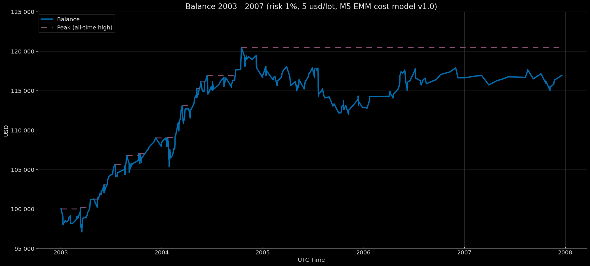

# Euro Macromechanica (EMM) M5 Engine — Extended Baseline (2003–2007) — Retail Rebate (5 USD/lot, risk 1%) – Compounding EoY-SoY Base 100k

<p align="center">Balance Curve — Compounding EoY-SoY Base 100k Mode (Risk 1%, $5 round-turn per standard lot, M5 EMM cost model v1.0) 2003–2007</p>

<p align="center"></p>

## 🧾 Track Description

This track reports backtest results for the M5 EMM strategy under **Retail Rebate** transaction costs: **5 USD per round‑turn per 1 standard lot (100 000 EUR)**, equivalent to **≈0.5 pips** on EURUSD, with a **dynamic cost model (spread & slippage) M5 EMM cost model v1.0**. Capitalization mode — **compounding across the entire period (EoY→SoY)**. Balance carries over from year to year. **Ending balance → initial balance** of the next year. Initial balance at the start of the period — 100k. Per‑trade risk — **1% of balance at entry**.

- Data range: **Extended Baseline 2003-01 – 2007-12** (coverage: **60 months without gaps = 5 years**)
- Instrument/TF: **EURUSD**, signal logic on **M5**
- **Backtest time zone:** **UTC+0** (all timestamps in UTC+0)
- Cost model: commission, spread, and slippage **included** in PnL

---

## 📈 Year-End Balance `compounding_eoy_soy_base_100k`

| Year | balance at year-end (UTC+0) | year-end percentage (rounded to 5 decimals) |
|---|---:|---:|
| 2003 | 108452.10914 | +8.45211% |
| 2004 | 117056.14327 | +7.93349% |
| 2005 | 112857.17589 | -3.58714% |
| 2006 | 116611.50821 | +3.32662% |
| 2007 | 116937.90296 | +0.27990% |

### Result over 5 years ~ +16937.90 USD / +16.94%

---

## 🧾 Cost Model

- **Commission:** 5 USD per round‑turn per 1 standard lot (100k EUR)  
- **Cost model (commission, spread, slippage) M5 EMM cost model v1.0** — [`docs/cost_model/m5_emm_cost_model_v1.0.csv`](https://github.com/euro-macromechanica-backtest/results/tree/main/docs/cost_model/m5_emm_cost_model_v1.0.csv).
- All costs are **included** in PnL.

> Details of the dynamic cost model are provided in [`Euro Macromechanica (EMM) Backtest — Overview and Methodology`](https://github.com/euro-macromechanica-backtest/results/blob/main/README.md)

---

## 📊 Summary — Retail Rebate 5 USD/lot, `compounding_eoy_soy_base_100k`, risk 1%

### Full period summary 
- **CAGR 3.18%** with annual volatility **3.81%**; risk–return profile — **Sharpe 0.84**, **Sortino 1.45**, **MAR (Full period Calmar) 0.62**.
- Drawdowns (on the continuous curve): **EoM MaxDD -5.10%**; recovery time — **not recovered (n/a)**; deeper intramonth (**-7.08%**), **TTR — not recovered (n/a)**. Time underwater: **EoM 38 months**, **Intramonth 38 months**.
- Monthly premium: mean/median month **0.27% / 0.22%**.
- Calendar stability: best year **2003 (8.45%)**, worst **2005 (-3.59%)**; “zero” months **4**.
- Sample size: coverage **5** years, **60** months; number of trades: **342**.
- Stress markers: **EoM MaxDD ≈ -5.10%**, **Intramonth MaxDD ≈ -7.08%**; expectation benchmark — **average month ≈ 0.27%**.
> **Summary:** a conservative profile: low volatility, limited drawdowns, and a stable modest monthly premium; resilience is delivered by the frequency of positive periods and disciplined risk management.

### Trades summary
- Sample size: **342** trades; win rate **70.47%**.
- Profile quality: **Profit factor 1.22**, **Payoff 0.51** (avg win/|avg loss|).
- Per‑trade expectancy: **mean 0.05 R**, **median 0.28 R**.
- R‑distribution: **σ ≈ 0.56 R**, **min -1.02 R**, **max 0.57 R**.
- Average outcomes: **avg win 0.37 R**, **avg loss -0.73 R**.
> **Summary:** positive expected value with a high share of winning trades and payoff below 1 — a “frequent small wins, rarer larger losses” profile; resilience is supported by risk‑management discipline.

### Yearly summary
- Coverage: **5** years (2003–2007). Mean/median calendar year: **3.28% / 3.33%**.
- Best year: **2003 (8.45%)**; worst year: **2005 (-3.59%)**.
- Drawdowns (within the year, from peak): **EoM -4.38% → -1.04%**, **Intramonth -5.20% → -2.21%**.
- Trading activity: total trades across years **342**; yearly averages — win rate **70.03%**, PF **1.22**.
> **Summary:** by year, the picture remains even: the average year is steadily positive without extreme spikes or slumps; drawdowns stay within a few percent and remain controlled. Trading metrics (≈70% winning trades and PF ~1.22) confirm stability year over year.

### Monthly returns
- Coverage: **60** months (2003–2007). Mean/median month: **0.27% / 0.22%** (P10/P90: **−1.06% / 1.74%**).
- Symmetry: positive months **37**, negative **19**, zero **4**.
- Extremes: best month **2004-02 (3.00%)**, worst month **2005-07 (−2.84%)**.
- Runs by month: maximum winning streak — **10** consecutive months, maximum losing streak — **4** consecutive months; months with zero return interrupt any streak.
> **Summary:** a small but stable monthly premium; the prevalence of positive months and the absence of long losing streaks align with a conservative profile.

### Conclusion
The track appears steady‑moderate: the equity curve rises evenly with low volatility; drawdowns are shallow and controlled, although recovery of prior peaks can take time and periods “underwater” can be prolonged. The monthly premium is small but stable, which also shows in the yearly dynamics without extreme spikes or slumps. Trading statistics support this character: a high share of winning trades with a modest payoff yields positive expectancy provided disciplined risk management and loss control. Monthly results are predominantly positive with no extended losing streaks — thereby the profile maintains a smooth trajectory and predictable risk–return characteristics.

### Full methodology and metric definitions in [`docs/metrics_methodology/metrics_schema.json`](https://github.com/euro-macromechanica-backtest/results/tree/main/docs/metrics_methodology/metrics_schema.json) / [`docs/metrics_methodology/metrics_schema.md`](https://github.com/euro-macromechanica-backtest/results/tree/main/docs/metrics_methodology/metrics_schema.md).

### Metrics files

```
metrics/
  monthly_returns.csv
  full_period_summary.csv
  yearly_summary.csv
  trades_full_period_summary.csv
```

### Metrics were computed based on non‑public files `trades_YYYY.csv` and `balance_YYYY.csv`

---

## 📎 Links

- **Euro Macromechanica (EMM) Backtest — Overview and Methodology**: repository root **[README.md](https://github.com/euro-macromechanica-backtest/results/blob/main/README.md)**
- Cost model (commission, spread, slippage) M5 EMM cost model v1.0 — [`docs/cost_model/m5_emm_cost_model_v1.0.csv`](https://github.com/euro-macromechanica-backtest/results/tree/main/docs/cost_model/m5_emm_cost_model_v1.0.csv)
- General information about the contents of `results`: **[results/README.md](https://github.com/euro-macromechanica-backtest/results/blob/main/results/README.md)**
- Inputs and provenance: **[INPUTS-PIN.md](https://github.com/euro-macromechanica-backtest/results/blob/main/docs/INPUTS-PIN.md)** / **[INPUTS-PROVENANCE.md](https://github.com/euro-macromechanica-backtest/data-hub/blob/main/INPUTS-PROVENANCE.md)**
- Full audit guide: **[docs/AUDIT.md](https://github.com/euro-macromechanica-backtest/results/blob/main/docs/AUDIT.md)**
- Data quality policy: **[data_quality_policy/policy_v1.0.md](https://github.com/euro-macromechanica-backtest/results/blob/main/data_quality_policy/policy_v1.0.md)**
- Metric calculation methodology: **[docs/metrics_methodology/metrics_schema.md](https://github.com/euro-macromechanica-backtest/results/tree/main/docs/metrics_methodology/metrics_schema.md)** / **[docs/metrics_methodology/metrics_schema.json](https://github.com/euro-macromechanica-backtest/results/tree/main/docs/metrics_methodology/metrics_schema.json)**
