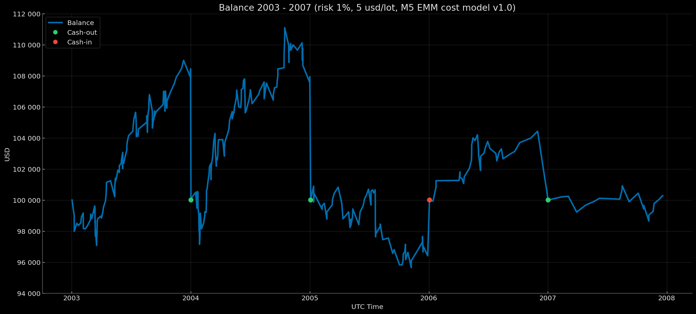

# Euro Macromechanica (EMM) M5 Engine — Extended Baseline (2003–2007) — Retail Rebate (5 USD/lot, risk 1%) – Fixed Start 100k

<p align="center">Balance Curve — Fixed Start 100k Mode (Risk 1%, $5 round-turn per standard lot, M5 EMM cost model v1.0) 2003–2007</p>

<p align="center"></p>

## 🧾 Описание трека

Этот трек фиксирует результаты бэктеста стратегии M5 EMM при **Retail Rebate** комиссионных издержках: **5 USD за round-turn на 1 стандартный лот (100 000 EUR)**, эквивалент **≈0.5 pips** на EURUSD, **динамическая модель издержек (spread & slippage) M5 EMM cost model v1.0**. Режим капитализации — **ежегодный ресет к 100 000 USD**. Риск на сделку — **1% от баланса на момент входа**.

- Диапазон данных: **Extended Baseline 2003-01 – 2007-12** (покрытие: **60 мес. без дыр = 5 лет**)
- Инструмент/TF: **EURUSD**, сигнальная логика на **M5**
- **Часовой пояс бэктеста:** **UTC+0** (все временные метки в UTC+0)
- Модель издержек: комиссия, spread и slippage **включены** в PnL
- Базовый NAV для ребейза: **100 000 USD** (`fixed_start_100k` — ежегодный ресет к 100k)

---

## 📈 Баланс по закрытию года `fixed_start_100k`

| Год | баланс на момент закрытия года (UTC+0) | процент на момент закрытия года (округление — 5 знаков после запятой) |
|---|---:|---:|
| 2003 | 108452.10914 | +8.45211% |
| 2004 | 107933.27301 | +7.93327% |
| 2005 | 96409.04960 | -3.59095% |
| 2006 | 103323.74153 | +3.32374% |
| 2007 | 100279.43279 | +0.27943% |

### Результат за 5 лет ~ +16,397.60 USD / +16.40%

---

## 🧾 Модель издержек

- **Комиссия:** 5 USD за round-turn на 1 стандартный лот (100k EUR)  
- **Модель издержек (commission, spread, slippage) M5 EMM cost model v1.0** — [`docs/cost_model/m5_emm_cost_model_v1.0.csv`](https://github.com/euro-macromechanica-backtest/results/tree/main/docs/cost_model/m5_emm_cost_model_v1.0.csv).
- Все издержки **включены** в PnL.

> Подробности о динамической модели издержек описаны в [`Обзор и Методология Euro Macromechanica (EMM) Backtest`](https://github.com/euro-macromechanica-backtest/results/blob/main/README.ru.md)

---

## 📊 Краткий обзор — Retail Rebate 5 USD/lot, `fixed_start_100k`, risk 1%

### Full period summary
- **CAGR 3.18%** при годовой волатильности **3.81%**; соотношение риск/доход — **Sharpe 0.84**, **Sortino 1.44**, **MAR (Full period Calmar) 0.62**.
- Просадки (по непрерывной кривой): **EoM MaxDD −5.11%**; время восстановления — **не восстановилось (n/a)**; внутримесячно глубже (**−7.08%**), **TTR — не восстановилось (n/a)**. Длительность под водой: **EoM 38 мес.**, **Intramonth 38 мес.**.
- Месячная премия: средний/медианный месяц **0.27% / 0.22%**.
- Календарная устойчивость: лучший год **2003 (8.45%)**, худший **2005 (−3.59%)**; «нулевых» месяцев **4**.
- Объём выборки: покрыто **5** лет; количество сделок: **342**.
- Стресс-ориентиры: **EoM MaxDD ≈ −5.11%**, **Intramonth MaxDD ≈ −7.08%**; ориентир ожиданий — **средний месяц ≈ 0.27%**.
**Итог.** Профиль выглядит умеренно-устойчивым — кривая капитала растёт ровно при низкой изменчивости, просадки неглубокие и управляемые, хотя восстановление пиков может затянуться; месячная «премия» небольшая, но стабильная, а календарные результаты без крайностей.

### Trades summary
- Объём выборки: **342** сделок; win rate **70.47%**.
- Качество профиля: **Profit factor 1.22**, **Payoff 0.51** (avg win/|avg loss|).
- Ожидание на сделку: **mean 0.05 R**, **median 0.28 R**.
- Распределение R: **σ ≈ 0.56 R**, **min -1.02 R**, **max 0.57 R**.
- Средние результаты: **avg win 0.37 R**, **avg loss -0.73 R**.
> **Итог:** положительная ожидаемая доходность при высокой доле прибыльных сделок и payoff ниже 1 указывает на модель «частые небольшие выигрыши vs редкие более крупные убытки». Устойчивость профиля зависит от жёсткого контроля потерь и дисциплины исполнения.

### Yearly summary
- Покрытие: **5** лет (2003–2007). Средний/медианный календарный год: **3.28% / 3.32%**.
- Лучший год: **2003 (8.45%)**; худший год: **2005 (-3.59%)**.
- Просадки (внутри года, от пика): **EoM -4.38% → -1.04%**, **Intramonth -5.20% → -2.21%**.
- Торговая активность: всего сделок за годы **342**; средние по годам — win rate **70.03%**, PF **1.22**.
> **Итог:** на годовом горизонте результаты умеренные и ровные: средний календарный результат стабилен, а внутригодовые просадки остаются контролируемыми; торговые метрики поддерживают картину устойчивости без экстремумов.

### Monthly returns
- Покрытие: **60** месяцев (2003–2007). Средний/медианный месяц: **0.27% / 0.22%** (P10/P90: **−1.06% / 1.74%**).
- Симметрия: положительных месяцев **37**, отрицательных **19**, нулевых **4**.
- Экстремальные значения: лучший месяц **2004-02 (3.00%)**, худший месяц **2005-07 (−2.84%)**.
- Серии по месяцам: максимальная серия выигрышей — **10** месяцев подряд, максимальная серия убытков — **4** месяца подряд; месяцы с нулевой доходностью прерывают любую серию.
> **Итог:** небольшая и стабильная месячная «премия»; устойчивость поддерживается высокой долей положительных месяцев и отсутствием длительных убыточных серий.

### Cash flows (USD)
- Покрытие: событий **4** за годы 2003–2006.
- Денежные потоки: **внесения (cash‑in)** 3,590.95 (1 событие), **снятия (cash‑out)** 19,709.12 (3 события) 
- **Прибыль за последний год** 279.43.
> **Итог:** чистая прибыль ~ **16,397.60**.

### Вывод
В целом трек показывает ровный рост при низкой изменчивости: просадки неглубокие, хотя восстановление пиков затягивается и «под водой» можно находиться долго; месячная премия небольшая, но стабильная, а годовые результаты без крайностей. Торговая статистика указывает на модель «частые небольшие выигрыши при payoff ниже 1», то есть положительное ожидание достигается за счёт высокой доли прибыльных сделок при дисциплине риск-менеджмента и контроле потерь. По месячной динамике преобладают положительные месяцы без длительных убыточных серий. По журналу ребейзинга отражён положительный результат — был снят чистый профит, что согласуется с общей картиной устойчивого поведения профиля.

### Полная методология и определения метрик в [`docs/metrics_methodology/metrics_schema.json`](https://github.com/euro-macromechanica-backtest/results/tree/main/docs/metrics_methodology/metrics_schema.json) / [`docs/metrics_methodology/metrics_schema.md`](https://github.com/euro-macromechanica-backtest/results/tree/main/docs/metrics_methodology/metrics_schema.md).

### Файлы метрик

```
metrics/
  monthly_returns.csv
  full_period_summary.csv
  rebasing_applied.csv
  yearly_summary.csv
  trades_full_period_summary.csv
```

### Метрики рассчитывались на основе непубличных файлов `trades_YYYY.csv` и `balance_YYYY.csv`

---

## 📎 Ссылки

- **Обзор и Методология Euro Macromechanica (EMM) Backtest**: корневой **[README.ru.md](https://github.com/euro-macromechanica-backtest/results/blob/main/README.ru.md)**
- Модель издержек (commission, spread, slippage) M5 EMM cost model v1.0 — [`docs/cost_model/m5_emm_cost_model_v1.0.csv`](https://github.com/euro-macromechanica-backtest/results/tree/main/docs/cost_model/m5_emm_cost_model_v1.0.csv)
- Общая информация о содержимом в `results`: **[results/README.ru.md](https://github.com/euro-macromechanica-backtest/results/blob/main/results/README.ru.md)**
- Входные данные и происхождение: **[INPUTS-PIN.ru.md](https://github.com/euro-macromechanica-backtest/results/blob/main/docs/INPUTS-PIN.ru.md)** / **[INPUTS-PROVENANCE.ru.md](https://github.com/euro-macromechanica-backtest/data-hub/blob/main/INPUTS-PROVENANCE.ru.md)**
- Полная инструкция по аудиту: **[docs/AUDIT.ru.md](https://github.com/euro-macromechanica-backtest/results/blob/main/docs/AUDIT.ru.md)**
- Политика качества данных: **[data_quality_policy/policy_v1.0.ru.md](https://github.com/euro-macromechanica-backtest/results/blob/main/data_quality_policy/policy_v1.0.ru.md)**
- Методология расчёта метрик: **[docs/metrics_methodology/metrics_schema.md](https://github.com/euro-macromechanica-backtest/results/tree/main/docs/metrics_methodology/metrics_schema.md)** / **[docs/metrics_methodology/metrics_schema.json](https://github.com/euro-macromechanica-backtest/results/tree/main/docs/metrics_methodology/metrics_schema.json)**