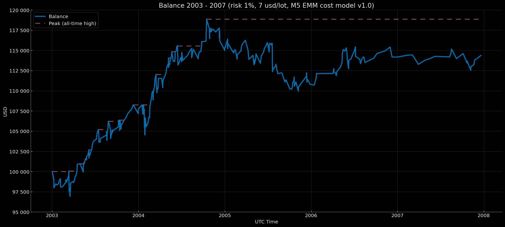

<p align="center">Balance Curve — Compounding EoY-SoY Base 100k Mode (Risk 1%, $7 round-turn per standard lot, M5 EMM cost model v1.0) 2003–2007</p>

<p align="center"></p>

# Euro Macromechanica (EMM) M5 Engine — Extended Baseline (2003–2007) — Retail Standard (7 USD/lot, risk 1%) – Compounding EoY-SoY Base 100k

## 🧾 Описание трека

Этот трек фиксирует результаты бэктеста стратегии M5 EMM при **Retail Standard** комиссионных издержках: **7 USD за round-turn на 1 стандартный лот (100 000 EUR)**, эквивалент **≈0.7 pips** на EURUSD, **динамическая модель издержек (spread & slippage) M5 EMM cost model v1.0**. Режим капитализации — **компаундинг на всём периоде (EoY→SoY)**. Капитал переходит из года в год. **Ending balance → initial balance** следующего года. Старт initial balance в начале периода — 100k. Риск на сделку — **1% от баланса на момент входа**.

- Диапазон данных: **Extended Baseline 2003-01 – 2007-12** (покрытие: **60 мес. без дыр = 5 лет**)
- Инструмент/TF: **EURUSD**, сигнальная логика на **M5**
- **Часовой пояс бэктеста:** **UTC+0** (все временные метки в UTC+0)
- Модель издержек: комиссия, spread и slippage **включены** в PnL

---

## 📈 Баланс по закрытию года `compounding_eoy_soy_base_100k`

| Год | баланс на момент закрытия года (UTC+0) | процент на момент закрытия года (округление — 5 знаков после запятой) |
|---|---:|---:|
| 2003 | 107707.83975 | +7.70784% |
| 2004 | 115385.68506 | +7.12840% |
| 2005 | 110772.96595 | −3.99765% |
| 2006 | 114174.88422 | +3.07107% |
| 2007 | 114365.17970 | +0.16667% |

### Результат за 5 лет ~ +14365.18 USD / +14.37%

---

## 🧾 Модель издержек

- **Комиссия:** 7 USD за round-turn на 1 стандартный лот (100k EUR)  
- **Модель издержек (commission, spread, slippage) M5 EMM cost model v1.0** — [`docs/cost_model/m5_emm_cost_model_v1.0.csv`](https://github.com/euro-macromechanica-backtest/results/tree/main/docs/cost_model/m5_emm_cost_model_v1.0.csv).
- Все издержки **включены** в PnL.

> Подробности о динамической модели издержек описаны в [`Обзор и Методология Euro Macromechanica (EMM) Backtest`](https://github.com/euro-macromechanica-backtest/results/blob/main/README.ru.md)

---

## 📊 Краткий обзор — Retail Standard 7 USD/lot, `compounding_eoy_soy_base_100k`, risk 1%

### Full period summary
- **CAGR 2.72%** при годовой волатильности **3.79%**; соотношение риск/доход — **Sharpe 0.73**, **Sortino 1.24**, **MAR (Full period Calmar) 0.49**.
- Просадки (по непрерывной кривой): **EoM MaxDD -5.54%**; время восстановления — **не восстановилось (n/a)**; внутримесячно глубже (**-7.50%**), **TTR — не восстановилось (n/a)**. Длительность под водой: **EoM 38 мес.**, **Intramonth 38 мес.**.
- Месячная премия: средний/медианный месяц **0.23% / 0.21%**.
- Календарная устойчивость: лучший год **2003 (7.71%)**, худший **2005 (-4.00%)**; «нулевых» месяцев **4**.
- Объём выборки: покрыто **5** лет, **60** мес.; количество сделок: **342**.
- Стресс‑ориентиры: **EoM MaxDD ≈ -5.54%**, **Intramonth MaxDD ≈ -7.50%**; ориентир ожиданий — **средний месяц ≈ 0.23%**.
> **Итог:** аккуратный профиль с низкой волатильностью, неглубокими просадками и устойчивой небольшой месячной премией; результат поддерживается частотой положительных периодов при требуемой дисциплине риск‑менеджмента.

### Trades summary
- Объём выборки: **342** сделок; win rate **69.88%**.
- Качество профиля: **Profit factor 1.19**, **Payoff 0.51** (avg win/|avg loss|).
- Ожидание на сделку: **mean 0.04 R**, **median 0.28 R**.
- Распределение R: **σ ≈ 0.56 R**, **min -1.03 R**, **max 0.57 R**.
- Средние результаты: **avg win 0.37 R**, **avg loss -0.72 R**.
> **Итог:** положительная матожидаемая доходность при высоком проценте прибыльных сделок и payoff ниже 1 — профиль «частые небольшие выигрыши, редкие более крупные убытки»; устойчивость обеспечивается дисциплиной риск‑менеджмента и контролем размера потерь.

### Yearly summary
- Покрытие: **5** лет (2003–2007). Средний/медианный календарный год: **2.82% / 3.07%**.
- Лучший год: **2003 (7.71%)**; худший год: **2005 (-4.00%)**.
- Просадки (внутри года, от пика): **EoM -4.71% → -1.08%**, **Intramonth -5.54% → -2.22%**.
- Торговая активность: всего сделок за годы **342**; средние по годам — win rate **69.55%**, PF **1.19**.
> **Итог:** на годовом горизонте профиль остаётся ровным: средний календарный результат стабилен, внутригодовые просадки ограничены, а торговые метрики подтверждают преобладание небольших, но частых положительных периодов.

### Monthly returns
- Покрытие: **60** месяцев (2003–2007). Средний/медианный месяц: **0.23% / 0.21%** (P10/P90: **-1.09% / 1.64%**).
- Симметрия: положительных месяцев **37**, отрицательных **19**, нулевых **4**.
- Экстремальные значения: лучший месяц **2004-02 (2.92%)**, худший месяц **2005-07 (-2.92%)**.
- Серии по месяцам: максимальная серия выигрышей — **10** месяцев подряд, максимальная серия убытков — **4** месяца подряд; месяцы с нулевой доходностью прерывают любую серию.
> **Итог:** небольшая, но стабильная премия при умеренных хвостах; устойчивость поддерживается высокой долей положительных месяцев и отсутствием длительных убыточных серий.

### Вывод
Трек выглядит устойчиво-умеренным: кривая капитала растёт ровно при низкой изменчивости, просадки неглубокие, хотя восстановление пиков может затягиваться; месячная «премия» небольшая, но стабильная и поддерживается высокой долей положительных периодов без длинных серий убытков. По годам динамика без крайностей: лучшие и худшие отрезки укладываются в комфортные пределы, а внутригодовые провалы остаются контролируемыми. Торговая статистика подтверждает модель «частые небольшие выигрыши при скромном payoff» — за счёт дисциплины риск-менеджмента и контроля потерь это даёт положительное ожидаемое значение, пригодное для аккуратного наращивания капитала во всём горизонте.

### Полная методология и определения метрик в [`docs/metrics_methodology/metrics_schema.json`](https://github.com/euro-macromechanica-backtest/results/tree/main/docs/metrics_methodology/metrics_schema.json) / [`docs/metrics_methodology/metrics_schema.md`](https://github.com/euro-macromechanica-backtest/results/tree/main/docs/metrics_methodology/metrics_schema.md).

### Файлы метрик

```
metrics/
  monthly_returns.csv
  full_period_summary.csv
  yearly_summary.csv
  trades_full_period_summary.csv
```

### Метрики рассчитывались на основе непубличных файлов `trades_YYYY.csv` и `balance_YYYY.csv`

---

## 📎 Ссылки

- **Обзор и Методология Euro Macromechanica (EMM) Backtest**: корневой **[README.ru.md](https://github.com/euro-macromechanica-backtest/results/blob/main/README.ru.md)**
- Модель издержек (commission, spread, slippage) M5 EMM cost model v1.0 — [`docs/cost_model/m5_emm_cost_model_v1.0.csv`](https://github.com/euro-macromechanica-backtest/results/tree/main/docs/cost_model/m5_emm_cost_model_v1.0.csv)
- Общая информация о содержимом в `results`: **[results/README.ru.md](https://github.com/euro-macromechanica-backtest/results/blob/main/results/README.ru.md)**
- Входные данные и происхождение: **[INPUTS-PIN.ru.md](https://github.com/euro-macromechanica-backtest/results/blob/main/docs/INPUTS-PIN.ru.md)** / **[INPUTS-PROVENANCE.ru.md](https://github.com/euro-macromechanica-backtest/data-hub/blob/main/INPUTS-PROVENANCE.ru.md)**
- Полная инструкция по аудиту: **[docs/AUDIT.ru.md](https://github.com/euro-macromechanica-backtest/results/blob/main/docs/AUDIT.ru.md)**
- Политика качества данных: **[data_quality_policy/policy_v1.0.ru.md](https://github.com/euro-macromechanica-backtest/results/blob/main/data_quality_policy/policy_v1.0.ru.md)**
- Методология расчёта метрик: **[docs/metrics_methodology/metrics_schema.md](https://github.com/euro-macromechanica-backtest/results/tree/main/docs/metrics_methodology/metrics_schema.md)** / **[docs/metrics_methodology/metrics_schema.json](https://github.com/euro-macromechanica-backtest/results/tree/main/docs/metrics_methodology/metrics_schema.json)**