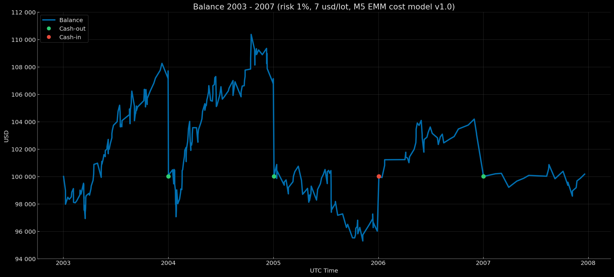

# Euro Macromechanica (EMM) M5 Engine — Extended Baseline (2003–2007) — Retail Standard (7 USD/lot, risk 1%) – Fixed Start 100k

<p align="center">Balance Curve — Fixed Start 100k Mode (Risk 1%, $7 round-turn per standard lot, M5 EMM cost model v1.0) 2003–2007</p>

<p align="center"></p>

## 🧾 Track Description

This track reports backtest results for the M5 EMM strategy under **Retail Standard** transaction costs: **7 USD per round‑turn per 1 standard lot (100 000 EUR)**, equivalent to **≈0.7 pips** on EURUSD, with a **dynamic cost model (spread & slippage) M5 EMM cost model v1.0**. Capitalization mode — **annual reset to 100 000 USD**. Per‑trade risk — **1% of balance at entry**.

- Data range: **Extended Baseline 2003-01 – 2007-12** (coverage: **60 months without gaps = 5 years**)
- Instrument/TF: **EURUSD**; signal logic on **M5**
- **Backtest time zone:** **UTC+0** (all timestamps in UTC+0)
- Cost model: commission, spread, and slippage **included** in PnL
- Base NAV for rebasing: **100 000 USD** (`fixed_start_100k` — annual reset to 100k)

---

## 📈 Year-End Balance `fixed_start_100k`

| Year | balance at year-end (UTC+0) | year-end percentage (rounded to 5 decimals) |
|---|---:|---:|
| 2003 | 107707.83975 | +7.70784% |
| 2004 | 107140.76118 | +7.14076% |
| 2005 | 96006.44707 | −3.99355% |
| 2006 | 103070.43943 | +3.07044% |
| 2007 | 100169.26886 | +0.16927% |

### Result over 5 years ~ +14094.76 USD / +14.09%

---

## 🧾 Cost Model

- **Commission:** 7 USD per round‑turn per 1 standard lot (100k EUR)  
- **Cost model (commission, spread, slippage) M5 EMM cost model v1.0** — [`docs/cost_model/m5_emm_cost_model_v1.0.csv`](https://github.com/euro-macromechanica-backtest/results/tree/main/docs/cost_model/m5_emm_cost_model_v1.0.csv).
- All costs are **included** in PnL.

> Details of the dynamic cost model are provided in [`Euro Macromechanica (EMM) Backtest — Overview and Methodology`](https://github.com/euro-macromechanica-backtest/results/blob/main/README.md)

---

## 📊 Summary — Retail Standard 7 USD/lot, `fixed_start_100k`, risk 1%

### Full period summary
- **CAGR 2.72%** with annual volatility **3.79%**; risk–return profile — **Sharpe 0.73**, **Sortino 1.24**, **MAR (full‑period Calmar) 0.49**.
- Drawdowns (on the continuous curve): **EoM MaxDD −5.54%**; recovery time — **not recovered (n/a)**; deeper intramonth (**−7.50%**), **TTR — not recovered (n/a)**. Time underwater: **EoM 38 months**, **Intramonth 38 months**.
- Monthly premium: mean/median month **0.23% / 0.21%**.
- Calendar stability: best year **2003 (7.71%)**, worst **2005 (−3.99%)**; “zero” months **4**.
- Sample size: coverage **5** years, **60** months; number of trades: **342**.
- Risk‑management stress marks: **EoM MaxDD ≈ −5.54%**, **Intramonth MaxDD ≈ −7.50%**; expectation benchmark — **average month ≈ 0.23%**.
> **Summary:** moderate growth with low volatility. Drawdowns are shallow, yet the high watermark was not recovered within the observation window; time underwater can extend to ~3 years. Intramonth swings are deeper than EoM but remain in single‑digit percentages. Returns are driven by steady, small monthly gains without extreme spikes.

### Trades summary
- Sample size: **342** trades; win rate **69.88%**.
- Profile quality: **Profit factor 1.19**, **Payoff 0.51** (avg win/|avg loss|).
- Per‑trade expectancy: **mean 0.04 R**, **median 0.28 R**.
- R‑distribution: **σ ≈ 0.56 R**, **min -1.03 R**, **max 0.57 R**.
- Average outcomes: **avg win 0.37 R**, **avg loss -0.72 R**.
> **Summary:** positive expectancy achieved through a high share of winning trades with **payoff < 1** (average profit smaller than average loss). The profile is close to “frequent small wins vs. less frequent larger losses”; stability is maintained by hit rate and per‑trade risk control.

### Yearly summary
- Coverage: **5** years (2003–2007). Mean/median calendar year: **2.82% / 3.07%**.
- Best year: **2003 (7.71%)**; worst year: **2005 (-3.99%)**.
- Drawdowns (within the year, from peak): **EoM -4.70% → -1.08%**, **Intramonth -5.54% → -2.23%**.
- Trading activity: total trades across years **342**; yearly averages — win rate **69.55%**, PF **1.19**.
> **Summary:** at the yearly horizon, results are moderate and even: the average calendar year is ~**2.82%** with limited in‑year drawdowns (typically single digits). Best and worst years remain within moderate bounds; the positive average is sustained by an acceptable frequency of profitable months and controlled drawdown depth.

### Monthly returns
- Coverage: **60** months (2003–2007). Mean/median month: **0.23% / 0.21%** (P10/P90: **-1.09% / 1.64%**).
- Symmetry: positive months **37**, negative **19**, zero **4**.
- Extremes: best month **2004-02 (2.92%)**, worst month **2005-07 (-2.92%)**.
- Runs by month: maximum winning streak — **10** consecutive months, maximum losing streak — **4** consecutive months; months with zero return interrupt any streak.
> **Summary:** the behavior of monthly returns is consistent with a profile featuring a moderate premium and bounded tails (P10/P90 in a narrow range). Stability is supported by the frequency of positive months and the absence of prolonged losing streaks.

### Cash flows (USD)
- Coverage: **4** events across 2003–2006.
- Cash flows: **deposits (cash‑in)** 3,993.55 (1 event), **withdrawals (cash‑out)** 17,919.04 (3 events)
- **Profit for the last year** 169.27.
> **Summary:** net profit ~ **14094.76**.

### Conclusion
Overall, the track shows moderate, even growth with low variability: drawdowns are shallow, although recovery of peaks can be protracted; the monthly premium is modest yet stable; yearly dynamics avoid extremes. Performance is sustained by a high share of profitable periods alongside a modest **payoff**, which calls for disciplined risk management. Intramonth fluctuations are deeper but remain controlled.

### Full methodology and metric definitions in [`docs/metrics_methodology/metrics_schema.json`](https://github.com/euro-macromechanica-backtest/results/tree/main/docs/metrics_methodology/metrics_schema.json) / [`docs/metrics_methodology/metrics_schema.md`](https://github.com/euro-macromechanica-backtest/results/tree/main/docs/metrics_methodology/metrics_schema.md).

### Metrics files

```
metrics/
  monthly_returns.csv
  full_period_summary.csv
  rebasing_applied.csv
  yearly_summary.csv
  trades_full_period_summary.csv
```

### Metrics were computed based on non‑public files `trades_YYYY.csv` and `balance_YYYY.csv`

---

## 📎 Links

- **Euro Macromechanica (EMM) Backtest — Overview and Methodology**: repository root **[README.md](https://github.com/euro-macromechanica-backtest/results/blob/main/README.md)**
- Cost model (commission, spread, slippage) M5 EMM cost model v1.0 — [`docs/cost_model/m5_emm_cost_model_v1.0.csv`](https://github.com/euro-macromechanica-backtest/results/tree/main/docs/cost_model/m5_emm_cost_model_v1.0.csv)
- General information about the contents of `results`: **[results/README.md](https://github.com/euro-macromechanica-backtest/results/blob/main/results/README.md)**
- Inputs and provenance: **[INPUTS-PIN.md](https://github.com/euro-macromechanica-backtest/results/blob/main/docs/INPUTS-PIN.md)** / **[INPUTS-PROVENANCE.md](https://github.com/euro-macromechanica-backtest/data-hub/blob/main/INPUTS-PROVENANCE.md)**
- Full audit guide: **[docs/AUDIT.md](https://github.com/euro-macromechanica-backtest/results/blob/main/docs/AUDIT.md)**
- Data quality policy: **[data_quality_policy/policy_v1.0.md](https://github.com/euro-macromechanica-backtest/results/blob/main/data_quality_policy/policy_v1.0.md)**
- Metric calculation methodology: **[docs/metrics_methodology/metrics_schema.md](https://github.com/euro-macromechanica-backtest/results/tree/main/docs/metrics_methodology/metrics_schema.md)** / **[docs/metrics_methodology/metrics_schema.json](https://github.com/euro-macromechanica-backtest/results/tree/main/docs/metrics_methodology/metrics_schema.json)**
