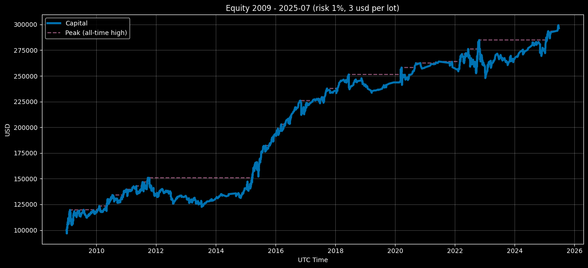

<p align="center">Equity Curve — Compounding Mode (Risk 1%, $3 round‑turn per standard lot) 2009–2025‑07</p>

<p align="center"></p>

# Euro Macromechanica (EMM) M5 Engine — Institutional (3 USD/lot, 1% risk)

## 🧾 Track Description

This track records backtest results of the M5 **EMM** strategy at indicative **institutional‑level commission** costs: **3 USD per round‑turn per 1 standard lot (100,000 EUR)**, equivalent to **≈0.3 pip** on EURUSD. Per‑trade risk — **1% of capital at entry**.

- Data span: **headline 2009–2025‑07** (coverage: **199 months = 16 years and 7 months**)
- Instrument/TF: **EURUSD**, signaling logic on **M5**
- **Backtest time zone:** **UTC+0** (all timestamps in UTC+0)
- Cost model: commission **included** in PnL; **slippage** in this track was **not modeled**
- Base NAV for rebasing: **100,000 USD** (equity starts from the **first closed trade**)

## 🧭 Sub‑tracks

- **compounding_eoy_soy_base_100k** — compounding over the full period (EoY). For monthly return calculations, equity is rebased: insert an anchor of **100k at time t₀−ε** (an instant before t₀).
- **fixed_start_100k** — annual reset to 100k (each calendar year evaluated separately). Cross‑series risk metrics over the entire curve for fixed are **not aggregated**.

---

## 📈 Capital Dynamics — Year-End Equity & Annual Change (UTC+0) (by year-end close) — `compounding_eoy_soy_base_100k`

| Year    | Capital at Year Close (UTC+0) | YoY Change vs. Prior Year |
|:-------:|------------------------------:|---------------------------:|
| 2009    | 117068.19325 | +17.06819% |
| 2010    | 138309.39896 | +18.14430% |
| 2011    | 133331.03938 | -3.59944% |
| 2012    | 133404.51988 | -0.24005% |
| 2013    | 130209.32095 | -2.39512% |
| 2014    | 140227.23261 | +7.68370% |
| 2015    | 192786.53904 | +37.48153% |
| 2016    | 217524.15802 | +12.83161% |
| 2017    | 234781.24171 | +7.93341% |
| 2018    | 239655.50467 | +2.07609% |
| 2019    | 242950.04236 | +1.37470% |
| 2020    | 257246.32453 | +5.88445% |
| 2021    | 257706.79082 | +0.17900% |
| 2022    | 260775.49728 | +1.19077% |
| 2023    | 265531.58800 | +1.82383% |
| 2024    | 274537.68258 | +3.39172% |
| 2025-07 | 295534.29367 | +7.64478% |

### Result over 16 years and 7 months — +195534.29367 USD / + 195.53430%

---

## 📊 Quick Overview — Institutional 3 USD/lot (1% risk)

- **Coverage:** 199 months (**2009‑01…2025‑07**).
- **CAGR:** 6.75%  |  **Vol (ann.):** 7.87%
- **Sharpe (ann., rf=0):** 0.87  |  **Sortino (ann.):** 1.42
- **MaxDD:** −16.88%  |  **MAR:** 0.400  |  **UW (longest):** 41 months  |  **Time UW:** 66.33%
- **By month:** positive — 60.30%; best/worst month: 11.44% / −5.02%.
- **Trades:** 2,736 | **Hit rate:** 69.52% | **PF:** 1.176 | **Payoff:** 0.516.  
  Average winner **0.392R**, loser **−0.761R**; **Expectancy:** **0.041R** (median **0.309R**).

### Additional metrics (compounding)

- **Ulcer Index:** 0.056  |  **Martin Ratio:** 1.23.
- **Skewness / Excess Kurtosis:** 1.015 / 4.441.
- **Rolling 12m (last window 2025‑07‑31):** return 6.43%, Sharpe 1.05.
- **Rolling 36m (last window 2025‑07‑31):** ret_ann 4.30%, maxdd_36m −8.15%, Calmar 0.53.
- **DD quantiles (left tail, monthly curve):** p95 −14.23%, p99 −15.76%.
- **Kelly (winsor 1/99):** f_opt 0.100, f_half 0.050, f_quarter 0.025.
- **Monte‑Carlo (block bootstrap, B=5000, L=3):**  
  **CAGR p05/p50/p95 = 3.67% / 6.74% / 10.05%**;  
  **MaxDD p50/p95 = −11.72% / −7.44%**;  
  **Pr(CAGR < 0) = 0.04%**; **Pr(MaxDD ≤ −30%) = 0.26%**.

### Results fixed_start_100k (annual)

- **Positive years:** 14/16 years and 7 months (84.42%); best/worst: 2015 **37.48%** / 2011 **−3.59%**.

### Short comparison: **3 USD/lot (1%)** vs **4.5 USD/lot (1%)**

- **Return/risk.** 3 USD is higher on **CAGR** (6.75% vs 5.89%), **Sharpe** (0.87 vs 0.78) and **Sortino** (1.42 vs 1.22) with similar volatility (7.87% vs 7.78%). **MAR** is also better (0.400 vs 0.321).
- **Drawdowns / UW.** **MaxDD** at 3 USD is shallower (−16.88% vs −18.34%), **Time Underwater** is lower (66.33% vs 69.35%); **Longest UW** is the same — ~41 months.
- **Monthly stability.** Higher share of positive months (60.30% vs 59.80%), and slightly nicer extremes (best/worst: 11.44%/−5.02% vs 10.89%/−5.20%).
- **Trades.** Same count (**2,736**), but at 3 USD better **PF** (1.176 vs 1.154) and **expectancy** (0.041R vs 0.036R); **payoff** slightly higher (0.516 vs 0.511).
- **Return shape.** 3 USD shows stronger positive asymmetry (**skew 1.015 vs 0.866**) and a slightly “fatter” tail (excess kurtosis 4.441 vs 4.035).
- **Ulcer / Martin.** **Ulcer Index** lower (0.056 vs 0.062), **Martin Ratio** higher (1.23 vs 0.98) — the 3 USD curve is less “painful.”
- **Rollings.** Recent windows stronger at 3 USD: **12m** (6.43% / Sharpe 1.05 vs 5.90% / 0.97) and **36m** (ret_ann 4.30% vs 3.65%; Calmar 0.53 vs 0.43).
- **Drawdown tails.** Left tail is softer: **DD p95** −14.23% vs −15.65%, **p99** −15.76% vs −17.20%.
- **Kelly.** Optimal fraction is nearly identical.
- **Monte‑Carlo.** Lower risk of “bad” scenarios at 3 USD: **Pr(CAGR<0)** 0.04% vs 0.06%; **Pr(MaxDD ≤ −30%)** 0.26% vs 0.42%; medians better (CAGR 6.74% vs 5.88%; MaxDD −11.72% vs −12.55%).

**Bottom line:** the **3 USD/lot** track delivers a clear improvement in the “return/risk” profile and less curve “pain” with the same logic and trade count. This is the expected gain from lower costs compared to **4.5 USD/lot**.

---

## 🔊 What the metrics say (Institutional **3 USD/lot**, **1%** risk)

- **Return/risk.** Moderate volatility with high “cleanliness” of returns: **Sharpe 0.87** and **Sortino 1.42** over a 199‑month history, **MAR 0.400**. This indicates a stable return‑to‑risk relationship over the long run.

- **Drawdowns and “pain.”** **MaxDD −16.9%** and low‑to‑mid **Ulcer Index 0.056** → the curve’s pain is more often **long but shallow**. **Time Underwater 66%**, **Longest UW ~41 months** — discipline matters more than “over‑optimization”: the system sits through phase periods below the high‑water mark without disasters.

- **Return distribution shape.** Positive **skew (≈1.02)** and a “fat” tail (**excess kurtosis ≈4.44**): rare large upsides compensate for a string of small negative months → **payoff ~0.52**, while **hit rate ~69.5%** and **PF > 1** maintain positive expectancy (**~0.041R/trade**).

- **Rollings.** **Rolling‑12m** / **Rolling‑36m** show phase behavior: in “in‑sync” markets the 12‑month **Sharpe ≈1.05**, **Calmar 36m ≈0.53**; in neutral regimes they converge toward averages. Useful to monitor the current regime without diluting it with the full history.

- **Drawdown quantiles (DD).** Left tail is moderate: **p95 ≈ −14.2%**, **p99 ≈ −15.8%** on the monthly curve. This sets realistic expectations for typical “worst” periods beyond a single MaxDD.

- **Trade structure.** The model “wins by frequency”: **hit rate ~69.5%**, **payoff ~0.52**, **PF ~1.18**, **expectancy > 0**. Loss control matters more than trying to “stretch” giant takes.

- **Kelly.** Current risk **1.0R per trade** corresponds to **10× Kelly** (for a 1% risk unit). The institutional approach is **≤ ½ Kelly** (≈ **0.05R**), which is noticeably lower than the current load and reduces the depth/duration of drawdowns at the cost of some return.

- **Probabilistic profile (Monte‑Carlo).** Median scenarios: **CAGR ~6.7%**, **MaxDD ~−11.7%**; the probability of a long‑term negative outcome is **≈0.04%**, and **very deep (≤−30%)** drawdowns are rare (**~0.26%**) with proper risk management.

**Bottom line.** Institutional at **3 USD/lot** is **moderate risk with improved return quality**: shallow but sometimes prolonged UW, high win frequency, positive asymmetry, and a low probability of “black” scenarios.

---

## 📋 Methodology for metric calculation (3 USD/lot, 1% risk)

### What is computed and which files

```
compounding_eoy_soy_base_100k/metrics/
  monthly_returns.csv
  full_period_summary.csv
  yearly_summary.csv
  trades_full_period_summary.csv
  rolling_12m.csv
  rolling_36m.csv
  dd_quantiles.csv
  kelly_summary.csv
  monte_carlo_summary.csv

fixed_start_100k/metrics/
  monthly_returns.csv
  yearly_summary.csv
  trades_full_period_summary.csv
```

### CSV Schemas (column names)

**compounding_eoy_soy_base_100k**

- `monthly_returns.csv`:  
  `year, month, ret_m`
- `full_period_summary.csv`:  
  `months, cagr, vol_ann, sharpe_ann, sortino_ann, maxdd, mar_full, longest_underwater_months, best_month, worst_month, pos_months_pct, n_trades, hit_rate, profit_factor, avg_win_r, avg_loss_r, payoff_ratio, expectancy_r_mean, expectancy_r_median, std_r, min_r, max_r, ulcer_index, martin_ratio, time_underwater_pct, skewness, kurtosis_excess`
- `yearly_summary.csv`:  
  `year, ret_year, maxdd_year, trades, hit_rate, profit_factor`
- `trades_full_period_summary.csv`:  
  `n_trades, hit_rate, profit_factor, avg_win_r, avg_loss_r, payoff_ratio, expectancy_r_mean, expectancy_r_median, std_r, min_r, max_r`
- `rolling_12m.csv`:  
  `date, roll_12m_return, roll_12m_sharpe`
- `rolling_36m.csv`:  
  `date_end, ret_36m_ann, maxdd_36m, calmar_36m`
- `dd_quantiles.csv`:  
  `quantile, drawdown_quantile`
- `kelly_summary.csv`:  
  `winsor_lo, winsor_hi, f_opt, f_half, f_quarter, obj_at_f_opt`
- `monte_carlo_summary.csv`:  
  `months, bootstrap_B, block_len_months, cagr_p05, cagr_p50, cagr_p95, maxdd_p50, maxdd_p95, p_cagr_lt_0, p_maxdd_lt_-0.30`

**fixed_start_100k**

- `monthly_returns.csv`:  
  `year, month, ret_m`
- `yearly_summary.csv`:  
  `year, ret_year, maxdd_year, trades, hit_rate, profit_factor`
- `trades_full_period_summary.csv`:  
  `n_trades, hit_rate, profit_factor, avg_win_r, avg_loss_r, payoff_ratio, expectancy_r_mean, expectancy_r_median, std_r, min_r, max_r`

> For **fixed**, a cross‑period `full_period_summary.csv` is **not calculated** (annual reset to 100k).

---

### Rules and conventions

- **Time zone:** UTC+0.  
- **Scale:** monthly **returns** from the **last EoM NAV** (month‑end); missing EoM — **ffill**.  
- **Anchor NAV = 100,000 USD.**  
  - **Compounding:** anchor at `t₀−ε` (before the first point).  
  - **Fixed:** each year — anchor at `YYYY‑01‑01 00:00 UTC−ε`.  
- **Months without trades** are not removed: `ret_m = 0`.  
- **Returns:** arithmetic (not log).  
- **Variances/σ:** sample, `ddof = 1`.  
- **R‑metrics (1% risk):**  
  if `pnl_pct` is in fractions → `R = pnl_pct`; if in percent → `R = pnl_%/100`.  
  `hit_rate = share(R>0)`; `PF = sum(R>0)/|sum(R<=0)|` (on **sums**).

---

### R-metrics (Risk 1% — STRICT)

- **Base:** **1R = 1.0%** of capital at entry.  
- If `pnl_pct` is **in fractions** (e.g., `0.012` = +1.2%) → `R = pnl_pct / 0.01`.  
- If `pnl_%` is **in percent** (e.g., `1.2` = +1.2%) → `R = pnl_% / 1.0`.  
- If `pnl_r`/`r` exists in `trades`, use it **only** if it’s already R at 1% risk.

- Introduce epsilon `eps = 1e-12` for robust comparisons to zero.  
- **Classification:**  
  — **win:** `R > +eps`; **loss:** `R < −eps`; zeros are excluded from the win/loss groups.  

- **Metrics (on R):**  
  — `hit_rate = share(R > +eps)` (zeros are not wins);  
  — `profit_factor = sum(R[R>+eps]) / abs(sum(R[R<−eps]))` (**on sums**, zeros do not participate);  
  — `avg_win_r = mean(R[R>+eps])`, `avg_loss_r = mean(R[R<−eps])`;  
  — `payoff_ratio = avg_win_r / |avg_loss_r|`;  
  — `expectancy_r_mean/median`, `std_r`, `min_r`, `max_r` — computed on **all** R as-is (zeros included).

---

### Formulas (institutional definitions)

**Return/risk (on monthly returns `r_m`)**
- `CAGR = (∏(1 + r_m))^(12/N) − 1`, where `N` is the number of months.  
- `vol_ann = stdev(r_m, ddof=1) · √12`.  
- `Sharpe_ann = (mean(r_m − rf_m) / stdev(r_m − rf_m, ddof=1)) · √12`, default `rf = 0`.  
- `Sortino_ann = (mean(r_m) / stdev(r_m[r_m < 0], ddof=1)) · √12` (downside‑σ only over **negative** months, target=0).

**Curve/drawdowns (monthly scale)**
- `eq_t = ∏(1 + r_m)`, `dd_t = eq_t / cummax(eq) − 1`.  
- `maxdd` = minimum of `dd_t` (negative).  
- `longest_underwater_months` — length of the longest run of months with `dd_t < 0` (the recovery month with `dd=0` is **not included**).  
- `time_underwater_pct = share(dd_t < 0)` (fraction of months “underwater”).  
- `mar_full = cagr / |maxdd|`.

**Ulcer / Martin / Distribution moments**
- `ulcer_index = sqrt( mean( max(0, −dd_t)^2 ) )`.  
- `martin_ratio = (mean(r_m)·12) / ulcer_index`.  
- `skewness` — sample skewness of returns `r_m`; `kurtosis_excess` — Fisher excess kurtosis (minus 3).

**Rolling metrics**
- `rolling_12m`:  
  `roll_12m_return = ∏(1+r_m_window) − 1`;  
  `roll_12m_sharpe = (mean/σ)·√12` within the 12m window (rf=0, `ddof=1`).  
- `rolling_36m (Calmar)`:
  `ret_36m_ann = (∏(1+r_m_window))^(12/36) − 1`;  
  `maxdd_36m` — MaxDD on the monthly curve within the window;  
  `calmar_36m = ret_36m_ann / |maxdd_36m|`.

**Drawdown quantiles**
- `dd_quantiles`: store left‑tail percentiles of the `dd_t` distribution (e.g., `p95`, `p99`), **with a negative sign**.

**Kelly (from the trade R‑distribution)**
- Winsorize `R` tails at `winsor_lo=1%`, `winsor_hi=99%` → `R_w`.  
- Search `f ∈ [0, f_cap]`, where `f_cap = min(10%, 0.95/|min(R_w)|)`.  
- Objective: `maximize E[ log(1 + f·R_w) ]`.  
- Report: `f_opt`, `f_half = f_opt/2`, `f_quarter = f_opt/4`, `obj_at_f_opt`.

**Monte‑Carlo (circular block bootstrap)**
- Default parameters: `B = 5000`, `block_len_months = 3`, fixed seed.  
- On each run of length `N` months, compute `CAGR*`, `MaxDD*` (monthly curve).  
- Report: `cagr_p05/p50/p95`, `maxdd_p50/p95`, `p_cagr_lt_0`, `p_maxdd_lt_-0.30`.

---

### What is **not** published for fixed

- Cross‑series `Sharpe/MAR/MaxDD` and extended metrics — **compounding only**.  
- For `fixed` — **in‑year/annual**: `ret_year`, `maxdd_year`, and annual trade metrics.

---

### Quick integrity checks

- Coverage: **199 months** (2009‑01 … 2025‑07) — no gaps.  
- `∏(1 + ret_m)` (comp) ≈ `NAV_last / 100000`.  
- `months` in `full_period_summary.csv` = rows in `monthly_returns.csv`.  
- `n_trades(full)` = sum of `yearly_summary.trades` = `trades_full_period_summary.n_trades`.  
- For `rolling_12m/36m` the first 11/35 months are empty (no window).

---

### Nuances (address common questions)

- **Rounding (institutional):**  
  CAGR/vol/maxdd/best/worst — **6** decimals; Sharpe/Sortino — **4**; PF/Payoff — **3**; hit_rate/pos_months — **6**; R‑metrics — **6**; Ulcer — **6**; Martin/Calmar — **3**.  
- **Last incomplete month:** included; NAV ffill to EoM.  
- **Months without trades:** keep (`ret_m = 0`).  
- **Sortino:** downside‑σ only for `r_m < 0`, target=0, `ddof=1`.  
- **Sharpe:** `rf=0` (if no rf series). With an annual rf → monthly `rf_m = (1+rf_ann)^(1/12) − 1`.  
- **PF / hit rate:** zeros are not wins; PF — on **sums**; if there are no losses — `PF = inf`.  
- **Underwater:** criterion **`dd < 0`**, recovery month (`dd = 0`) **not included**.  
- **dd_quantiles:** values are **negative** (left tail), do not take absolute value.

> Exact definitions/units/rounding are duplicated in `metrics_schema.json` and are used for automatic pipeline validation.

---

## 🔍 Transparency & Reproducibility

- General info: root **README.md**
- Inputs and provenance: **docs/AUDIT.md / INPUTS‑PIN.md**
- Order execution mechanics: **strategy_proof/README.md**
- Metrics were computed from non‑public files `trades_YYYY.csv` and `equity_YYYY.csv`. Access: see **COMMERCIAL.md**.
- The current track is a **demo M5 (~10–15% of the full EMM logic)**; the calendar filter is light; TCA/slippage — out of scope. 
