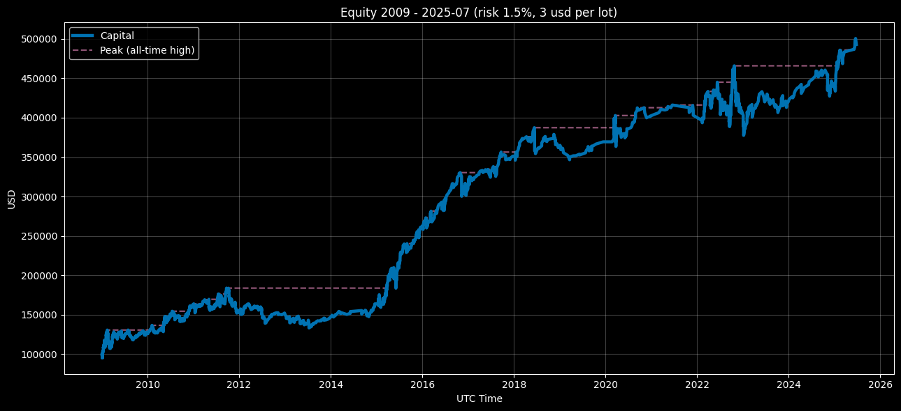

<p align="center">Equity Curve — Compounding Mode (Risk 1.5%, $3 round‑turn per standard lot) 2009–2025‑07</p>

<p align="center"></p>

# Euro Macromechanica (EMM) M5 Engine — Institutional (3 USD/lot, Risk 1.5%)

## 🧾 Track Description

This track records the backtest results of the M5 **EMM** strategy under indicative **institutional‑level commission** costs: **$3 per round‑turn per 1 standard lot (100,000 EUR)**, equivalent to **≈0.3 pip** on EURUSD. Per‑trade risk — **1.5% of equity at entry**.

- Data span: **headline 2009–2025‑07** (coverage: **199 months = 16 years and 7 months**)
- Instrument/TF: **EURUSD**, signal logic on **M5**
- **Backtest time zone:** **UTC+0** (all timestamps in UTC+0)
- Cost model: commission **included** in PnL; **slippage** in this track **was not modeled**
- Baseline NAV for rebase: **$100,000** (equity starts at the **first closed trade**)

## 🧭 Subtracks

- **compounding_eoy_soy_base_100k** — compounding across the full period (EoY). For monthly returns, equity is rebased by inserting an anchor **100k at t₀−ε** (an instant before t₀).
- **fixed_start_100k** — annual reset to 100k (each calendar year evaluated independently). Cross‑period risk metrics for the fixed curve are **not aggregated**.

---

## 📈 Capital Dynamics — Year-End Equity & Annual Change (UTC+0) (by year-end close) - `compounding_eoy_soy_base_100k`

| Year   | Capital at Year-End (UTC+0) | YoY Change |
|:------:|-----------------------------:|-----------:|
| 2009   | 126,137.92674               | +26.13793% |
| 2010   | 161,494.03174               | +28.02972% |
| 2011   | 152,291.51394               |  −5.69836% |
| 2012   | 151,538.92674               |  −0.49418% |
| 2013   | 145,945.32640               |  −3.69120% |
| 2014   | 163,029.82355               | +11.70609% |
| 2015   | 260,690.09012               | +59.90331% |
| 2016   | 311,998.60502               | +19.68180% |
| 2017   | 349,666.18041               | +12.07299% |
| 2018   | 360,452.54127               | +3.084765  |
| 2019   | 367,827.70758               |  +2.04609% |
| 2020   | 400,297.03342               |  +8.82732% |
| 2021   | 401,320.66223               |  +0.25572% |
| 2022   | 407,568.42350               |  +1.55680% |
| 2023   | 418,370.14976               |  +2.65029% |
| 2024   | 439,680.51060               |  +5.09366% |
| 2025-07| 490,831.14182               | +11.63359% |

### Result over 16 years and 7 months — +390831.14182 USD / + 390.83114%

---

## 📊 Quick Overview — Institutional 3 USD/lot (Risk 1.5%)

- **Coverage:** 199 months (**2009‑01…2025‑07**).
- **CAGR:** 10.07%  |  **Vol (ann.):** 11.89%
- **Sharpe (ann., rf=0):** 0.87  |  **Sortino (ann.):** 1.43
- **MaxDD:** −24.90%  |  **MAR:** 0.404  |  **UW (longest):** 41 mo.  |  **Time UW:** 66.33%
- **By month:** positive — 60.30%; best/worst month: 17.53% / −7.50%.
- **Trades:** 2736 | **Hit‑rate:** 69.33% | **PF:** 1.170 | **Payoff:** 0.510.  
  Average winner **0.392R**, average loser **−0.761R**; **Expectancy:** **0.041R** (median **0.309R**).

### Additional Metrics (compounding)

- **Ulcer Index:** 0.084  |  **Martin Ratio:** 1.23.
- **Skewness / Excess Kurtosis:** 1.077 / 4.698.
- **Rolling 12m (last window 2025‑07‑31):** return 9.54%, Sharpe 1.09.
- **Rolling 36m (last window 2025‑07‑31):** ret_ann 6.83%, maxdd_36m −12.06%, Calmar 0.57.
- **DD quantiles (left tail, monthly curve):** p95 −21.22%, p99 −23.36%.
- **Kelly (winsor 1/99):** f_opt 0.100, f_half 0.050, f_quarter 0.025.
- **Monte‑Carlo (block bootstrap, B=5000, L=3):**  
  **CAGR p05/p50/p95 = 5.36% / 10.04% / 15.18%**;  
  **MaxDD p50/p95 = −17.28% / −11.10%**;  
  **Pr(CAGR < 0) = 0.04%**; **Pr(MaxDD ≤ −30%) = 3.78%**.

### fixed_start_100k Results (yearly)

- **Positive years:** 14/16 years and 7 months (84.42%); best/worst: 2015 **59.88%** / 2011 **−5.70%**.

### Short Comparison: **3 USD/lot (1.5%)** vs **3 USD/lot (1%)**

- **Return/Risk.** 1.5% delivers higher **CAGR** (**10.07% vs 6.75%**) on higher **volatility** (**11.89% vs 7.87%**). **Sharpe** is nearly identical (**0.87 vs 0.87**), **Sortino** similar (**1.43 vs 1.42**). **MAR** close (**0.404 vs 0.400**).
- **Drawdowns / UW.** **MaxDD** is deeper at 1.5% (**−24.90% vs −16.88%**). **Time UW** about the same (**66.33% vs 66.33%**); **Longest UW** ~**41 mo.** for both. Monthly extremes at 1.5% are sharper (**17.53% / −7.50%** vs **11.44% / −5.02%**).
- **Monthly stability.** Share of positive months is the same (**60.30% vs 60.30%**).
- **Trades.** Same count (**2736**). At 1.5%: slightly lower **hit‑rate** (**69.33% vs 69.52%**), **PF** (**1.170 vs 1.176**) and **payoff** (**0.510 vs 0.516**). **Expectancy in R** is the same (**≈0.041R**) — by definition it does not depend on the nominal risk unit.
- **Return distribution shape.** At 1.5% both **skew** (**1.077 vs 1.015**) and tail heaviness (**excess kurtosis 4.698 vs 4.441**) are higher — more rare large moves.
- **Ulcer / Martin.** **UI** higher (**0.084 vs 0.056**), **Martin** roughly the same (**~1.23 vs ~1.23**) — the 1.5% curve is “more painful” in depth/duration of typical drawdowns.
- **Rollings.** Latest windows stronger on 1.5%: **12m** (9.54% / Sharpe 1.09 vs 6.43% / 1.05) and **36m** (ret_ann 6.83% vs 4.30%; Calmar 0.57 vs 0.53).
- **Drawdown tails.** Left tail deeper at 1.5%: **DD p95** **−21.22% vs −14.23%**, **p99** **−23.36% vs −15.76%**.
- **Kelly.** **f_opt ≈ 0.10** for both. **f_opt ≈ 0.10** in R terms. Current load **1.0R per trade** corresponds to **10× Kelly** (for the 1% track) and **15× Kelly** (for the 1.5% track). An institutional approach is **≤½ Kelly** (≈ **0.05R**), which is markedly below the current load and reduces drawdown depth/duration at the cost of some return.

- **Monte‑Carlo.** At 1.5% the median **CAGR** is higher (**10.04% vs 6.74%**), but the median **MaxDD** is deeper (**−17.28% vs −11.72%**). Tail risk is higher: **Pr(MaxDD ≤ −30%)** **3.78% vs 0.26%**; **Pr(CAGR<0)** similar and low (**0.04% vs 0.04%**).

**Bottom line:** the **1.5%** version predictably “accelerates” returns with nearly unchanged Sharpe, **at the cost of deeper drawdowns and fatter tails**. The **1%** version offers a gentler risk profile with very similar quality of return per unit of risk. The choice depends on acceptable drawdown depth and desired capital volatility.

---

## 🔊 What the Metrics Say (Institutional **3 USD/lot**, Risk **1.5%**)

- **Return/Risk.** Higher average return on higher volatility: **Sharpe 0.87** and **Sortino 1.43** over 199 months, **MAR 0.404**. This indicates a stable return‑to‑risk relation with a “faster” equity curve profile.

- **Drawdowns and “pain.”** **MaxDD −24.9%** and **Ulcer Index 0.084** → the curve’s pain is **deeper and more noticeable** than in conservative regimes; meanwhile **Time Underwater ~66%**, **Longest UW ~41 mo.** stay in the model’s typical range: prolonged phases below the high‑water mark without catastrophic collapses.

- **Return distribution shape.** Positive **skew (≈1.08)** and a “fat” tail (**excess kurtosis ≈4.70**): rare large upsides compensate sequences of small negatives → **payoff ~0.51**, **hit‑rate ~69.3%**, **PF ~1.17**, **expectancy ~0.041R/trade**.

- **Rollings.** **Rolling‑12m / Rolling‑36m** emphasize phase behavior: in “in‑sync” markets **12m Sharpe ~1.09**, **Calmar 36m ~0.57**; in neutral regimes metrics revert to averages. Useful for live monitoring without diluting with full history.

- **Drawdown quantiles (DD quantiles).** Left tail meaningful: **p95 ≈ −21.2%**, **p99 ≈ −23.4%** on the monthly curve — sets realistic expectations of “bad” periods beyond a single MaxDD point.

- **Trade structure.** The model “wins by frequency”: **hit‑rate ~69%**, **payoff ~0.51**, **PF > 1**, **expectancy > 0**. Emphasis on loss control and high win share rather than extreme take‑profits.

- **Kelly.** **f_opt ≈ 0.10** in R terms. Current load **1.0R per trade ≈ 15× Kelly** (for the 1.5% track). An institutional approach is **≤½ Kelly ≈ 0.05R**, materially below the current level and reducing drawdown depth/duration.

- **Probabilistic profile (Monte‑Carlo).** Median scenarios: **CAGR ~10.0%**, **MaxDD ~−17.3%**; probability of a long‑term negative outcome **~0.04%**, and **very deep (≤−30%)** drawdowns **~3.78%** under proper risk management.

**Bottom line.** Institutional at **$3/lot, 1.5%** is **more aggressive in dynamics**, with a higher average pace and acceptable “cleanliness” of returns, but with deeper drawdown tails. At the current load (≈15× Kelly) the profile is growth‑oriented; cutting sizing toward **≤½ Kelly** materially softens drawdowns and time underwater.

---

## 📋 Metrics Methodology (3 USD/lot, Risk 1.5%)

### What is computed and which files

```
compounding_eoy_soy_base_100k/metrics/
  monthly_returns.csv
  full_period_summary.csv
  yearly_summary.csv
  trades_full_period_summary.csv
  rolling_12m.csv
  rolling_36m.csv
  dd_quantiles.csv
  kelly_summary.csv
  monte_carlo_summary.csv

fixed_start_100k/metrics/
  monthly_returns.csv
  yearly_summary.csv
  trades_full_period_summary.csv
```

### CSV Schemas (column names)

**compounding_eoy_soy_base_100k**

- `monthly_returns.csv`:  
  `year, month, ret_m`
- `full_period_summary.csv`:  
  `months, cagr, vol_ann, sharpe_ann, sortino_ann, maxdd, mar_full, longest_underwater_months, best_month, worst_month, pos_months_pct, n_trades, hit_rate, profit_factor, avg_win_r, avg_loss_r, payoff_ratio, expectancy_r_mean, expectancy_r_median, std_r, min_r, max_r, ulcer_index, martin_ratio, time_underwater_pct, skewness, kurtosis_excess`
- `yearly_summary.csv`:  
  `year, ret_year, maxdd_year, trades, hit_rate, profit_factor`
- `trades_full_period_summary.csv`:  
  `n_trades, hit_rate, profit_factor, avg_win_r, avg_loss_r, payoff_ratio, expectancy_r_mean, expectancy_r_median, std_r, min_r, max_r`
- `rolling_12m.csv`:  
  `date, roll_12m_return, roll_12m_sharpe`
- `rolling_36m.csv`:  
  `date_end, ret_36m_ann, maxdd_36m, calmar_36m`
- `dd_quantiles.csv`:  
  `quantile, drawdown_quantile`
- `kelly_summary.csv`:  
  `winsor_lo, winsor_hi, f_opt, f_half, f_quarter, obj_at_f_opt`
- `monte_carlo_summary.csv`:  
  `months, bootstrap_B, block_len_months, cagr_p05, cagr_p50, cagr_p95, maxdd_p50, maxdd_p95, p_cagr_lt_0, p_maxdd_lt_-0.30`

**fixed_start_100k**

- `monthly_returns.csv`:  
  `year, month, ret_m`
- `yearly_summary.csv`:  
  `year, ret_year, maxdd_year, trades, hit_rate, profit_factor`
- `trades_full_period_summary.csv`:  
  `n_trades, hit_rate, profit_factor, avg_win_r, avg_loss_r, payoff_ratio, expectancy_r_mean, expectancy_r_median, std_r, min_r, max_r`

> For **fixed**, a cross‑period `full_period_summary.csv` is **not computed** (annual reset to 100k).

---

### Rules & Conventions

- **Time zone:** UTC+0.  
- **Scale:** monthly **returns** from the **last EoM NAV** (month end); missing EoM — **ffill**.  
- **NAV anchor = $100,000.**  
  - **Compounding:** anchor at `t₀−ε` (before the first point).  
  - **Fixed:** each year — anchor at `YYYY‑01‑01 00:00 UTC−ε`.  
- **Months with no trades** are kept: `ret_m = 0`.  
- **Returns:** arithmetic (not log).  
- **Dispersions/σ:** sample, `ddof = 1`.  

**R‑metrics (Risk 1.5%, STRICT):**  
- Base: **1R = 1.5%** of equity at entry.  
- If `pnl_pct` **in fractions** → `R = pnl_pct / 0.015`.  
- If `pnl_%` **in percent** → `R = pnl_% / 1.5`.  
- If `trades` already have `pnl_r`/`r`, use **only** if this is R for 1.5%.  
- Introduce epsilon `eps = 1e‑12` for robust zero comparisons.  
- **Classification:**  
  — **win**: `R > +eps`; **loss**: `R < −eps`; zeros excluded from win/loss groups.  
- **Metrics:**  
  — `hit_rate = share(R > +eps)` (zeros are not wins);  
  — `profit_factor = sum(R[R>+eps]) / abs(sum(R[R<−eps]))` (**by sums**, zeros excluded);  
  — `avg_win_r = mean(R[R>+eps])`; `avg_loss_r = mean(R[R<−eps])`;  
  — `payoff_ratio = avg_win_r / |avg_loss_r|`;  
  — `expectancy_r_mean/median`, `std_r`, `min_r`, `max_r` — over **all** R as is (zeros included).

---

### Formulas (institutional definitions)

**Return/Risk (by monthly returns `r_m`)**
- `CAGR = (∏(1 + r_m))^(12/N) − 1`, where `N` is the number of months.  
- `vol_ann = stdev(r_m, ddof=1) · √12`.  
- `Sharpe_ann = (mean(r_m − rf_m) / stdev(r_m − rf_m, ddof=1)) · √12`, default `rf = 0`.  
- `Sortino_ann = (mean(r_m) / stdev(r_m[r_m < 0], ddof=1)) · √12` (downside‑σ from **negative** months only, target=0).

**Curve/Drawdowns (monthly scale)**
- `eq_t = ∏(1 + r_m)`, `dd_t = eq_t / cummax(eq) − 1`.  
- `maxdd` = min of `dd_t` (negative).  
- `longest_underwater_months` — length of the longest consecutive months with `dd_t < 0` (the recovery month with `dd=0` **is not included**).  
- `time_underwater_pct = share(dd_t < 0)` (share of months “under water”).  
- `mar_full = cagr / |maxdd|`.

**Ulcer / Martin / Moments**
- `ulcer_index = sqrt( mean( max(0, −dd_t)^2 ) )`.  
- `martin_ratio = (mean(r_m)·12) / ulcer_index`.  
- `skewness` — sample skewness of `r_m`; `kurtosis_excess` — Fisher excess kurtosis (minus 3).

**Rolling metrics**
- `rolling_12m`:  
  `roll_12m_return = ∏(1+r_m_window) − 1`;  
  `roll_12m_sharpe = (mean/σ)·√12` within the 12m window (rf=0, `ddof=1`).  
- `rolling_36m (Calmar)`:
  `ret_36m_ann = (∏(1+r_m_window))^(12/36) − 1`;  
  `maxdd_36m` — MaxDD on the monthly curve within the window;  
  `calmar_36m = ret_36m_ann / |maxdd_36m|`.

**Drawdown quantiles**
- `dd_quantiles`: store left‑tail percentiles of `dd_t` (e.g., `p95`, `p99`), **with negative sign**.

**Kelly (by the trade R‑distribution)**
- Winsorize `R` tails at `winsor_lo=1%`, `winsor_hi=99%` → `R_w`.  
- Search domain: `f ∈ [0, f_cap]`, where `f_cap = min(10%, 0.95/|min(R_w)|)` (so `1+fR_w > 0`).  
- Objective: `maximize E[ log(1 + f·R_w) ]`.  
- Report: `f_opt`, `f_half = f_opt/2`, `f_quarter = f_opt/4`, `obj_at_f_opt`.

**Monte‑Carlo (circular block bootstrap)**
- Defaults: `B = 5000`, `block_len_months = 3`, fixed seed.  
- For each run of length `N` months compute `CAGR*` and `MaxDD*` (monthly curve).  
- Report: `cagr_p05/p50/p95`, `maxdd_p50/p95`, `p_cagr_lt_0`, `p_maxdd_lt_-0.30`.

---

### What is **not** published for fixed

- Cross‑period `Sharpe/MAR/MaxDD` and extended metrics — **only for compounding**.  
- For `fixed` we publish **intra‑year/yearly**: `ret_year`, `maxdd_year`, and yearly trade metrics.

---

### Integrity Mini‑checks

- Coverage: **199 months** (2009‑01 … 2025‑07) — no gaps.  
- `∏(1 + ret_m)` (comp) ≈ `NAV_last / 100000`.  
- `months` in `full_period_summary.csv` = number of rows in `monthly_returns.csv`.  
- `n_trades(full)` = sum of `yearly_summary.trades` = `trades_full_period_summary.n_trades`.  
- For `rolling_12m/36m` the first 11/35 months are empty (window not yet formed).

---

### Nuances (answer frequent questions)

- **Rounding (institutional):**  
  CAGR/vol/maxdd/best/worst — **6** decimals; Sharpe/Sortino — **4**; PF/Payoff — **3**; hit_rate/pos_months — **6**; R‑metrics — **6**; Ulcer — **6**; Martin/Calmar — **3**.  
- **Last partial month:** included; NAV ffill to EoM.  
- **Months with no trades:** kept (`ret_m = 0`).  
- **Sortino:** downside‑σ only on `r_m < 0`, target=0, `ddof=1`.  
- **Sharpe:** `rf=0` (if no rf series). With annual rf → monthly `rf_m = (1+rf_ann)^(1/12) − 1`.  
- **PF / hit‑rate:** zeros are not wins; PF — by **sums**; if there are no losses — `PF = inf`.  
- **Underwater:** computed by **`dd < 0`**, recovery month (`dd = 0`) **not included**.  
- **dd_quantiles:** values are **negative** (left tail), do not take absolute value.

> Exact definitions/units/rounding are duplicated in `metrics_schema.json` and are used for automatic pipeline validation.

---

## 🔍 Transparency & Reproducibility

- General info: root **README.md**
- Inputs and provenance: **docs/AUDIT.md / INPUTS‑PIN.md**
- Order execution mechanics: **strategy_proof/README.md**
- Metrics were computed from non‑public files `trades_YYYY.csv` and `equity_YYYY.csv`. Access: see **COMMERCIAL.md**.
- The current track is a **demo M5 (~10–15% of the full EMM logic)**; the calendar filter is light; TCA/slippage — out of scope. 
