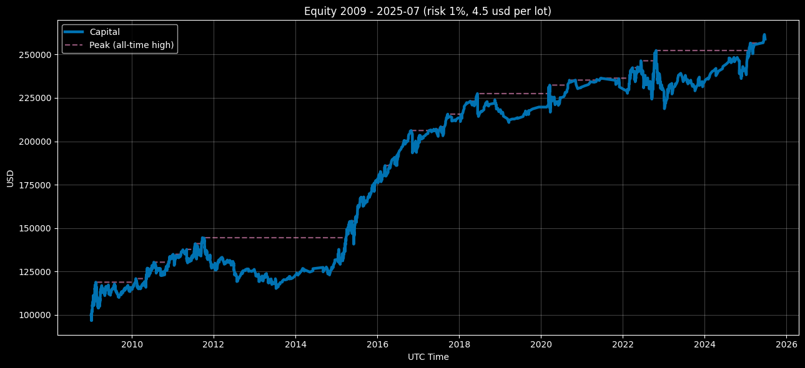

<p align="center">Equity Curve — Compounding Mode (Risk 1%, $4.5 round‑turn per standard lot) 2009–2025‑07</p>

<p align="center"></p>

# Euro Macromechanica (EMM) M5 Engine — Retail Advanced (4.5 USD/lot, риск 1%)

## 🧾 Описание трека

Этот трек фиксирует результаты бэктеста стратегии M5 **EMM** при издержках ритейла использующего cashback на комиссии: **4.5 USD за round‑turn на 1 стандартный лот (100 000 EUR)**, эквивалент **≈0.45 pip** на EURUSD. Риск на сделку — **1% от капитала на момент входа**.

- Диапазон данных: **headline 2009–2025‑07** (покрытие: **199 мес. = 16 лет и 7 мес.**)
- Инструмент/TF: **EURUSD**, сигнальная логика на **M5**
- **Часовой пояс бэктеста:** **UTC+0** (все временные метки в UTC+0)
- Модель издержек: комиссия **включена** в PnL; **slippage** в этом треке **не моделировался**
- Базовый NAV для ребейза: **100 000 USD** (equity начинается с **первой закрытой сделки**)

## 🧭 Подтреки

- **compounding_eoy_soy_base_100k** — компаундинг на всём периоде (EoY). Для расчёта месячных доходностей equity ребейзится: перед первой точкой вставляется якорь **100k в момент t₀−ε** (на мгновение раньше t₀).
- **fixed_start_100k** — ежегодный ресет к 100k (каждый календарный год оценивается отдельно). Сквозные риск‑метрики по всей кривой для fixed **не агрегируются**.

---

## 📈 Динамика капитала по закрытию года `compounding_eoy_soy_base_100k`

| Год | Капитал на конец года (UTC+0) | Изменение к предыдущему году |
|---:|---:|---:|
| 2009 | 114735.04762 | +14.73505% |
| 2010 | 133601.31085 | +16.44333% |
| 2011 | 127022.20280 | -4.92443% |
| 2012 | 125860.79330 | -0.91434% |
| 2013 | 122261.93381 | -2.85940% |
| 2014 | 131293.72134 | +7.38724% |
| 2015 | 177172.64410 | +34.94373% |
| 2016 | 198020.93468 | +11.76722% |
| 2017 | 212836.24783 | +7.48169% |
| 2018 | 216455.84763 | +1.70065% |
| 2019 | 219092.87031 | +1.21827% |
| 2020 | 230443.25590 | +5.18063% |
| 2021 | 230654.17205 | +0.09153% |
| 2022 | 230324.12380 | -0.14309% |
| 2023 | 233315.03391 | +1.29857% |
| 2024 | 240529.69215 | +3.09224% |
| 2025-07 | 258145.17790 | +7.32362% |

### Результат за 16 лет и 7 месяцев - +158145.17790 USD / + 158.14518%

---

## 📊 Краткий обзор — Retail Advanced 4.5 USD/lot (risk 1%)

- **Покрытие:** 199 мес. (**2009-01…2025-07**).
- **CAGR:** 5.89%  |  **Vol (ann.):** 7.78%
- **Sharpe (ann., rf=0):** 0.78  |  **Sortino (ann.):** 1.22
- **MaxDD:** -18.34%  |  **MAR:** 0.321  |  **UW (longest):** 41 мес.  |  **Time UW:** 69.35%
- **Помесячно:** положительные — 59.80%; лучший/худший мес.: 10.89% / -5.20%.
- **Сделки:** 2736 | **Hit-rate:** 69.30% | **PF:** 1.154 | **Payoff:** 0.511.  
  Средняя прибыльная **0.389R**, убыточная **-0.761R**; **Expectancy:** 0.036R (median 0.305R).

### Дополнительные метрики (compounding)

- **Ulcer Index:** 0.062  |  **Martin Ratio:** 0.98.
- **Skewness / Excess Kurtosis:** 0.866 / 4.035.
- **Rolling 12m (последнее окно 2025-07-31):** return 5.90%, Sharpe 0.97.
- **Rolling 36m (последнее окно 2025-07-31):** ret_ann 3.65%, maxdd_36m -8.44%, Calmar 0.43.
- **DD-квантили (левый хвост, месячная кривая):** p95: -15.65%, p99: -17.20%
- **Kelly (winsor 1/99):** f_opt 0.0985, f_half 0.0493, f_quarter 0.0246.
- **Monte-Carlo (block bootstrap, B=5000, L=3):** CAGR p05/p50/p95 = 2.89% / 5.88% / 9.08%; MaxDD p50/p95 = -12.55% / -7.93%; Pr(CAGR<0) = 0.06%; Pr(MaxDD ≤ −30%) = 0.42%.

### Итоги fixed_start_100k (годовые)

- **Положительных лет:** 13/16 лет и 7 месяцев (78.39%); лучший/худший: 2015 34.92% / 2011 -4.93%.

### Короткое сравнение с 7 USD/lot (risk 1%)

- **Доходность/риск:** 0.45 выше по **CAGR** (5.89% vs 4.37%) и по **Sharpe** (0.78 vs 0.6); волатильности близки (7.78% vs 7.64%).
- **Просадки:** у 0.45 мельче **MaxDD** (-18.34% vs -20.33%) и лучше **MAR** (0.321 vs 0.215).
- **Стабильность по месяцам:** 59.80% положительных против 58.30% у 0.7; лучший/худший мес. у 0.45 чуть лучше (+10.89% / -5.20% vs +9.99% / -5.51%).
- **Underwater:** самая длинная серия у 0.45 — 41 мес., у 0.7 — 42 мес. (месяц восстановления не включаем).
- **Сделки:** объём одинаковый (**2736**), но у 0.45 лучше **PF** (~1.154 vs 1.118) и **expectancy** (~0.036R vs 0.028R).
- **Годовые экстремумы (comp):** лучший год у 0.45 сильнее (2015 34.94% vs 2015 30.78%), худший — мягче (2011 -4.92% vs 2011 -7.09%).

---

## 🔊 Что говорят метрики (Retail Advanced 0.45 — 4.5 USD/lot, риск 1%)

- **Доходность/риск.** Sharpe и Sortino выше «стресс-ретейла», **MAR** лучше: стратегия стабильно зарабатывает больше, чем теряет на просадках при умеренной годовой волатильности.

- **Просадки и «боль».** **MaxDD** умеренный, **Ulcer Index** низко‑средний → боль по кривой чаще **долгая, но неглубокая**. **Time Underwater** повышенный: значимая часть времени под хай‑водоразделом — это про дисциплину инвестора, а не про катастрофы. **Longest UW** ~многолетний: худший сценарий — долго ждать обновления хайя, но глубина контролируема.

- **Форма распределения ретёрнов.** Положительный **skew** и положительный **excess kurtosis**: у стратегии есть **редкие сильные апсайды**, а хвосты «жирнее нормальных». Вывод: риск‑менеджмент обязателен, но редкие большие плюсы компенсируют серию мелких минусов.

- **Роллинги.** **Rolling‑12m** и **Rolling‑36m** показывают фазовость: когда рынок «в такт» модели — Sharpe/Calmar в окнах заметно выше; в нейтральных фазах сводится к среднему. Это удобно для мониторинга текущего режима без «размывания» всей историей.

- **Квантили просадок (DD quantiles).** Даёт не один MaxDD, а **типичную глубину UW**: видно, насколько глубоки «хвостовые» месяцы (например, p95/p99), что полезно для ожиданий и лимитов.

- **Структура сделок.** **Hit‑rate высокий**, **payoff скромный (~0.5)**, **PF > 1**, **expectancy > 0** → стратегия «берёт частотой и контролем убытков», а не размерами отдельных выигрышей.

- **Kelly.** Текущий риск **1.0R на сделку** соответствует **10× Kelly** (для 1%). Институциональный подход — **≤½ Kelly** (≈ **0.05R**), что заметно ниже текущей нагрузки и уменьшает глубину/длину просадок ценой части доходности.

- **Вероятностный профиль (Monte‑Carlo).** Медианные исходы показывают устойчивый CAGR и умеренные просадки; вероятность **долгосрочного отрицательного результата низкая**, а **очень глубокие** просадки — редкий сценарий при корректном риск‑менеджменте.

**Итог.** 0.45 в «retail advanced» режиме — это **умеренный риск с улучшенным качеством ретёрнов**: длинные, но неглубокие UW, высокая частота выигрышей, положительная асимметрия и низкая вероятность «чёрных» сценариев.

---

## 📋 Методология расчёта метрик (4.5 USD/lot, риск 1%)

### Что считается и какие файлы

```
compounding_eoy_soy_base_100k/metrics/
  monthly_returns.csv
  full_period_summary.csv
  yearly_summary.csv
  trades_full_period_summary.csv
  rolling_12m.csv
  rolling_36m.csv
  dd_quantiles.csv
  kelly_summary.csv
  monte_carlo_summary.csv

fixed_start_100k/metrics/
  monthly_returns.csv
  yearly_summary.csv
  trades_full_period_summary.csv
```

### Схемы CSV (названия колонок)

**compounding_eoy_soy_base_100k**

- `monthly_returns.csv`:  
  `year, month, ret_m`
- `full_period_summary.csv`:  
  `months, cagr, vol_ann, sharpe_ann, sortino_ann, maxdd, mar_full, longest_underwater_months, best_month, worst_month, pos_months_pct, n_trades, hit_rate, profit_factor, avg_win_r, avg_loss_r, payoff_ratio, expectancy_r_mean, expectancy_r_median, std_r, min_r, max_r, ulcer_index, martin_ratio, time_underwater_pct, skewness, kurtosis_excess`
- `yearly_summary.csv`:  
  `year, ret_year, maxdd_year, trades, hit_rate, profit_factor`
- `trades_full_period_summary.csv`:  
  `n_trades, hit_rate, profit_factor, avg_win_r, avg_loss_r, payoff_ratio, expectancy_r_mean, expectancy_r_median, std_r, min_r, max_r`
- `rolling_12m.csv`:  
  `date, roll_12m_return, roll_12m_sharpe`
- `rolling_36m.csv`:  
  `date_end, ret_36m_ann, maxdd_36m, calmar_36m`
- `dd_quantiles.csv`:  
  `quantile, drawdown_quantile`
- `kelly_summary.csv`:  
  `winsor_lo, winsor_hi, f_opt, f_half, f_quarter, obj_at_f_opt`
- `monte_carlo_summary.csv`:  
  `months, bootstrap_B, block_len_months, cagr_p05, cagr_p50, cagr_p95, maxdd_p50, maxdd_p95, p_cagr_lt_0, p_maxdd_lt_-0.30`

**fixed_start_100k**

- `monthly_returns.csv`:  
  `year, month, ret_m`
- `yearly_summary.csv`:  
  `year, ret_year, maxdd_year, trades, hit_rate, profit_factor`
- `trades_full_period_summary.csv`:  
  `n_trades, hit_rate, profit_factor, avg_win_r, avg_loss_r, payoff_ratio, expectancy_r_mean, expectancy_r_median, std_r, min_r, max_r`

> Для **fixed** сквозной `full_period_summary.csv` **не считается** (ежегодный ресет к 100k).

---

### Правила и конвенции

- **Таймзона:** UTC+0.  
- **Шкала:** месячные **ретёрны** из **последнего EoM NAV** (конец месяца); пропуски EoM — **ffill**.  
- **Якорь NAV = 100 000 USD.**  
  - **Compounding:** якорь в `t₀−ε` (перед первой точкой).  
  - **Fixed:** каждый год — якорь на `YYYY-01-01 00:00 UTC−ε`.  
- **Месяцы без сделок** не удаляем: `ret_m = 0`.  
- **Ретёрны:** арифметические (не лог).  
- **Дисперсии/σ:** выборочные, `ddof = 1`.  
- **R-метрики (риск 1%):**  
  если `pnl_pct` в долях → `R = pnl_pct`; если в процентах → `R = pnl_%/100`.  
  `hit_rate = share(R>0)`; `PF = sum(R>0)/|sum(R<=0)|` (по **суммам**).

---

**R-метрики (риск 1% — STRICT)**  
- База: **1R = 1.0%** капитала на входе.  
- Если `pnl_pct` **в долях** (например, `0.012` = +1.2%) → `R = pnl_pct / 0.01`.  
- Если `pnl_%` **в процентах** (например, `1.2` = +1.2%) → `R = pnl_% / 1.0`.  
- Если в `trades` есть `pnl_r`/`r`, используем **только** если это уже R при риске 1%.

- Вводим эпсилон `eps = 1e-12` для устойчивых сравнений с нулём.  
- **Классификация:**  
  — **win:** `R > +eps`; **loss:** `R < −eps`; нули исключаем из win/loss-групп.  

- **Метрики (по R):**  
  — `hit_rate = share(R > +eps)` (нули не победы);  
  — `profit_factor = sum(R[R>+eps]) / abs(sum(R[R<−eps]))` (**по суммам**, нули не участвуют);  
  — `avg_win_r = mean(R[R>+eps])`, `avg_loss_r = mean(R[R<−eps])`;  
  — `payoff_ratio = avg_win_r / |avg_loss_r|`;  
  — `expectancy_r_mean/median`, `std_r`, `min_r`, `max_r` — по **всем** R как есть (нули включены).

---

### Формулы (institutional-определения)

**Доходность/риск (по месячным ретёрнам `r_m`)**
- `CAGR = (∏(1 + r_m))^(12/N) − 1`, где `N` — число месяцев.  
- `vol_ann = stdev(r_m, ddof=1) · √12`.  
- `Sharpe_ann = (mean(r_m − rf_m) / stdev(r_m − rf_m, ddof=1)) · √12`, по умолчанию `rf = 0`.  
- `Sortino_ann = (mean(r_m) / stdev(r_m[r_m < 0], ddof=1)) · √12` (downside-σ только по **отрицательным** месяцам, target=0).

**Кривая/просадки (месячная шкала)**
- `eq_t = ∏(1 + r_m)`, `dd_t = eq_t / cummax(eq) − 1`.  
- `maxdd` = минимум `dd_t` (отрицательное).  
- `longest_underwater_months` — длина самой длинной серии месяцев с `dd_t < 0` (месяц восстановления с `dd=0` **не включается**).  
- `time_underwater_pct = share(dd_t < 0)` (доля месяцев «под водой»).  
- `mar_full = cagr / |maxdd|`.

**Ulcer / Martin / Моменты распределения**
- `ulcer_index = sqrt( mean( max(0, −dd_t)^2 ) )`.  
- `martin_ratio = (mean(r_m)·12) / ulcer_index`.  
- `skewness` — выборочная асимметрия ретёрнов `r_m`; `kurtosis_excess` — «избыточная» куртозис (Fisher, минус 3).

**Rolling-метрики**
- `rolling_12m`:  
  `roll_12m_return = ∏(1+r_m_window) − 1`;  
  `roll_12m_sharpe = (mean/σ)·√12` внутри 12м окна (rf=0, `ddof=1`).  
- `rolling_36m (Calmar)`:
  `ret_36m_ann = (∏(1+r_m_window))^(12/36) − 1`;  
  `maxdd_36m` — MaxDD на месячной кривой в окне;  
  `calmar_36m = ret_36m_ann / |maxdd_36m|`.

**Квантили просадок**
- `dd_quantiles`: сохраняем лево-хвостовые перцентили распределения `dd_t` (например, `p95`, `p99`), **со знаком минус**.

**Kelly (по R-распределению сделок)**
- Winsorize хвосты `R` на `winsor_lo=1%`, `winsor_hi=99%` → `R_w`.  
- Ищем `f ∈ [0, f_cap]`, где `f_cap = min(10%, 0.95/|min(R_w)|)`.  
- Цель: `maximize E[ log(1 + f·R_w) ]`.  
- В отчёт: `f_opt`, `f_half = f_opt/2`, `f_quarter = f_opt/4`, `obj_at_f_opt`.

**Monte-Carlo (circular block bootstrap)**
- Параметры по умолчанию: `B = 5000`, `block_len_months = 3`, фиксированный seed.  
- На каждом прогоне длиной `N` месяцев получаем `CAGR*`, `MaxDD*` (месячная кривая).  
- В отчёт: `cagr_p05/p50/p95`, `maxdd_p50/p95`, `p_cagr_lt_0`, `p_maxdd_lt_-0.30`.

---

### Что **не** публикуем для fixed

- Сквозные `Sharpe/MAR/MaxDD` и расширенные метрики — **только для compounding**.  
- Для `fixed` — **внутригодовые/годовые**: `ret_year`, `maxdd_year`, и годовые trade-метрики.

---

### Мини-проверки целостности

- Охват: **199 месяцев** (2009-01 … 2025-07) — без «дыр».  
- `∏(1 + ret_m)` (comp) ≈ `NAV_last / 100000`.  
- `months` в `full_period_summary.csv` = строкам в `monthly_returns.csv`.  
- `n_trades(full)` = сумма `yearly_summary.trades` = `trades_full_period_summary.n_trades`.  
- Для `rolling_12m/36m` первые 11/35 месяцев — пустые (нет окна).

---

### Нюансы (закрывают частые вопросы)

- **Округления (institutional):**  
  CAGR/vol/maxdd/best/worst — **6** знаков; Sharpe/Sortino — **4**; PF/Payoff — **3**; hit_rate/pos_months — **6**; R-метрики — **6**; Ulcer — **6**; Martin/Calmar — **3**.  
- **Последний неполный месяц:** включаем; NAV ffill до EoM.  
- **Месяцы без сделок:** оставляем (`ret_m = 0`).  
- **Sortino:** downside-σ только по `r_m < 0`, target=0, `ddof=1`.  
- **Sharpe:** `rf=0` (если нет rf-ряда). При годовом rf → месячный `rf_m = (1+rf_ann)^(1/12) − 1`.  
- **PF / hit-rate:** нули не считаем как win; PF — по **суммам**; если потерь нет — `PF = inf`.  
- **Underwater:** критерий **`dd < 0`**, месяц восстановления (`dd = 0`) **не входит**.  
- **dd_quantiles:** значения **отрицательные** (левый хвост), не брать модуль.

> Точные определения/юниты/округления продублированы в `metrics_schema.json` и используются для автоматической валидации пайплайна.

---

## 🔍 Прозрачность и воспроизводимость

- Общая информация: корневой **README.ru.md**
- Входные данные и происхождение: **docs/AUDIT.ru.md / INPUTS‑PIN.ru.md**
- Механика исполнения ордеров: **strategy_proof/README.ru.md**
- Метрики рассчитывались на основе непубличных файлов `trades_YYYY.csv` и `equity_YYYY.csv`. Доступ см. **COMMERCIAL.md**.
- Текущий трек — **демо M5 (~10–15% полной логики EMM)**; календарь — мягкая фильтрация; TCA/slippage — вне скоупа.