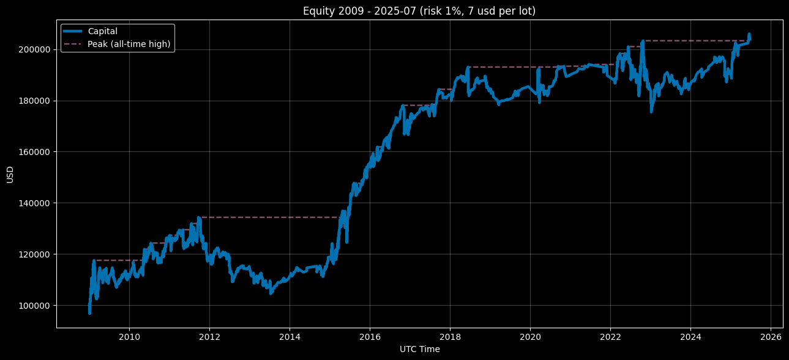

<p align="center">Equity Curve — Compounding Mode (Risk 1%, $7 round‑turn per standard lot) 2009–2025‑07</p>

<p align="center"></p>

# Euro Macromechanica (EMM) M5 Engine — Retail Baseline Stress (7 USD/lot, 1% risk)

## 🧾 Track Description

This track records backtest results of the M5 **EMM** strategy under “retail‑stress” costs: **7 USD per round‑turn per 1 standard lot (100,000 EUR)**, equivalent to **≈0.7 pip** on EURUSD. Per‑trade risk — **1% of capital at entry**.

- Data span: **headline 2009–2025‑07** (coverage: **199 months = 16 years and 7 months**)
- Instrument/TF: **EURUSD**, signaling logic on **M5**
- **Backtest time zone:** **UTC+0** (all timestamps in UTC+0)
- Cost model: commission **included** in PnL; **slippage** in this track was **not modeled**
- Base NAV for rebasing: **100,000 USD** (equity starts from the **first closed trade**)

## 🧭 Sub‑tracks

- **compounding_eoy_soy_base_100k** — compounding over the full period (EoY). For monthly return calculations, equity is rebased: insert an anchor of **100k at time t₀−ε** (an instant before t₀).
- **fixed_start_100k** — annual reset to 100k (each calendar year evaluated separately). Cross‑series risk metrics over the entire curve for fixed are **not aggregated**.

---

## 📈 Capital Dynamics — Year-End Equity & Annual Change (UTC+0) (by year-end close) `**compounding_eoy_soy_base_100k**`

| Year | Equity at Year-End (UTC+0) | Change vs. Prior Year |
|---|---:|---:|
| 2009 | 111001.82183 | +11.00182% |
| 2010 | 126073.98434 | +13.57830% |
| 2011 | 117132.18741 | -7.09250% |
| 2012 | 114754.34223 | -2.03005% |
| 2013 | 110757.00365 | -3.64199% |
| 2014 | 118371.61184 | +6.87506% |
| 2015 | 154803.25971 | +30.77735% |
| 2016 | 170292.15819 | +10.00554% |
| 2017 | 181152.79054 | +6.72998% |
| 2018 | 183118.69709 | +1.08577% |
| 2019 | 181967.26578 | +0.96210% |
| 2020 | 189303.89531 | +4.03184% |
| 2021 | 189201.52687 | -0.05408% |
| 2022 | 184805.79554 | -2.32331% |
| 2023 | 185597.88107 | +0.42860% |
| 2024 | 190408.33022 | +2.59187% |
| 2025-07| 203333.28728- | +6.78802% |

### Result over 16 years and 7 months — +103333.28728 USD / +103.33329%

---

## 📊 Quick Overview — Retail Baseline Stress 7 USD/lot (1% risk)

- **Coverage:** 199 months (**2009‑01…2025‑07**).
- **CAGR:** 4.37%  |  **Vol (ann.):** 7.64%
- **Sharpe (ann., rf=0):** 0.60  |  **Sortino (ann.):** 0.89
- **MaxDD:** −20.33%  |  **MAR:** 0.215  |  **UW (longest):** 42 months
- **By month:** positive — 58.29%; best/worst month: 9.99% / −5.51%.
- **Trades:** 2,736 | **Hit rate:** 68.97% | **PF:** 1.118 | **Payoff:** 0.503.  
  Average winner **0.383R**, loser **−0.761R**; **Expectancy:** 0.028R (median 0.299R).
- **By year (comp):** best — **2015: 30.78%**, worst — **2011: −7.09%**.
- **Fixed summary:** positive years — **12/16 years 7 months** (72.36%); best/worst: **2015 30.78%** / **2011 −7.08%**.

### Takeaways (by the numbers)

1) **Moderate return/risk profile:** Sharpe≈0.60, MaxDD≈−20.33%, MAR≈0.215.  
2) **Monthly stability:** ~58.29% positive months supported by a high hit rate, while payoff ~0.503 — the strategy leans on frequency rather than win size.  
3) **Underwater duration is manageable:** longest UW 42 months; within a retail profile given the 7 USD/lot commission.  
4) **Yearly robustness (fixed):** most years are positive.  
5) **Replication:** metrics are computed from the monthly EoM curve (UTC+0), R‑block at 1% risk per trade; methodology compatible with 0.45/0.30.

---

## 📋 Methodology for Metric Calculation (7 USD/lot, 1% risk)

### What is computed and which files

```
compounding_eoy_soy_base_100k/metrics/
  monthly_returns.csv
  full_period_summary.csv
  yearly_summary.csv
  trades_full_period_summary.csv

fixed_start_100k/metrics/
  monthly_returns.csv
  yearly_summary.csv
  trades_full_period_summary.csv
```

### CSV Schemas

**compounding_eoy_soy_base_100k**

- `monthly_returns.csv`: `year, month, ret_m`  
  `ret_m` — monthly return in fractions (0.012 = +1.2%) from EoM NAV (UTC+0); months without trades remain with `ret_m = 0`.
- `full_period_summary.csv`:  
  `months, cagr, vol_ann, sharpe_ann, sortino_ann, maxdd, mar_full, longest_underwater_months, best_month, worst_month, pos_months_pct, n_trades, hit_rate, profit_factor, avg_win_r, avg_loss_r, payoff_ratio, expectancy_r_mean, expectancy_r_median, std_r, min_r, max_r`
- `yearly_summary.csv`: `year, ret_year, maxdd_year, trades, hit_rate, profit_factor`
- `trades_full_period_summary.csv`:  
  `n_trades, hit_rate, profit_factor, avg_win_r, avg_loss_r, payoff_ratio, expectancy_r_mean, expectancy_r_median, std_r, min_r, max_r`

**fixed_start_100k**

- `monthly_returns.csv`: `year, month, ret_m` (within each year an anchor of 100k at 01‑01 00:00 UTC−ε)
- `yearly_summary.csv`: `year, ret_year, maxdd_year, trades, hit_rate, profit_factor`
- `trades_full_period_summary.csv`: same as comp (aggregated over the full period)

---

### Rules and Conventions

- **Time zone:** UTC+0.  
- **Scale:** monthly returns from the **last EoM NAV**; missing month‑end — ffill.  
- **Anchor NAV = 100,000 USD.**  
  - **Compounding:** insert anchor at `t₀−ε` (before the first point).  
  - **Fixed:** each year — anchor at `YYYY‑01‑01 00:00 UTC−ε`.  
- **Months without trades** are not removed: `ret_m = 0`.  
- **Variances/σ:** sample, `ddof = 1`.  
- **R‑metrics (1% risk):**  
  `R = pnl_pct` (if `pnl_pct` is in fractions) **or** `R = pnl_% / 100` (if in percent).  
  `hit_rate` = share of `R > 0`; `PF` = sum of wins / |sum of losses| (on **sums**, not means).

---

### R-metrics (Risk 1% — STRICT)

- **Base:** **1R = 1.0%** of capital at entry.  
- If `pnl_pct` is **in fractions** (e.g., `0.012` = +1.2%) → `R = pnl_pct / 0.01`.  
- If `pnl_%` is **in percent** (e.g., `1.2` = +1.2%) → `R = pnl_% / 1.0`.  
- If `pnl_r`/`r` exists in `trades`, use it **only** if it’s already R at 1% risk.

- Introduce epsilon `eps = 1e-12` for robust comparisons to zero.  
- **Classification:**  
  — **win:** `R > +eps`; **loss:** `R < −eps`; zeros are excluded from the win/loss groups.  

- **Metrics (on R):**  
  — `hit_rate = share(R > +eps)` (zeros are not wins);  
  — `profit_factor = sum(R[R>+eps]) / abs(sum(R[R<−eps]))` (**on sums**, zeros do not participate);  
  — `avg_win_r = mean(R[R>+eps])`, `avg_loss_r = mean(R[R<−eps])`;  
  — `payoff_ratio = avg_win_r / |avg_loss_r|`;  
  — `expectancy_r_mean/median`, `std_r`, `min_r`, `max_r` — computed on **all** R as-is (zeros included).

---

### Formulas (institutional definitions)

- `CAGR = (∏(1 + r_m))^(12/N) − 1`, where `N` is the number of months.  
- `vol_ann = stdev(r_m, ddof=1) · √12`.  
- `Sharpe_ann = (mean(r_m − rf_m) / stdev(r_m − rf_m, ddof=1)) · √12`, default `rf = 0`.  
- `Sortino_ann = (mean(r_m) / stdev(r_m[r_m < 0], ddof=1)) · √12` (downside‑σ only over **negative** months, target=0).  
- **Curve and drawdowns (monthly scale):**  
  `eq_t = ∏(1 + r_m)`, `dd_t = eq_t / cummax(eq) − 1`.  
  `maxdd` = minimum of `dd_t` (a negative number).  
  `longest_underwater_months` — the length of the longest run of months with `dd_t < 0` (the recovery month with `dd = 0` is not included).  
- **MAR:** `mar_full = cagr / |maxdd|` (over the entire monthly curve).  
- **Annual (fixed/comp):**  
  `ret_year = ∏(1 + r_m_within_year) − 1`,  
  `maxdd_year` — on the monthly curve **within the year**.

---

### What is **not** published in this track

- Extended “institutional” metrics (Ulcer, Martin, rolling‑12/36m, Calmar_36m, Kelly, Monte‑Carlo) — **not included** in 0.7.  
- Cross‑series Sharpe/MAR/MaxDD for **fixed** — **not calculated** (due to the annual reset to 100k).

---

### Quick integrity checks

- Coverage: **199 months** (2009‑01 … 2025‑07) — no gaps.  
- `∏(1 + ret_m)` for comp ≈ `NAV_last / 100000`.  
- `n_trades` in `trades_full_period_summary.csv` = sum of yearly `trades` from `yearly_summary.csv`.  
- PF is scale‑invariant (matches in both fractions and percent if using **sums**).

---

### Notes on costs

- Commission **7 USD per round‑turn per 1 standard lot (100k EUR)** is included in PnL.  
- **Slippage** in this track was **not modeled**.

---

### Nuances (address common questions)

- **Rounding (institutional):**  
  CAGR/vol/maxdd/best/worst — up to **6** decimals; Sharpe/Sortino — up to **4**; PF/Payoff — up to **3**; hit_rate/pos_months — up to **6**; R‑metrics — up to **6**.  
  - **Last incomplete month:** **included**; NAV ffill to EoM; the month remains in the series.  
- **Months without trades:** remain with `ret_m = 0` (do not drop).  
- **Downside‑σ (Sortino):** computed **only on negative months** `r_m < 0`, `ddof=1`, target=0.  
- **Sharpe:** `rf=0` (if no rf series). If there is an annual rf → use **effective** `rf_m = (1 + rf_ann)^(1/12) − 1`.  
- **PF / hit rate:** `hit_rate = share(R > 0)` (zeros are not wins). `PF = sum(R>0) / |sum(R<=0)|`; if there are no losses — **PF = inf**.  
- **Longest Underwater:** computed **inclusively** as the length of consecutive months with `dd < 0`. The recovery month (`dd = 0`) **is not included**.  
- **Sanity checks:**  
  `∏(1+ret_m)` (comp) ≈ `NAV_last/100000`;  
  `n_trades(full)` = sum of yearly `trades`;  
  coverage — **199 months** (2009‑01…2025‑07) without gaps.

> Exact definitions/units/rounding are duplicated in `metrics_schema.json` and are used for automatic pipeline validation.

## 🔍 Transparency & Reproducibility

- General info: root **README.md**
- Inputs and provenance: **docs/AUDIT.md / INPUTS‑PIN.md**
- Order execution mechanics: **strategy_proof/README.md**
- Metrics were computed from non‑public files `trades_YYYY.csv` and `equity_YYYY.csv`. Access: see **COMMERCIAL.md**.
- The current track is a **demo M5 (~10–15% of the full EMM logic)**; the calendar filter is light; TCA/slippage — out of scope. Institutional showcase tracks with lower costs and expanded metrics are available.